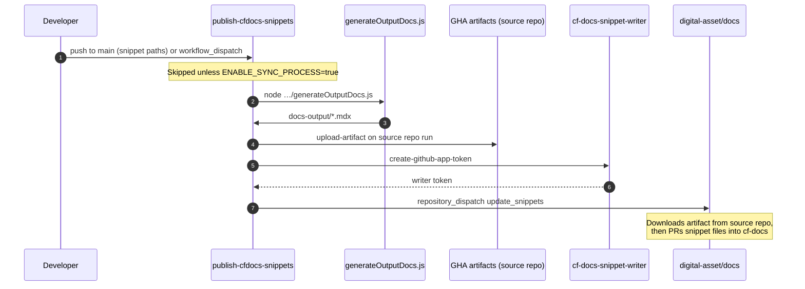

# CF Docs snippet sync — source repository guide

How snippet publishing works **from the source repository side**: from a merge on `main` through artifact upload and the dispatch to [digital-asset/docs](https://github.com/digital-asset/docs) (cf-docs).

This guide covers the standard **GHA source flow** used by splice, daml, cn-quickstart, daml-shell, dpm, and scribe. Canton uses a separate CircleCI bridge — see [update-workflow-rev2.md § Canton](./update-workflow-rev2.md#canton-circleci--gha-bridge).

**Related:** [app-install-checklist.md](./app-install-checklist.md) · [update-workflow-rev2.md](./update-workflow-rev2.md) · [publish-cfdocs-snippets.yml](/scripts/templates/publish-cfdocs-snippets.yml)

---

## What the source repo does

1. Detect snippet source changes on `main` (or run manually) — **trigger `paths` must be configured per repo** (see [Triggers](#triggers)).
2. Extract configured snippets into `docs-output/` (a transient directory on the runner, not committed).
3. Upload `docs-output/` as a **GitHub Actions artifact** attached to the workflow run **in the source repository** (not in cf-docs).
4. Mint a short-lived **writer** app token scoped to cf-docs.
5. Dispatch `update_snippets` on cf-docs with artifact and repo metadata (`artifact-id`, `run-id`, `repo-org`, etc.).

The artifact stays in the **source repo's Actions artifact storage** until cf-docs downloads it. Only after cf-docs runs `pull-external-snippets` do the snippet files appear under `docs-main/snippets/external/{repo}/…` in the main docs repo. That consumer flow is documented in [update-workflow-rev2.md § cf-docs](./update-workflow-rev2.md#cf-docs-pulling-snippets).

**Do not confuse:**
- **GHA artifact** — temporary blob storage tied to a workflow run on the **calling (source) repo**; cf-docs fetches it via the reader app.
- **Snippet files in cf-docs** — the permanent `.mdx` files merged via PR into `digital-asset/docs`.

---

## Files to add on the source repo

| File | Purpose |
|------|---------|
| `.github/workflows/publish-cfdocs-snippets.yml` | Copy from [scripts/templates/publish-cfdocs-snippets.yml](/scripts/templates/publish-cfdocs-snippets.yml) |
| `generateOutputDocs.js` | Snippet extraction script (from cf-docs `scripts/helpers/`, paths adjusted per repo) |
| Snippet export config | JSON list of snippets (e.g. `exportConfig.json`, synced from cf-docs `*-snippet-list-remote.json`) |

Layout varies by repo. Example (splice): scripts live under `gha-scripts/cf-docs/`. Other repos may use `scripts/docs/`.

Generated output goes to `docs-output/` at the repo root during the workflow run. **Do not commit** `docs-output/` — it is uploaded as a GHA artifact on the source repo only; cf-docs receives the files later via its pull workflow.

---

## Prerequisites on the source repo

### GitHub App: reader

Install **cf-docs-snippet-reader** on this source repository (Actions: Read). cf-docs uses this app later to download the artifact you upload here.

### Secrets

| Secret | Purpose |
|--------|---------|
| `CF_DOCS_SNIPPET_WRITER_APP_ID` | Writer app ID (same app as on cf-docs) |
| `CF_DOCS_SNIPPET_WRITER_PRIVATE_KEY` | Writer app private key PEM |

The writer app is **installed on cf-docs only**; the source repo stores the PEM so it can mint dispatch tokens. Prefer org-level secrets when several repos in the same org publish snippets.

### Repository variables

| Variable | Typical value | Purpose |
|----------|---------------|---------|
| `MAIN_REPO_ORG` | `digital-asset` | cf-docs org — dispatch target |
| `MAIN_REPO_NAME` | `docs` | cf-docs repo name — dispatch target |
| `ENABLE_SYNC_PROCESS` | `true` when ready | **Master switch** — see below |

Set variables under **Settings → Secrets and variables → Actions → Variables**.

---

## `ENABLE_SYNC_PROCESS`

The publish workflow job is gated:

```yaml
if: vars.ENABLE_SYNC_PROCESS == 'true'
```

| Value | Behavior |
|-------|----------|
| unset or not `true` | Workflow triggers may appear in the Actions tab, but the **publish job is skipped**. Safe for rollout: merge the workflow and extraction scripts before going live. |
| `true` | Full publish runs: extract → artifact → dispatch cf-docs. |

**Rollout recommendation:**

1. Merge workflow + extraction scripts with `ENABLE_SYNC_PROCESS` **unset** (or `false`).
2. Configure reader app, writer secrets, and `MAIN_REPO_ORG` / `MAIN_REPO_NAME`.
3. Run a manual `workflow_dispatch` and confirm the job is skipped until the variable is set.
4. Set `ENABLE_SYNC_PROCESS` = `true` and verify end-to-end (cf-docs PR under `docs-main/snippets/external/{repo}/main/`).

Canton uses a separate variable: `ENABLE_CFDOCS_SNIPPET_SYNC` on the bridge workflow.

---

## Workflow: `publish-cfdocs-snippets.yml`

### Triggers

**You must adjust `on.push.paths` for every source repo.** The template lists placeholder paths; copy the workflow only after replacing them with the directories and files that actually affect snippet extraction in that repository. If paths are too narrow, merges that change snippet content will not trigger a publish. If too broad, unrelated pushes will trigger unnecessary runs.

```yaml
on:
  workflow_dispatch:
  push:
    branches: [main]
    paths:
      # REQUIRED: replace with paths relevant to THIS source repo
      - docs/**
      - scripts/docs/**
      - gha-scripts/cf-docs/**
```

Include at minimum:
- Paths to **source files** referenced in the export config (RST, YAML, shell, etc.)
- The **export config** itself (e.g. `gha-scripts/cf-docs/exportConfig.json` or `scripts/docs/exportConfig.json`)
- The **extraction script** if changes there could alter output

**Example — splice** (`canton-network/splice`):

```yaml
paths:
  - docs/src/**
  - apps/app/src/pack/examples/**
  - cluster/helm/**
  - gha-scripts/cf-docs/**
```

**Example — typical digital-asset repo** (daml, cn-quickstart, dpm):

```yaml
paths:
  - docs/**
  - scripts/docs/**
```

Also adjust the `run:` path in the extract step to match where `generateOutputDocs.js` lives in that repo.

### Steps (in order)

#### 1. Checkout

Checks out the commit that triggered the workflow.

#### 2. Extract snippet data

Runs `generateOutputDocs.js`, which reads the export config and writes one `.mdx` file per snippet into `docs-output/`.

Adjust the `run:` path to match where the script lives in your repo.

#### 3. Store artifact output

Uploads the entire `docs-output/` directory as a GitHub Actions artifact **on the source repository's workflow run** (Actions → artifact storage for that repo/run — **not** a commit or file in cf-docs):

```yaml
name: ${{ github.event.repository.name }}-snippets
```

The artifact name is derived from the repository name (e.g. `splice-snippets`, `daml-shell-snippets`). No per-repo placeholder is required in the template.

The step output `artifact-id`, together with `run-id` and `repo-org`, tells cf-docs where to download the artifact from the **source repo's** Actions storage via the reader app.

#### 4. Prepare additional params

Records `short_sha` for the PR title on cf-docs.

#### 5. Generate snippet writer app token

Mints a short-lived token via `actions/create-github-app-token@v2`, scoped to `${MAIN_REPO_ORG}/${MAIN_REPO_NAME}` (cf-docs).

#### 6. Update main docs repo

Calls cf-docs via `repository_dispatch` event `update_snippets`:

| Payload field | Source | Used by cf-docs for |
|---------------|--------|---------------------|
| `artifact-id` | upload-artifact step | Identifying the artifact in **source repo** Actions storage |
| `run-id` | `${{ github.run_id }}` | Workflow run on the **source repo** that holds the artifact |
| `repo-name` | `${{ github.event.repository.name }}` | Target folder `snippets/external/{repo-name}/…` in cf-docs |
| `repo-org` | `${{ github.repository_owner }}` | Which **source repo** the reader app uses to download the artifact |
| `repo-version` | `main` | Target folder `…/{repo-version}/` in cf-docs |
| `trigger_sha_short` | git short SHA | PR title suffix |

After this step completes successfully, cf-docs owns the rest of the pipeline.

---

## Sequence (source repo only)



---

## Local testing before enabling sync

From a cf-docs checkout you can run extraction locally without dispatching:

```bash
npm run generate:external-snippets -- splice --source-dir ../splice
```

Add `--copy-output --version main` to copy results into cf-docs for inspection. See [update-workflows.md](./update-workflows.md).

---

## Checklist (source repo)

- [ ] Reader app installed on this repository
- [ ] `CF_DOCS_SNIPPET_WRITER_*` secrets configured
- [ ] `MAIN_REPO_ORG` = `digital-asset`, `MAIN_REPO_NAME` = `docs`
- [ ] `.github/workflows/publish-cfdocs-snippets.yml` merged with **repo-specific `paths` and script path**
- [ ] Extraction script + export config in place
- [ ] Local extraction succeeds (`generateOutputDocs.js` → `docs-output/`, 0 failures)
- [ ] `ENABLE_SYNC_PROCESS` = `true`
- [ ] End-to-end: push to `main` → cf-docs PR updated

---

## Troubleshooting (source repo)

| Symptom | Check |
|---------|--------|
| Workflow runs but job skipped | `ENABLE_SYNC_PROCESS` = `true` |
| Extraction step fails | Run `generateOutputDocs.js` locally; fix export config vs source files |
| Dispatch 403 | Writer secrets; `MAIN_REPO_ORG` / `MAIN_REPO_NAME` |
| cf-docs cannot download artifact | Reader app installed on **source repo**; payload `run-id` / `artifact-id` / `repo-org` point at that repo's Actions run |
| Wrong folder in cf-docs PR | `PAYLOAD_repo-name` should match `github.event.repository.name` (e.g. `splice`) |
