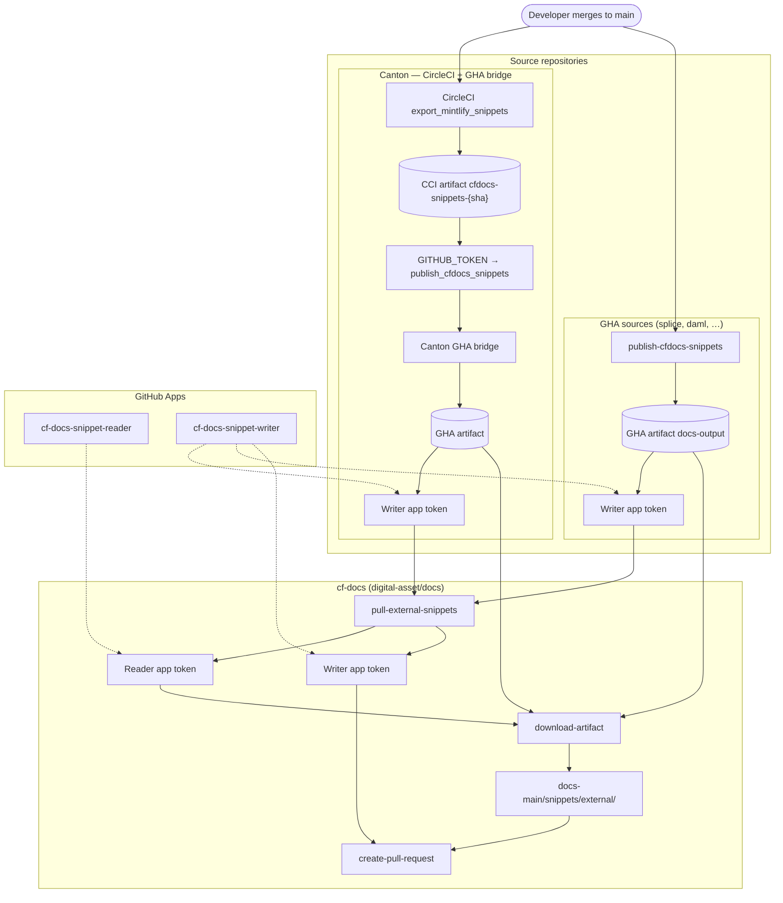
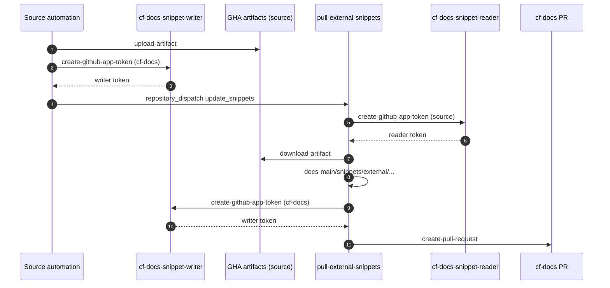

# CF Docs snippet sync — rev 2

Target architecture for syncing external code snippets into [digital-asset/docs](https://github.com/digital-asset/docs) (cf-docs) using **GitHub Apps**.

Snippet changes are extracted in a source repository, uploaded as a GHA artifact, and pulled into cf-docs via `repository_dispatch`. cf-docs writes files to `docs-main/snippets/external/{repo}/{version}/` and opens or updates a PR on `main`.

**Exception:** [DACH-NY/canton](https://github.com/DACH-NY/canton) uses a **CircleCI → GHA bridge** because snippet extraction runs on CircleCI there. Apart from that bridge, every source repo follows the same GHA flow (extract → upload artifact → dispatch cf-docs).

**Setup:** [app-install-checklist.md](./app-install-checklist.md)  
**Source repo guide:** [source-repo-workflow-readme.md](./source-repo-workflow-readme.md)  
**Legacy flow / local extraction:** [update-workflows.md](./update-workflows.md)

Within this document:

* **cf-docs** — [digital-asset/docs](https://github.com/digital-asset/docs) (consumer)
* **Source repositories** (publishers):
  * [DACH-NY/canton](https://github.com/DACH-NY/canton) — CircleCI bridge
  * [canton-network/splice](https://github.com/canton-network/splice)
  * [digital-asset/daml](https://github.com/digital-asset/daml)
  * [digital-asset/cn-quickstart](https://github.com/digital-asset/cn-quickstart)
  * [DACH-NY/daml-shell](https://github.com/DACH-NY/daml-shell)
  * [digital-asset/dpm](https://github.com/digital-asset/dpm)
  * [DACH-NY/scribe](https://github.com/DACH-NY/scribe)

Publishing runs on **`main` only** (Canton: additionally gated on `CIRCLE_BRANCH == main`).

---

## Overview

| Path | Source repos | Extract | Artifact | Dispatch to cf-docs |
|------|--------------|---------|----------|-------------------|
| **GHA** | splice, daml, cn-quickstart, daml-shell, dpm, scribe | GHA publish workflow | GHA `upload-artifact` | Writer app → cf-docs |
| **CircleCI bridge** | [DACH-NY/canton](https://github.com/DACH-NY/canton) only | CircleCI `export_mintlify_snippets` | CCI → GHA re-upload | Writer app → cf-docs |

All GHA source repos share the same pattern: run `generateOutputDocs.js`, upload `docs-output/` as an artifact, mint a writer app token, dispatch `update_snippets` on cf-docs. Copy [scripts/templates/publish-cfdocs-snippets.yml](/scripts/templates/publish-cfdocs-snippets.yml) to `.github/workflows/publish-cfdocs-snippets.yml` on each source repo (adjust paths and script location per repo).

---

## Authentication

Cross-repo snippet sync uses **two GitHub Apps** (reader + writer). The separate **`GENERATED_DOCS_MERGER`** app is unrelated — it only merges generated reference docs on cf-docs.

| App | Installed on | Permissions | Used for |
|-----|--------------|-------------|----------|
| **cf-docs-snippet-reader** | Source repos | Actions: Read | cf-docs `download-artifact` from source |
| **cf-docs-snippet-writer** | cf-docs only | Contents + PRs: R/W | Source → cf-docs dispatch; cf-docs PR creation |

**Not app-authenticated (Canton bridge only):**

These credentials are **only** used on [DACH-NY/canton](https://github.com/DACH-NY/canton) for the CircleCI → GHA bridge. No other source repo needs them.

| Credential | Location | Purpose |
|------------|----------|---------|
| `GITHUB_TOKEN` (canton-machine PAT) | CircleCI context on Canton | CircleCI → Canton GHA `publish_cfdocs_snippets` dispatch |
| `CIRCLECI_API_TOKEN` | Canton GHA | Bridge downloads CircleCI snippet artifacts |

See [GitHub Apps](#github-apps) and [app-install-checklist.md](./app-install-checklist.md).

---

## cf-docs: pulling snippets

**Workflow:** [pull-external-snippets.yml](/.github/workflows/pull-external-snippets.yml)  
**Event:** `update_snippets`

**Dispatch payload:**

| Field | Description |
|-------|-------------|
| `artifact-id` | GHA artifact ID on the source repository |
| `run-id` | GHA workflow run ID on the source repository |
| `repo-name` | Source repository name |
| `repo-org` | Source repository org |
| `repo-version` | Version folder (branch name; `main` for Canton) |

**Steps:**

1. Mint **reader** app token scoped to `${repo_org}/${repo_name}`
2. `download-artifact` from source GHA run
3. Write to `docs-main/snippets/external/{repo_name}/{repo_version}/`
4. Mint **writer** app token → `create-pull-request` → `external-snippet-update-{repo}-{version}`

**cf-docs secrets:**

| Secret |
|--------|
| `CF_DOCS_SNIPPET_READER_APP_ID` |
| `CF_DOCS_SNIPPET_READER_PRIVATE_KEY` |
| `CF_DOCS_SNIPPET_WRITER_APP_ID` |
| `CF_DOCS_SNIPPET_WRITER_PRIVATE_KEY` |

---

## Canton: CircleCI + GHA bridge

Repository: [DACH-NY/canton](https://github.com/DACH-NY/canton)

### CircleCI (`export_mintlify_snippets`)

1. Restore `docs-open/target/snippet_json_data` from workspace
2. Run `node scripts/docs/generateOutputDocs.js` → `docs-output/`
3. Store CircleCI artifact `cfdocs-snippets-{CIRCLE_SHA1}`
4. On **`main` only**: `repository_dispatch` → `publish_cfdocs_snippets`

**Soft failure:** unless `FAIL_ON_CF_DOCS_ERROR=true` is set in the CircleCI context, export or dispatch failures **do not fail the CI job** (allows testing without blocking `main`). When set to `true`, failures fail the job.

### Canton GHA ([scripts/templates/publish-cfdocs-snippets-canton-bridge.yml](/scripts/templates/publish-cfdocs-snippets-canton-bridge.yml))

1. Download CircleCI artifact `cfdocs-snippets-{sha}`
2. Re-upload as GHA artifact `cfdocs-snippets-{sha}`
3. Mint **writer** app token → dispatch `update_snippets` on cf-docs

Gated by `ENABLE_CFDOCS_SNIPPET_SYNC == 'true'`.

**Canton GHA secrets / vars:**

| Name | Type | Purpose |
|------|------|---------|
| `CF_DOCS_SNIPPET_WRITER_APP_ID` | Secret | Dispatch to cf-docs |
| `CF_DOCS_SNIPPET_WRITER_PRIVATE_KEY` | Secret | Dispatch to cf-docs |
| `CIRCLECI_API_TOKEN` | Secret | Download CCI artifacts *(bridge only)* |
| `MAIN_REPO_ORG` / `MAIN_REPO_NAME` | Variable | cf-docs target |
| `ENABLE_CFDOCS_SNIPPET_SYNC` | Variable | Enable bridge |

**CircleCI *(bridge only)*:**

| Name | Purpose |
|------|---------|
| `GITHUB_TOKEN` (context) | CCI → Canton GHA dispatch |
| `FAIL_ON_CF_DOCS_ERROR` | Set `true` to fail job on export/dispatch errors *(optional)* |

---

## GHA source repos

All repositories below use the same GHA flow. **Template:** [scripts/templates/publish-cfdocs-snippets.yml](/scripts/templates/publish-cfdocs-snippets.yml) → copy to `.github/workflows/publish-cfdocs-snippets.yml`. **Setup details:** [source-repo-workflow-readme.md](./source-repo-workflow-readme.md).

1. Extract snippets → `docs-output/`
2. `upload-artifact` (name: `{repository.name}-snippets`, from `${{ github.event.repository.name }}`)
3. Mint writer app token → dispatch `update_snippets` on cf-docs

### Enable switch: `ENABLE_SYNC_PROCESS`

The publish job runs only when the repository variable **`ENABLE_SYNC_PROCESS`** is exactly `true`:

```yaml
if: vars.ENABLE_SYNC_PROCESS == 'true'
```

Leave unset (or set to any other value) while rolling out the workflow and extraction scripts — triggers may fire, but the publish job is skipped until you are ready for live sync. Set to `true` after reader app install, writer secrets, and a successful local extraction test.

*(Canton bridge uses `ENABLE_CFDOCS_SNIPPET_SYNC` instead.)*

**Secrets (each source repo):** `CF_DOCS_SNIPPET_WRITER_*`  
**Variables:**

| Variable | Value | Purpose |
|----------|-------|---------|
| `MAIN_REPO_ORG` | `digital-asset` | cf-docs org (dispatch target) |
| `MAIN_REPO_NAME` | `docs` | cf-docs repo name |
| `ENABLE_SYNC_PROCESS` | `true` when live | Enables publish job |

**Reader app:** installed on the source repo (not on cf-docs)

---

## Splice (GHA source)

Repository: [canton-network/splice](https://github.com/canton-network/splice)

### Layout

| Path | Role |
|------|------|
| `gha-scripts/cf-docs/generateOutputDocs.js` | Snippet extraction script |
| `gha-scripts/cf-docs/exportConfig.json` | Snippet definitions (synced from cf-docs `splice-snippet-list-remote.json`) |
| `.github/workflows/publish-cfdocs-snippets.yml` | Publish workflow |
| `docs-output/` | Generated snippets *(CI artifact, not committed)* |

### Workflow

**File:** `.github/workflows/publish-cfdocs-snippets.yml`

**Triggers:** push to `main` on snippet source paths, or `workflow_dispatch`:

```yaml
paths:
  - docs/src/**
  - apps/app/src/pack/examples/**
  - cluster/helm/**
  - gha-scripts/cf-docs/**
```

**Steps:** checkout → `node gha-scripts/cf-docs/generateOutputDocs.js` → upload artifact `${{ github.event.repository.name }}-snippets` → dispatch cf-docs with `repo-name` / `repo-org` from `${{ github.event.repository.name }}` and `${{ github.repository_owner }}`, `repo-version: main`.

Job gated by **`ENABLE_SYNC_PROCESS`** = `true` — see [source-repo-workflow-readme.md](./source-repo-workflow-readme.md#enable_sync_process).

### Installation checklist

1. Install **reader** app on [canton-network/splice](https://github.com/canton-network/splice)
2. Add writer app secrets (`CF_DOCS_SNIPPET_WRITER_*`) on splice (or `canton-network` org secret)
3. Set repository variables: `MAIN_REPO_ORG` = `digital-asset`, `MAIN_REPO_NAME` = `docs`
4. Set `ENABLE_SYNC_PROCESS` = `true` when ready to publish
5. Merge `.github/workflows/publish-cfdocs-snippets.yml` and `gha-scripts/cf-docs/` on `main`
6. Verify: push to `main` → splice workflow → cf-docs PR under `docs-main/snippets/external/splice/main/`

Snippet config in cf-docs: [splice-snippet-list-remote.json](./splice-snippet-list-remote.json) (~172 snippets).

---

## GitHub Apps

### How token minting works

Workflows call [`actions/create-github-app-token@v2`](https://github.com/actions/create-github-app-token) with `APP_ID` + `PRIVATE_KEY` from secrets. Tokens are short-lived and scoped per step.

**Reader (cf-docs pulls from source):**

```yaml
- uses: actions/create-github-app-token@v2
  id: reader-token
  with:
    app-id: ${{ secrets.CF_DOCS_SNIPPET_READER_APP_ID }}
    private-key: ${{ secrets.CF_DOCS_SNIPPET_READER_PRIVATE_KEY }}
    owner: ${{ env.repo_org }}
    repositories: ${{ env.repo_name }}
```

**Writer (dispatch or PR on cf-docs):**

```yaml
- uses: actions/create-github-app-token@v2
  id: writer-token
  with:
    app-id: ${{ secrets.CF_DOCS_SNIPPET_WRITER_APP_ID }}
    private-key: ${{ secrets.CF_DOCS_SNIPPET_WRITER_PRIVATE_KEY }}
    owner: ${{ vars.MAIN_REPO_ORG }}      # source-repo dispatch only
    repositories: ${{ vars.MAIN_REPO_NAME }}
```

Writer app is **installed on cf-docs only**. Source repos hold the private key but do not install the app.

### Why two apps?

App permissions are global per app. A single app with Contents write must be installed on source repos to read their artifacts — granting write access on Canton, splice, etc. Two apps keep sources read-only from cf-docs' perspective.

### Credential topology

```text
READER (Actions: Read)          WRITER (Contents + PRs R/W)
installed on source repos       installed on cf-docs only
private key on cf-docs          private key on cf-docs + sources
```

---

## Full flow



### Sequence (auth-focused)



---

## Source repo installation

Track rollout per repository. Update as apps are installed and workflows merged.

**Sync path:** `GHA` = standard GitHub Actions flow · `CCI bridge` = Canton CircleCI path

**Status:** `—` not started · `WIP` in progress · `Live` app auth verified

| Snippet key | GitHub repository | Path | Snippet config | Workflow | Status | Notes |
|-------------|-------------------|------|----------------|----------|--------|-------|
| `canton` | [DACH-NY/canton](https://github.com/DACH-NY/canton) | CCI bridge | [canton-snippet-list-remote.json](./canton-snippet-list-remote.json) | `publish-cfdocs-snippets.yml` + CCI | WIP | ~335 snippets. `FAIL_ON_CF_DOCS_ERROR` unset during rollout. Cross-org reader install. |
| `splice` | [canton-network/splice](https://github.com/canton-network/splice) | GHA | [splice-snippet-list-remote.json](./splice-snippet-list-remote.json) | `publish-cfdocs-snippets.yml` | WIP | Scripts in `gha-scripts/cf-docs/`. ~172 snippets. |
| `daml` | [digital-asset/daml](https://github.com/digital-asset/daml) | GHA | [daml-snippet-list-remote.json](./daml-snippet-list-remote.json) | TBC | — | |
| `cn-quickstart` | [digital-asset/cn-quickstart](https://github.com/digital-asset/cn-quickstart) | GHA | [cn-quickstart-snippet-list-remote.json](./cn-quickstart-snippet-list-remote.json) | TBC | — | |
| `daml-shell` | [DACH-NY/daml-shell](https://github.com/DACH-NY/daml-shell) | GHA | [daml-shell-snippet-list-remote.json](./daml-shell-snippet-list-remote.json) | TBC | — | |
| `dpm` | [digital-asset/dpm](https://github.com/digital-asset/dpm) | GHA | [dpm-snippet-list-remote.json](./dpm-snippet-list-remote.json) | TBC | — | |
| `scribe` | [DACH-NY/scribe](https://github.com/DACH-NY/scribe) | GHA | [scribe-snippet-list-remote.json](./scribe-snippet-list-remote.json) | TBC | — | |

### Per-repo onboarding checklist

```markdown
- [ ] Reader app installed on source repo
- [ ] Writer app secrets on source repo
- [ ] MAIN_REPO_ORG / MAIN_REPO_NAME variables set
- [ ] ENABLE_SYNC_PROCESS=true when ready for live sync
- [ ] Extraction workflow merged
- [ ] End-to-end test on main → cf-docs PR
- [ ] Tracker row → Live
```

### cf-docs (consumer)

| Item | Value |
|------|-------|
| Repository | [digital-asset/docs](https://github.com/digital-asset/docs) |
| Pull workflow | [pull-external-snippets.yml](/.github/workflows/pull-external-snippets.yml) |
| Reader + writer secrets | `CF_DOCS_SNIPPET_READER_*`, `CF_DOCS_SNIPPET_WRITER_*` |
| Writer app installation | cf-docs repo only |
| Merger app | `GENERATED_DOCS_MERGER_*` — separate, generated docs only |

---

## Reference files

| File | Role |
|------|------|
| [app-install-checklist.md](./app-install-checklist.md) | Step-by-step app + secret setup |
| [source-repo-workflow-readme.md](./source-repo-workflow-readme.md) | Source repo publish workflow guide |
| [scripts/templates/publish-cfdocs-snippets.yml](/scripts/templates/publish-cfdocs-snippets.yml) | GHA source repo template |
| [scripts/templates/publish-cfdocs-snippets-canton-bridge.yml](/scripts/templates/publish-cfdocs-snippets-canton-bridge.yml) | Canton CircleCI → GHA bridge template |
| [pull-external-snippets.yml](/.github/workflows/pull-external-snippets.yml) | cf-docs consumer |
| `*-snippet-list-remote.json` | Snippet definitions |

---

## Cross-org note

Source repos span multiple orgs (`DACH-NY`, `canton-network`, `digital-asset`). Reader app installs need approval from each org. Writer private keys on cross-org repos (e.g. Canton, daml-shell, scribe) may require org secret policy allowance.
