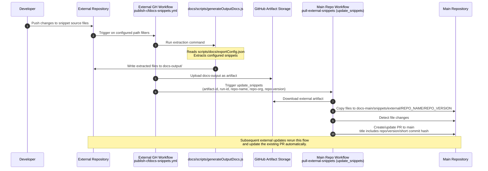

# External repo snippet update flow 

This document describes the external snippet update workflow for this docs repository. Within this document:
* The main docs repository refers to this repository.
* External repository refers to other external repositories, from which the code snippet files are sourced in.

The automation to pull the snippet updates into this repository is implemented using GitHub Action workflows

> **Rev 2 (GitHub Apps, Canton bridge):** see [update-workflow-rev2.md](./update-workflow-rev2.md) and [app-install-checklist.md](./app-install-checklist.md).

## Local one-command extraction

From this repository, use `generate:external-snippets` to copy the matching helper/config into a local source repository and run extraction there:

```bash
npm run generate:external-snippets -- canton --source-dir ../canton
```

The first positional argument selects the snippet repository. Supported names are listed with:

```bash
npm run generate:external-snippets -- --list
```

By default, the generated files remain in the source repository's `docs-output/` directory. To also copy the output into this repository's snippet tree, pass `--copy-output` and a version folder:

```bash
npm run generate:external-snippets -- canton --source-dir ../canton --copy-output --version main
```

For repositories with generated snippet JSON, the wrapper runs the required preparation step first. For example, `canton` runs `docs-open / reset` and `docs-open / generateSphinxSnippets` before invoking the extraction helper. Use `--skip-prepare` only when those generated inputs already exist.

# Workflow architecture

Changes in the external repository snippet source files are being extracted on the external repository, wrapped into an artifact and then being pulled in from this repository into the appropriate folder in the `snippets/external/` folder.


## Extract snippet files

In the external repository, three files control the extraction of snippets:
* [scripts/templates/publish-cfdocs-snippets.yml](/scripts/templates/publish-cfdocs-snippets.yml) - GitHub workflow template (copy to source repo)
* The matching `*-snippet-list-remote.json` from this folder - The list defining the snippets to be extracted
* [scripts/helpers/generateOutputDocs.js](/scripts/helpers/generateOutputDocs.js) - Script that extracts the snippets defined in the snippet list.

The location of the script and config file might vary depending on the source repo file structure. For example, in `daml-shell` they live under `scripts/docs/`:
* The snippet list json file is copied to `scripts/docs/exportConfig.json`
* The helper script is copied to `scripts/docs/generateOutputDocs.js`

### Manual extraction

You can find all configuration files (`xyz-snippet-list-remote.json`) in this folder (`config/snippet-config`). The script to generate the output snippets can be found in `/scripts/generateOutputDocs.js` (in this repository).

The GitHub action file needs to be adjusted accordingly:

```
paths:
  - docs/**          # adjust to snippet source paths in the source repo
  - scripts/docs/**
```
Line 9-11 with the paths to trigger the update workflow

```
run: node scripts/docs/generateOutputDocs.js
```
Line 21 with the path to the `generateOutputDocs.js` script (adjust per repo layout)

The snippet extraction script is then called from the GitHub action and extracts snippet files into a temp folder `docs-output`. During the extraction, the files are also transformed: Content is wrapped into a markdown codeblock.
The content of this folder (full extract) is then stored into the [GitHub artifact storage](https://docs.github.com/en/actions/concepts/workflows-and-actions/workflow-artifacts). Afterwards, the `update_snippets` workflow is called on the main repository (this repo), which will pull the snippet files.

## Pulling snippet files

In this repository, the [pull-external-snippets](/.github/workflows/pull-external-snippets.yml) workflow (dispatch name: `update_snippets`) is triggered with the following parameters:
* artifact-id: External Artifact Id
* run-id: Github Action Run Id
* repo-name: External repo name
* repo-org: External repo org
* repo-version: External repo version

It pulls the external artifact and places the files into `docs-main/snippets/external/{repo_name}/{repo_version}`. Then, a PR is created (if there are any changed files) towards main on this repository. The PR title contains the repo name, version and the last commit hash (short) of the external repo. If another update is pushed on the external repository, the existing PR is being updated automatically.

## Full workflow sequence




# Tokens and variables/secrets configuration

Snippet sync uses **GitHub Apps** (reader + writer). See [update-workflow-rev2.md](./update-workflow-rev2.md) and [app-install-checklist.md](./app-install-checklist.md).

Legacy PAT names (`EXTERNAL_REPO_TOKEN`, `DOCS_PR_TOKEN`, `MAIN_DOCS_REPO_TOKEN`) are **not used** in rev 2 workflows.

## Source repository configuration (GHA-only template)

On GHA-only source repositories. Full setup: [source-repo-workflow-readme.md](./source-repo-workflow-readme.md).

| Name | Type | Purpose |
|------|------|---------|
| `CF_DOCS_SNIPPET_WRITER_APP_ID` | Secret | Writer app — dispatch to cf-docs |
| `CF_DOCS_SNIPPET_WRITER_PRIVATE_KEY` | Secret | Writer app private key |
| `MAIN_REPO_ORG` | Variable | cf-docs org |
| `MAIN_REPO_NAME` | Variable | cf-docs repo |
| `ENABLE_SYNC_PROCESS` | Variable | Must be `true` to run the publish job (master switch) |

The workflow derives `repo-name`, `repo-org`, and artifact name from `${{ github.event.repository.name }}` and `${{ github.repository_owner }}` — no separate `SOURCE_REPO_*` variables are required.

# Integration in the documentation

The extracted snippets are integrated into the documentation using the [Mintlify snippet system](https://www.mintlify.com/docs/create/reusable-snippets). In the target Markdown file, they are embedded using

```
import MySnippet from "/shared/my-snippet.mdx";

<MySnippet />
```
# Notes & Troubleshooting

## Additional files

The above mentioned files:
* `config/snippet-config/*-snippet-list-remote.json`
* `scripts/templates/publish-cfdocs-snippets.yml`
* `scripts/generateOutputDocs.js`

are only added to this repository for reference. They are only used in the external repositories.

## Delete snippets

Currently, snippets are only being added and updated, but not deleted.

## Complex build extraction

Repositories with a complex build before extraction (for example Canton) use the rev 2 flow documented in [update-workflow-rev2.md](./update-workflow-rev2.md).
