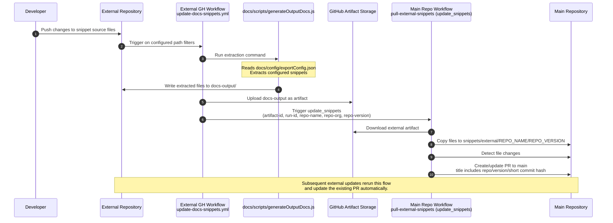

# External repo snippet update flow 

This document describes the external snippet update workflow for this docs repository. Within this document:
* The main docs repository refers to this repository.
* External repository refers to other external repositories, from which the code snippet files are sourced in.

The automation to pull the snippet updates into this repository is implemented using GitHub Action workflows

# Workflow architecture

Changes in the external repository snippet source files are being extracted on the external repository, wrapped into an artifact and then being pulled in from this repository into the appropriate folder in the `snippets/external/` folder.


## Extract snippet files

In the external repository, three files control the extraction of snippets:
* [config/snippet-config/update-docs-snippets.yml](/config/snippet-config/update-docs-snippets.yml) - GitHub workflow file
* [config/snippet-config/splice-wallet-kernel-snippet-list-remote.json](/config/snippet-config/splice-wallet-kernel-snippet-list-remote.json) - The list defining the snippets to be extracted
* [scripts/helpers/generateOutputDocs.js](/scripts/helpers/generateOutputDocs.js) - Script that extracts the snippets defined in the snippet list.

The location of the script and config file might vary depending on the source repo file structure. In the splice-wallet-kernel repository, these are placed inside the `/docs/` folder:
* The snippet list json file is located at `/docs/config/exportConfig.json`
* The helper script is located at `/docs/scripts/generateOutputDocs.js`

The GitHub action file needs to be adjusted accordingly:

```
paths:
  - docs/wallet-integration-guide/examples/snippets/**
  - docs/wallet-integration-guide/examples/scripts/**
```
Line 9-11 with the paths to trigger the update workflow

```
run: node docs/scripts/generateOutputDocs.js
```
Line 21 with the path to the `generateOutputDocs.js` script

The snippet extraction script is then called from the GitHub action and extracts snippet files into a temp folder `docs-output`. During the extraction, the files are also transformed: Content is wrapped into a markdown codeblock.
The content of this folder (full extract) is then stored into the [GitHub artifact storage](https://docs.github.com/en/actions/concepts/workflows-and-actions/workflow-artifacts). Afterwards, the `update_snippets` workflow is called on the main repository (this repo), which will pull the snippet files.

## Pulling snippet files

In this repository, the [pull-external-snippets](/.github/workflows/pull-external-snippets.yml) workflow (dispatch name: `update_snippets`) is triggered with the following parameters:
* artifact-id: External Artifact Id
* run-id: Github Action Run Id
* repo-name: External repo name
* repo-org: External repo org
* repo-version: External repo version

It pulls the external artifact and places the files into `snippets/external/{repo_name}/{repo_version}`. Then, a PR is created (if there are any changed files) towards main on this repository. The PR title contains the repo name, version and the last commit hash (short) of the external repo. If another update is pushed on the external repository, the existing PR is being updated automatically.

## Full workflow sequence




# Tokens and variables/secrets configuration

## Target repository (this repo) configuration

On the target repository, the following repository environment **secrets** must be configured:
* `EXTERNAL_REPO_TOKEN` - token used to access the artifact of the external repository
* `DOCS_PR_TOKEN` - token used to create the Pull Request on this repository


## Source repository configuration

On the source repository, the following secret must be configured:
* `MAIN_DOCS_REPO_TOKEN`

additionally, the following environment variables must be set:
* `MAIN_REPO_ORG` - `digital-asset`
* `MAIN_REPO_NAME` - `docs`
* `SOURCE_REPO_NAME` - `{SOURCE_REPOSITORY_NAME}`
* `SOURCE_REPO_ORG` - `{SOURCE_REPOSITORY_ORG}`
* `SOURCE_REPO_VERSION` - `main`
* `ENABLE_SYNC_PROCESS` - `true`

## Token permissions

The following token permission must be configured on these tokens:

**EXTERNAL_REPO_TOKEN**

* repository scope: External repositories
  * `hyperledger-labs/splice-wallet-kernel/`
  * `DACH-NY/canton`
  * `digital-asset/daml`
  * `hyperledger-labs/splice`
  * TODO: finalize list

* permission scope:
  * Actions: Read

**DOCS_PR_TOKEN**

* repository scope: This repository
  * `digital-asset/docs`

* permission scope:
  * Contents: Read and write
  * Pull requests: Read and write

**MAIN_DOCS_REPO_TOKEN**

* repository scope: This repository
  * `digital-asset/docs`

* permission scope:
  * Contents: Read and write

Note: The `DOCS_PR_TOKEN` can also be used as `MAIN_DOCS_REPO_TOKEN`

# Integration in the documentation

The extracted snippets are integrated into the documentation using the [Mintlify snippet system](https://www.mintlify.com/docs/create/reusable-snippets). In the target Markdown file, they are embedded using

```
import MySnippet from "/shared/my-snippet.mdx";

<MySnippet />
```
# Notes & Troubleshooting

## Additional files

The above mentioned files:
* `config/snippet-config/*-snippet-list-remote.json`
* `config/snippet-config/update-docs-snippets.yml`
* `scripts/helpers/generateOutputDocs.js`

are only added to this repository for reference. They are only used in the external repositories.

## Delete snippets

Currently, snippets are only being added and updated, but not deleted.

## Complex build extraction

This readme currently shows the process for simple repositories, where the snippets can be extracted directly (like the splice-wallet-kernel repository) and needs to be updated to reflect the build steps on more complex repositories (like the canton repository), which run before the snippet extraction.
