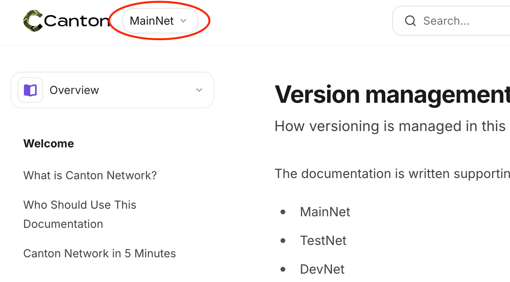

The documentation is written supporting three different main versions:
* MainNet
* TestNet
* DevNet

For each main content group, there is a `common` folder for files not attributed to a specific version, and a folder for each version for version-specific files. Underneath these folders, there are further subfolders for each module. 

# File structure

The file structure for the overview section, reference module is laid out as follows:

<Tree>
  <Tree.Folder name="docs-main" defaultOpen>
    <Tree.Folder name="overview" defaultOpen>
      <Tree.Folder name="common" defaultOpen>
      	<Tree.Folder name="reference" defaultOpen>
        	<Tree.File name="canton-coin-tokenomics.mdx" />
        	<Tree.File name="tokenomics-of-gs.mdx" />
        	<Tree.File name="canton-name-service.mdx" />
        </Tree.Folder>
      </Tree.Folder>
      <Tree.Folder name="mainnet" defaultOpen>
      	<Tree.Folder name="reference" defaultOpen>
      	  <Tree.File name="splice-wallet-reference.mdx" />
      	  <Tree.File name="sv-governance-reference.mdx" />
      	</Tree.Folder>
      </Tree.Folder>
      <Tree.Folder name="testnet" defaultOpen>
      	<Tree.Folder name="reference" defaultOpen>
      	  <Tree.File name="splice-wallet-reference.mdx" />
      	  <Tree.File name="sv-governance-reference.mdx" />
      	</Tree.Folder>
      </Tree.Folder>
      <Tree.Folder name="devnet" defaultOpen>
      	<Tree.Folder name="reference" defaultOpen>
      	  <Tree.File name="splice-wallet-reference.mdx" />
      	  <Tree.File name="sv-governance-reference.mdx" />
      	</Tree.Folder>
      </Tree.Folder>
    </Tree.Folder>
  </Tree.Folder>
</Tree>

The files `canton-coin-tokenomics.mdx`, `tokenomics-of-gs.mdx` and `canton-name-service.mdx` are shared across all versions, while `splice-wallet-reference.mdx` and `sv-governance-reference.mdx` are version-specific.

# `docs.json` configuration

In the configuration file, a list of files (`pages`) is configured for each version, which also defines the navigation content. Common files can be referenced from multiple versions, while the version-specific files are only referenced in the according version.


```json docs.json highlight={7,15-16,24,32-33}
"navigation": {
    "dropdowns": [
      {
        "dropdown": "Overview",
        "versions": [
          {
            "version": "MainNet",
            "groups": [
              {
                "group": "GS and Tokenomics",
                "pages": [
                  "docs-main/overview/common/reference/canton-coin-tokenomics",
                  "docs-main/overview/common/reference/tokenomics-of-gs",
                  "docs-main/overview/common/reference/canton-name-service",
                  "docs-main/overview/mainnet/reference/splice-wallet-reference",
                  "docs-main/overview/mainnet/reference/sv-governance-reference",
                  "docs-main/overview/common/reference/gsf-policies"
                ]
              }
            ]
          },
          [...]
          {
          	"version": "TestNet",
            "groups": [
              {
              	"group": "GS and Tokenomics",
                "pages": [
                  "docs-main/overview/common/reference/canton-coin-tokenomics",
                  "docs-main/overview/common/reference/tokenomics-of-gs",
                  "docs-main/overview/common/reference/canton-name-service",
                  "docs-main/overview/testnet/reference/splice-wallet-reference",
                  "docs-main/overview/testnet/reference/sv-governance-reference",
                  "docs-main/overview/common/reference/gsf-policies"
                ]
              }
            ]
          }
        [...]
```

Highlighted lines show the version reference and version-specific files.

# User navigation

Users can change the version using the dropdown at the top left:



## Version switching

The platform is aware of similar files for different versions in different version folders, meaning: With the configuration presented above, when navigating to the [TestNet splice wallet page](/docs-main/overview/testnet/reference/splice-wallet-reference), and then changing the version to the MainNet, the correct splice wallet page for the MainNet will be loaded.

## File linking

When linking internally to a file inside the `common` folder, which is shared across multiple versions, the client app keeps track of the selected version and displays the navigation (and navigation links) to the currently selected version. Example:
* User navigates to the [DevNet Splice Wallet Reference](/docs-main/overview/devnet/reference/splice-wallet-reference).
* User clicks on an internal link to the [Canton Name Service](/docs-main/overview/common/reference/canton-name-service) on that page. Even though the Canton Name Service page is used in all three versions (MainNet, TestNet and DevNet), the version switch and navigation display sticks to the DevNet display.
* User continues navigating to other pages, still seeing the DevNet

## Limitations

* When a user follows an external link to a common page, used in multiple versions, or opens a link in a new tab, there is no existing version reference and the first defined version (=> MainNet) is displayed.
* When running the local dev environment, the version reference is sometimes lost after a hot reload when navigating (=> just reload the page).
