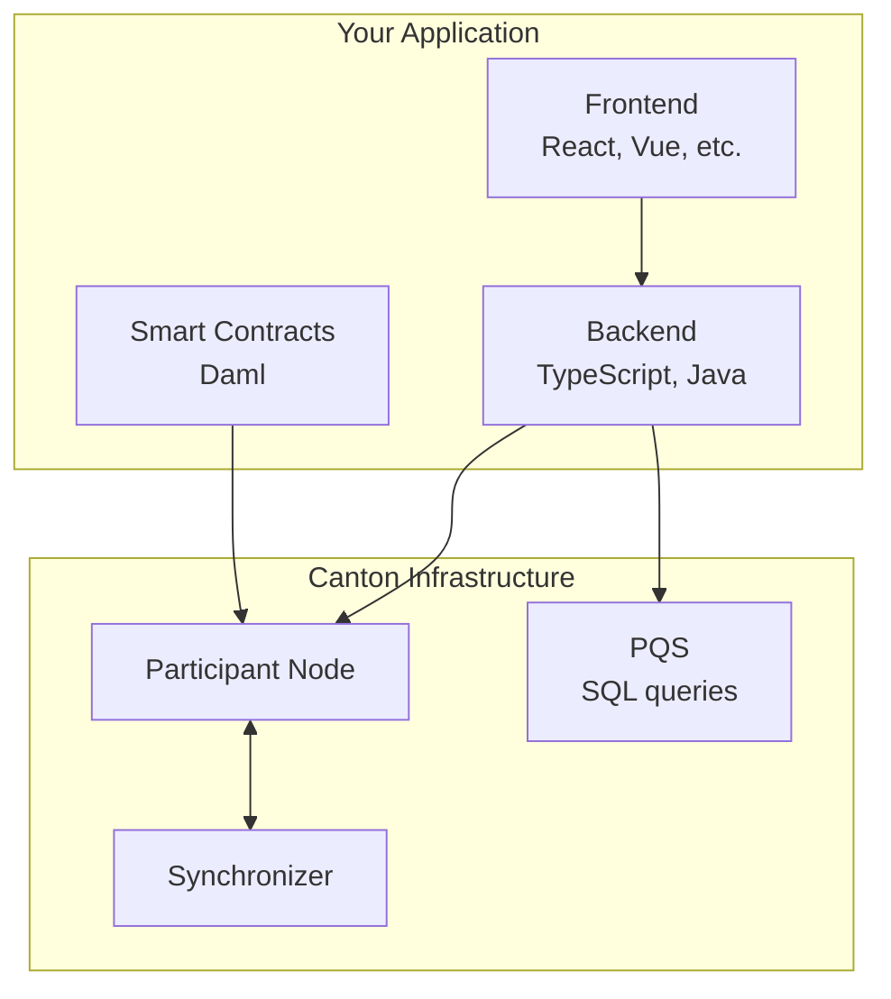

Whether you're new to blockchain or migrating from another platform, this guide helps you find the most efficient path to building on Canton Network.

## Quick Assessment

<AccordionGroup>

<Accordion title="I'm new to blockchain development">
**Recommended Path:**
1. [Five-Minute Overview](/overview/understand/five-minute-overview) - Understand what Canton is
2. [Core Concepts](/overview/understand/core-concepts) - Learn the fundamentals
3. [Module 1: Understanding Canton](/appdev/modules/m1-understanding-canton) - Build mental models
4. [Module 3: Daml Smart Contracts](/appdev/modules/m3-dev-environment) - Start coding
5. [Module 4: Building Applications](/appdev/modules/m4-building-apps-intro) - Hands-on practice with the example application
</Accordion>

<Accordion title="I have Ethereum/Solidity experience">
**Recommended Path:**
1. [Canton for Ethereum Developers](/appdev/modules/m2-canton-for-ethereum-devs) - Map your knowledge
2. [Privacy Model](/overview/learn/privacy-model) - Understand the key difference
3. [Module 3: Daml Smart Contracts](/appdev/modules/m3-dev-environment) - Learn Daml syntax
4. [Module 4: Building Applications](/appdev/modules/m4-building-apps-intro) - Hands-on practice building a full-stack Canton app

**Key differences to internalize:**
- Immutable contracts (archive + create, not mutate)
- Explicit authorization (signatory/controller, not msg.sender)
- Privacy by default (declare observers, not hide data)
</Accordion>

<Accordion title="I have experience with other blockchains (Solana, Cosmos, etc.)">
**Recommended Path:**
1. [Five-Minute Overview](/overview/understand/five-minute-overview) - Canton's approach
2. [Canton for Ethereum Developers](/appdev/modules/m2-canton-for-ethereum-devs) - Concept mapping (still useful)
3. [Architecture Overview](/overview/learn/architecture) - How components work
4. [Module 3: Daml Smart Contracts](/appdev/modules/m3-dev-environment) - Start coding
</Accordion>

<Accordion title="I want to understand Canton without coding (architect/PM)">
**Recommended Path:**
1. [Five-Minute Overview](/overview/understand/five-minute-overview)
2. [The Problem Canton Solves](/overview/understand/the-problem)
3. [Canton's Solution](/overview/understand/cantons-solution)
4. [Use Cases](/overview/understand/use-cases)
5. [Architecture Overview](/overview/learn/architecture)
</Accordion>

</AccordionGroup>

## Learning Modules

The developer documentation is organized into progressive modules:

| Module | Focus | Prerequisites |
|--------|-------|---------------|
| **Module 1** | Understanding Canton | None |
| **Module 2** | Canton for Ethereum Devs | Ethereum/blockchain experience |
| **Module 3** | Daml Smart Contracts | Module 1 or 2 |
| **Module 4** | Building Applications | Module 3 |
| **Module 5** | Testing & Deployment | Module 4 |
| **Module 6** | Smart Contract Upgrades | Module 3-5 |
| **Module 7** | Production Best Practices | Module 5 |

## Development Stack Overview

Canton development involves these components:

## Prerequisites

Before starting development:

### Required

- **Programming experience** in any language
- **Command line** familiarity
- **Git** for version control

### Helpful (but not required)

- **Functional programming** concepts (Haskell, OCaml, F#, or similar)
- **Docker** for running local environments
- **PostgreSQL** for PQS queries

### Development Environment

<CardGroup cols={2}>

<Card title="Daml SDK" icon="download">
  Install the SDK including Daml compiler and tools.
</Card>

<Card title="VS Code Extension" icon="code">
  Install the Daml VS Code extension for syntax highlighting and IDE support.
</Card>

</CardGroup>

## Hands-on Practice

Ready to build? [Module 4: Building Applications](/appdev/modules/m4-building-apps-intro) walks you through a full-stack Canton Network application end-to-end — prerequisites, running the demo, backend and frontend development, the JSON Ledger API, and observability.

## Getting Help

<CardGroup cols={3}>

{/* TODO: Add Slack link once available */}
<Card title="Community Slack" icon="slack" href="/shared/support-channels">
  #gsf-global-synchronizer-appdev channel
</Card>

<Card title="Forum" icon="comments" href="https://forum.canton.network/">
  Technical discussions and Q&A
</Card>

<Card title="FAQ" icon="question" href="/appdev/faq">
  Common questions answered
</Card>

</CardGroup>
