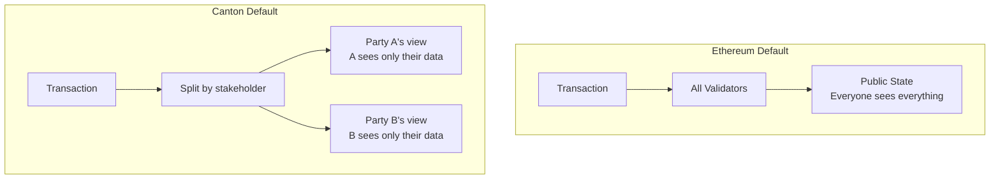
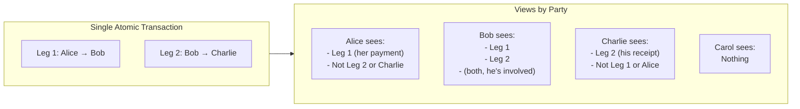
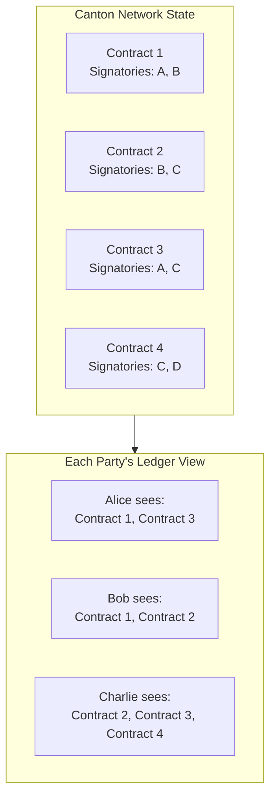

Privacy is the most significant architectural difference between Canton and Ethereum. This page explains the differences in depth and provides guidance for adapting your thinking.

## The Fundamental Difference

| Aspect | Ethereum | Canton |
|--------|----------|--------|
| **Default visibility** | Public | Private |
| **Approach** | Add privacy on top | Build privacy in |
| **Data location** | All nodes store all data | Nodes store only relevant data |
| **Opt-in model** | Opt-in to privacy (difficult) | Opt-in to visibility (explicit observers) |



## Default Visibility Comparison

### Ethereum: Public by Default

On Ethereum, when you deploy a contract or send a transaction:

1. **Transaction data** is visible in the mempool before execution
2. **State changes** are recorded on every node
3. **Historical data** is queryable by anyone forever
4. **Contract code** is readable by anyone
5. **All interactions** are visible to all observers

Even "private" variables in Solidity are not private—they're just not exposed via the ABI. Anyone can read storage slots directly.

```solidity
// Solidity: "private" is misleading
contract NotReallyPrivate {
    uint256 private secretValue;  // Anyone can read this from storage
}
```

### Canton: Private by Default

On Canton, data is visible only to entitled parties:

1. **Transaction content** is encrypted during submission
2. **Views** are delivered only to relevant validators
3. **State** is stored only on validators hosting stakeholders
4. **Contract data** is visible only to signatories and observers
5. **Third parties** see nothing unless explicitly declared

```haskell
-- Daml: Visibility is explicit
template TrulyPrivate
  with
    owner : Party
    secretValue : Decimal
  where
    signatory owner
    -- No observers: only owner sees this contract
```

## Sub-Transaction Privacy

Canton's key innovation is **sub-transaction privacy**: different parts of the same transaction are visible to different parties.

### Example: Atomic Three-Party Transfer

Consider: Alice pays Bob with Canton Coin, and Bob simultaneously pays Charlie.

**On Ethereum:**
- Everyone sees: Alice paid Bob, Bob paid Charlie
- Everyone knows: amounts, parties, timing
- Carol (unrelated) can see all details

**On Canton:**



### Why This Matters

| Use Case | Ethereum Problem | Canton Solution |
|----------|------------------|-----------------|
| **Trading** | Competitors see your trades | Only counterparty sees trade |
| **Lending** | Loan terms are public | Only borrower/lender see terms |
| **Supply chain** | All parties see all prices | Each party sees their portion |
| **Compliance** | Data visible to unauthorized parties | Regulator added as observer only |

## Comparison to Ethereum Privacy Solutions

### Layer 2 Solutions

**Approach:** Move transactions off MainNet; settle on-chain.

| Aspect | L2 Solutions | Canton |
|--------|--------------|--------|
| **Operator visibility** | L2 operator sees all transactions | Synchronizer sees nothing |
| **Data availability** | Must be available somewhere | Only to entitled parties |
| **Settlement** | Requires L1 confirmation | Immediate finality |
| **Trust model** | Trust L2 operator | Cryptographic privacy |

### Zero-Knowledge Solutions

**Approach:** Prove validity without revealing data.

Canton does not use zero-knowledge proofs. Instead, privacy is achieved through selective data distribution—parties only receive the transaction views they're entitled to see. This provides a simpler programming model without ZK circuit complexity or proof generation overhead.

### Private Channels (Hyperledger Fabric)

**Approach:** Separate channels for private transactions.

| Aspect | Private Channels | Canton |
|--------|------------------|--------|
| **Granularity** | Channel-level | Sub-transaction level |
| **Cross-channel** | Complex to implement | Native atomic transactions |
| **Membership** | Must manage channel membership | Declared in contracts |
| **Flexibility** | Rigid channel structure | Dynamic per-transaction |

### Encryption at Rest

**Approach:** Encrypt data stored on-chain.

| Aspect | Encryption | Canton |
|--------|------------|--------|
| **Key management** | Complex key distribution | No shared keys needed |
| **Metadata** | Transaction patterns visible | Encrypted entirely |
| **Future risk** | May be decrypted later | Not stored to decrypt |
| **Computation** | Can't compute on encrypted data | Full computation on views |

## Private Ledger View

In Canton, each party has their own **private ledger view**—the collection of all contracts where they're a stakeholder.

### What This Means



**Key implications:**

| On Ethereum | On Canton |
|-------------|-----------|
| Query all tokens: `getAllTokens()` | Query *your* tokens: `getMyContracts()` |
| Global state exists | No global state concept |
| Total supply is known | Total supply visible only if explicitly designed for visibility |
| Any node answers any query | Only your validator answers your queries |

### Querying Data

**Ethereum approach:**
```javascript
// Anyone can query any data
const totalSupply = await token.totalSupply();
const aliceBalance = await token.balanceOf(alice);
const bobBalance = await token.balanceOf(bob);
```

**Canton approach:**
```typescript
// You can only query your own data
const myContracts = await ledgerApi.getActiveContracts({
  templateId: "Token",
  party: myParty  // Only your party
});

// Can't query Bob's balance unless you're an observer
```

## What the Synchronizer Can and Cannot See

The synchronizer (sequencer + mediator) coordinates transactions but never sees content.

### Synchronizer Can See

- Encrypted message blobs (must deliver them)
- Message sizes (network routing)
- Timestamps (ordering)
- Confirmation results, such as committed or rejected (finality)
- Validator identifiers (routing)
- Party identifiers (for routing, but not end-user identity)

### Synchronizer Cannot See

- Transaction content (encrypted)
- Contract data (never transmitted to synchronizer)
- Choice being exercised (encrypted)
- Amounts, prices, terms (encrypted)

### Trust Implications

Canton's trust model differs fundamentally from traditional blockchains:

**What you trust the synchronizer for:**
- Ordering transactions fairly (not reordering to favor certain parties)
- Delivering messages to all entitled participants
- Availability (being online when you need to transact)

**What you don't need to trust the synchronizer for:**
- Your data privacy—it only sees encrypted blobs
- Transaction validation—your validator does this
- Correct execution—the protocol enforces this cryptographically

**What you trust your validator for:**
- Storing your contract data securely
- Executing transactions correctly on your behalf
- Not revealing your data to unauthorized parties

<Warning>
Your hosting validator sees all your party's data. Choose your validator carefully—this is a trust relationship similar to choosing a bank or custodian.
</Warning>

| Ethereum | Canton |
|----------|--------|
| Trust all validators not to censor | Trust synchronizer not to censor |
| All validators see everything | Synchronizer sees only encrypted views |
| MEV is possible (validators see pending txs) | MEV is significantly harder (transactions encrypted) |
| Front-running is structural | Front-running is much harder |
| Trust any node for queries | Trust only your validator for your data |

## Design Implications for Developers

### Rethinking State Queries

**Ethereum mindset:** "How do I query global state?"

**Canton mindset:** "What can my party see, and who else needs visibility?"

### Observer Pattern

When designing contracts, explicitly consider:

1. **Who are signatories?** They must authorize and always see.
2. **Who are observers?** They can see but not act.
3. **Who can exercise choices?** Controllers for each choice.
4. **What gets divulged?** Fetching contracts in transactions reveals them.

```haskell
template DesignedForPrivacy
  with
    primaryParty : Party
    counterparty : Party
    auditor : Party  -- Only if audit is required
    details : SensitiveData
  where
    signatory primaryParty
    observer counterparty  -- Needs to see, but not auditor

    -- Add auditor only when they need to see
    choice AddAuditObserver : ContractId DesignedForPrivacy
      with newAuditor : Party
      controller primaryParty
      do create this with auditor = newAuditor
```

### Privacy Checklist

When designing Canton applications:

| Question | Design Impact |
|----------|---------------|
| Who needs to see this contract? | Signatory + observer declarations |
| Who can act on this contract? | Controller declarations per choice |
| What happens when contracts are fetched? | Divulgence considerations |
| Do third parties need visibility? | Add observers explicitly |
| Should validators see everything? | Consider party hosting choices |

## Next Steps

<CardGroup cols={2}>

<Card title="Smart Contract Paradigm" icon="code" href="/docs-main/appdev/modules/m2-smart-contract-paradigm">
  Understand Daml's immutable contract model vs. Solidity.
</Card>

<Card title="Privacy Model Deep Dive" icon="lock" href="/docs-main/overview/learn/privacy-model">
  Technical details of sub-transaction privacy.
</Card>

</CardGroup>
