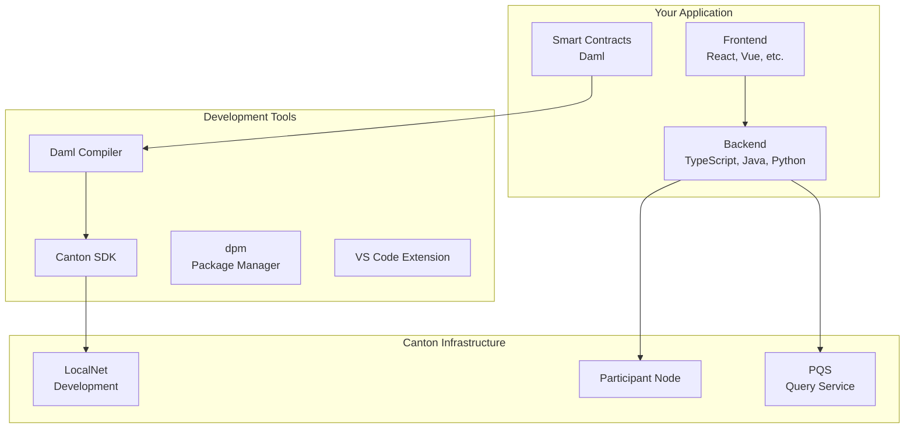
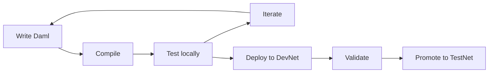

This page introduces the development stack you'll use to build Canton applications. Understanding these components helps you see how everything fits together.

## Stack Overview



## Smart Contract Layer

### Daml

Daml is Canton's smart contract language—a functional language designed for multi-party workflows.

| Aspect | Details |
|--------|---------|
| **Paradigm** | Functional programming |
| **Type system** | Strongly typed with inference |
| **Compiles to** | Daml-LF (ledger format) |
| **Primary use** | Define contracts, choices, authorization |

**Example:**

```haskell
template Token
  with
    owner : Party
    issuer : Party
    amount : Decimal
  where
    signatory issuer
    observer owner

    choice Transfer : ContractId Token
      with newOwner : Party
      controller owner
      do create this with owner = newOwner
```

### Daml Compiler

The Daml compiler (`daml build`) compiles Daml source code into DAR files (Daml Archives) that can be deployed to participant nodes.

```bash
# Compile Daml code
daml build

# Output: .dar file containing compiled contracts
```

## Application Layer

### Backend Integration

Your backend connects to Canton via the Ledger API.

| Option | Protocol | Best For |
|--------|----------|----------|
| **gRPC API** | gRPC/Protobuf | High-performance, typed |
| **JSON API** | HTTP/JSON | Simpler integration, web-friendly |

**Language support:**
- TypeScript/JavaScript (code generation available)
- Java (code generation available)
- Python
- Any language via gRPC

### Code Generation

Generate type-safe bindings from your Daml code:

```bash
# Generate TypeScript bindings
daml codegen ts .dar -o generated

# Generate Java bindings
daml codegen java .dar -o generated
```

Generated code provides:
- Type-safe contract representations
- Command submission helpers
- Event handling utilities

### Frontend

Use any web framework. Common choices:

| Framework | Notes |
|-----------|-------|
| **React** | Most common in Canton ecosystem |
| **Vue** | Good alternative |
| **Angular** | Enterprise preference |

The frontend typically connects via your backend, which handles Ledger API communication.

## Development Tools

### Canton SDK

The Canton SDK bundles everything needed for Canton development:

| Component | Purpose |
|-----------|---------|
| **Daml compiler** | Compile smart contracts |
| **Canton runtime** | Run local participant nodes |
| **Console** | Interactive administration |
| **Templates** | Project scaffolding |

### dpm (Daml Package Manager)

Manage dependencies and build workflows:

```bash
# Initialize project
dpm init

# Add dependency
dpm add package-name

# Build
dpm build
```

### VS Code Extension

The Daml VS Code extension ([Daml Studio](https://marketplace.visualstudio.com/items?itemName=DigitalAssetHoldingsLLC.daml)) provides:

- Syntax highlighting
- Type checking
- Error diagnostics
- Code navigation
- Integrated terminal

**Install:** Search "Daml" in VS Code extensions.

## Infrastructure Components

### LocalNet

LocalNet is a local Canton environment for development:

```bash
# Start LocalNet (via QuickStart)
make start

# Or via Canton SDK
canton-sandbox
```

LocalNet provides:
- Local synchronizer
- Local participant node(s)
- Test Canton Coin
- No external dependencies

### Participant Node

The participant node is the Canton runtime that:
- Hosts your parties
- Stores contract data
- Executes Daml logic
- Exposes the Ledger API

In production, this runs on your infrastructure or a service provider's.

### PQS (Participant Query Store)

PQS provides SQL-based querying for complex data access:

| Use Case | Ledger API | PQS |
|----------|------------|-----|
| Simple queries | Good | Good |
| Complex aggregations | Limited | Excellent |
| Reporting | Difficult | Easy |
| Real-time updates | Excellent | Good |

PQS maintains a PostgreSQL database synchronized with ledger state.

## Development Workflow

### Typical Flow



### Steps

1. **Write** Daml contracts defining your business logic
2. **Compile** with `daml build`
3. **Test** locally with Daml Script or LocalNet
4. **Build** backend integration
5. **Deploy** to DevNet for integration testing
6. **Promote** through TestNet to MainNet

## QuickStart Project

The [cn-quickstart](https://github.com/digital-asset/cn-quickstart) repository provides a complete example:

| Component | Technology |
|-----------|------------|
| **Contracts** | Daml |
| **Backend** | TypeScript |
| **Frontend** | React |
| **Infrastructure** | Docker Compose LocalNet |

```bash
# Clone and run
git clone https://github.com/digital-asset/cn-quickstart
cd cn-quickstart
make start
```

## Tool Comparison with Other Platforms

| Purpose | Ethereum | Canton |
|---------|----------|--------|
| **Smart contracts** | Solidity | Daml |
| **Build tool** | Hardhat/Foundry | daml build/dpm |
| **IDE** | Remix, VS Code | VS Code + Daml extension |
| **Testing** | Mocha, Foundry tests | Daml Script |
| **Local network** | Hardhat node, Anvil | LocalNet, Canton Sandbox |
| **API** | JSON-RPC | Ledger API (gRPC/JSON) |
| **Indexing** | The Graph | PQS |

## Next Steps

<CardGroup cols={2}>

<Card title="QuickStart" icon="rocket" href="/docs-main/appdev/quickstart">
  Run the example application.
</Card>

<Card title="Module 3: Daml" icon="code" href="/docs-main/developer/m3-daml">
  Start writing smart contracts.
</Card>

</CardGroup>
