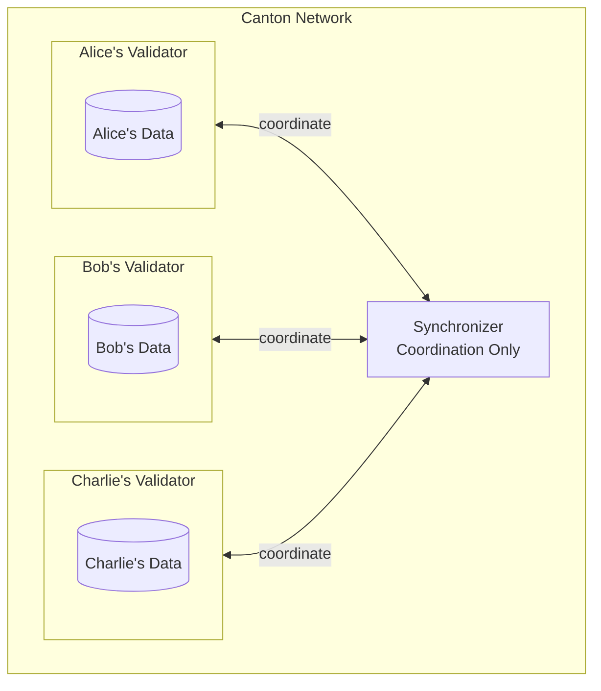
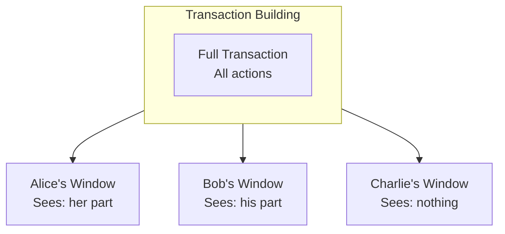
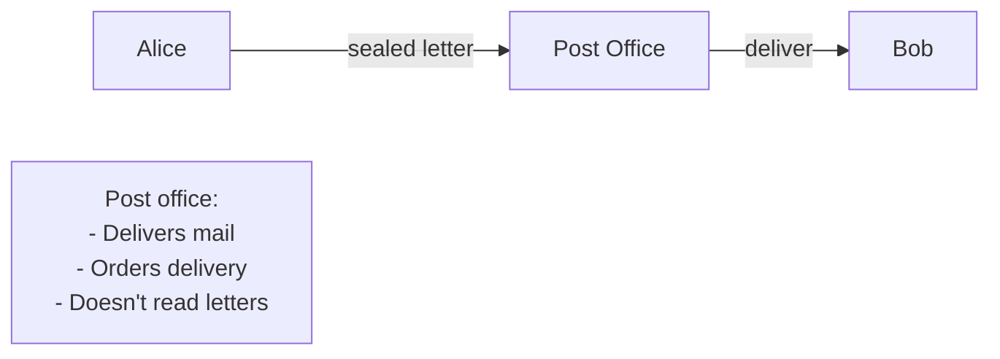
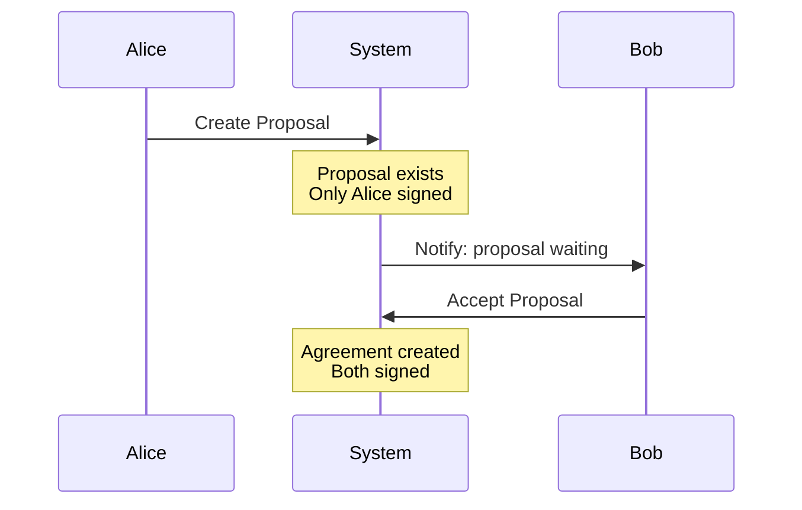

Effective Canton development requires the right mental models. This page helps you build intuition that will make everything else click.

## Mental Model 1: The Private Database Network

Think of Canton not as a blockchain, but as a network of private databases that can coordinate.

### The Model



**Key insight:** Each party's data stays in their validator. When Alice and Bob transact, only Alice and Bob's validators participate. Charlie's data is unaffected and Charlie doesn't even know it happened.

### Why This Matters

- **For queries**: You can only query your own data
- **For design**: Think about what data goes where
- **For privacy**: Data never leaves where it belongs

## Mental Model 2: Contracts as Facts

Think of contracts not as code that executes, but as **facts** that exist.

### The Model

| Traditional View | Canton View |
|------------------|-------------|
| "Contract has state X" | "Fact: Alice owns 100 tokens" |
| "Update state to Y" | "Archive old fact, create new fact" |
| "Contract at address Z" | "Fact identified by ID, may be archived" |

### Example

```
Fact 1: "Alice owns 100 tokens" (exists)
Action: Alice transfers 30 to Bob
Fact 1: "Alice owns 100 tokens" (archived)
Fact 2: "Alice owns 70 tokens" (created)
Fact 3: "Bob owns 30 tokens" (created)
```

**Key insight:** You never modify facts. Old facts become history, new facts are created. This gives you an immutable audit trail and enables privacy guarantees.

## Mental Model 3: Authorization as Structure

Think of authorization not as code you write, but as **structure** you declare.

### Traditional Authorization

```
function doThing() {
  if (msg.sender != owner) revert();
  // do thing
}
```

The code checks authorization at runtime. If you forget the check, anyone can call it.

### Canton Authorization

```haskell
choice DoThing : Result
  controller owner  -- Declaration, not code
  do
    -- Only owner can reach here
```

**Key insight:** Authorization is declared in the type system. The protocol enforces it. You can't forget to check because there's nothing to check.

## Mental Model 4: Views as Windows

Think of transactions as having **windows** (views) that different parties look through.

### The Model

Imagine a transaction as a building with different windows:



Each party looks through their window and sees only what they're entitled to see. The building (transaction) is the same, but the views are different.

**Key insight:** Privacy isn't about hiding data—it's about each party having their own view of shared reality.

## Mental Model 5: Parties as Stakeholders

Think of parties not as "accounts" but as **stakeholders** with specific roles.

### Roles

| Role | Meaning | Analogy |
|------|---------|---------|
| **Signatory** | Must authorize, always sees | Signer on a legal document |
| **Observer** | Can see, can't act | CC'd on an email |
| **Controller** | Can execute specific action | Has the key to a specific door |

### Example: Loan Agreement

```
Loan Contract:
- Signatory: Bank (must authorize the loan)
- Signatory: Borrower (must authorize the loan)
- Observer: Auditor (can see the loan)
- Controller for Repay: Borrower (only they can repay)
- Controller for Foreclose: Bank (only they can foreclose)
```

**Key insight:** Each party has a specific relationship to the contract. This relationship determines what they can see and do.

## Mental Model 6: The Synchronizer as a Post Office

Think of the synchronizer not as a blockchain, but as a **post office**.

### The Model



The post office:
- Receives sealed letters (encrypted messages)
- Puts them in order
- Delivers them to recipients
- Never opens or reads them

**Key insight:** The synchronizer is infrastructure, not a participant. It can't see what you're doing, only that you're doing something.

## Mental Model 7: Transactions as Proposals

Think of multi-party transactions as **proposals** that require acceptance.

### The Model

When Alice wants to create a contract that Bob must also sign:



**Key insight:** Multi-party authorization requires explicit consent. You can't force someone into a contract—they must accept.

## Putting It Together

When building on Canton, keep these models in mind:

| Situation | Apply Model |
|-----------|-------------|
| Designing data storage | Private Database Network |
| Designing state changes | Contracts as Facts |
| Designing permissions | Authorization as Structure |
| Designing privacy | Views as Windows |
| Designing parties | Parties as Stakeholders |
| Understanding infrastructure | Synchronizer as Post Office |
| Designing workflows | Transactions as Proposals |

## Common Misconceptions

| Misconception | Reality |
|---------------|---------|
| "Canton is just another blockchain" | It's a fundamentally different architecture |
| "I can query all contracts" | You can only query your party's data |
| "Smart contracts have addresses" | Contracts have IDs that change on archive/create |
| "Validators see everything" | Validators see only their parties' data |
| "The synchronizer stores my data" | The synchronizer stores nothing |

## Next Steps

<CardGroup cols={2}>

<Card title="Development Stack" icon="layer-group" href="/docs-main/appdev/modules/m1-development-stack">
  Understand the tools you'll use.
</Card>

<Card title="Architecture Overview" icon="diagram-project" href="/docs-main/overview/learn/architecture">
  See how components work together technically.
</Card>

</CardGroup>
