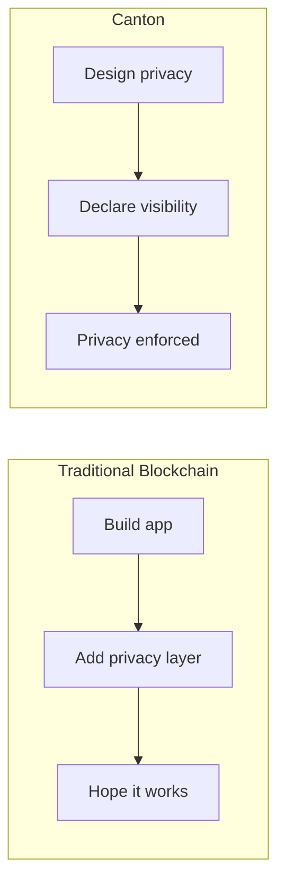

This module provides the conceptual foundation you need before writing Canton code. Even if you're eager to start coding, taking time to understand these concepts will make you more effective.

## Module Overview

| Section | Purpose |
|---------|---------|
| **Mental Models** | Build intuition for how Canton works |
| **Development Stack** | Understand the tools and technologies |
| **How Canton Differs** | See what makes Canton unique |

## Why This Module Matters

Canton is not just another blockchain with different syntax. It represents a fundamentally different approach to distributed ledgers:

- **Privacy is native**, not bolted on
- **Consensus is targeted**, not global
- **State is distributed**, not replicated
- **Authorization is declared**, not coded

Understanding these principles upfront will save you from fighting against the architecture later.

## Core Insights

### Insight 1: Privacy First

On most blockchains, you build an application and then try to add privacy. On Canton, you start with privacy and choose what to reveal.

### Insight 2: No Global State

There is no single "blockchain" you can query for all information. Each party has their own view of the ledger.

| Traditional View | Canton Reality |
|------------------|----------------|
| "Query the blockchain" | Query *your* data from *your* validator |
| "Total supply" | Calculated if designed to be visible |
| "All transactions" | *Your* transactions only |

### Insight 3: Immutable Everything

Contracts don't change. When you "update" a contract, you archive the old one and create a new one. This isn't a limitation—it's the foundation of privacy and integrity guarantees.

### Insight 4: Explicit Authorization

You don't check `msg.sender` at runtime. You declare who can do what at compile time, and the protocol enforces it.

## Prerequisites Check

Before proceeding, you should:

- **Understand** what Canton is ([Five-Minute Overview](/docs-main/overview/understand/five-minute-overview))
- **Know** the basic components ([Core Concepts](/docs-main/overview/understand/core-concepts))
- **Have** programming experience (any language)

No blockchain experience is required—and if you have it, be prepared to unlearn some things.

## What You'll Learn

By the end of this module, you'll understand:

1. How to think about Canton's privacy model
2. The relationship between parties, validators, and synchronizers
3. How transactions flow through the system
4. What tools you'll use for development

## Learning Path

<CardGroup cols={2}>

<Card title="Mental Models" icon="brain" href="/docs-main/appdev/modules/m1-mental-models">
  Build intuition for Canton's approach to distributed ledgers.
</Card>

<Card title="Development Stack" icon="wrench" href="/docs-main/appdev/modules/m1-development-stack">
  Understand the tools and technologies you'll use.
</Card>

</CardGroup>

After completing this module, continue to:
- **[Module 2](/docs-main/appdev/modules/m2-canton-for-ethereum-devs)**: If you have Ethereum/blockchain experience
- **[Daml Documentation](https://docs.daml.com)**: If you're ready to start writing Daml
