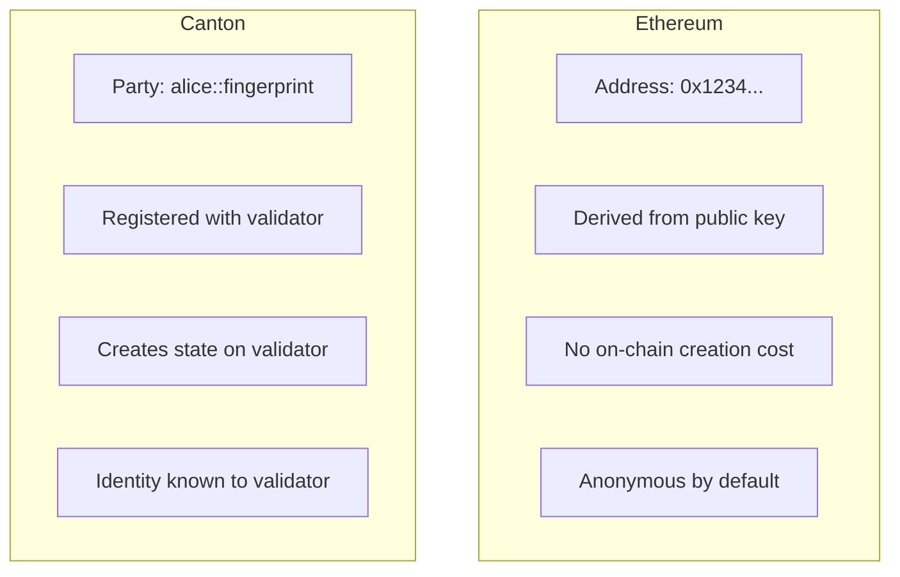

This reference provides detailed translations from Ethereum concepts to their Canton equivalents. Use this as a quick reference when you encounter familiar terms and need to understand their Canton counterpart.

## Core Protocol Concepts

| Ethereum | Canton | Key Differences |
|----------|--------|-----------------|
| **Blockchain** | Synchronizer | Canton synchronizers coordinate without storing state |
| **Block** | Transaction batch | Participants receive only relevant transactions |
| **Node** | Validator / Participant | Stores only hosted parties' data |
| **Global state** | Distributed state | No global view; each party has their view |
| **Finality** | Confirmation | Deterministic finality after confirmation |
| **Reorg** | Not applicable | Canton has no chain reorganizations |

## Identity & Accounts

| Ethereum | Canton | Key Differences |
|----------|--------|-----------------|
| **EOA (Address)** | Party | Parties have explicit authorization semantics |
| **Private key** | Party keys | Can be local (validator-held) or external |
| **msg.sender** | Controller | Declared at compile-time, not runtime |
| **Contract address** | Contract ID | Unique identifier, not derived from deployer |
| **ENS name** | Canton Name Service (CNS) | Human-readable party identifiers |

### Party vs. Address Deep Dive



**Implications:**
- Don't create parties frivolously (unlike Ethereum addresses)
- Party creation requires interaction with a validator
- Parties are not pseudonymous in the same way as Ethereum addresses

## Smart Contract Concepts

| Ethereum | Canton | Key Differences |
|----------|--------|-----------------|
| **Smart contract** | Template | Daml defines types and choices |
| **Contract instance** | Contract | Immutable; state changes create new contracts |
| **Function** | Choice | Choices are typed and authorized |
| **Constructor** | `create` | Creates contract from template |
| **Storage variables** | Contract fields | Immutable within a contract instance |
| **ABI** | Daml types | Type-safe interface definition |

### State Model Comparison

**Ethereum: Mutable State**
```solidity
contract Token {
    mapping(address => uint256) balances;

    function transfer(address to, uint256 amount) public {
        balances[msg.sender] -= amount;  // Mutate in place
        balances[to] += amount;
    }
}
```

**Canton: Immutable Contracts**
```haskell
template Token
  with
    owner : Party
    amount : Decimal
  where
    signatory owner

    choice Transfer : ContractId Token
      with newOwner : Party
      controller owner
      do
        -- Archive this contract (implicit)
        -- Create new contract with new owner
        create this with owner = newOwner
```

| Aspect | Ethereum | Canton |
|--------|----------|--------|
| **Modification** | Update storage variables | Archive old, create new |
| **History** | Implicit in state transitions | Explicit in contract lifecycle |
| **Atomicity** | Per-transaction | Per-transaction |
| **Rollback** | Revert state changes | Hidden as part of the protocol |

## Transaction Concepts

| Ethereum | Canton | Key Differences |
|----------|--------|-----------------|
| **Transaction** | Transaction / Command | Canton transactions are privacy-preserving |
| **Transaction hash** | Transaction ID | Unique identifier |
| **Gas** | Traffic | Paid in Canton Coin |
| **Gas price** | Traffic cost | Based on transaction size and complexity |
| **Nonce** | Not required | Canton handles ordering |
| **Receipt** | Completion | Confirmation of command execution |

### Transaction Visibility

| Ethereum | Canton |
|----------|--------|
| Transaction visible to all nodes | Transaction split into views |
| Everyone sees sender, recipient, data | Each party sees only their view |
| Public mempool | Encrypted submission |
| Block explorer shows everything | Block explorer shows your transactions only |

## Authorization Concepts

| Ethereum | Canton | Key Differences |
|----------|--------|-----------------|
| **msg.sender** | Controller | Compile-time vs. runtime check |
| **require()** | Signatory/controller declarations | Enforced by protocol |
| **Ownable** | Signatory pattern | Built into the language |
| **Access control** | Observer/controller declarations | Explicit visibility control |
| **Multi-sig** | Multiple signatories | Native multi-party support |

### Authorization Example

**Ethereum: Runtime Check**
```solidity
function transfer(address to, uint256 amount) public {
    require(msg.sender == owner, "Not authorized");
    // ... transfer logic
}
```

**Canton: Compile-Time Declaration**
```haskell
choice Transfer : ContractId Asset
  controller owner  -- Only owner can exercise this choice
  do
    -- No runtime check needed; protocol enforces
    create this with owner = newOwner
```

## Event & Data Concepts

| Ethereum | Canton | Key Differences |
|----------|--------|-----------------|
| **Events** | Transaction tree | Structured record of actions |
| **emit** | Implicit in transaction | All creates/archives are recorded |
| **Indexed parameters** | Contract fields | Queryable via Ledger API/PQS |
| **Logs** | Active Contract Set (ACS) | Current state queryable |
| **eth_getLogs** | GetTransactionTrees | Historical transaction data |

## Network Concepts

| Ethereum | Canton | Key Differences |
|----------|--------|-----------------|
| **MainNet** | Canton Network MainNet | Production with real value |
| **Testnet (Sepolia)** | DevNet / TestNet | Test environments |
| **Local (Hardhat/Anvil)** | LocalNet | Development environment |
| **RPC endpoint** | Ledger API | gRPC or JSON interface |
| **Infura/Alchemy** | Validator service | Hosted infrastructure |
| **Chain ID** | Synchronizer ID | Network identifier |

### Environment Comparison

| Environment | Ethereum | Canton |
|-------------|----------|--------|
| **Local development** | Hardhat, Anvil, Ganache | LocalNet (Daml SDK) |
| **Shared testing** | Sepolia, Goerli | DevNet (requires sponsorship) |
| **Pre-production** | Sepolia | TestNet (requires approval) |
| **Production** | MainNet | MainNet (full onboarding) |

## Development Tooling

| Ethereum | Canton | Notes |
|----------|--------|-------|
| **Solidity** | Daml | Different paradigm: functional vs. imperative |
| **Hardhat/Foundry** | dpm + daml build | Build and test toolchain |
| **Remix** | VS Code + Daml extension | IDE support |
| **ethers.js/web3.js** | Ledger API (gRPC/JSON) | Application integration |
| **MetaMask** | Wallet SDK | User wallet integration |
| **Etherscan** | Scan API | Network exploration |
| **The Graph** | PQS | Indexed data queries |

## Common Patterns

| Ethereum Pattern | Canton Equivalent |
|------------------|-------------------|
| **ERC-20** | Token Standard ([CIP-0056](https://github.com/global-synchronizer-foundation/cips/blob/main/cip-0056/cip-0056.md)) |
| **ERC-721/ERC-1155** | dApp Standard ([CIP-0103](https://github.com/mjuchli-da/cips/blob/cip-dapp-standard/cip-0103/cip-0103.md)) |
| **Proxy pattern** | Smart Contract Upgrade (SCU) |
| **Factory pattern** | Template instantiation |
| **Pull payments** | Propose/accept pattern |
| **Access control lists** | Observer lists |
| **Pausable** | Contract lifecycle choices |
| **Reentrancy guard** | Not needed (sequential execution) |

## What Doesn't Translate

Some Ethereum concepts have no direct Canton equivalent:

| Ethereum | Canton Reality |
|----------|----------------|
| **Public by default** | Private by default |
| **Any node can query any state** | Query only your parties' data |
| **Anonymous participation** | Parties have identity |
| **Permissionless contract deployment** | Packages vetted by validators |
| **Flash loans** | Different execution model |
| **MEV/front-running** | Transactions are encrypted |

## Next Steps

<CardGroup cols={2}>

<Card title="Privacy Differences" icon="lock" href="/docs-main/appdev/modules/m2-privacy-differences">
  Deep dive into Canton's privacy model vs. Ethereum.
</Card>

<Card title="Smart Contract Paradigm" icon="code" href="/docs-main/appdev/modules/m2-smart-contract-paradigm">
  Understand the Daml vs. Solidity programming model.
</Card>

</CardGroup>
