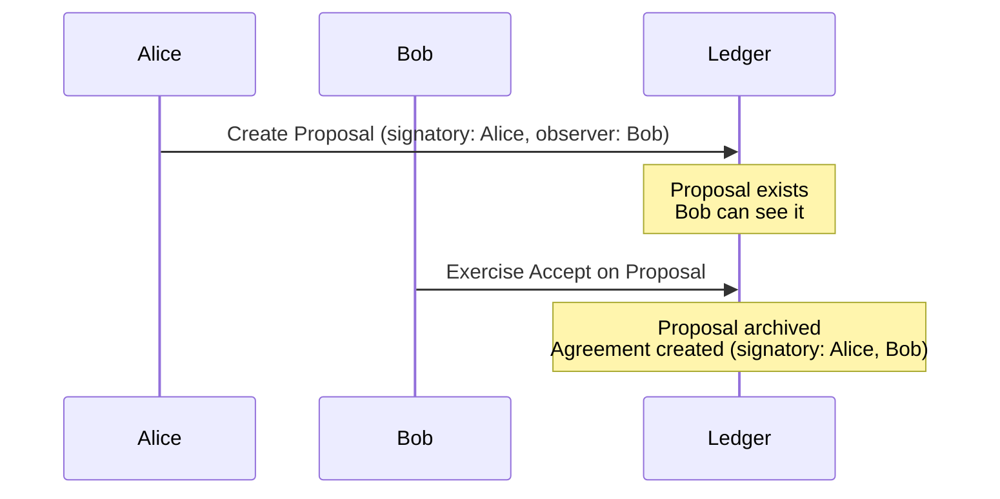
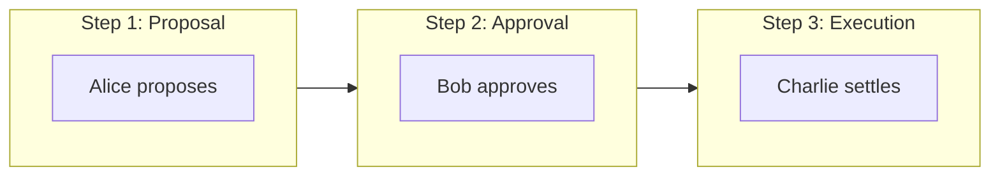
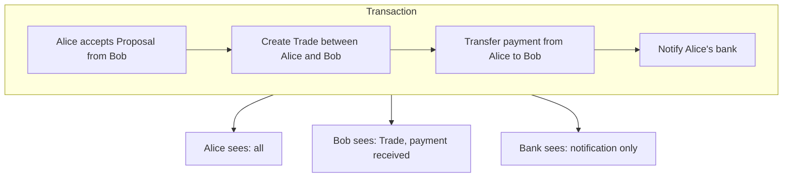

Multi-party workflows are where Canton's architecture shines compared to Ethereum. This page covers the key patterns and how to think about them differently.

## The Core Difference

On Ethereum, multi-party agreement is a **pattern you implement**. On Canton, it's a **protocol guarantee**.

| Aspect | Ethereum | Canton |
|--------|----------|--------|
| **Multi-sig creation** | Deploy contract, collect signatures over time | Collect signatures over time or submit all at once |
| **Authorization** | Runtime mapping checks | Protocol-level enforcement |
| **Atomicity** | Manual state machine | Built-in all-or-nothing |
| **Visibility** | All parties see everything | Each party sees only their view |

## The Propose-Accept Pattern

Since Canton requires all signatories to authorize contract creation, you can't create a multi-party contract unilaterally. The standard pattern is **propose-accept**:



### In Daml

```haskell
-- Step 1: Alice creates a proposal
template TradeProposal
  with
    proposer : Party
    counterparty : Party
    asset : Text
    price : Decimal
  where
    signatory proposer
    observer counterparty  -- Counterparty can see the proposal

    choice Accept : ContractId Trade
      controller counterparty  -- Only counterparty can accept
      do
        create Trade with
          buyer = counterparty
          seller = proposer
          asset
          price

    choice Withdraw : ()
      controller proposer  -- Proposer can cancel
      do pure ()

-- Step 2: Acceptance creates the multi-party contract
template Trade
  with
    buyer : Party
    seller : Party
    asset : Text
    price : Decimal
  where
    signatory buyer, seller  -- Both must have agreed
```

### Compare to Ethereum

```solidity
// Ethereum: Manual approval tracking
contract TradeEscrow {
    address public buyer;
    address public seller;
    bool public buyerApproved;
    bool public sellerApproved;

    function approve() public {
        if (msg.sender == buyer) buyerApproved = true;
        if (msg.sender == seller) sellerApproved = true;
    }

    function execute() public {
        require(buyerApproved && sellerApproved, "Not approved");
        // Execute trade...
    }
}
```

The Canton version:
- Authorization is enforced by the protocol, not by application-level checks
- State transitions are atomic, so partial or inconsistent states don't arise
- Visibility is automatically scoped to the involved parties

## Delegation Patterns

Canton supports sophisticated delegation where one party grants another the ability to act on their behalf.

### Controller Delegation

```haskell
template Asset
  with
    owner : Party
    delegate : Optional Party  -- Optional delegate
  where
    signatory owner

    choice Transfer : ContractId Asset
      with newOwner : Party
      controller case delegate of
        Some d -> d        -- Delegate can act if set
        None -> owner      -- Otherwise owner acts
      do
        create this with owner = newOwner

    choice SetDelegate : ContractId Asset
      with newDelegate : Party
      controller owner
      do
        create this with delegate = Some newDelegate
```

### Delegation via Separate Contract

```haskell
-- Delegation authority as a separate contract
template DelegationAuthority
  with
    principal : Party    -- Who grants authority
    agent : Party        -- Who receives authority
    scope : [Text]       -- What actions are allowed
  where
    signatory principal
    observer agent

    nonconsuming choice ActOnBehalf : ()
      with action : Text
      controller agent
      do
        assertMsg "Action not in scope" (action `elem` scope)
        -- Perform delegated action...
        pure ()
```

## Multi-Step Workflows

For workflows requiring multiple parties in sequence:



### Workflow State Machine

```haskell
data WorkflowState
  = Proposed
  | Approved
  | Settled

template Workflow
  with
    initiator : Party
    approver : Party
    settler : Party
    state : WorkflowState
    payload : Text
  where
    signatory initiator
    observer approver, settler

    choice Approve : ContractId Workflow
      controller approver
      do
        assertMsg "Must be in Proposed state" (state == Proposed)
        create this with state = Approved

    choice Settle : ContractId Workflow
      controller settler
      do
        assertMsg "Must be in Approved state" (state == Approved)
        create this with state = Settled
```

## Atomic Multi-Contract Operations

Canton can atomically update multiple contracts in a single transaction:

```haskell
choice ExecuteSwap : ()
  with
    assetA : ContractId Asset
    assetB : ContractId Asset
  controller buyer, seller
  do
    -- Both happen atomically or neither does
    exercise assetA Transfer with newOwner = buyer
    exercise assetB Transfer with newOwner = seller
```

### Why This Matters

On Ethereum, atomic swaps require:
- Escrow contracts
- Time-locked phases
- Failure recovery logic
- Careful reentrancy protection

On Canton, atomicity is **guaranteed by the protocol**. If any part fails, nothing happens.

## Privacy in Multi-Party Workflows

Each party only sees their relevant portion:



## Common Workflow Patterns

| Pattern | Use Case | Key Feature |
|---------|----------|-------------|
| **Propose-Accept** | Two-party agreements | Simple, clear consent |
| **Propose-Accept-Settle** | Three-party workflows | Sequential authorization |
| **Delegation** | Acting on behalf | Controlled authority transfer |
| **Escrow** | Conditional execution | Atomic swap guarantee |
| **Voting** | Group decisions | Threshold-based approval |

### Voting Example

```haskell
template Vote
  with
    proposal : Text
    voters : [Party]
    votes : [(Party, Bool)]
    threshold : Int
  where
    signatory (map fst votes)
    observer voters

    choice CastVote : ContractId Vote
      with
        voter : Party
        approve : Bool
      controller voter
      do
        assertMsg "Not a voter" (voter `elem` voters)
        assertMsg "Already voted" (voter `notElem` map fst votes)
        create this with votes = (voter, approve) :: votes

    choice TallyAndExecute : ()
      controller voters
      do
        let approvals = length [v | (_, v) <- votes, v]
        assertMsg "Threshold not met" (approvals >= threshold)
        -- Execute the proposal...
        pure ()
```

## Related Topics

<CardGroup cols={2}>

<Card title="Migration Checklist" icon="list-check" href="/docs-main/appdev/modules/m2-migration-checklist">
  Practical checklist for migrating from Ethereum.
</Card>

<Card title="Module 3: Daml" icon="code" href="/docs-main/appdev/modules/m3-dev-environment">
  Start writing Daml smart contracts.
</Card>

</CardGroup>
