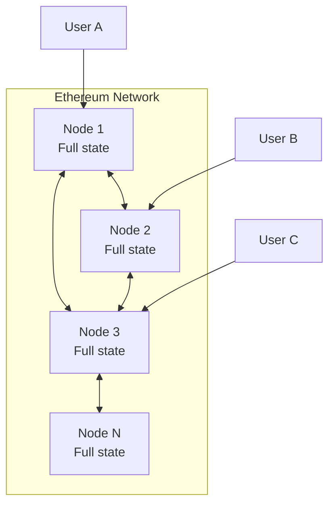
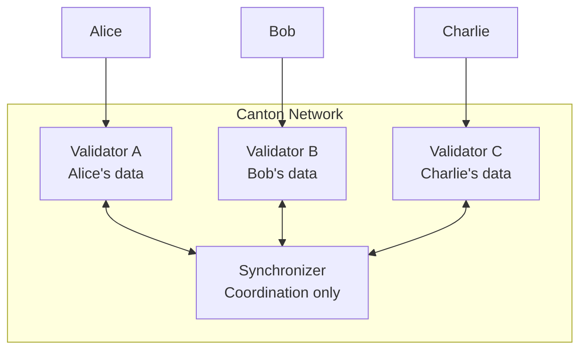
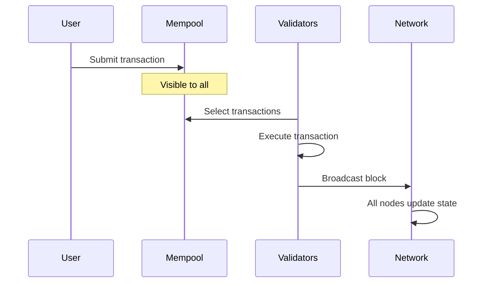
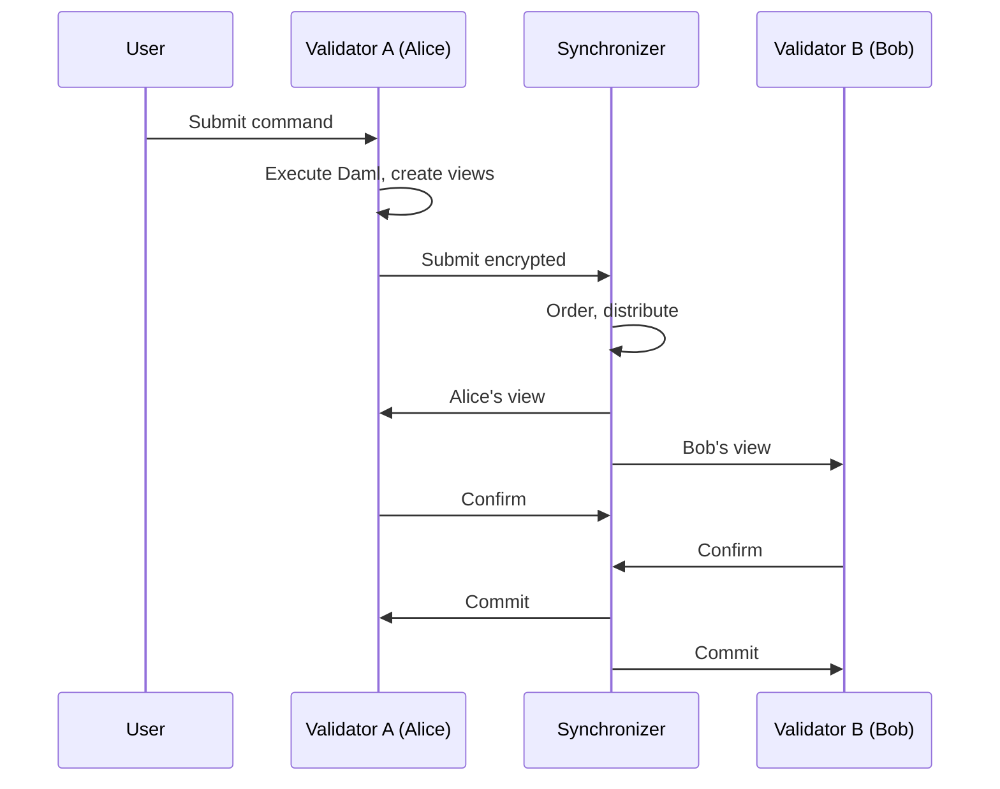
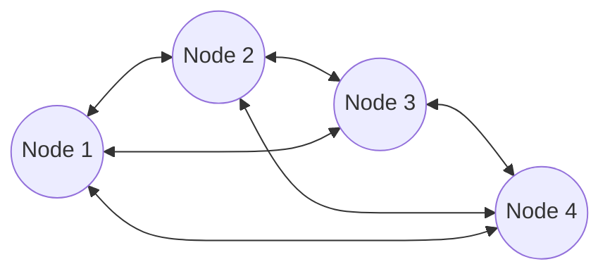
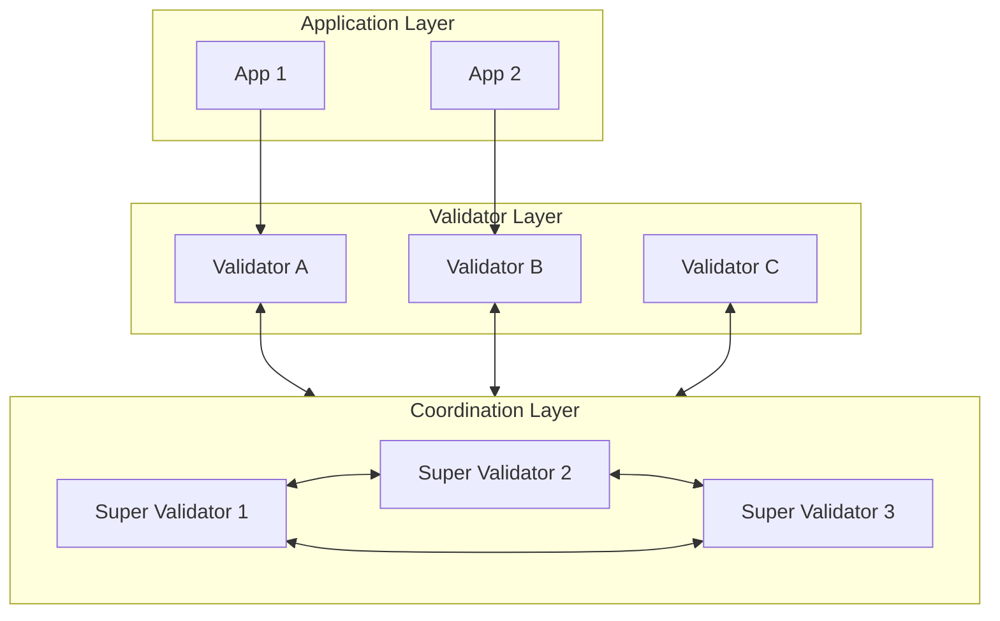

import DamlDocsAppdevModulesM2NetworkArchitectureL126 from "/snippets/daml-docs/appdev_modules_m2-network-architecture_L126.mdx";
import DamlDocsAppdevModulesM2NetworkArchitectureL136 from "/snippets/daml-docs/appdev_modules_m2-network-architecture_L136.mdx";

Canton's network architecture is fundamentally different from Ethereum. This page compares the architectures to help you understand the implications for your applications.

## High-Level Architecture

### Ethereum Architecture

**Key characteristics:**
- All nodes store all state
- Any node can answer any query
- Consensus requires all validators
- Horizontal scaling limited

### Canton Architecture

**Key characteristics:**
- Validators store only their parties' data
- Synchronizer coordinates without storing
- Consensus involves only affected parties
- A party can be hosted on multiple validators (multihosting)

## Canton Components

### Validators

Validators store only their parties' data and answer queries only for hosted parties. In consensus, they validate only transactions affecting their parties.

### Synchronizers

Synchronizers coordinate transaction ordering without storing state. They ensure all affected parties see consistent ordering.

### Key Differences from Traditional Blockchains

In Canton:
- There is no global state—each party has their own view
- State visibility is private to stakeholders
- Only hosting validators can answer queries for their parties
- Finality is deterministic after confirmation

## Data Flow Comparison

### Ethereum Transaction Flow

### Canton Transaction Flow

## Query Architecture

### Ethereum: Global Queries

<DamlDocsAppdevModulesM2NetworkArchitectureL126 />

### Canton: Party-Scoped Queries

<DamlDocsAppdevModulesM2NetworkArchitectureL136 />

| Query Type | Ethereum | Canton |
|------------|----------|--------|
| **My balance** | Query any node | Query my validator |
| **Other's balance** | Query any node | Must be observer |
| **Total supply** | Query any node | Only if designed to expose |
| **Transaction history** | Query any node | Only my transactions |

## Implications for Application Design

### Data Availability

| Consideration | Ethereum | Canton |
|---------------|----------|--------|
| **Read replicas** | Any node | Only your validator |
| **Caching** | Cache any data | Cache only entitled data |
| **Analytics** | On-chain data public | Need explicit data sharing |

### User Experience

| Aspect | Ethereum | Canton |
|--------|----------|--------|
| **Wallet connection** | Any RPC endpoint | Your validator's API |
| **Balance display** | Query public state | Query your contracts |
| **Transaction history** | Public block explorer | Personal transaction view |

### Scaling

Canton's architecture naturally distributes load because validators only process transactions affecting their hosted parties. Additional capacity can be achieved by distributing parties across more validators.

## Network Topology

### Ethereum: Flat P2P

All nodes are peers, all store the same data.

### Canton: Hierarchical

Synchronizer coordinates, validators serve parties.

## Trust Model Comparison

| Entity | Ethereum Trust | Canton Trust |
|--------|----------------|--------------|
| **Validators** | See all, validate all | See only relevant, validate relevant |
| **Network operators** | Block producers see everything | Synchronizer sees nothing |
| **Your node** | You trust your node | You trust your validator |
| **Other users** | Compete for block space | Independent transactions |

## Migration Considerations

When migrating from Ethereum to Canton:

| Aspect | Action Required |
|--------|-----------------|
| **State queries** | Redesign for party-scoped queries |
| **Analytics** | Build explicit data sharing if needed |
| **Node infrastructure** | Set up validator, not full node |
| **User onboarding** | Connect users to your validator |
| **Third-party integrations** | Access Ledger API via gRPC or JSON API |

## Next Steps

<CardGroup cols={2}>

<Card title="Architecture Deep Dive" icon="diagram-project" href="/docs-main/overview/learn/architecture">
  Detailed Canton architecture documentation.
</Card>

<Card title="Start Building" icon="code" href="/docs-main/appdev/modules/m3-dev-environment">
  Begin writing Daml smart contracts.
</Card>

</CardGroup>
