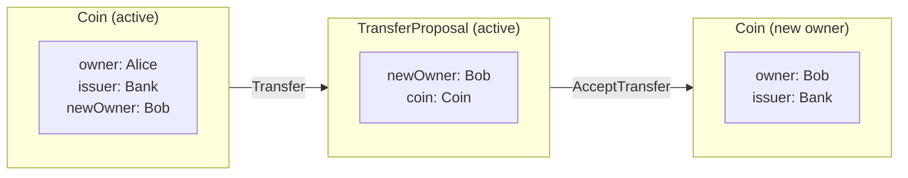
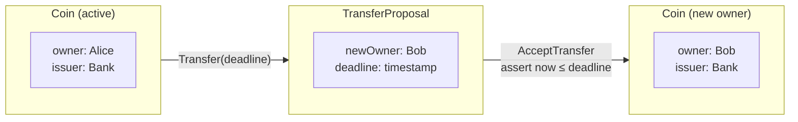
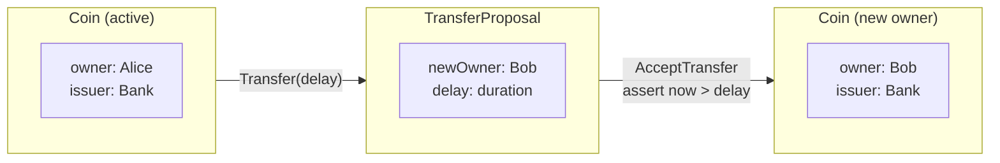
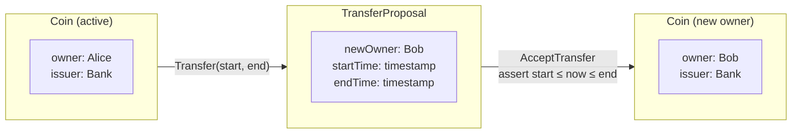

import DamlAppdevModulesM3WorkingWithTimeL105 from "/snippets/daml-docs/appdev_modules_m3-working-with-time_L105.mdx";
import DamlAppdevModulesM3WorkingWithTimeL118 from "/snippets/daml-docs/appdev_modules_m3-working-with-time_L118.mdx";
import DamlAppdevModulesM3WorkingWithTimeL159 from "/snippets/daml-docs/appdev_modules_m3-working-with-time_L159.mdx";
import DamlAppdevModulesM3WorkingWithTimeL172 from "/snippets/daml-docs/appdev_modules_m3-working-with-time_L172.mdx";
import DamlAppdevModulesM3WorkingWithTimeL213 from "/snippets/daml-docs/appdev_modules_m3-working-with-time_L213.mdx";
import DamlAppdevModulesM3WorkingWithTimeL232 from "/snippets/daml-docs/appdev_modules_m3-working-with-time_L232.mdx";
import DamlAppdevModulesM3WorkingWithTimeL25 from "/snippets/daml-docs/appdev_modules_m3-working-with-time_L25.mdx";
import DamlAppdevModulesM3WorkingWithTimeL276 from "/snippets/daml-docs/appdev_modules_m3-working-with-time_L276.mdx";
import DamlAppdevModulesM3WorkingWithTimeL295 from "/snippets/daml-docs/appdev_modules_m3-working-with-time_L295.mdx";
import DamlAppdevModulesM3WorkingWithTimeL38 from "/snippets/daml-docs/appdev_modules_m3-working-with-time_L38.mdx";
import DamlAppdevModulesM3WorkingWithTimeL49 from "/snippets/daml-docs/appdev_modules_m3-working-with-time_L49.mdx";
import DamlAppdevModulesM3WorkingWithTimeL60 from "/snippets/daml-docs/appdev_modules_m3-working-with-time_L60.mdx";
import DamlAppdevModulesM3WorkingWithTimeL67 from "/snippets/daml-docs/appdev_modules_m3-working-with-time_L67.mdx";


{/* COPIED_START source="docs-website:docs/replicated/daml/3.4/sdk/sdlc-howtos/smart-contracts/develop/patterns/implementing-time-constraints.rst" hash="17e57ac2" */}

# How To Implement Time Constraints

Contract time constraints may be implemented using either:

- ledger time primitives (i.e. isLedgerTimeLT, isLedgerTimeLE, isLedgerTimeGT and isLedgerTimeGE) or assertions (i.e. assertWithinDeadline and assertDeadlineExceeded)

  > - the use of ledger time primitives and assertions do not constrain the time bound between transaction preparation and submission - e.g. they are suitable for workflows using external parties to sign transactions

- or, by calling getTime

  > - calls to getTime constrain transaction preparation and submission workflows to be (by default) within 1 minute.
  > - the 1 minute value is the default value for the ledger time record time tolerance parameter (a dynamic synchronizer parameter).

The next subsections demonstrate how the following Coin and TransferProposal contracts can be modified to use different types of ledger time constraints to control when parties are allowed to perform ledger writes.

Coin contract

<DamlAppdevModulesM3WorkingWithTimeL25 />

<DamlAppdevModulesM3WorkingWithTimeL38 />

TransferProposal contract

<DamlAppdevModulesM3WorkingWithTimeL49 />

<DamlAppdevModulesM3WorkingWithTimeL60 />

<DamlAppdevModulesM3WorkingWithTimeL67 />


*Simple coin transfer with consent withdrawal*

## How to check that a deadline is valid

This design pattern demonstrates how to limit choices so that they must occur by a given deadline.

### Motivation

When parties need to perform ledger writes by a given deadline.

### Implementation

Transfer proposals can be accepted at any point in time. To restrict this behaviour so that acceptance must occur by a fixed time, a guard for AcceptTransfer choice execution can be added.

TransferProposal contract
In the TransferProposal contract, the body of the AcceptTransfer choice is modified to assert that the contract deadline is valid.

<DamlAppdevModulesM3WorkingWithTimeL105 />

As transfer proposals are created when a Transfer choice is executed, the time by which an AcceptTransfer can be executed needs to be passed in as a choice parameter.

Coin contract
In the Coin contract, the Transfer choice has an additional deadline argument, so that TransferProposal contracts can be given a fixed lifetime.

<DamlAppdevModulesM3WorkingWithTimeL118 />


*Time-limited coin ownership transfer*

## How to check that a deadline has passed

This design pattern demonstrates how to ensure choices only occur after a given deadline.

### Motivation

When parties need to perform ledger writes after a fixed time delay.

### Implementation

Transfer proposals can be accepted at any point in time. To restrict this behaviour so that acceptance can only occur after a fixed delay, a guard for AcceptTransfer choice execution can be added.

TransferProposal contract
In the TransferProposal contract, the body of the AcceptTransfer choice is modified to assert that the contract deadline has been exceeded or passed.

<DamlAppdevModulesM3WorkingWithTimeL159 />

As transfer proposals are created when a Transfer choice is executed, the delay time after which an AcceptTransfer can be executed needs to be passed in as a choice parameter.

Coin contract
In the Coin contract, the Transfer choice has an additional deadline argument, so that TransferProposal contracts can be given a delay.

<DamlAppdevModulesM3WorkingWithTimeL172 />


*Delayed coin ownership transfer*

## Grant time-limited writes to parties

This design pattern demonstrates how to grant time-limited writes to parties.

### Motivation

When parties need to be able to perform ledger writes, but writes need to only be granted for a specific time window.

### Implementation

Transfer proposals can be accepted at any point in time. To restrict this behaviour so that acceptance can only occur within a given time window, a guard for AcceptTransfer choice execution can be added.

TransferProposal contract
In the TransferProposal contract, the body of the AcceptTransfer choice is modified to assert that the contract deadline has been exceeded or passed.

<DamlAppdevModulesM3WorkingWithTimeL213 />

As transfer proposals are created when a Transfer choice is executed, the interval start and end times, during which an AcceptTransfer can be executed need to be passed in as choice parameters.

Coin contract
In the Coin contract, the Transfer choice has an additional deadline argument, so that TransferProposal contracts can be given a delay.

<DamlAppdevModulesM3WorkingWithTimeL232 />


*Coin ownership transfer within a time window*

## Where to use getTime

For workflows that prepare and submit transactions, care needs to be taken when using calls to getTime. This is because calls to getTime cause transactions to be bound to the ledger time, and in turn constrain how sequencers may re-order transactions. Global Synchronizers are configured such that the transaction prepare and submit time window is one minute, so any workflow using getTime must prepare and submit transactions within that one-minute time window.

For workflows where this constraint can not be met (e.g. workflows that sign transactions using external parties), it is recommended that workflows are designed to use the ledger time primitives and assertions.

### Motivation

When parties need to perform ledger writes by a given deadline, but are able to prepare and submit a transaction within 1 minute.

### Implementation

Transfer proposals can be accepted at any point in time. To require acceptance by a fixed time, you can add a guard for AcceptTransfer choice execution. Here you determine the current ledger time by calling getTime.

TransferProposal contract
In the TransferProposal contract, the body of the AcceptTransfer choice is modified to assert that the contract deadline is valid relative to the ledger time returned by calling getTime.

<DamlAppdevModulesM3WorkingWithTimeL276 />

As transfer proposals are created when a Transfer choice is executed, the time by which an AcceptTransfer can be executed needs to be passed in as a choice parameter.

Coin contract
In the Coin contract, the Transfer choice has an additional deadline argument, so that TransferProposal contracts can be given a fixed lifetime.

<DamlAppdevModulesM3WorkingWithTimeL295 />


{/* COPIED_END */}
{/* COPIED_START source="docs-website:docs/replicated/daml/3.4/sdk/tutorials/smart-contracts/constraints.rst" hash="dc7e974c" */}

# Add constraints to a contract

You will often want to constrain the data stored or the allowed data transformations in your contract models. In this section, you will learn about the two main mechanisms provided in Daml:

- The `ensure` keyword.
- The `assert`, `abort` and, `error` keywords.

To make sense of the latter, you'll also learn more about the `Update` and `Script` types, and `do` blocks, which will be good preparation for `compose`, where you will use `do` blocks to compose choices into complex transactions.

Lastly, you will learn about time on the ledger and in Daml Script.

<Tip>
Remember that you can load all the code for this section into a folder called `intro-constraints` by running `dpm new intro-constraints  --template daml-intro-constraints`
</Tip>

## Template preconditions

The first kind of restriction you may want to put on the contract model are called *template pre-conditions*. These are simply restrictions on the data that can be stored on a contract from that template.

Suppose, for example, that the `SimpleIou` contract from `simple_iou` should only be able to store positive amounts. You can enforce this using the `ensure` keyword:

```haskell
-- Code from: daml/daml-intro-constraints/daml/Restrictions.daml
-- [Include actual code example here]
```

The `ensure` keyword takes a single expression of type `Bool`. If you want to add more restrictions, use logical operators `&&`, `||`, and `not` to build up expressions. The below shows the additional restriction that currencies are three capital letters:

```haskell
-- Code from: daml/daml-intro-constraints/daml/Restrictions.daml
-- [Include actual code example here]
```

<Tip>
The `T` here stands for the `DA.Text` which has been imported from the Daml standard library using `import DA.Text as T`:
</Tip>

```haskell
-- Code from: daml/daml-intro-constraints/daml/Restrictions.daml
-- [Include actual code example here]
```

## Assertions

A second common kind of restriction is one on data transformations.

For example, the simple Iou in `simple_iou` allowed the no-op where the `owner` transfers to themselves. You can prevent that using an `assert` statement, which you have already encountered in the context of scripts.

`assert` does not return an informative error so often it's better to use the function `assertMsg`, which takes a custom error message:

```haskell
-- Code from: daml/daml-intro-constraints/daml/Restrictions.daml
-- [Include actual code example here]
```

```haskell
-- Code from: daml/daml-intro-constraints/daml/Restrictions.daml
-- [Include actual code example here]
```

Similarly, you can write a `Redeem` choice, which allows the `owner` to redeem an `Iou` *during business hours on weekdays*. The `Redeem` choice implementation below confirms that `getTime` returns a value that is during business hours on weekdays. If all those checks pass, the choice does not do anything other than archive the `SimpleIou`. (This assumes that actual cash changes hands off-ledger:)

```haskell
-- Code from: daml/daml-intro-constraints/daml/Restrictions.daml
-- [Include actual code example here]
```

In the above example, the time is taken apart into day of week and hour of day using standard library functions from `DA.Date` and `DA.Time`. The hour of the day is checked to be in the range from 8 to 18. The day of week is checked to not be Saturday or Sunday.

The following example shows how the `Redeem` choice is exercised in a script:

```haskell
-- Code from: daml/daml-intro-constraints/daml/Restrictions.daml
-- [Include actual code example here]
```

For the purposes of testing the `Redeem` choice, the above code sets and advances the ledger time with the `setTime` and `passTime` functions respectively. Exercising the choice should fail or should not fail depending on the day of week and the time of day. While that is straightforward, the issue of time on a Daml ledger is worthy of more discussion.

## Time on Daml ledgers

Each transaction on a Daml ledger has two timestamps: the *ledger time (LT)* and the *record time (RT)*.

**Ledger time (LT)** is the time associated with a transaction in the ledger model, as determined by the participant. It is the time of a transaction from a business and application perspective. When you call `getTime, it is the LT that is returned. The LT is used when reasoning about related transactions and commits. The LT can be compared with other LTs to guarantee model consistency. For example, LTs are used to enforce that no transaction depends on a contract that does not exist. This is the requirement known as "causal monotonicity."

**Record time (RT)** is the time assigned by the persistence layer. It represents the time that the transaction is “physically” recorded. For example, “The backing database ledger has assigned the timestamp of such-and-such time to this transaction.” The only purpose of the RT is to ensure that transactions are being recorded in a timely manner.

Each Daml ledger has a policy on the allowed difference between LT and RT called the *skew*. A consistent zero-skew is not feasible because this is a distributed system. If it is too far off, the transaction will be rejected. This is the requirement known as “bounded skew.” The RT is not relevant beyond this determination of skew.

Returning to the theme of *business hours*, consider the following example: Suppose that the ledger had a skew of 10 seconds. At 17:59:55, just before the end of business hours, Alice submits a transaction to redeem an Iou. One second later, the transaction is assigned an LT of 17:59:56. However, there still may be a few seconds before the transaction is persisted to the underlying storage. For example, the transaction might be written in the underlying backing store at 18:00:06, *after business hours*. Because LT is within business hours and LT - RT \.

### Time in test scripts

For tests, you can set time using the following functions:

- `setTime`, which sets the ledger time to the given time.
- `passTime`, which takes a `RelTime` (a relative time) and moves the ledger by that much.

On a distributed Daml ledger, there are no guarantees that LT or RT are strictly increasing. The only guarantee is that ledger time is increasing *with causality*. That is, if a transaction `TX2` depends on a transaction `TX1`, then the ledger enforces that the LT of `TX2` is greater than or equal to that of `TX1`.

The following script illustrates that idea by moving the logical time back by three days and then trying to exercise a choice on a contract *that hasn't been created yet*. That fails, as you would hope.

```haskell
-- Code from: daml/daml-intro-constraints/daml/Restrictions.daml
-- [Include actual code example here]
```

## Actions and `do` blocks

You have come across `do` blocks and `<-` notations in two contexts by now: `Script` and `Update`. Both of these are examples of an `Action`, also called a *Monad* in functional programming. You can construct `Actions` conveniently using `do` notation.

Understanding `Actions` and `do` blocks is therefore crucial to being able to construct correct contract models and test them, so this section will explain them in some detail.

### Pure expressions compared to actions

Expressions in Daml are pure in the sense that they have no side-effects: they neither read nor modify any external state. If you know the value of all variables in scope and write an expression, you can work out the value of that expression on pen and paper.

However, the expressions you've seen that used the `<-` notation are not like that. For example, take `getTime`, which is an `Action`. Here's the example we used earlier:

``daml
now syntax for functions later.

`Coin` and `play` are deliberately left obscure in the above. All you have is an action `getCoin` to get your hands on a `Coin` in a `Script` context and an action `flipCoin` which represents the simplest possible game: a single coin flip resulting in a `Face`.

You can't play any `CoinGame` game on pen and paper as you don't have a coin, but you can write down a script or recipe for a game:

```haskell
-- Code from: daml/daml-intro-constraints/daml/Restrictions.daml
-- [Include actual code example here]
```

The `game` expression is a `CoinGame` in which a coin is flipped three times. If all three tosses return `Heads`, the result is `"Win"`, or else `"Loss"`.

In a `Script` context you can get a `Coin` using the `getCoin` action, which uses the LT to calculate a seed, and play the game.

*Somehow* the `Coin` is threaded through the various actions. If you want to look through the looking glass and understand in-depth what's going on, you can look at the source file to see how the `CoinGame` action is implemented, though be warned that the implementation uses a lot of Daml features we haven't introduced yet in this introduction.

More generally, if you want to learn more about Actions (aka Monads), we recommend a general course on functional programming, and Haskell in particular. See `haskell-connection` for some suggestions.

## Errors

Above, you've learnt about `assertMsg` and `abort`, which represent (potentially) failing actions. Actions only have an effect when they are performed, so the following script succeeds or fails depending on the value of `abortScript`:

```haskell
-- Code from: daml/daml-intro-constraints/daml/Restrictions.daml
-- [Include actual code example here]
```

However, what about errors in contexts other than actions? Suppose we wanted to implement a function `pow` that takes an integer to the power of another positive integer. How do we handle that the second parameter has to be positive?

One option is to make the function explicitly partial by returning an `Optional`:

```haskell
-- Code from: daml/daml-intro-constraints/daml/Restrictions.daml
-- [Include actual code example here]
```

This is a useful pattern if we need to be able to handle the error case, but it also forces us to always handle it as we need to extract the result from an `Optional`. We can see the impact on convenience in the definition of the above function. In cases, like division by zero or the above function, it can therefore be preferable to fail catastrophically instead:

```haskell
-- Code from: daml/daml-intro-constraints/daml/Restrictions.daml
-- [Include actual code example here]
```

The big downside to this is that even unused errors cause failures. The following script will fail, because `failingComputation` is evaluated:

```haskell
-- Code from: daml/daml-intro-constraints/daml/Restrictions.daml
-- [Include actual code example here]
```

`error` should therefore only be used in cases where the error case is unlikely to be encountered, and where explicit partiality would unduly impact usability of the function.

## Next up

You can now specify a precise data and data-transformation model for Daml ledgers. In `parties`, you will learn how to properly involve multiple parties in contracts, how authority works in Daml, and how to build contract models with strong guarantees in contexts with mutually distrusting entities.

{/* COPIED_END */}

