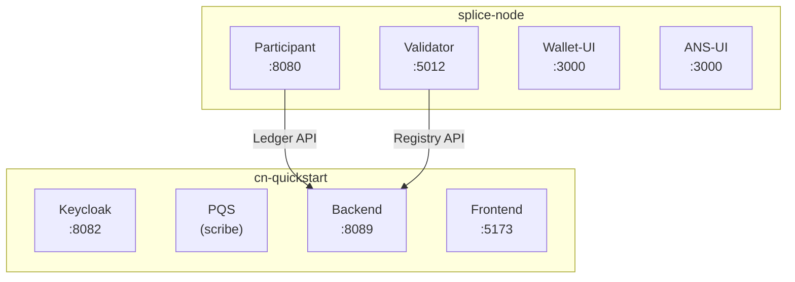

import CantonGlobalSynchronizerDeploymentInstallationL41 from "/snippets/canton-docs/global-synchronizer_deployment_installation_L41.mdx";

{/* COPIED_START source="docs-website:docs/replicated/quickstart/3.5/sdk/quickstart/operate/deploy-quickstart-to-devnet.rst" hash="d9f5e11c" */}

## Overview

In this guide, you'll deploy the Quickstart app from LocalNet to DevNet.
You'll deploy the original DAR, deploy to the backend, frontend and test
the workflow.

You should have the Quickstart application
*installed* and understand the
[Project Structure](/appdev/quickstart/project-structure) guide.

## DevNet validator prerequisite

You must have successfully submitted a validator request to successfully
complete this guide.

Submit your request at:
[https://canton.foundation/apply-to-set-up-a-validator-node/](https://canton.foundation/apply-to-set-up-a-validator-node/)

Visit the global synchronizer docs to learn more about the validator
onboarding process and how to deploy a validator with Docker Compose.

You can find up-to-date Canton Foundation DevNet Super Validator Node
Information at: [https://canton.foundation/sv-network-status/](https://canton.foundation/sv-network-status/)

## Architectural overview

The Quickstart DevNet deployment splits across two components:

-   **splice-node**: Provides the validator infrastructure (participant,
    validator, wallet-ui, ans-ui)
-   **cn-quickstart**: Provides the application layer (keycloak, pqs,
    backend-service, frontend)



{/* LOCAL_MODIFICATION: the architectural overview diagram was converted from ASCII box-drawing to mermaid for consistency with other diagrams in the project. The upstream snippet (cn-quickstart-rst-code-sdk-docs-sharable-sdk-quickstart-operate-deploy-quickstart-to-devnet-text-37.mdx) contains the original ASCII art. */}

`splice-node` ports are internal container ports and routed via nginx by
hostname. `cn-quickstart` ports are directly exposed.

The frontend communicates with the backend via HTTP REST calls to
`/api/*` endpoints. The Vite development server proxies these requests
to the backend, which translates them into Ledger API calls. For a
detailed explanation of this fully mediated architecture, see
[Project Structure](/appdev/quickstart/project-structure).

## Quickstart configuration for DevNet

Quickstart environment variables are set for `LocalNet` usage by
default, but ledger connections differ between `LocalNet` and `DevNet`
configurations. For example:

| Variable      | LocalNet Value | DevNet Value                |
|---------------|----------------|-----------------------------|
| `LEDGER_HOST` | `localhost`    | `grpc-ledger-api.localhost` |
| `LEDGER_PORT` | `5001`         | `80` or `8080`              |

## Configure Host entries

`nginx.conf` uses virtual hosting to route requests to backend services.
As a result, nginx inspects your `Host` HTTP header to determine backend
routing. Add explicit host entires for reliable routing.

Add these entries to `/etc/hosts`:

<Snippet
  source="https://github.com/digital-asset/cn-quickstart/blob/77e46ee7ddbe8bf1b921111778e33eb399e33ad3/sdk/docs/sharable/sdk/quickstart/operate/deploy-quickstart-to-devnet.rst"
  lines="96..107"
  normalize="preserve"
  language="bash"
/>

You only need to complete this step one time.

| Host Entry                  | URL                                   | Purpose                                      |
|-------------------|--------------------------------|----------------------|
| `json-ledger-api.localhost` | `http://json-ledger-api.localhost/`   | JSON Ledger API (REST commands, DAR uploads) |
| `grpc-ledger-api.localhost` | `http://grpc-ledger-api.localhost/`   | gRPC Ledger API (backend's `LEDGER_HOST`)    |
| `validator.localhost`       | `http://validator.localhost/`         | Validator application API                    |
| `wallet.localhost`          | `http://wallet.localhost/`            | Canton Wallet web interface                  |
| `app-provider.localhost`    | `http://app-provider.localhost:5173/` | Quickstart frontend web interface            |
| `participant.localhost`     | `http://participant.localhost/`       | Participant admin/metrics                    |
| `ans.localhost`             | `http://ans.localhost/`               | Canton Name Service (ANS) web interface      |
| `keycloak.localhost`        | `http://keycloak.localhost:8082/`     | OAuth2/OIDC provider                         |

DevNet Host Entries

The nginx proxy routes based on hostname. Default port is 80. MacOS
users may need to change the validator port from 80 to 8080 to avoid
`vmnetd` errors. See `vmnetd-error` in the Troubleshooting section.

## Download the Splice node release bundle

In `DevNet`, your Splice node validator runs locally and connects to the `DevNet` synchronizer.
Download and extract the Splice node bundle by following the Requirements
step in the [Docker Compose Validator Deployment guide](/global-synchronizer/deployment/validator-docker-compose#requirements).

The extracted `splice-node` directory and `cn-quickstart` should be
siblings to one another:

```bash
.
└── Canton_Network_App_Dev
    ├── cn-quickstart
    └── splice-node
```

<Note>
Find the most recent Splice release on the [canton-network/splice releases page](https://github.com/canton-network/splice/releases).
</Note>

## Navigate to the validator's Docker Compose directory

<CantonGlobalSynchronizerDeploymentInstallationL41 />

## Connect to a Canton Network Validator Node

Navigate to your OS's VPN settings, then connect to your sponsoring
validator node.

VPN access is required for `DevNet`. Contact your sponsoring SV for VPN
credentials.

### Mac OS

Settings \> VPN


Enable your Canton Network VPN


### Linux

Network \> VPN


## Clean Docker

Clear Docker If this is not your first time connecting to `DevNet` so
that stale containers do not interfere.

<Snippet
  source="https://github.com/digital-asset/cn-quickstart/blob/77e46ee7ddbe8bf1b921111778e33eb399e33ad3/sdk/docs/sharable/sdk/quickstart/operate/deploy-quickstart-to-devnet.rst"
  lines="233..234"
  normalize="preserve"
  language="bash"
/>

## Get network information

### Retrieve DevNet migration ID and Splice version

In terminal, from the `/validator` directory run:

<Snippet
  source="https://github.com/digital-asset/cn-quickstart/blob/77e46ee7ddbe8bf1b921111778e33eb399e33ad3/sdk/docs/sharable/sdk/quickstart/operate/deploy-quickstart-to-devnet.rst"
  lines="245..251"
  normalize="preserve"
  language="bash"
/>

Verify that the Splice version matches the splice-node version that you
recently downloaded and unzipped. Minor Splice versions change on a
regular basis. You may elect to hard code `SPLICE_VERSION` rather than
saving the most recent version, e.g. `SPLICE_VERSION=0.6.4`

### Get the onboarding secret

You may use the following Super Validator URL if you are connected to
the Canton Network Global Synchronizer. If not, your sponsoring SV will
provide the appropriate URL. In this case, you must replace the provided
`SPONSOR_SV_URL` with your provided URL.

<Snippet
  source="https://github.com/digital-asset/cn-quickstart/blob/77e46ee7ddbe8bf1b921111778e33eb399e33ad3/sdk/docs/sharable/sdk/quickstart/operate/deploy-quickstart-to-devnet.rst"
  lines="265..271"
  normalize="preserve"
  language="bash"
/>

<div class="tip" markdown="1">

<div class="title" markdown="1">

Tip

</div>

The onboarding secret is only good for 1 hour. If containers ever show
unhealthy, try requesting a new onboarding secret as your first step in
troubleshooting.

</div>

### Party Hint

Set a Party Hint. The party hint must match the expected hint that is
established when running `make setup` from `cn-quickstart/quickstart`.

If you don't remember your party hint, you can open a terminal and
navigate to `cn-quickstart/quickstart/`, then run `make setup`.

The default party hint is `quickstart-USERNAME-1`

Return to the terminal in the `validator` directory. Set `PARTY_HINT`.

<Snippet
  source="https://github.com/digital-asset/cn-quickstart/blob/77e46ee7ddbe8bf1b921111778e33eb399e33ad3/sdk/docs/sharable/sdk/quickstart/operate/deploy-quickstart-to-devnet.rst"
  lines="291..292"
  normalize="preserve"
  language="bash"
/>

This value must match the expected party hint.

## Authentication

<div class="note" markdown="1">

<div class="title" markdown="1">

Note

</div>

If you would like to connect to `DevNet` without authentication, you may
skip this section and initiate the `start.sh` script without the `-a`
flag.

</div>

Update authentication variables in
`splice-node/docker-compose/validator/.env` using Quickstart's
pre-configured Keycloak values. The following Authentication values can
be found in `cn-quickstart`'s keycloak `env`, realm and user JSON files.
Files include
`quickstart/quickstart/docker/modules/keycloak/compose.env`,
`AppProvider-realm.json`, and `AppProvider-users-0.json`.

`splice-node/docker-compose/validator/.env`

<Snippet
  source="https://github.com/digital-asset/cn-quickstart/blob/77e46ee7ddbe8bf1b921111778e33eb399e33ad3/sdk/docs/sharable/sdk/quickstart/operate/deploy-quickstart-to-devnet.rst"
  lines="310..333"
  normalize="preserve"
  stripTrailingWhitespace="true"
  language="bash"
/>

<div class="note" markdown="1">

<div class="title" markdown="1">

Note

</div>

These are development secrets and should be changed for production.

</div>

## Start the validator with the start.sh script.

Verify that you are in the `validator` directory, then run this command
to connect to `DevNet`:

<Snippet
  source="https://github.com/digital-asset/cn-quickstart/blob/77e46ee7ddbe8bf1b921111778e33eb399e33ad3/sdk/docs/sharable/sdk/quickstart/operate/deploy-quickstart-to-devnet.rst"
  lines="345..352"
  normalize="preserve"
  language="bash"
/>

### Flag descriptions

| Flag | Description                                |
|------|--------------------------------------------|
| `-s` | Sponsor SV URL                             |
| `-o` | Onboarding secret                          |
| `-p` | Your unique party hint                     |
| `-m` | Migration ID (a non-negative integer)      |
| `-w` | Wait for validator to be fully operational |
| `-a` | Enable authentication                      |

<div class="note" markdown="1">

<div class="title" markdown="1">

Note

</div>

You can omit the `-a` flag to skip authentication setup. This may make
initial testing easier, but you should enable authentication for
production use.

</div>

While `DevNet` is starting, move on to the next step. (You'll need to
complete the next step before `DevNet` is able to connect).

## Spin up the Quickstart DevNet

In a second terminal, navigate to the Quickstart `DevNet` Docker Compose
directory.

<Snippet
  source="https://github.com/digital-asset/cn-quickstart/blob/77e46ee7ddbe8bf1b921111778e33eb399e33ad3/sdk/docs/sharable/sdk/quickstart/operate/deploy-quickstart-to-devnet.rst"
  lines="390..393"
  normalize="preserve"
  language="bash"
/>

<Snippet
  source="https://github.com/digital-asset/cn-quickstart/blob/77e46ee7ddbe8bf1b921111778e33eb399e33ad3/sdk/docs/sharable/sdk/quickstart/operate/deploy-quickstart-to-devnet.rst"
  lines="396..405"
  normalize="preserve"
  stripTrailingWhitespace="true"
  language="text"
/>

`DevNet` connects shortly after spinning up the docker containers. A
successful connection shows healthy containers.


<div class="note" markdown="1">

<div class="title" markdown="1">

Note

</div>

See the Troubleshooting section if you experience a `vmnetd` error.

</div>

## Build and upload the DAR

Return to the `/quickstart` directory.

<Snippet
  source="https://github.com/digital-asset/cn-quickstart/blob/77e46ee7ddbe8bf1b921111778e33eb399e33ad3/sdk/docs/sharable/sdk/quickstart/operate/deploy-quickstart-to-devnet.rst"
  lines="424..425"
  normalize="preserve"
  language="bash"
/>

Then build the Daml code.

<Snippet
  source="https://github.com/digital-asset/cn-quickstart/blob/77e46ee7ddbe8bf1b921111778e33eb399e33ad3/sdk/docs/sharable/sdk/quickstart/operate/deploy-quickstart-to-devnet.rst"
  lines="430..431"
  normalize="preserve"
  language="bash"
/>

Verify that the `DAR` was created.

<Snippet
  source="https://github.com/digital-asset/cn-quickstart/blob/77e46ee7ddbe8bf1b921111778e33eb399e33ad3/sdk/docs/sharable/sdk/quickstart/operate/deploy-quickstart-to-devnet.rst"
  lines="436..437"
  normalize="preserve"
  language="bash"
/>

If successful, this command returns the `DAR` file.

<Snippet
  source="https://github.com/digital-asset/cn-quickstart/blob/77e46ee7ddbe8bf1b921111778e33eb399e33ad3/sdk/docs/sharable/sdk/quickstart/operate/deploy-quickstart-to-devnet.rst"
  lines="442..443"
  normalize="preserve"
  language="text"
/>

## Upload the DAR to your DevNet validator

Get a token from Keycloak to make an authenticated request:

<Snippet
  source="https://github.com/digital-asset/cn-quickstart/blob/77e46ee7ddbe8bf1b921111778e33eb399e33ad3/sdk/docs/sharable/sdk/quickstart/operate/deploy-quickstart-to-devnet.rst"
  lines="451..455"
  normalize="preserve"
  language="bash"
/>

(Note that the `client_secret` matches the `app-provider-validator`'s
`secret` in Keycloak's `AppProvider-realm.json`).

From the `/quickstart` directory, upload the `DAR` to your `DevNet`
validator (MacOS users replace `${LEDGER_PORT}` with `8080`):

### MacOS

<Snippet
  source="https://github.com/digital-asset/cn-quickstart/blob/77e46ee7ddbe8bf1b921111778e33eb399e33ad3/sdk/docs/sharable/sdk/quickstart/operate/deploy-quickstart-to-devnet.rst"
  lines="465..469"
  normalize="preserve"
  language="bash"
/>

### Linux

<Snippet
  source="https://github.com/digital-asset/cn-quickstart/blob/77e46ee7ddbe8bf1b921111778e33eb399e33ad3/sdk/docs/sharable/sdk/quickstart/operate/deploy-quickstart-to-devnet.rst"
  lines="475..479"
  normalize="preserve"
  language="bash"
/>

An empty response of `{}` indicates a successful upload.

## Build the Backend

Build the backend from the `/quickstart` directory:

<Snippet
  source="https://github.com/digital-asset/cn-quickstart/blob/77e46ee7ddbe8bf1b921111778e33eb399e33ad3/sdk/docs/sharable/sdk/quickstart/operate/deploy-quickstart-to-devnet.rst"
  lines="489..490"
  normalize="preserve"
  language="bash"
/>

## Configure Quickstart frontend for DevNet

The frontend communicates with the backend via HTTP REST calls to
`/api/*` endpoints. The Vite development server proxies these requests
to the backend, which translates them into Ledger API calls to the
`DevNet` participant. Review `vite.config.ts` for details.

Build the frontend from the `/quickstart` directory:

<Snippet
  source="https://github.com/digital-asset/cn-quickstart/blob/77e46ee7ddbe8bf1b921111778e33eb399e33ad3/sdk/docs/sharable/sdk/quickstart/operate/deploy-quickstart-to-devnet.rst"
  lines="503..504"
  normalize="preserve"
  language="bash"
/>

Start the Vite development server.

<Snippet
  source="https://github.com/digital-asset/cn-quickstart/blob/77e46ee7ddbe8bf1b921111778e33eb399e33ad3/sdk/docs/sharable/sdk/quickstart/operate/deploy-quickstart-to-devnet.rst"
  lines="509..510"
  normalize="preserve"
  language="bash"
/>

The frontend runs on `port 5173`. Open your browser to:

[http://app-provider.localhost:5173](http://app-provider.localhost:5173)

It's extremely important to prepend `localhost` with `app-provider` in
order to successfully log in through Keycloak.

Select AppProvider


Login as `app-provider` with password `abc123`


You sign in to the App Provider's Quickstart homepage. Congratulations!
You've launched Quickstart to `DevNet`!


<div class="note" markdown="1">

<div class="title" markdown="1">

Note

</div>

Quickstart won't immediately operate as it does on `LocalNet`. You'll
need to refactor to resolve connectivity issues. Perhaps begin with
`make create-app-install-request`.

</div>

## Appendix
### Recipes
#### Start and stop scripts
In the future, use the provided `start.sh` and `stop.sh` scripts to
quickly start and stop Quickstart `DevNet` Docker containers.

Use `./start.sh` to run a live log stream in terminal. (exit with
ctrl+c) Opt for `./start.sh -d` to spin up the containers without a log
stream.

Stop all of the Quickstart `DevNet` Docker containers with `./stop.sh`.
You may also remove the volumes with `./stop.sh -v`.

#### Health check
You can check that Docker services are connected by checking
`docker ps`. To check a specific service use grep. e.g.
`docker ps | grep backend-service`.

<Snippet
  source="https://github.com/digital-asset/cn-quickstart/blob/77e46ee7ddbe8bf1b921111778e33eb399e33ad3/sdk/docs/sharable/sdk/quickstart/operate/deploy-quickstart-to-devnet.rst"
  lines="569..570"
  normalize="preserve"
  language="bash"
/>

Via, CURL, get a token and then ping the service.

Get an auth token:

<Snippet
  source="https://github.com/digital-asset/cn-quickstart/blob/77e46ee7ddbe8bf1b921111778e33eb399e33ad3/sdk/docs/sharable/sdk/quickstart/operate/deploy-quickstart-to-devnet.rst"
  lines="577..581"
  normalize="preserve"
  language="bash"
/>

Call the service of your choice:

<Snippet
  source="https://github.com/digital-asset/cn-quickstart/blob/77e46ee7ddbe8bf1b921111778e33eb399e33ad3/sdk/docs/sharable/sdk/quickstart/operate/deploy-quickstart-to-devnet.rst"
  lines="586..587"
  normalize="preserve"
  language="bash"
/>

#### Super validator connectivity check
You may make a connectivity check to the `DevNet` super validator at
anytime:

<Snippet
  source="https://github.com/digital-asset/cn-quickstart/blob/77e46ee7ddbe8bf1b921111778e33eb399e33ad3/sdk/docs/sharable/sdk/quickstart/operate/deploy-quickstart-to-devnet.rst"
  lines="595..596"
  normalize="preserve"
  language="bash"
/>


#### View tables
You can explore the container schema by querying the list of tables.

<Snippet
  source="https://github.com/digital-asset/cn-quickstart/blob/77e46ee7ddbe8bf1b921111778e33eb399e33ad3/sdk/docs/sharable/sdk/quickstart/operate/deploy-quickstart-to-devnet.rst"
  lines="607..612"
  normalize="preserve"
  stripTrailingWhitespace="true"
  language="bash"
/>

#### Confirm current migration ID
<Snippet
  source="https://github.com/digital-asset/cn-quickstart/blob/77e46ee7ddbe8bf1b921111778e33eb399e33ad3/sdk/docs/sharable/sdk/quickstart/operate/deploy-quickstart-to-devnet.rst"
  lines="618..619"
  normalize="preserve"
  language="bash"
/>

#### Find DSO fingerprint
<Snippet
  source="https://github.com/digital-asset/cn-quickstart/blob/77e46ee7ddbe8bf1b921111778e33eb399e33ad3/sdk/docs/sharable/sdk/quickstart/operate/deploy-quickstart-to-devnet.rst"
  lines="625..626"
  normalize="preserve"
  language="bash"
/>

### Docker
#### Read docker logs
<Snippet
  source="https://github.com/digital-asset/cn-quickstart/blob/77e46ee7ddbe8bf1b921111778e33eb399e33ad3/sdk/docs/sharable/sdk/quickstart/operate/deploy-quickstart-to-devnet.rst"
  lines="635..636"
  normalize="preserve"
  language="bash"
/>

#### Kill running containers
<Snippet
  source="https://github.com/digital-asset/cn-quickstart/blob/77e46ee7ddbe8bf1b921111778e33eb399e33ad3/sdk/docs/sharable/sdk/quickstart/operate/deploy-quickstart-to-devnet.rst"
  lines="642..643"
  normalize="preserve"
  language="bash"
/>

#### Stop gracefully
<Snippet
  source="https://github.com/digital-asset/cn-quickstart/blob/77e46ee7ddbe8bf1b921111778e33eb399e33ad3/sdk/docs/sharable/sdk/quickstart/operate/deploy-quickstart-to-devnet.rst"
  lines="649..650"
  normalize="preserve"
  language="bash"
/>

`docker ps -q` lists the container IDs of running containers `$()`
passes those IDs to the kill or stop command

#### Remove containers after stopping
<Snippet
  source="https://github.com/digital-asset/cn-quickstart/blob/77e46ee7ddbe8bf1b921111778e33eb399e33ad3/sdk/docs/sharable/sdk/quickstart/operate/deploy-quickstart-to-devnet.rst"
  lines="659..660"
  normalize="preserve"
  language="bash"
/>

#### One command
<Snippet
  source="https://github.com/digital-asset/cn-quickstart/blob/77e46ee7ddbe8bf1b921111778e33eb399e33ad3/sdk/docs/sharable/sdk/quickstart/operate/deploy-quickstart-to-devnet.rst"
  lines="666..667"
  normalize="preserve"
  language="bash"
/>

### Troubleshooting
#### Resolve vmnetd errorIf you experience a `vmnetd` error response then the most
straightforward solution is to update the validator compose port from 80
to 8080.


If necessary, to resolve "vmnetd running errors", find `nginx` service
in `splice-node/docker-compose/validator/compose.yaml`. It is currently
at line 163. Change port `80:80` in `"${HOST_BIND_IP:-127.0.0.1}:80:80"`
to `8080:80`.

`splice-node/docker-compose/validator/compose.yaml`

<Snippet
  source="https://github.com/digital-asset/cn-quickstart/blob/77e46ee7ddbe8bf1b921111778e33eb399e33ad3/sdk/docs/sharable/sdk/quickstart/operate/deploy-quickstart-to-devnet.rst"
  lines="689..709"
  normalize="preserve"
  language="yaml"
/>

#### Troubleshoot frontend JavaScript mapping errors
##### Switch BACKEND_PORT from 8080 to 8089
Open `cn-quickstart/quickstart/.env` in a text editor and change
`BACKEND_PORT=8080` to `BACKEND_PORT=8089`.

##### Update proxyReq in vite configuration
Change line 35 in `vite.config.ts` from
`proxyReq.setHeader('host', 'app-provider.localhost')` to
`proxyReq.setHeader('host', 'app-provider.localhost:5173')`.

##### Ping app-provider.localhost
<Snippet
  source="https://github.com/digital-asset/cn-quickstart/blob/77e46ee7ddbe8bf1b921111778e33eb399e33ad3/sdk/docs/sharable/sdk/quickstart/operate/deploy-quickstart-to-devnet.rst"
  lines="728..729"
  normalize="preserve"
  language="bash"
/>

If successful, navigate to the app at
[http://app-provider.localhost:5173](http://app-provider.localhost:5173) and login.

##### Check backend-service logs for errors
<Snippet
  source="https://github.com/digital-asset/cn-quickstart/blob/77e46ee7ddbe8bf1b921111778e33eb399e33ad3/sdk/docs/sharable/sdk/quickstart/operate/deploy-quickstart-to-devnet.rst"
  lines="737..738"
  normalize="preserve"
  language="bash"
/>

##### Find the login options
<Snippet
  source="https://github.com/digital-asset/cn-quickstart/blob/77e46ee7ddbe8bf1b921111778e33eb399e33ad3/sdk/docs/sharable/sdk/quickstart/operate/deploy-quickstart-to-devnet.rst"
  lines="744..745"
  normalize="preserve"
  language="bash"
/>

##### Get token for backend API access
<Snippet
  source="https://github.com/digital-asset/cn-quickstart/blob/77e46ee7ddbe8bf1b921111778e33eb399e33ad3/sdk/docs/sharable/sdk/quickstart/operate/deploy-quickstart-to-devnet.rst"
  lines="577..581"
  normalize="preserve"
  language="bash"
/>

##### Verify token was retrieved
<Snippet
  source="https://github.com/digital-asset/cn-quickstart/blob/77e46ee7ddbe8bf1b921111778e33eb399e33ad3/sdk/docs/sharable/sdk/quickstart/operate/deploy-quickstart-to-devnet.rst"
  lines="761..762"
  normalize="preserve"
  language="bash"
/>

##### Query data from PQS
Query app install requests

<Snippet
  source="https://github.com/digital-asset/cn-quickstart/blob/77e46ee7ddbe8bf1b921111778e33eb399e33ad3/sdk/docs/sharable/sdk/quickstart/operate/deploy-quickstart-to-devnet.rst"
  lines="770..771"
  normalize="preserve"
  language="bash"
/>

Query license data

<Snippet
  source="https://github.com/digital-asset/cn-quickstart/blob/77e46ee7ddbe8bf1b921111778e33eb399e33ad3/sdk/docs/sharable/sdk/quickstart/operate/deploy-quickstart-to-devnet.rst"
  lines="776..777"
  normalize="preserve"
  language="bash"
/>

#### Error port is already in use
If terminal shows `Error: Port 5173 is already in use` identify and kill
the associated node process, then run your command again.

<Snippet
  source="https://github.com/digital-asset/cn-quickstart/blob/77e46ee7ddbe8bf1b921111778e33eb399e33ad3/sdk/docs/sharable/sdk/quickstart/operate/deploy-quickstart-to-devnet.rst"
  lines="785..786"
  normalize="preserve"
  language="bash"
/>

<Snippet
  source="https://github.com/digital-asset/cn-quickstart/blob/77e46ee7ddbe8bf1b921111778e33eb399e33ad3/sdk/docs/sharable/sdk/quickstart/operate/deploy-quickstart-to-devnet.rst"
  lines="789..791"
  normalize="preserve"
  language="text"
/>

<Snippet
  source="https://github.com/digital-asset/cn-quickstart/blob/77e46ee7ddbe8bf1b921111778e33eb399e33ad3/sdk/docs/sharable/sdk/quickstart/operate/deploy-quickstart-to-devnet.rst"
  lines="794..795"
  normalize="preserve"
  language="bash"
/>

#### Restart unhealthy Docker containers
If you have trouble connecting to healthy containers, restart the Docker
containers and capture full logs.

Stop the container

<Snippet
  source="https://github.com/digital-asset/cn-quickstart/blob/77e46ee7ddbe8bf1b921111778e33eb399e33ad3/sdk/docs/sharable/sdk/quickstart/operate/deploy-quickstart-to-devnet.rst"
  lines="805..806"
  normalize="preserve"
  language="bash"
/>

Start fresh and capture the logs

<Snippet
  source="https://github.com/digital-asset/cn-quickstart/blob/77e46ee7ddbe8bf1b921111778e33eb399e33ad3/sdk/docs/sharable/sdk/quickstart/operate/deploy-quickstart-to-devnet.rst"
  lines="811..812"
  normalize="preserve"
  language="bash"
/>

Read logs in terminal:

<Snippet
  source="https://github.com/digital-asset/cn-quickstart/blob/77e46ee7ddbe8bf1b921111778e33eb399e33ad3/sdk/docs/sharable/sdk/quickstart/operate/deploy-quickstart-to-devnet.rst"
  lines="817..818"
  normalize="preserve"
  language="bash"
/>

Replace `splice-validator-validator-1` with the desired container.

#### Keycloak
<div class="note" markdown="1">

<div class="title" markdown="1">

Note

</div>

You can login to the Keycloak admin GUI at
`http://host.docker.internal:8082/` Use `admin` for the username and
password.

</div>


Check Keycloak logs:

<Snippet
  source="https://github.com/digital-asset/cn-quickstart/blob/77e46ee7ddbe8bf1b921111778e33eb399e33ad3/sdk/docs/sharable/sdk/quickstart/operate/deploy-quickstart-to-devnet.rst"
  lines="837..838"
  normalize="preserve"
  language="bash"
/>

Check PostgreSQL:

<Snippet
  source="https://github.com/digital-asset/cn-quickstart/blob/77e46ee7ddbe8bf1b921111778e33eb399e33ad3/sdk/docs/sharable/sdk/quickstart/operate/deploy-quickstart-to-devnet.rst"
  lines="843..844"
  normalize="preserve"
  language="bash"
/>

Check the OIDC discovery endpoint:

<Snippet
  source="https://github.com/digital-asset/cn-quickstart/blob/77e46ee7ddbe8bf1b921111778e33eb399e33ad3/sdk/docs/sharable/sdk/quickstart/operate/deploy-quickstart-to-devnet.rst"
  lines="849..850"
  normalize="preserve"
  language="bash"
/>

Get an OAuth2 `AppProvider realm` token:

<Snippet
  source="https://github.com/digital-asset/cn-quickstart/blob/77e46ee7ddbe8bf1b921111778e33eb399e33ad3/sdk/docs/sharable/sdk/quickstart/operate/deploy-quickstart-to-devnet.rst"
  lines="855..861"
  normalize="preserve"
  language="bash"
/>

Get an OAuth2 `AppUser realm` token:

<Snippet
  source="https://github.com/digital-asset/cn-quickstart/blob/77e46ee7ddbe8bf1b921111778e33eb399e33ad3/sdk/docs/sharable/sdk/quickstart/operate/deploy-quickstart-to-devnet.rst"
  lines="866..872"
  normalize="preserve"
  language="bash"
/>

Check Keycloak's public key location:

<Snippet
  source="https://github.com/digital-asset/cn-quickstart/blob/77e46ee7ddbe8bf1b921111778e33eb399e33ad3/sdk/docs/sharable/sdk/quickstart/operate/deploy-quickstart-to-devnet.rst"
  lines="877..878"
  normalize="preserve"
  language="bash"
/>

Expected response is
`"http://host.docker.internal:8082/realms/AppProvider"`

#### Unable to login to Keycloak as admin
<Snippet
  source="https://github.com/digital-asset/cn-quickstart/blob/77e46ee7ddbe8bf1b921111778e33eb399e33ad3/sdk/docs/sharable/sdk/quickstart/operate/deploy-quickstart-to-devnet.rst"
  lines="886..887"
  normalize="preserve"
  language="bash"
/>

The following command disables the SSL requirements for the master realm
and allows you to login as admin at `localhost:8082`.

<Snippet
  source="https://github.com/digital-asset/cn-quickstart/blob/77e46ee7ddbe8bf1b921111778e33eb399e33ad3/sdk/docs/sharable/sdk/quickstart/operate/deploy-quickstart-to-devnet.rst"
  lines="892..897"
  normalize="preserve"
  language="bash"
/>

#### Splice-onboarding troubleshooting
Find specific env values:

<Snippet
  source="https://github.com/digital-asset/cn-quickstart/blob/77e46ee7ddbe8bf1b921111778e33eb399e33ad3/sdk/docs/sharable/sdk/quickstart/operate/deploy-quickstart-to-devnet.rst"
  lines="905..906"
  normalize="preserve"
  language="bash"
/>

Restart the `splice-onboarding` container:

<Snippet
  source="https://github.com/digital-asset/cn-quickstart/blob/77e46ee7ddbe8bf1b921111778e33eb399e33ad3/sdk/docs/sharable/sdk/quickstart/operate/deploy-quickstart-to-devnet.rst"
  lines="911..915"
  normalize="preserve"
  language="bash"
/>

Watch the logs:

<Snippet
  source="https://github.com/digital-asset/cn-quickstart/blob/77e46ee7ddbe8bf1b921111778e33eb399e33ad3/sdk/docs/sharable/sdk/quickstart/operate/deploy-quickstart-to-devnet.rst"
  lines="920..921"
  normalize="preserve"
  language="bash"
/>

Query `splice-onboarding` networks:

<Snippet
  source="https://github.com/digital-asset/cn-quickstart/blob/77e46ee7ddbe8bf1b921111778e33eb399e33ad3/sdk/docs/sharable/sdk/quickstart/operate/deploy-quickstart-to-devnet.rst"
  lines="926..927"
  normalize="preserve"
  language="bash"
/>

Check which network the `splice-validator-nginx` is on:

<Snippet
  source="https://github.com/digital-asset/cn-quickstart/blob/77e46ee7ddbe8bf1b921111778e33eb399e33ad3/sdk/docs/sharable/sdk/quickstart/operate/deploy-quickstart-to-devnet.rst"
  lines="932..933"
  normalize="preserve"
  language="bash"
/>

Then inspect that container to see its network:

<Snippet
  source="https://github.com/digital-asset/cn-quickstart/blob/77e46ee7ddbe8bf1b921111778e33eb399e33ad3/sdk/docs/sharable/sdk/quickstart/operate/deploy-quickstart-to-devnet.rst"
  lines="938..940"
  normalize="preserve"
  language="bash"
/>

Check if `splice-onboarding` is initialized:

<Snippet
  source="https://github.com/digital-asset/cn-quickstart/blob/77e46ee7ddbe8bf1b921111778e33eb399e33ad3/sdk/docs/sharable/sdk/quickstart/operate/deploy-quickstart-to-devnet.rst"
  lines="945..946"
  normalize="preserve"
  language="bash"
/>

#### Splice-onboarding connection issue
If you run `splice-onboarding` logs and see:

<Snippet
  source="https://github.com/digital-asset/cn-quickstart/blob/77e46ee7ddbe8bf1b921111778e33eb399e33ad3/sdk/docs/sharable/sdk/quickstart/operate/deploy-quickstart-to-devnet.rst"
  lines="954..963"
  normalize="preserve"
  language="text"
/>

Then there is likely an error in `LEDGER_HOST` or `LEDGER_PORT`. Unset
the variables or quit and restart terminal.

{/* COPIED_END */}
