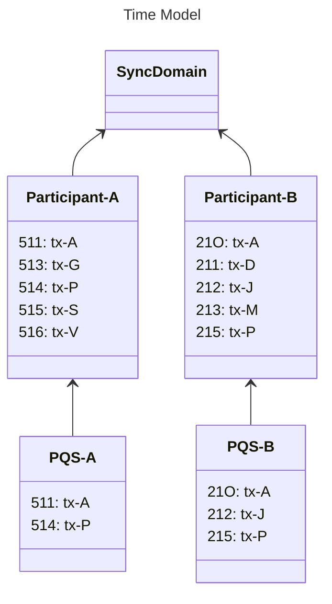

import DamlDocsAppdevReferencePqsSqlReferenceL316 from "/snippets/daml-docs/appdev_reference_pqs-sql-reference_L316.mdx";
import DamlDocsAppdevReferencePqsSqlReferenceL323 from "/snippets/daml-docs/appdev_reference_pqs-sql-reference_L323.mdx";
import DamlDocsAppdevReferencePqsSqlReferenceL347 from "/snippets/daml-docs/appdev_reference_pqs-sql-reference_L347.mdx";
import DamlDocsAppdevReferencePqsSqlReferenceL370 from "/snippets/daml-docs/appdev_reference_pqs-sql-reference_L370.mdx";
import DamlDocsAppdevReferencePqsSqlReferenceL381 from "/snippets/daml-docs/appdev_reference_pqs-sql-reference_L381.mdx";
import DamlDocsAppdevReferencePqsSqlReferenceL391 from "/snippets/daml-docs/appdev_reference_pqs-sql-reference_L391.mdx";
import DamlDocsAppdevReferencePqsSqlReferenceL410 from "/snippets/daml-docs/appdev_reference_pqs-sql-reference_L410.mdx";
import DamlDocsAppdevReferencePqsSqlReferenceL416 from "/snippets/daml-docs/appdev_reference_pqs-sql-reference_L416.mdx";
import DamlDocsAppdevReferencePqsSqlReferenceL432 from "/snippets/daml-docs/appdev_reference_pqs-sql-reference_L432.mdx";
import DamlDocsAppdevReferencePqsSqlReferenceL455 from "/snippets/daml-docs/appdev_reference_pqs-sql-reference_L455.mdx";
import ExternalScribeMainScribeRstCodeDocsUserComponentHowtosPqsReferencesSqlApiSql208 from "/snippets/external/scribe/main/scribe-rst-code-docs-user-component-howtos-pqs-references-sql-api-sql-208.mdx";
import ExternalScribeMainScribeRstCodeDocsUserComponentHowtosPqsReferencesSqlApiSql216 from "/snippets/external/scribe/main/scribe-rst-code-docs-user-component-howtos-pqs-references-sql-api-sql-216.mdx";
import ExternalScribeMainScribeRstCodeDocsUserComponentHowtosPqsReferencesSqlApiSql244 from "/snippets/external/scribe/main/scribe-rst-code-docs-user-component-howtos-pqs-references-sql-api-sql-244.mdx";

The PQS SQL API is provisioned directly in the PostgreSQL database. Data consumers interact with it through SQL -- not through the PQS process itself.

PQS data can be joined across contract tables to build projections (for example, joining holdings with account templates). The temporal offset model and historical event functions (`creates`, `archives`, `exercises`) make PQS well-suited for audit trails and compliance queries.

{/* COPIED_START source="docs-website:replicated/pqs/3.5/component-howtos/pqs/references/sql-api.rst" hash="addc8b94" */}

<Warning title="Pre-reviewed Content - Do Not Modify">
This section was copied from existing reviewed documentation.
**Source:** `replicated/pqs/3.5/component-howtos/pqs/references/sql-api.rst`
Reviewers: Skip this section. Remove markers after final approval.
</Warning>

# SQL API

While data consumers do not communicate with the PQS process directly, they do use an API that PQS has provisioned in the database itself. This SQL API is designed to provide a consistent and stable interface for users to access the ledger. It consists of a set of functions that should be the only database artifacts readers interact with.

## Ledger time model

A key aspect to consider when querying the ledger is the fact that it makes the history over time available. Additionally, understanding time in a distributed environment can be challenging because there are many different clocks available.

### Offset

A Participant Node models time using an index called an *offset*. An offset is a unique index of the Participant Nodes's local ledger. You can think of this as selecting an item in the ledger using a specific offset (or index) into the ledger.

Offsets are ordered, representing the order of transactions on the ledger of a Participant Node. Due to privacy and filtering, the sequence of offsets of a Participant Node usually appears to contain gaps.

Offsets are specific to a Participant Node and are not consistent between peer Participant Nodes, even when processing common transactions. This is because each Participant Node has its own ledger and allocates its own offsets based on it's permissioned view of transactions.

Offsets are represented as strings (in Daml 2.x) or integers (in Daml 3.3+) in columns `created_at_offset`, `archived_at_offset` and `exercised_at_offset` (see `pqs-references-types-of-returned-data`).

### Ledger time

Ledger time is an approximate wall-clock time (within a bounded skew) that preserves causal ordering. That is, if a contract is created at a certain time, it cannot be used until after that time. The ledger time is represented by `created_effective_at`, `archived_effective_at` and `exercised_effective_at` columns (see `pqs-references-types-of-returned-data`).

### Transaction ID

A transaction ID corresponds to an offset in the following ways:

- Not every offset has a transaction ID. For example, the completion event of a rejected transaction does not have a transaction ID because it was unsuccessful.
- There is, at most, one transaction ID at a given offset.
- Each transaction ID is unique and always has a single offset.
- While offsets are allocated by, and are specific to, a Participant Node; transaction ID values are common to all Participant Nodes.
- Transaction ordering (as represented by associated offset) can vary between Participant Nodes.
- A transaction ID is entirely opaque and does not communicate any information, other than identification.

### Which should I use?

Different types of data analysis require different tools. For example in these types of analysis the following identifiers can be useful:

- Causal: **Offset** provides an understanding of events in causal order, consistent with the participant-determined ledger commit ordering.
- Systematic: **Transaction ID** is required for correlating over multiple Participant Nodes, serving as a common identifier for individual transactions.
- Temporal: **Ledger Time** provides an ordering of events in wall-clock time, with bounded skew. This can be useful depending on your need for precision.

## PQS time model

PQS provides all three identifiers, but offset defines the order. With this PQS is able to provide a consistent view of ledger transactions.

Offsets are deeply embedded in the SQL API, allowing users to query the ledger in a manner that provides consistency. Users can nominate the offsets they wish to query, or simply query the latest available offset.

The following figure shows a pair of Participant Nodes and their respective ledgers. Each Participant Node has its own PQS instance, and you can see that it always has the portion of the ledger it is authorized to see:

You can also see that the offsets (prefix) are common to the Participant Node and PQS, but the Transaction IDs (suffix) are shared throughout.

## Offset management

The following functions control the temporal perspective of the ledger, and allow you to control how you consider time in your queries. Since PQS exposes an eventually consistent perspective of the ledger, you may wish to query:

- **Ignore**; The *latest available* state.
- **Pin**; The state of the ledger at a specific time.
- **Span**; The ledger events across a time range, such as for an audit trail.
- **Consistency**; The ledger in a way that maintains consistency with other interactions you have had with the ledger (read or write).

The following functions allow you to control the temporal scope of the ledger. This establishes the context in which subsequent queries execute:

- `set_latest(offset)`: nominates the offset of the latest data to include in observing the ledger. If `NULL` it uses the latest available. The actual offset to be used is returned. If the supplied offset is beyond what is available, an error occurs.
- `validate_offset_exists(offset)`: validates that the datastore has a complete history up to and including the offset provided. Returns an error if the nominated offset is not available (too old, or too new).
- `set_oldest(offset)`: nominates the offset of the oldest events to include in query scope. If `NULL` then it uses the oldest available. Function returns the actual offset used. If the supplied offset is beyond what is available, an error occurs.
- `nearest_offset(time)`: a helper function to determine the offset of a given time (or interval prior to now).

## Accessing contracts and exercises

Under this scope, the following table functions[^1] allow access to the ledger and are used directly in queries. They are designed to be used in a similar manner to tables or views, and allow users to focus on the data they wish to query, with the impact of offsets removed.

- `active(name, [at_offset])`: active instances of the target template/interface views that existed at the time of the latest offset
- `creates(name, [from_offset], [to_offset])`: create events of the target template/interface views that occurred between the oldest and latest offset
- `archives(name, [from_offset], [to_offset])`: archive events of the target template/interface views that occurred between the oldest and latest offset
- `exercises(name, [from_offset], [to_offset])`: exercise events of the target choice that occurred between the oldest and latest offset

The `name` identifier can be used with or without the package specified:

- Fully qualified: `<package>:<module>:<template|interface|choice>`
- Partially qualified: `<module>:<template|interface|choice>` or `<template|interface|choice>` (if unambiguous)

Partially qualified identifiers fail if there is an ambiguous result.

These functions have optional parameters to allow the user to specify the offset range to be used. Providing these arguments is alternative to using `set_*` functions prior in the session. The following queries are equivalent:

Implicit: geared towards context-oriented exploration

<ExternalScribeMainScribeRstCodeDocsUserComponentHowtosPqsReferencesSqlApiSql208 />

Explicit: beneficial to inline the entire context, to emit in a single statement

<ExternalScribeMainScribeRstCodeDocsUserComponentHowtosPqsReferencesSqlApiSql216 />

## Accessing transactions metadata

In certain cases, it might be necessary to access the metadata of a ledger transaction instead of the contracts/exercises themselves. This can be done through the `transactions` view which provides additional data not directly exposed by the primary table functions described in the previous section:

| Name                        | Type                       | Description                                                                                                                                                                                                   |
|-----------------------------|----------------------------|---------------------------------------------------------------------------------------------------------------------------------------------------------------------------------------------------------------|
| `ix`                        | `bigint`                   | Internal primary key of the ledger transaction                                                                                                                                                                |
| `offset`                    | `bigint`                   | Ledger offset                                                                                                                                                                                                 |
| `transaction_id`            | `text`                     | Transaction ID assigned by the ledger                                                                                                                                                                         |
| `effective_at`              | `timestamp with time zone` | Ledger effective time                                                                                                                                                                                         |
| `workflow_id`               | `text`                     | Workflow ID used in command submission                                                                                                                                                                        |
| `trace_context`             | `trace_context`            | Ledger API trace context (user defined type containing `(trace_parent: text, trace_state: text)`) (see `trace_context <com.daml.ledger.api.v2.Completion.trace_context>` and `pqs-trace-context-propagation`) |
| `external_transaction_hash` | `bytea`                    | Hash of the transaction submitted by the external party (see `external_transaction_hash <com.daml.ledger.api.v2.Transaction.external_transaction_hash>`)                                                      |

A query against the contracts/exercises can easily and efficiently be enriched with the transaction metadata by joining through the appropriate `*_at_ix` column, for example:

<ExternalScribeMainScribeRstCodeDocsUserComponentHowtosPqsReferencesSqlApiSql244 />

## Summary functions

Summary functions are available to provide an overview of the ledger data available within the nominated offset range:

- `summary_transients(from_offset, to_offset)`: the number of transients per Daml fully qualified name within the offset range.
- `summary_updates(from_offset, to_offset)`: summary of create and archive counts per Daml fully qualified name within the offset range.

The following functions retrieve event counts per `template_fqn`:

- `summary_active(at_offset)`
- `summary_creates(from_offset, to_offset)`
- `summary_archives(from_offset, to_offset)`
- `summary_exercises(from_offset, to_offset)`

## Lookup functions

- `lookup_contract(contract_id)` is a mechanism to retrieve contract data without needing to know its Daml qualified name. The function returns both contract and all associated interface view projections, distinguishable by the `payload_type` column.
- `lookup_exercises(contract_id)` is a mechanism to retrieve choice exercise data without needing to know the Daml qualified name; knowing the contract ID is sufficient.

## Types of returned data

All functions returning contract data return the following columns:

| Name                    | Type                          | Description                                                                                                                                            |
|-------------------------|-------------------------------|--------------------------------------------------------------------------------------------------------------------------------------------------------|
| `template_fqn`          | `text`                        | Fully-qualified name of the template or interface                                                                                                      |
| `payload_type`          | `'template'` or `'interface'` | Type of contract payload                                                                                                                               |
| `create_event_pk`       | `bigint`                      | Reference to contract creation event primary key                                                                                                       |
| `create_event_id`       | `(bigint, integer)`           | Orderable addressing type `(offset, node ID)` of the creation event                                                                                    |
| `created_at_ix`         | `bigint`                      | Ordinal index of the transaction containing the creation event                                                                                         |
| `created_at_offset`     | `bigint`                      | Ledger offset of the transaction containing the creation event                                                                                         |
| `created_effective_at`  | `timestamp with time zone`    | Ledger effective time of the transaction containing the creation event                                                                                 |
| `archive_event_pk`      | `bigint`                      | Reference to contract archival event primary key                                                                                                       |
| `archive_event_id`      | `(bigint, integer)`           | Orderable addressing type `(offset, node ID)` of the archival event                                                                                    |
| `archived_at_ix`        | `bigint`                      | Ordinal index of the transaction containing the archival event                                                                                         |
| `archived_at_offset`    | `bigint`                      | Ledger offset of the transaction containing the archival event                                                                                         |
| `archived_effective_at` | `timestamp with time zone`    | Ledger effective time of the transaction containing the archival event                                                                                 |
| `life_ix`               | `int8range`                   | Contract's lifespan expressed in ordinal indexes                                                                                                       |
| `contract_id`           | `text`                        | Ledger-assigned contract ID                                                                                                                            |
| `payload`               | `jsonb`                       | JSONB representation of contract data                                                                                                                  |
| `metadata`              | `bytea`                       | Explicit contract disclosure metadata (see `stakeholder-contract-share`)                                                                               |
| `package_name`          | `text`                        | Daml package name                                                                                                                                      |
| `package_version`       | `text`                        | Daml package version                                                                                                                                   |
| `package_id`            | `text`                        | Daml package ID                                                                                                                                        |
| `redaction_id`          | `text`                        | Redaction process reference                                                                                                                            |
| `signatories`           | `text[]`                      | Parties consenting to the creation of the contract                                                                                                     |
| `observers`             | `text[]`                      | Additional stakeholders whom the contract is visible to                                                                                                |
| `witnesses`             | `text[]`                      | Parties that are notified of this event                                                                                                                |
| `divulged_only`         | `boolean`                     | Indicates whether the contract was only divulged (`true`), or properly disclosed (`false`). Refer to `da-model-divulgence` for background information. |

All functions returning exercise data return the following columns:

| Name                      | Type                       | Description                                                                                                                                                                                                    |
|---------------------------|----------------------------|----------------------------------------------------------------------------------------------------------------------------------------------------------------------------------------------------------------|
| `template_fqn`            | `text`                     | Fully-qualified name of the template where choice is defined                                                                                                                                                   |
| `choice_fqn`              | `text`                     | Fully-qualified name of the choice                                                                                                                                                                             |
| `choice`                  | `text`                     | Choice name                                                                                                                                                                                                    |
| `consuming`               | `boolean`                  | Whether the choice is consuming                                                                                                                                                                                |
| `exercise_event_pk`       | `bigint`                   | Reference to choice exercise event primary key                                                                                                                                                                 |
| `exercise_event_id`       | `(bigint, integer)`        | Orderable addressing type `(offset, node ID)` of the exercise event                                                                                                                                            |
| `exercised_at_ix`         | `bigint`                   | Ordinal index of the transaction containing the exercise event                                                                                                                                                 |
| `exercised_at_offset`     | `bigint`                   | Ledger offset of the transaction containing the exercise event                                                                                                                                                 |
| `exercised_effective_at`  | `timestamp with time zone` | Ledger effective time of the transaction containing the exercise event                                                                                                                                         |
| `contract_id`             | `text`                     | Ledger-assigned contract ID                                                                                                                                                                                    |
| `argument`                | `jsonb`                    | JSONB representation of the choice argument type                                                                                                                                                               |
| `result`                  | `jsonb`                    | JSONB representation of the choice return type                                                                                                                                                                 |
| `package_name`            | `text`                     | Daml package name                                                                                                                                                                                              |
| `package_version`         | `text`                     | Daml package version                                                                                                                                                                                           |
| `package_id`              | `text`                     | Daml package ID                                                                                                                                                                                                |
| `redaction_id`            | `text`                     | Redaction process reference                                                                                                                                                                                    |
| `signatories`             | `text[]`                   | Parties that consented to the creation of the contract that choice was exercised on                                                                                                                            |
| `observers`               | `text[]`                   | Additional stakeholders made aware of the creation of the contract that choice was exercised on                                                                                                                |
| `controllers`             | `text[]`                   | Parties that collectively exercised this choice (see `acting_parties <com.daml.ledger.api.v2.ExercisedEvent.acting_parties>`)                                                                                  |
| `witnesses`               | `text[]`                   | Parties that are notified of this event                                                                                                                                                                        |
| `last_descendant_node_id` | `integer`                  | Upper boundary of node IDs for events in the same transaction that appeared as a result of this exercise event (see `last_descendant_node_id <com.daml.ledger.api.v2.ExercisedEvent.last_descendant_node_id>`) |

## JSONB encoding

PQS stores the ledger using a Daml-LF JSON-based encoding (see `reference-json-lf-value-specification`) of Daml-LF values. An overview of the encoding is provided below.

Users should consult the PostgreSQL documentation to understand how to work with JSONB data[^2] natively in SQL.

Values on the ledger (contract payloads and keys, interface views, exercise arguments, and return values) can be primitive types, user-defined records, variants, or enums. These types translate to JSON types[^3] as follows:

### Primitive types

| Daml type    | JSON type                                                                                                                                                                               |
|--------------|-----------------------------------------------------------------------------------------------------------------------------------------------------------------------------------------|
| `ContractID` | represented as [string](https://json-schema.org/understanding-json-schema/reference/string)                                                                                             |
| `Int64`      | represented as [string](https://json-schema.org/understanding-json-schema/reference/string)                                                                                             |
| `Decimal`    | represented as [string](https://json-schema.org/understanding-json-schema/reference/string)                                                                                             |
| `List`       | represented as [array](https://json-schema.org/understanding-json-schema/reference/array)                                                                                               |
| `Text`       | represented as [string](https://json-schema.org/understanding-json-schema/reference/string)                                                                                             |
| `Date`       | ISO 8601 date represented as [string](https://json-schema.org/understanding-json-schema/reference/string)                                                                               |
| `Time`       | ISO 8601 time (in UTC) represented as [string](https://json-schema.org/understanding-json-schema/reference/string)                                                                      |
| `Bool`       | represented as [boolean](https://json-schema.org/understanding-json-schema/reference/boolean)                                                                                           |
| `Party`      | represented as [string](https://json-schema.org/understanding-json-schema/reference/string)                                                                                             |
| `Unit`       | represented as empty object `{}`                                                                                                                                                        |
| `Optional`   | [nullable](https://json-schema.org/understanding-json-schema/reference/null) value or [array](https://json-schema.org/understanding-json-schema/reference/array) (depending on context) |

### User-defined types

| Daml type | JSON type                                                                                                                                                                                                       |
|-----------|-----------------------------------------------------------------------------------------------------------------------------------------------------------------------------------------------------------------|
| `Record`  | represented as [object](https://json-schema.org/understanding-json-schema/reference/object), where each create parameter's name is a key, and the parameter's value is the JSON-encoded value                   |
| `Variant` | represented as [object](https://json-schema.org/understanding-json-schema/reference/object), using the `{"tag": "CONSTRUCTOR", "value": <JSON-encoded value>}` format, such as `{"tag": "Left", "value": true}` |
| `Enum`    | represented as [string](https://json-schema.org/understanding-json-schema/reference/string), where the value is the constructor name.                                                                           |

[^1]: [PostgreSQL Table Functions](https://www.postgresql.org/docs/current/xfunc-sql.html#XFUNC-SQL-TABLE-FUNCTIONS)

[^2]: [PostgreSQL JSONB Containment](https://www.postgresql.org/docs/current/datatype-json.html#JSON-CONTAINMENT)

[^3]: [JSON Schema Type Reference](https://json-schema.org/understanding-json-schema/reference/type)

{/* COPIED_END */}

## Offset model

A validator models time using an **offset**, a unique integer index into its local ledger. Offsets are ordered and represent the causal order of transactions. Due to privacy filtering, the sequence of offsets on a given validator usually contains gaps.

Offsets are specific to a single validator and are not consistent across peers, even for common transactions. Each node allocates its own offsets based on its permissioned view.

In addition to offsets, PQS exposes **ledger time** (approximate wall-clock time preserving causal ordering) and **transaction IDs** (opaque identifiers common across all validators). Use offsets for causal analysis, transaction IDs for cross-node correlation, and ledger time for temporal queries.

## Offset management

Call `set_oldest` and `set_latest` before running queries in a session to pin the temporal window, or pass offset arguments directly to table functions (see below).

## Table functions for contracts and exercises

<Warning>
Partially qualified identifiers fail if the result is ambiguous.
</Warning>

These functions accept optional offset parameters as an alternative to calling `set_oldest`/`set_latest` beforehand. The following two approaches are equivalent:

<DamlDocsAppdevReferencePqsSqlReferenceL316 />

<DamlDocsAppdevReferencePqsSqlReferenceL323 />

## Lookup functions

## Transactions view

The `transactions` view provides transaction metadata not directly exposed by the table functions above.

| Column | Type | Description |
|---|---|---|
| `ix` | `bigint` | Internal primary key of the ledger transaction |
| `offset` | `bigint` | Ledger offset |
| `transaction_id` | `text` | Transaction ID assigned by the ledger |
| `effective_at` | `timestamp with time zone` | Ledger effective time |
| `workflow_id` | `text` | Workflow ID used in command submission |
| `trace_context` | `trace_context` | Ledger API trace context (user-defined type containing `trace_parent` and `trace_state`) |
| `external_transaction_hash` | `bytea` | Hash of the transaction submitted by the external party |

Join through the `*_at_ix` column to enrich contract or exercise data with transaction metadata:

<DamlDocsAppdevReferencePqsSqlReferenceL347 />

## Summary functions

This section will be expanded in a future update. For PQS query patterns and usage, see the [PQS documentation](https://docs.digitalasset.com/canton/3.5/participant/how-to/pqs/pqs-user-guide).

## Contract columns

This section will be expanded in a future update. Contract columns are available on tables returned by the `creates()` function. See the `transactions` table above for the join pattern.

## Exercise columns

This section will be expanded in a future update. Exercise columns are available on tables returned by the `exercises()` function.

## JSONB indexing

PQS metadata columns are indexed by default, but queries on `payload` contents (the JSONB column) need custom indexes for acceptable performance. Use the `create_index_for_contract` helper to create expression indexes on the internal contract tables:

<DamlDocsAppdevReferencePqsSqlReferenceL370 />

After creating the index, run `VACUUM ANALYZE` on the underlying table so PostgreSQL collects statistics:

<DamlDocsAppdevReferencePqsSqlReferenceL381 />

For equality-only lookups on text fields, a `hash` index is more compact:

<DamlDocsAppdevReferencePqsSqlReferenceL391 />

<Note>
When two indexed fields have a statistical dependency (for example, `wallet.holder` determines `wallet.label`), PostgreSQL may severely underestimate result cardinality. Create [extended statistics](https://www.postgresql.org/docs/current/sql-createstatistics.html) on the dependent expressions to correct this.
</Note>

## Maintenance functions

### Pruning

`prune_to_offset(offset)` permanently removes all transactions up to and including the given offset. Active contracts are preserved under a new offset; all other transaction data (archived contracts, exercise events) is deleted.

<DamlDocsAppdevReferencePqsSqlReferenceL410 />

Combine with `nearest_offset()` to prune by timestamp or interval:

<DamlDocsAppdevReferencePqsSqlReferenceL416 />

<Warning>
Pruning is irreversible. The target offset must be within the bounds of the contiguous history and cannot coincide with the latest consistent checkpoint.
</Warning>

### Redaction

Redaction removes sensitive data from specific contracts or exercises while preserving the event metadata.

- `redact_contract(contract_id, redaction_id)` -- nullifies `payload` and `contract_key` on an archived contract (and its interface views). Returns the number of affected entries.
- `redact_exercise(event_id, redaction_id)` -- nullifies `argument` and `result` on an exercise event.

<DamlDocsAppdevReferencePqsSqlReferenceL432 />

You cannot redact an active contract, and a contract that has already been redacted cannot be redacted again. There are no such restrictions on exercise events. After redaction, the `redaction_id` column is populated in query results and the data columns return `NULL`.

### History Slicing

PQS supports history slicing through the `--pipeline-ledger-start` and `--pipeline-ledger-stop` command-line options, which let you request a specific range of ledger history. This is useful when you need a PQS instance that covers only a particular time window — for example, populating a reporting database with a specific quarter's data, or creating a lightweight instance that skips old history after a participant has been pruned.

There are constraints on the start and stop offsets. PQS fails fast if:

- The requested offset range falls outside the participant's available ledger history
- The start offset refers to a pruned region or genesis on a pruned ledger
- The requested range would create a gap in the PQS datastore's existing history (you cannot skip over offsets that the datastore has not yet seen)

If you are working with a pruned participant, set `--pipeline-ledger-start` to an offset at or after the participant's pruning point.

### Resetting

`reset_to_offset(offset)` removes all transactions **after** the given offset, allowing PQS to resume processing from that point. A dry-run validation is available first:

<DamlDocsAppdevReferencePqsSqlReferenceL455 />

<Warning>
Resetting is destructive and permanent. Stop PQS and all consuming applications before resetting. Coordinate with your validator operator, especially in disaster-recovery scenarios.
</Warning>
