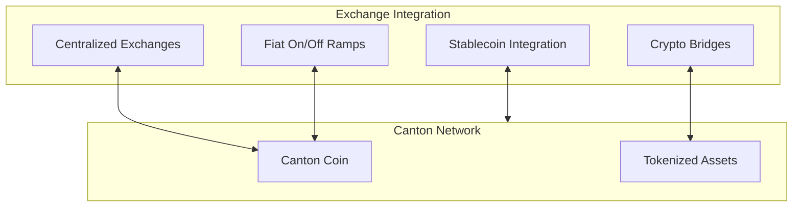

Exchange integration connects Canton Network to broader financial markets, enabling liquidity for Canton Coin and tokenized assets.

## Integration Types

## Centralized Exchange Integration

Exchanges can list Canton Coin for trading against other currencies.

### Requirements

| Requirement | Description |
|-------------|-------------|
| **Validator** | Run a validator to host exchange party |
| **Custody** | Secure Canton Coin custody solution |
| **API integration** | Connect to Ledger API for deposits/withdrawals |
| **Compliance** | Meet regulatory requirements |

### Capabilities

| Function | Description |
|----------|-------------|
| **Deposits** | Users send CC to exchange party |
| **Withdrawals** | Exchange sends CC to user parties |
| **Trading** | Off-ledger order matching |
| **Custody** | Hold CC on behalf of users |

## Fiat On/Off Ramps

Enable conversion between fiat currencies and Canton Coin.

### Models

| Model | Description |
|-------|-------------|
| **Direct** | Exchange provides fiat-to-CC conversion |
| **Partnership** | Partner with existing fiat rails |
| **Banking** | Traditional banking integration |

### Considerations

| Aspect | Consideration |
|--------|---------------|
| **Compliance** | AML/KYC requirements |
| **Licensing** | Money transmission requirements |
| **Banking** | Bank partnerships for fiat |
| **Geography** | Regional regulations |

## Stablecoin Integration

### USDC on Canton

USDC integration provides dollar-denominated liquidity:

| Feature | Description |
|---------|-------------|
| **Issuance** | USDC tokens on Canton |
| **Transfers** | Privacy-preserving USDC transfers |
| **Redemption** | Convert to off-chain USDC |

For detailed USDC integration documentation, see [docs.digitalasset.com/usdc](https://docs.digitalasset.com/usdc).

### Benefits

| Benefit | Description |
|---------|-------------|
| **Stable value** | Dollar-denominated transactions |
| **Privacy** | Canton's privacy model applies |
| **Liquidity** | Connects to broader USDC ecosystem |

## Crypto Bridges

Connect Canton to other blockchain ecosystems.

### Considerations

| Aspect | Consideration |
|--------|---------------|
| **Security** | Bridge security model |
| **Trust** | Who operates the bridge |
| **Speed** | Cross-chain settlement time |
| **Privacy** | What privacy is preserved |

<Note>
Bridge security is complex. Evaluate bridge implementations carefully before relying on them.
</Note>

## For Exchange Operators

### Getting Started

1. **Evaluate** Canton Network requirements
2. **Plan** custody and compliance approach
3. **Set up** validator infrastructure
4. **Integrate** with Ledger API
5. **Test** on DevNet/TestNet
6. **Launch** on MainNet

### Technical Requirements

| Component | Purpose |
|-----------|---------|
| **Validator** | Host exchange party |
| **Database** | Transaction records |
| **API integration** | Ledger API connectivity |
| **Monitoring** | Operational visibility |
| **Security** | Key management, access control |

### Resources

| Resource | Content |
|----------|---------|
| [Validator Setup](/docs-main/global-synchronizer/deploy/validator-setup) | Infrastructure deployment |
| [Ledger API](/docs-main/appdev/reference/ledger-api) | API integration |
| [Support](/docs-main/shared/support-channels) | Technical assistance |

## For Developers

### Integrating Exchange Features

If you're building an application that needs exchange integration:

| Approach | Description |
|----------|-------------|
| **Partner** | Integrate with existing exchange |
| **Build** | Build exchange functionality |
| **Hybrid** | Combine both approaches |

### APIs

| API | Use |
|-----|-----|
| **Ledger API** | Direct Canton integration |
| **Exchange APIs** | Partner exchange integration |
| **Wallet SDK** | User-facing wallet features |

## Privacy Considerations

Exchange integration maintains Canton's privacy model:

| Aspect | Privacy Behavior |
|--------|------------------|
| **Deposits** | Only you and exchange see deposit |
| **Withdrawals** | Only you and exchange see withdrawal |
| **Balances** | Exchange sees balances they custody |
| **Trading** | On-exchange trading may have different privacy |

<Note>
Centralized exchange trading typically happens off-ledger, meaning exchange privacy policies apply there, not Canton's.
</Note>

## Next Steps

<CardGroup cols={2}>

<Card title="USDC Integration" icon="dollar-sign" href="https://docs.digitalasset.com/usdc">
  Detailed USDC documentation.
</Card>

<Card title="Validator Setup" icon="server" href="/docs-main/global-synchronizer/deploy/validator-setup">
  Set up exchange infrastructure.
</Card>

</CardGroup>
