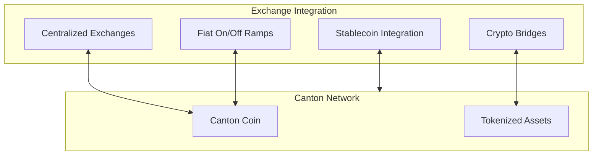

Exchange integration connects Canton Network to broader financial markets, enabling liquidity for Canton Coin and tokenized assets.

## Integration Types

## Centralized Exchange Integration

Exchanges can list Canton Coin for trading against other currencies. To integrate, exchanges need to run a validator to host their exchange party, implement a secure Canton Coin custody solution, connect to the Ledger API for deposits and withdrawals, and meet regulatory requirements.

Once integrated, exchanges can accept user deposits where users send CC to the exchange party, process withdrawals by sending CC to user parties, perform off-ledger order matching for trading, and hold CC on behalf of users through custody.

## Fiat On/Off Ramps

Fiat on/off ramps enable conversion between fiat currencies and Canton Coin. Integration models include direct conversion by the exchange, partnerships with existing fiat rails, or traditional banking integration.

Key considerations include AML/KYC compliance requirements, money transmission licensing, bank partnerships for fiat handling, and regional regulatory differences.

## Stablecoin Integration

### USDC on Canton

USDC integration provides dollar-denominated liquidity on Canton Network. USDC tokens can be issued on Canton, transferred with Canton's privacy-preserving model, and redeemed for off-chain USDC.

For detailed USDC integration documentation, see [docs.digitalasset.com/usdc](https://docs.digitalasset.com/usdc).

The benefits include stable value for dollar-denominated transactions, Canton's privacy model applied to stablecoin transfers, and connection to the broader USDC ecosystem.

## Crypto Bridges

Crypto bridges connect Canton to other blockchain ecosystems. When evaluating bridges, consider the security model, who operates the bridge, cross-chain settlement time, and what privacy is preserved across chains.

<Note>
Bridge security is complex. Evaluate bridge implementations carefully before relying on them.
</Note>

## For Exchange Operators

### Getting Started

1. Evaluate Canton Network requirements
2. Plan your custody and compliance approach
3. Set up validator infrastructure
4. Integrate with the Ledger API
5. Test on DevNet/TestNet
6. Launch on MainNet

You'll need a validator to host your exchange party, a database for transaction records, Ledger API connectivity, operational monitoring, and security measures for key management and access control.

### Resources

- [Validator Setup](/docs-main/global-synchronizer/deploy/validator-setup) for infrastructure deployment
- [Ledger API](/docs-main/appdev/reference/ledger-api) for API integration
- [Support](/docs-main/shared/support-channels) for technical assistance

## For Developers

If you're building an application that needs exchange integration, you can partner with existing exchanges, build exchange functionality yourself, or take a hybrid approach combining both.

Integration typically uses the Ledger API for direct Canton integration, exchange APIs for partner exchange integration, and the Wallet SDK for user-facing wallet features.

## Privacy Considerations

Exchange integration maintains Canton's privacy model. Deposits are visible only to you and the exchange. Withdrawals are visible only to you and the exchange. The exchange sees only the balances they custody.

<Note>
Centralized exchange trading typically happens off-ledger, meaning exchange privacy policies apply there, not Canton's.
</Note>

## Next Steps

<CardGroup cols={2}>

<Card title="USDC Integration" icon="dollar-sign" href="https://docs.digitalasset.com/usdc">
  Detailed USDC documentation.
</Card>

<Card title="Validator Setup" icon="server" href="/docs-main/global-synchronizer/deploy/validator-setup">
  Set up exchange infrastructure.
</Card>

</CardGroup>
