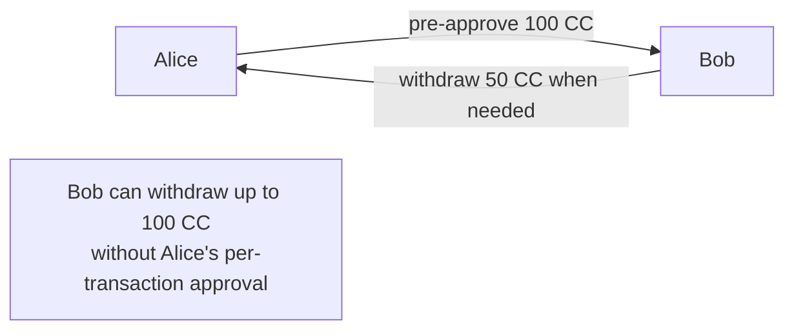
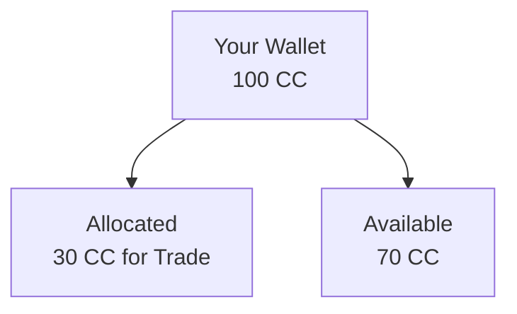
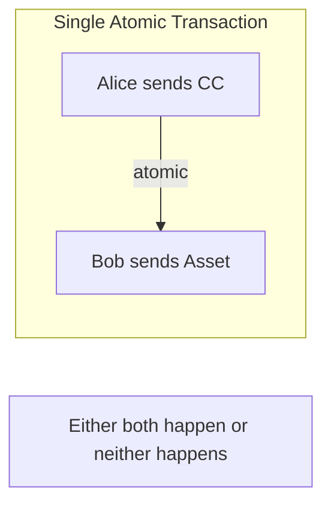
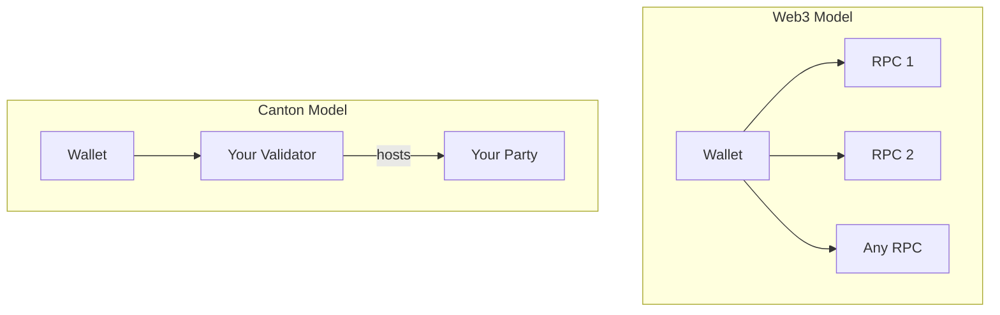

Canton wallets work differently from Web3 wallets like MetaMask. This page explains the key differences and what they mean for users and developers.

## Fundamental Differences

| Aspect | Web3 Wallets | Canton Wallets |
|--------|--------------|----------------|
| **Data visibility** | Balances public | Balances private |
| **Transaction privacy** | All transactions public | Only you see your transactions |
| **Network model** | Connect to any RPC | Connect to the validator with your party |
| **Identity** | Pseudonymous address | Party identifier |
| **Transfer model** | Single-step send | Single-step or multi-step (pre-approvals, allocations) |

## Privacy Model

### Web3: Public by Default

On Ethereum, your wallet:
- Has a public address anyone can see
- Shows balance to anyone who queries
- All transactions visible on block explorers
- Transaction patterns analyzable

```
Anyone can query: 0x123...abc has 45.67 ETH
Anyone can see: 0x123...abc sent 5 ETH to 0x456...def
```

### Canton: Private by Default

On Canton, your wallet:
- Has a party identifier visible only to you
- Balance visible only to you (and entitled parties)
- Transactions visible only to participants
- No public transaction history

```
Only you can see: Your party has 100 CC
Only participants see: You transferred 20 CC to another party
```

## Transfer Capabilities

Canton wallets support transfer patterns not possible in traditional wallets.

### Multi-Step Transfers

Traditional transfer: Send X now.

Canton supports complex workflows:

| Pattern | Description |
|---------|-------------|
| **Pre-approvals** | Authorize future transfers up to a limit |
| **Allocations** | Reserve tokens for specific purposes |
| **DvP** | Atomic delivery-vs-payment exchanges |
| **Conditional** | Transfers triggered by conditions |

### Pre-Approvals

Allow another party to withdraw up to a certain amount:



**Use cases:**
- Subscription payments
- Recurring transfers
- Automated application flows

### Allocations

Reserve tokens for a specific purpose:



**Use cases:**
- Trade settlement
- Escrow arrangements
- Multi-step workflows

### Delivery vs. Payment (DvP)

Atomic exchange of different assets:



**Why this matters:**
- No settlement risk
- No trust required between parties
- Complex exchanges in single transaction

## Connection Model

### Web3: Any RPC

Web3 wallets connect to any compatible RPC endpoint:
- Infura, Alchemy, or self-hosted
- Can switch providers freely
- Any node can answer queries

### Canton: Your Validator

Canton wallets connect to a specific validator:
- The validator hosting your party
- Can't freely switch (party is hosted somewhere specific)
- Only your validator has your data



## Identity Model

### Web3: Address-Based

- Address derived from public key
- Anyone can generate addresses
- Pseudonymous (address is identity)

### Canton: Party-Based

- Party identifier tied to validator hosting
- Party creation involves validator
- Not pseudonymous in the same way

<Note>
For local parties (where the validator holds the keys), the validator signs on behalf of the party. For external parties, keys are held externally and require explicit signing.
</Note>

| Web3 Address | Canton Party |
|--------------|--------------|
| `0x742d35Cc6634C0532925a3b844Bc454e4438f44e` | `alice::1220f2fe29866fd6a0009ecc8a64ccdc09f1958bd0f801166baaee469d1251b2eb72` |

## Explorer Differences

### Web3: Global Explorer

Block explorers show all network activity:
- Any transaction
- Any address balance
- Any contract state

### Canton: Personal Explorer

Canton explorers show your activity:
- Your transactions only
- Your balances
- Your contracts

<Note>
There's no equivalent of Etherscan showing all network transactions. This is by design—privacy is fundamental.
</Note>

## Implications for Users

| If you're used to... | On Canton... |
|----------------------|--------------|
| Checking any address balance | You can only check your own |
| Viewing all transactions | You see only your transactions |
| Connecting to any RPC | You connect to your validator |
| Simple send transactions | You have more transfer options |

## Implications for Developers

| If you're building... | Consider... |
|----------------------|-------------|
| Wallet integration | Use Wallet SDK for Canton patterns |
| Transaction display | Show only user's transactions |
| Balance queries | Query user's party only |
| Multi-step workflows | Leverage pre-approvals and allocations |

## Next Steps

<CardGroup cols={2}>

<Card title="Wallet for Developers" icon="code" href="/docs-main/building-blocks/wallets/for-developers">
  Integrate wallet functionality into your app.
</Card>

<Card title="Token Standard" icon="coins" href="/docs-main/building-blocks/tokens/standard">
  Understand the Canton Token Standard.
</Card>

</CardGroup>
