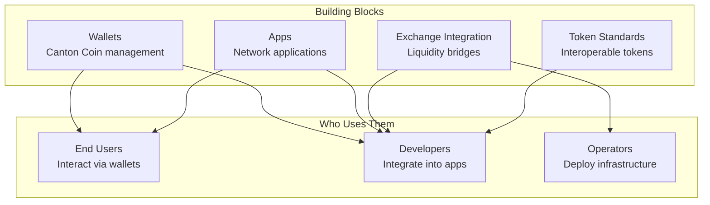

Building Blocks are the foundational components, applications, and integrations that make up the Canton Network ecosystem. They provide ready-to-use functionality that application developers can integrate, and that end users interact with directly.

## The Building Blocks Ecosystem

Canton Network provides several categories of building blocks:

## Categories

### Wallets

Wallets enable users and applications to manage Canton Coin and interact with the network.

| Type | Purpose | Audience |
|------|---------|----------|
| **User Wallets** | Personal CC management | End users |
| **Wallet SDK** | Integration into applications | Developers |
| **Custodial Solutions** | Enterprise CC management | Institutions |

**Key capabilities:**
- Canton Coin balance management
- Transfer execution
- Transaction history
- Traffic top-ups

### Apps

Applications built on Canton Network, from reference implementations to production applications.

| Category | Examples |
|----------|----------|
| **Reference Apps** | Splice wallet, Scan explorer |
| **DeFi** | Trading, lending applications |
| **Enterprise** | Business process applications |
| **Infrastructure** | Tools and utilities |

### Exchange Integration

Bridges to traditional finance and other blockchain ecosystems.

| Integration Type | Purpose |
|------------------|---------|
| **Fiat on/off ramps** | Convert between CC and fiat |
| **Crypto bridges** | Connect to other blockchain assets |
| **USDC integration** | Stablecoin liquidity |

### Token Standards

Standardized interfaces for creating and managing tokens on Canton Network.

| Standard | Purpose |
|----------|---------|
| **CIP-0056** | Canton Network Token Standard |
| **Holding interfaces** | Standardized balance management |
| **Transfer interfaces** | Interoperable transfers |

## For Different Audiences

### For End Users

Building blocks you interact with directly:

<CardGroup cols={2}>

<Card title="Find a Wallet" icon="wallet" href="/docs-main/building-blocks/wallets/for-users">
  Discover wallet options for managing your Canton Coin.
</Card>

<Card title="Find Apps" icon="grid-2" href="/docs-main/building-blocks/apps/finding-apps">
  Explore applications built on Canton Network.
</Card>

</CardGroup>

### For Developers

Building blocks to integrate into your applications:

<CardGroup cols={2}>

<Card title="Wallet Integration" icon="code" href="/docs-main/building-blocks/wallets/for-developers">
  Add wallet functionality to your application.
</Card>

<Card title="Token Standard" icon="coins" href="/docs-main/building-blocks/tokens/standard">
  Implement standardized tokens.
</Card>

</CardGroup>

### For Operators

Building blocks to deploy and operate:

<CardGroup cols={2}>

<Card title="Exchange Integration" icon="building-columns" href="/docs-main/building-blocks/exchange/overview">
  Connect exchanges and liquidity.
</Card>

<Card title="Infrastructure" icon="server" href="/docs-main/global-synchronizer/understand/introduction">
  Operate validator infrastructure.
</Card>

</CardGroup>

## How Building Blocks Differ from Other Ecosystems

Canton Network's building blocks have unique characteristics:

| Aspect | Traditional DeFi | Canton Building Blocks |
|--------|------------------|------------------------|
| **Visibility** | Public by default | Private by default |
| **Composability** | Permissionless | Privacy-preserving |
| **Wallets** | See all transactions | See only your transactions |
| **Tokens** | Public token balances | Private holdings |

### Example: Wallet Experience

**On Ethereum:**
- Wallet shows your balance
- Anyone can query your balance
- All transfers publicly visible
- Transaction patterns analyzable

**On Canton:**
- Wallet shows your balance
- Only you (and entitled parties) see your balance
- Transfers visible only to participants
- Transaction patterns private

## Building Blocks and Privacy

Building blocks in Canton respect the network's privacy model:

| Component | Privacy Behavior |
|-----------|------------------|
| **Wallets** | Only show holdings you're entitled to see |
| **Apps** | Operate within privacy boundaries |
| **Tokens** | Balances private to holders |
| **Explorers** | Show only your transactions (not network-wide) |

<Note>
Unlike blockchain explorers on Ethereum that show all transactions, Canton explorers show only transactions where you are a stakeholder.
</Note>

## Getting Started

Depending on your role:

| If you want to... | Start here |
|-------------------|------------|
| Manage Canton Coin | [Wallets for Users](/docs-main/building-blocks/wallets/for-users) |
| Use Canton apps | [Finding Apps](/docs-main/building-blocks/apps/finding-apps) |
| Integrate wallets | [Wallets for Developers](/docs-main/building-blocks/wallets/for-developers) |
| Create tokens | [Token Standard](/docs-main/building-blocks/tokens/standard) |
| Integrate exchanges | [Exchange Overview](/docs-main/building-blocks/exchange/overview) |

## Next Steps

<CardGroup cols={2}>

<Card title="Canton Ecosystem" icon="globe" href="/docs-main/building-blocks/ecosystem">
  Explore the broader Canton Network ecosystem.
</Card>

<Card title="Integration Patterns" icon="puzzle-piece" href="/docs-main/building-blocks/integration-patterns">
  Common patterns for building with building blocks.
</Card>

</CardGroup>
