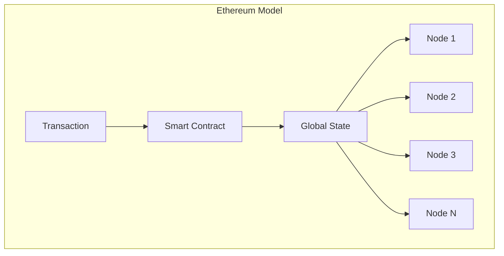
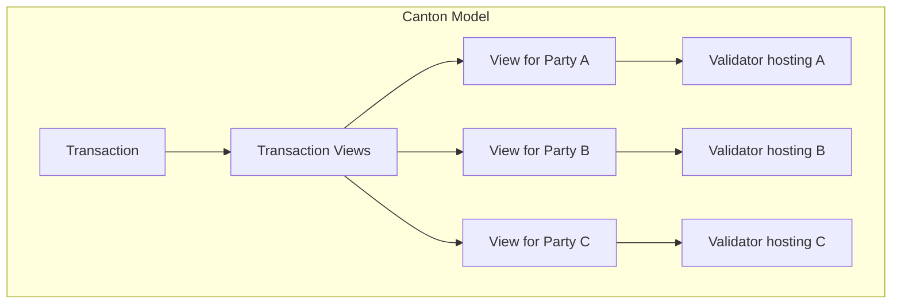
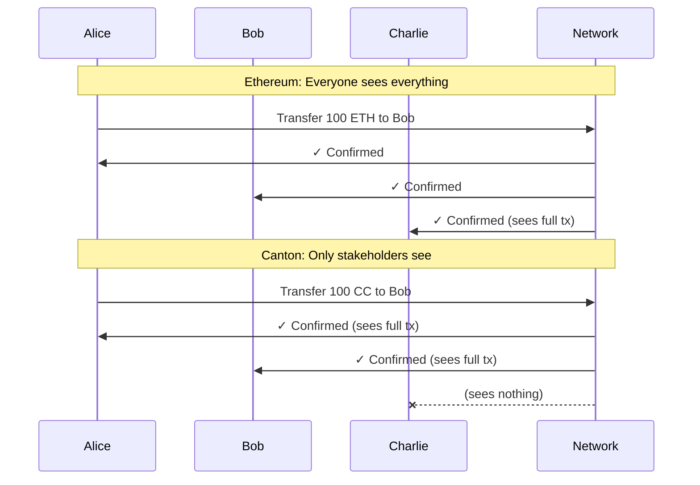

import DamlAppdevModulesM2CantonForEthereumDevsL159 from "/snippets/daml-docs/appdev_modules_m2-canton-for-ethereum-devs_L159.mdx";
import DamlAppdevModulesM2CantonForEthereumDevsL184 from "/snippets/daml-docs/appdev_modules_m2-canton-for-ethereum-devs_L184.mdx";
import DamlAppdevModulesM2CantonForEthereumDevsL236 from "/snippets/daml-docs/appdev_modules_m2-canton-for-ethereum-devs_L236.mdx";
import DamlAppdevModulesM2CantonForEthereumDevsL73 from "/snippets/daml-docs/appdev_modules_m2-canton-for-ethereum-devs_L73.mdx";


If you're coming from Ethereum, Solana, or another blockchain platform, Canton will feel both familiar and fundamentally different. This section maps concepts you know to their Canton equivalents - and highlights where mental models must shift.

## Core Concept Mapping

The following table maps familiar Ethereum concepts to their Canton equivalents.

| Ethereum Concept | Canton Equivalent | Canton Notes |
|-----------------|-------------------|--------------|
| Blockchain | Synchronizer | Coordinates consensus without storing state |
| Smart Contract | Template | Defines data schema and executable choices |
| Contract Instance | Contract | Immutable; state changes create new contracts |
| Function | Choice | Actions that archive and/or create contracts |
| EOA (Address) | Party | Cryptographic identity with explicit permissions |
| Transaction | Transaction | Only entitled parties see their relevant views |
| Global State | Distributed State | No global state; each node stores its parties' data |
| Node | Validator (Participant) | Stores data only for its hosted parties |
| Gas | Traffic | Network usage fee paid in Canton Coin |

## The Mental Model Shift

**On Ethereum**: You write code that mutates global state. Everyone sees everything. Your contract sits at an address anyone can call.

**On Canton**: You write templates that define what data exists and what actions are possible. Contracts are created and archived (never mutated). Only relevant parties see the data. Authorization is built into the model, not bolted on.





## Smart Contract Paradigm: Templates vs Solidity

In Solidity, you define contracts with mutable state and functions that modify that state:

```solidity
// Solidity: Mutable state
contract Token {
    mapping(address => uint256) public balances;
    
    function transfer(address to, uint256 amount) public {
        balances[msg.sender] -= amount;
        balances[to] += amount;
    }
}
```

In Daml (Canton's smart contract language), you define templates with immutable contracts and choices that archive existing contracts and create new ones:

<DamlAppdevModulesM2CantonForEthereumDevsL73 />

### Key Differences

These are the fundamental differences between Solidity and Daml programming models.

| Aspect | Solidity | Daml |
|--------|----------|------|
| **State model** | Mutable storage variables | Immutable contracts; changes create new contracts |
| **Authorization** | Runtime `msg.sender` checks | Compile-time `signatory`/`controller` declarations |
| **Default visibility** | Public by default | Private by default; explicit `observer` declarations |
| **Execution control** | Anyone can call public functions | Only declared controllers can exercise choices |

The `Transfer` choice in Daml doesn't mutate the existing contract. It **archives** the current contract and **creates** a new one with the new owner. This immutability is fundamental to Canton's privacy and integrity guarantees.

## Privacy Model Differences

**Ethereum default**: Everything public. Privacy requires additional layers (ZK-rollups, private channels).

**Canton default**: Everything private. Visibility requires explicit declaration.



## Reading Data: No Global RPC

On Ethereum, any node can answer queries about any state. On Canton, **you must connect to the validator that hosts the party whose data you want**.

<Note>
There is no single, all-encompassing blockchain RPC endpoint you can call to retrieve all data. Instead, you use your validator's Ledger API for your parties' data, and potentially an application provider's API for their data.
</Note>

This is a direct consequence of privacy. If Charlie can't see Alice's data on-ledger, Charlie's node doesn't have Alice's data to query.

## Authorization Model

Authorization works fundamentally differently in Canton compared to Ethereum.

| Ethereum | Canton |
|----------|--------|
| `msg.sender` determines authorization | `signatory` and `controller` determine authorization |
| Anyone can call any public function | Only specified parties can exercise choices |
| Authorization is runtime check | Authorization is compile-time guarantee and a run-time double check |

Canton's authorization model uses three key roles:

- **Signatory**: The party or parties that must authorize contract creation. Signatories always see the contract and can exercise choices if also declared as controller.
- **Observer**: A party permitted to see the contract but cannot exercise choices unless also declared as controller.
- **Controller**: The party permitted to execute a particular choice on a contract. Controllers see the contract when exercising.

### Authorization Example

<DamlAppdevModulesM2CantonForEthereumDevsL159 />

In this template:
- `issuer` must sign to create the contract (signatory)
- `owner` and `auditor` can see the contract (observers)
- Only `owner` can exercise the `Transfer` choice (controller)

Note that `controller` declarations are per-choice. A template can have multiple choices with different controllers:

<DamlAppdevModulesM2CantonForEthereumDevsL184 />

## Developer Tooling Comparison

Canton has equivalent tooling for most Ethereum development workflows.

| Ethereum Tool | Canton Equivalent | Notes |
|--------------|-------------------|-------|
| Solidity | Daml | Functional vs imperative paradigm |
| Hardhat / Foundry | Daml SDK + dpm | Build, test, deploy toolchain |
| Remix | VS Code + Daml Extension | IDE with language support |
| MetaMask | Wallet SDK | User wallet integration |
| Web3.js / ethers.js | Ledger API (gRPC/JSON) | Application integration |
| ERC standards | CIPs | [CIP-0056](https://github.com/global-synchronizer-foundation/cips/blob/main/cip-0056/cip-0056.md) (tokens), [CIP-0103](https://github.com/mjuchli-da/cips/blob/cip-dapp-standard/cip-0103/cip-0103.md) (dApp standard) |

## Multi-Party Workflows

Canton treats multi-party coordination as a first-class concern. Where Ethereum requires manual coordination patterns, Canton builds them into the language.

### Ethereum Approach: Manual Multi-Sig

```solidity
// Solidity: Manual signature collection
contract MultiSig {
    mapping(address => bool) public approved;
    uint256 public approvalCount;
    
    function approve() public {
        require(!approved[msg.sender], "Already approved");
        approved[msg.sender] = true;
        approvalCount++;
    }
    
    function execute() public {
        require(approvalCount >= 2, "Need 2 approvals");
        // ... execute action
    }
}
```

### Canton Approach: Built-in Multi-Party

<DamlAppdevModulesM2CantonForEthereumDevsL236 />

The Daml version is enforced at the protocol level. There's no way to create the contract without both signatures, and no way to exercise `Execute` without both parties.

<Note>
Multi-party authorization in Canton requires collecting signatures from parties that may be hosted on different validators. This typically involves workflow patterns where one party proposes an action and others accept it. See the developer modules for detailed patterns on implementing multi-party workflows.
</Note>

## What You'll Need to Unlearn

Coming from Ethereum, these habits will need to change.

| Ethereum Habit | Canton Reality |
|----------------|----------------|
| **Query all state from any node** | Query from validators hosting relevant parties |
| **Mutate contract storage** | State changes create new contracts; old ones are archived |
| **Implicit authorization via msg.sender** | Explicit declaration of signatories and controllers |
| **Public by default** | Private by default; explicitly add observers for visibility |
| **Interchangeable nodes** | Validators store their hosted parties' state |

### The Four Mental Shifts

1. **No global state queries**: You can't query "all tokens" across the network
2. **Immutable contracts**: State changes create new contracts; old ones are archived
3. **Explicit authorization**: Every action requires explicit signatory/controller declarations
4. **Privacy by default**: You must opt-in to visibility, not opt-out

## Common Gotchas

<Warning>
These are the most common mistakes blockchain developers make when first building on Canton.
</Warning>

| Gotcha | Why It Happens | How to Avoid |
|--------|---------------|--------------|
| **Building public state lookups** | Expecting Ethereum-style global queries | Design for party-scoped queries from the start |
| **Forgetting multi-party authorization** | Ethereum's permissionless model | Always consider: who must sign? who can act? |
| **Trying to mutate contracts** | Solidity's mutable storage model | Embrace create/archive pattern |
| **Designing too many parties** | Ethereum addresses are free | Each party creates storage overhead; design party structure deliberately |

## Next Steps

- **[Architecture Overview](/devnet/overview/learn/architecture)** - Deep dive into Canton's component model
- **[Privacy Model Explained](/devnet/overview/learn/privacy-model)** - Understand sub-transaction privacy
- **[Developer Track Module 3: Daml Development](/devnet/appdev/modules/m3-dev-environment)** - Start writing Daml code
