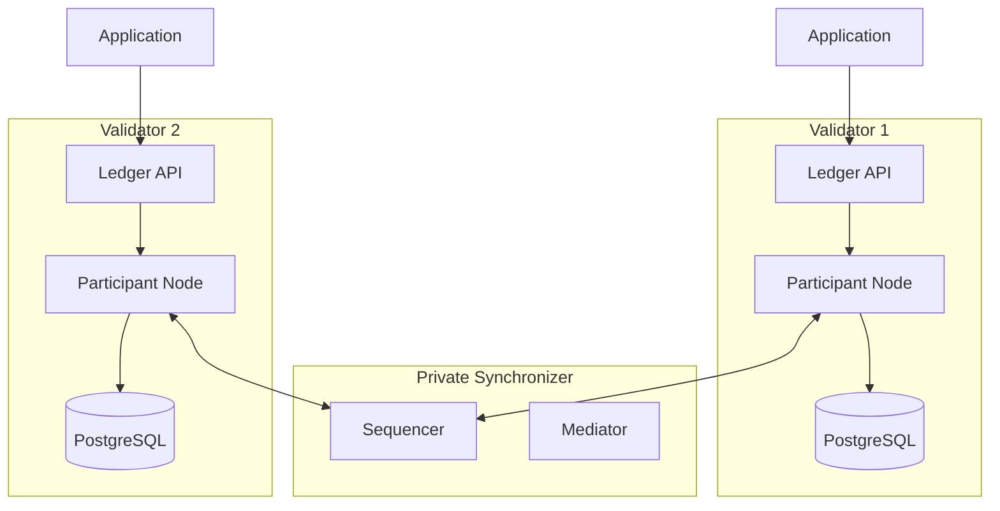

import CantonGlobalSynchronizerExtensionSynchronizersPrivateValidatorsL105 from "/snippets/canton-docs/global-synchronizer_extension-synchronizers_private-validators_L105.mdx";


You can run validators exclusively on a private synchronizer, with no connection to the Global Synchronizer. This gives you a self-contained Canton deployment where you control all infrastructure and operate independently of the Canton Network.

## When to choose private-only validators

Private-only validators suit specific operational scenarios:

- **Internal enterprise workflows** — Your Daml applications run entirely within one organization, and all parties are hosted on validators you operate
- **Consortium with no external dependencies** — A closed group of organizations runs shared workflows without needing to interact with the broader Canton Network
- **Regulatory constraints** — Rules prevent connecting to external network infrastructure, or all transaction processing must occur on infrastructure within a specific jurisdiction
- **Development and testing** — You want to build and test Daml applications without setting up Global Synchronizer connectivity

## What differs from Global Synchronizer validators

Running a validator without a Global Synchronizer connection simplifies operations but removes certain capabilities.

**What you get:**
- Full Canton protocol features — sub-transaction privacy, multi-party workflows, Daml smart contracts
- The Ledger API works identically to a Global Synchronizer-connected validator
- Simpler network topology with no external dependencies
- No Canton Coin traffic fees

**What you do not get:**
- No Canton Coin — You cannot hold, transfer, or use Canton Coin
- No Splice wallet — The wallet application requires Global Synchronizer connectivity
- No interoperability with Canton Network parties — Your contracts cannot interact with contracts on the Global Synchronizer
- No validator onboarding process — You manage the full topology yourself

## Architecture

A private-only validator is a standard Canton participant node connected to your private synchronizer. Without the Global Synchronizer, the validator process (which handles Canton Network-specific features like wallet management and traffic purchases) is not needed.



## Deployment

Deploy the participant node without the validator process. You can use the Canton open-source distribution for this, since you do not need the Splice-specific components.

### Helm deployment

```yaml
# participant-values.yaml
participant:
  storage:
    type: postgres
    config:
      dataSourceClass: "org.postgresql.ds.PGSimpleDataSource"
      properties:
        serverName: "<postgres-host>"
        portNumber: 5432
        databaseName: "participant_db"
        user: "participant_user"
        password: "<password>"
  ledgerApi:
    port: 5001
    tls:
      certChainFile: "/certs/tls.crt"
      privateKeyFile: "/certs/tls.key"
  synchronizerConnections:
    - alias: "private-sync"
      sequencerConnection: "https://sequencer.private-sync.example.com"
```

```bash
helm install participant canton/canton-participant \
  -f participant-values.yaml \
  --namespace canton
```

### Connecting to the synchronizer

After the participant starts, it connects to the configured synchronizer automatically. Verify the connection:

<CantonGlobalSynchronizerExtensionSynchronizersPrivateValidatorsL105 />

## Choosing between private-only and Global Synchronizer-connected

Use this decision framework:

- **Do any of your parties need to transact with external Canton Network parties?** If yes, you need a Global Synchronizer connection. Consider the [hybrid pattern](/devnet/global-synchronizer/extension-synchronizers/hybrid-synchronizer-pattern) instead.
- **Do you need Canton Coin for payments or settlement?** If yes, you need a Global Synchronizer connection.
- **Might you need network connectivity in the future?** If possibly, deploy standard validators now and connect to the Global Synchronizer later. Adding a synchronizer connection is non-disruptive — see [linking to multiple synchronizers](/devnet/global-synchronizer/extension-synchronizers/linking-validator-multi-sync).
- **Is your use case entirely internal with no foreseeable external interaction?** Private-only validators are the simpler choice.

## Migrating to Global Synchronizer later

If your requirements change, you can connect your validators to the Global Synchronizer without disrupting your private synchronizer workflows:

1. Complete the Global Synchronizer onboarding process (sponsorship, IP allowlisting, onboarding secret)
2. Add the Global Synchronizer connection to your validators
3. Reassign contracts that need network-wide visibility from the private synchronizer to the Global Synchronizer
4. Continue running private workflows on the private synchronizer

Your existing applications and contracts on the private synchronizer are unaffected by adding the Global Synchronizer connection.
