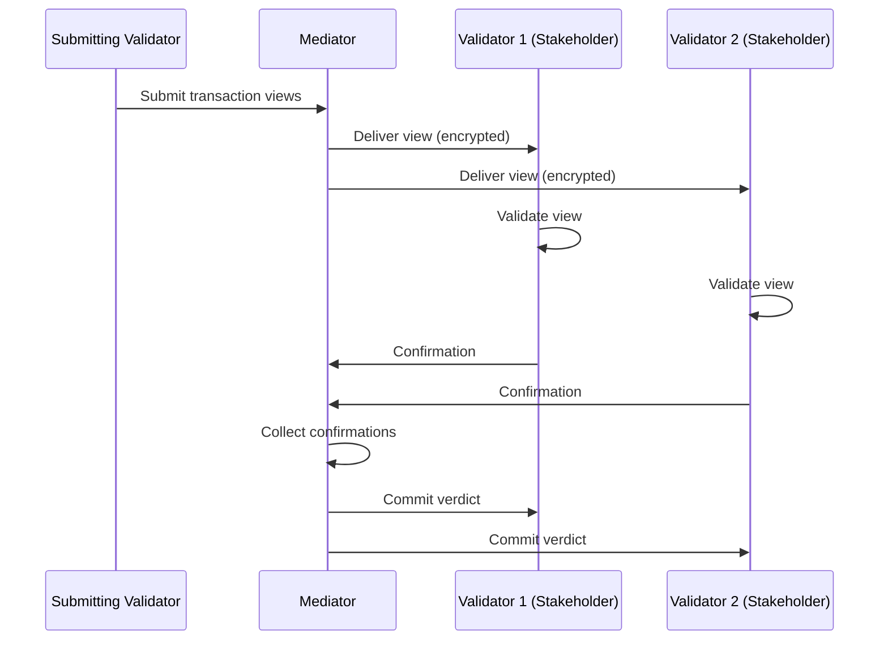
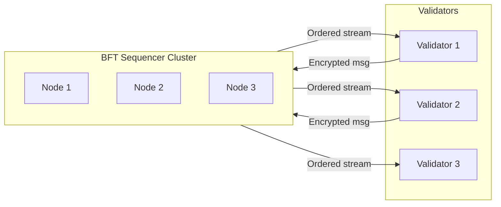
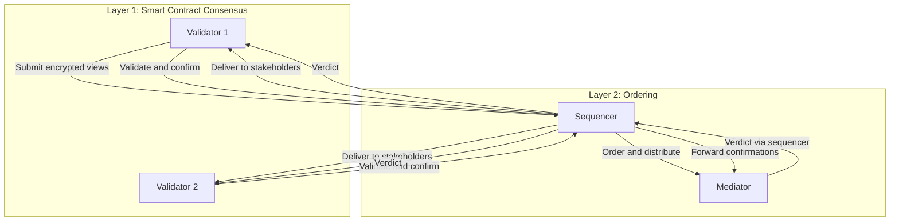

Canton uses a two-layer consensus architecture that separates **smart contract transaction consensus** from **ordering consensus**. This separation is what allows Canton to achieve privacy while maintaining integrity.

## Why Two Layers?

Traditional blockchains combine ordering and validation into a single consensus process. Every validator sees every transaction to verify correctness and agree on order. This tight coupling creates an inherent privacy limitation.

Canton decouples these concerns into two layers:

- **Smart contract consensus** validates transaction correctness. Only affected stakeholders participate, and each sees only their portion of the transaction.
- **Ordering consensus** establishes global transaction order. Synchronizer nodes participate, but they only see encrypted messages.

## Layer 1: Smart Contract Consensus (Proof of Stakeholder)

Smart contract consensus in Canton follows a **Proof of Stakeholder** model. Only parties with a stake in a contract can validate transactions affecting that contract.

### How It Works

1. **Stakeholder Identification**: When a transaction affects a contract, Canton identifies all stakeholders (signatories, observers, controllers)
2. **View Distribution**: Each stakeholder receives only the transaction view they're entitled to see
3. **Independent Validation**: Each stakeholder validates their view against Daml rules
4. **Confirmation**: Stakeholders send confirmation or rejection to the mediator
5. **Verdict**: Once sufficient confirmations are received, the transaction commits or aborts in entirety

Non-stakeholders never see the transaction at all. Only affected parties do validation work, and Daml authorization rules are enforced by the stakeholders themselves.

The trust assumption here is straightforward: you trust that signatories and controllers will correctly validate their portion. Since they have a direct interest in the contract (they signed it or are observing it), they're incentivized to validate honestly.

## Layer 2: Ordering Consensus (BFT Sequencing)

The ordering layer establishes a **total order** for all transactions on a synchronizer. This ensures all participants see events in the same sequence from the same synchronizer, preventing double-spends and ensuring consistency.

### How It Works

The synchronizer's sequencer component:

1. Receives encrypted transaction messages from participants
2. Assigns a globally unique timestamp/sequence number for that synchronizer
3. Distributes messages to all entitled recipients in order
4. Ensures all recipients see the same ordering

### BFT Ordering

For decentralized synchronizers (like the Global Synchronizer), ordering uses Byzantine Fault Tolerant (BFT) consensus:

- Multiple sequencer nodes run the ordering protocol
- Tolerates up to 1/3 Byzantine (malicious) nodes
- Based on ISS (Insanely Scalable State-Machine Replication) algorithm
- Provides safety and liveness guarantees

All validators receive messages in identical order, ensuring consistency. The sequencers only see encrypted messages, so ordering does not compromise privacy. And the BFT protocol continues operating even if some nodes fail.

The trust assumption: fewer than 1/3 of sequencer nodes are malicious. For the Global Synchronizer, this trust is distributed across independent Super Validators.

## How the Layers Interact

The two layers work together in Canton's transaction protocol:

The flow begins in the ordering layer: a validator submits an encrypted transaction, and the sequencer assigns it a position in the global order.  The sequencer then distributes the relevant views to stakeholders.  The mediator is made aware how many confirmations it needs to reach a verdict.  At this point, smart contract consensus takes over — each stakeholder validates their view and sends a confirmation to the mediator. Finally, the mediator aggregates confirmations and broadcasts the verdict back through the sequencer's ordering layer.

## Benefits of Separation

**Privacy without sacrificing integrity.** The ordering layer prevents double-spends (integrity and consistency), while the smart contract layer ensures only stakeholders see data (privacy). Neither layer alone could achieve both.

**Flexible trust models.** Different synchronizers can use different ordering trust models — a single-operator sequencer for private deployments, or a BFT sequencer for decentralized networks — while smart contract consensus stays the same regardless.

**Scalability.** The ordering layer handles synchronization only, keeping it lightweight. Validation work is distributed to affected validators only, with no global state replication required.

## Comparison to Other Approaches

| Approach | Ordering | Validation | Privacy |
|----------|----------|------------|---------|
| **Traditional Blockchain** | All validators | All validators | None |
| **L2 Rollups** | Sequencer | Fraud/validity proofs | Limited |
| **Canton** | Synchronizer (BFT) | Affected stakeholders only | Full sub-transaction |

## Related Topics

- [Trust Model Overview](/devnet/overview/learn/trust-model) — trust assumptions across each layer
- [Architecture Overview](/devnet/overview/learn/architecture) — how components fit together
- [Privacy Model](/devnet/overview/learn/privacy-model) — sub-transaction privacy in detail
