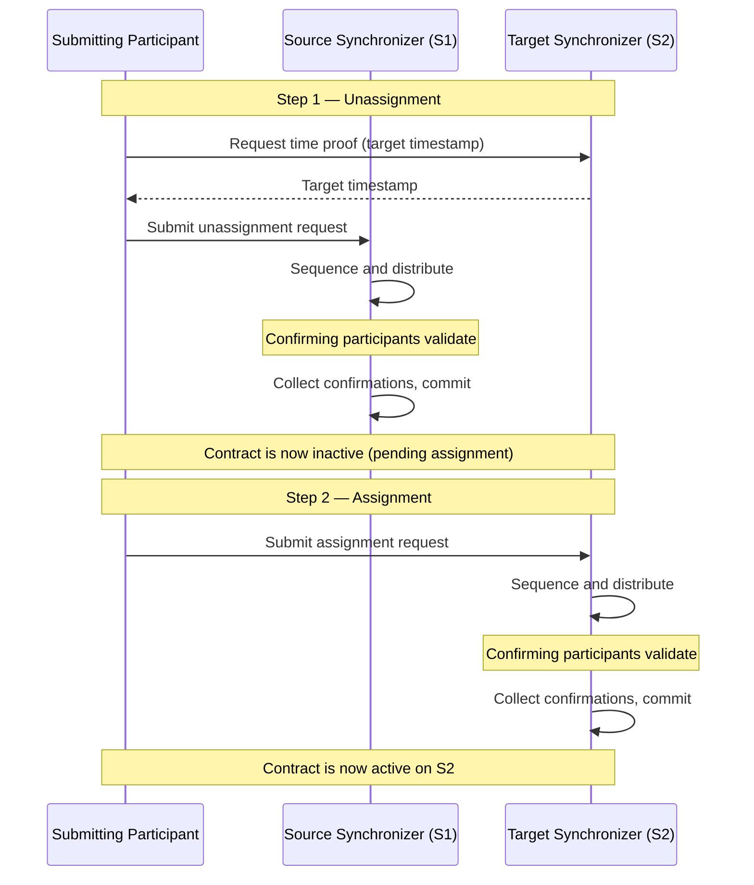

## Why reassignments exist

A participant node can connect to several synchronizers. Different synchronizers may serve different purposes: regulatory compliance, performance characteristics, cost, governance models, or application-specific restrictions. Contracts created on different synchronizers need a way to participate in the same transaction, and reassignment is that mechanism.

<Note>
Synchronizers are commodities used by stakeholders to synchronize changes on contracts. The contracts themselves are stored only on participant nodes. An assignation is an agreement between stakeholders that they can change over time through reassignments.
</Note>

## Two-step process: unassignment and assignment

## Key definitions

### Reassignment counter

The **reassignment counter** tracks the number of times a contract has been reassigned. It is set to zero when the contract is created and increased by one with each unassignment. The unassignment event and the corresponding assignment event have the same reassignment counter.

### Target timestamp

When an unassignment is submitted, a time proof is requested on the target synchronizer. This timestamp — the **target timestamp** — is used to perform validations related to the target synchronizer (package vetting, stakeholder hosting, and so on) during unassignment processing. Using a single fixed target-timestamp ensures all confirming participants run the same validations against the same topology snapshot.

### Reassigning participant

A reassigning participant is connected to both the source and target synchronizers and hosts a stakeholder on both. This dual connectivity allows it to validate the full reassignment and guard against double spends.

Formally, a participant `P` is a **reassigning participant** for a party `S` and contract `c` if all of the following hold:

- `S` is a stakeholder of `c`.
- `S` is hosted by `P` on the target synchronizer at the [target timestamp](#target-timestamp).
- `S` is hosted by `P` on the source synchronizer.

The last condition is checked during submission using a recent topology snapshot and during phase 3 of the protocol using a topology snapshot at request time.

### Signatory unassigning participant

A **signatory unassigning participant** for a contract `c` and party `S` is a [reassigning participant](#reassigning-participant) where:

- `S` is a **signatory** of `c`.
- `S` is hosted on `P` with at least confirmation rights on the source synchronizer.

Signatory unassigning participants are the confirmers of an unassignment request — only signatories should confirm because non-signatory observers would not block the reassignment regardless.

### Signatory assigning participant

A **signatory assigning participant** for a contract `c` and party `S` is a [reassigning participant](#reassigning-participant) where:

- `S` is a **signatory** of `c`.
- `S` is hosted on `P` with at least confirmation rights on the target synchronizer.

A signatory assigning participant is informed of both the unassignment and the assignment of a contract, and is a confirmer of the assignment request.

## Confirmation policies

## Validation rules

### Unassignment validation

### Assignment validation

Standard validations that also apply to regular Daml transactions are performed for both steps: correct view decryption, correct recipient lists, and correct root hash messages.

<Warning>
If the topology changes between unassignment and assignment, completing the reassignment may become impossible. In that case, you can either adjust the topology to allow the assignment, or use the repair service to manually fix the contract's assignation on every relevant participant node.
</Warning>

## Submission policies

This relaxed requirement has two motivations. First, a party that loses submission permission on a synchronizer after reassignment can still initiate a reassignment back, preserving the ability to exercise choices. Second, decentralized parties (which cannot submit Daml transactions) should still be able to submit reassignments for composability.

## Assignment exclusivity

This mechanism gives the initiator a window to complete the reassignment without interference, while still allowing other participants to finish an abandoned reassignment.

## Automatic vs. explicit reassignment

You can trigger reassignments in two ways.

### Automatic (synchronizer router)

When you submit a transaction through the Ledger API, Canton's synchronizer router automatically identifies a suitable synchronizer. It reassigns all input contracts to that synchronizer, executes the transaction, and optionally reassigns output contracts afterward. Your application does not need to manage synchronizer selection or reassignment commands.

The router selects the admissible synchronizer that has the highest priority, minimizes the number of reassignments, and (as a tiebreaker) has the lowest synchronizer ID. An application can influence routing through per-synchronizer package vetting, inhomogeneous party hosting, or explicitly disclosed contracts.

### Explicit (Ledger API commands)

For fine-grained control, you can submit reassignment commands directly through the Ledger API. The unassign command specifies the contracts, source synchronizer, and target synchronizer. The assign command references the unassign ID returned by the unassignment. You can also prescribe which synchronizer to use when submitting a transaction; if that synchronizer is not suitable, submission fails.

<Note>
Automatic reassignment is convenient but can cause unexpected contention. Both unassignment and assignment lock the contract, which means reassignments compete with other workflows, including read-only transactions. If contention is a concern, design your Daml workflows with explicit reassignment in mind.
</Note>

## Ledger API data

### Unassign command fields

- **Contracts**: The contracts to reassign (all must share the same signatories and stakeholders).
- **Source synchronizer**: The current assignation.
- **Target synchronizer**: The desired assignation.

### Unassigned event fields

- **Unassign ID**: An opaque identifier that uniquely identifies the reassignment, used to submit the assignment.
- **Reassignment counter**: Number of times the contract has been reassigned.
- **Assignment exclusivity**: The deadline before which only the unassignment submitter can submit the assignment.

### Assign command fields

- **Unassign ID**: The identifier from the unassigned event.
- **Source synchronizer**: The previous assignation.
- **Target synchronizer**: The new assignation.

### Assigned event fields

- **Unassign ID**: For correlating unassigned and assigned events.
- **Reassignment counter**: Same value as in the unassigned event.
- **Created event**: The contract data, included so that participants learning about the contract for the first time (because it entered their visibility) can access its payload.

## Contracts entering and leaving visibility

A contract can **enter the visibility** of a participant when the participant hosts a stakeholder on the target synchronizer (and is therefore an informee of the assignment) but did not host a stakeholder on the source synchronizer (so it was not an informee of the unassignment). The created event included in the assigned event lets the participant learn about the contract's payload as it becomes usable for the first time.

The reverse — a contract **leaves the visibility** of a participant — happens when the participant was an informee of the unassignment (because it hosted a stakeholder on the source synchronizer) but is not an informee of the assignment (because the same stakeholder is not hosted there, or because that stakeholder is hosted on a different node on the target synchronizer). The contract becomes unusable on that participant after the unassignment, even though it remains active for other stakeholders on the target synchronizer.

A contract can enter and leave a participant's visibility multiple times during its life cycle. This typically happens when stakeholders hosted on the participant are multi-hosted across synchronizers in a way that changes over time.

## Updates stream ordering

When a participant connects to multiple synchronizers, the updates stream merges events from all of them. Because time cannot be compared across synchronizers, there is no global causality guarantee on the updates stream. Events from different synchronizers may appear in any order, and different participants may see different orderings.

Within a single synchronizer, ordering is consistent: a created event always appears before any unassigned or archived event for that contract, and an archived event always appears after any assigned or created event.
