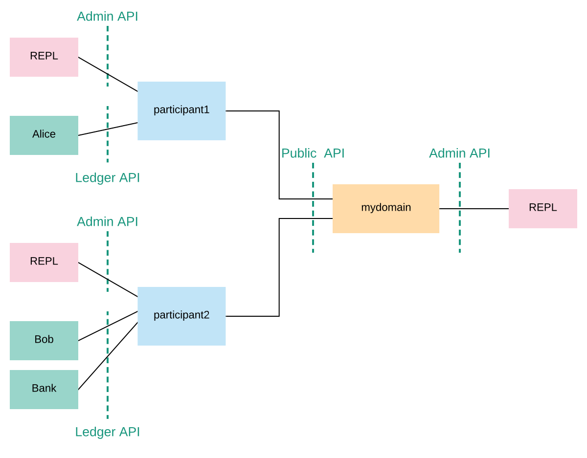
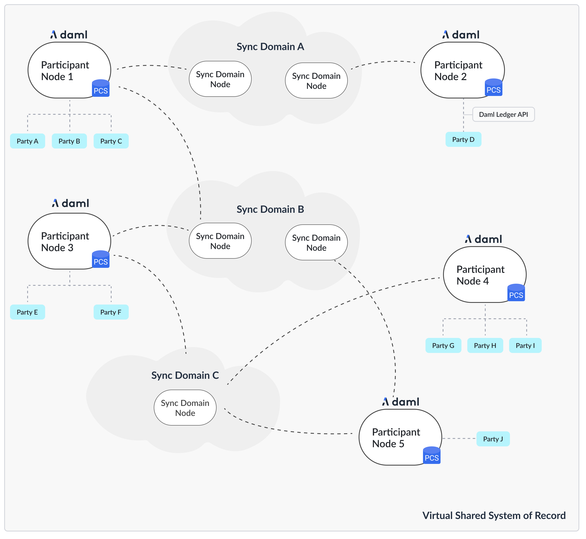

{/* COPIED_START source="docs-website:docs/replicated/canton/3.4/participant/tutorials/getting_started.rst" hash="1e3b752b" */}

<Warning title="Pre-reviewed Content - Do Not Modify">
This section was copied from existing reviewed documentation.
**Source:** `docs-website:docs/replicated/canton/3.4/participant/tutorials/getting_started.rst`
Reviewers: Skip this section. Remove markers after final approval.
</Warning>

<div className="todo">
change the section where we provision smart contract code: - create a new empty project - use the "Understanding IOUs" section to explain the structure of a daml contract (link to the Java bindings page once it covers a quickstart-style IOU walkthrough: /sdks-tools/language-bindings/java) - transact on the IOU contract using curl and JSON Ledger API, not via console commands
</div>

# Getting Started

Interested in Canton? This is the right place to start! You don't need any prerequisite knowledge, and you will learn:

- how to install Canton and get it up and running in a simple test configuration
- the main concepts of Canton
- the main configuration options
- some simple diagnostic commands on Canton
- the basics of Canton identity management
- how to upload and execute new smart contract code

## Installation

Canton is a JVM application. To run it natively you need Java 11 or higher installed on your system. Alternatively Canton is available as a [docker image](https://hub.docker.com/r/digitalasset/canton-open-source) (see Canton docker instructions).

Canton is platform-agnostic. For development purposes, it runs on macOS, Linux, and Windows. Linux is the supported platform for production.

Note: Windows garbles the Canton console output unless you are running Windows 10 and you enable terminal colors (e.g., by running `cmd.exe` and then executing `reg add HKCU\Console /v VirtualTerminalLevel /t REG_DWORD /d 1`).

To start, download the open source community edition [latest release](https://github.com/digital-asset/daml/releases) and extract the archive, or use the enterprise edition if you have access to it.

The extracted archive has the following structure:

``` none
.
├── bin
├── config
├── daml
├── dars
├── demo
├── drivers (enterprise)
├── examples
├── lib
└── ...
```

- `bin`: contains the scripts for running Canton (`canton` under Unix-like systems and `canton.bat` under Windows)
- `config`: contains a set of reference configuration files for each node type
- `daml`: contains the source code for some sample smart contracts
- `dars`: contains the compiled and packaged code of the above contracts
- `demo`: contains everything needed to run the interactive Canton demo
- `examples`: contains sample configuration and script files for the Canton console
- `lib`: contains the Java executables (JARs) needed to run Canton

This tutorial assumes you are running a Unix-like shell.

## Starting Canton

While Canton supports a daemon mode for production purposes, in this tutorial we will use its console, a built-in interactive read-evaluate-print loop (REPL). The REPL gives you an out-of-the-box interface to all Canton features. In addition, as it's built using [Ammonite](https://ammonite.io/), you also have the full power of Scala if you need to extend it with new scripts. As such, any valid Scala expression can be typed inside the console:

``` none
@ Seq(1,2,3).map(_ * 2)
    res1: Seq[Int] = List(2, 4, 6)
```

Navigate your shell to the directory where you extracted Canton. Then, run

```bash
bin/canton --help
```

to see the command line options that Canton supports. Alternatively to `bin/canton`, you can also start Canton directly with `java -jar lib/canton-*.jar`, assuming all other jar dependencies are in the `lib` folder, too.

Next, run

```bash
bin/canton -c examples/01-simple-topology/simple-topology.conf
```

This starts the console using the configuration file `examples/01-simple-topology/simple-topology.conf`. You will see the banner on your screen

``` none
_____            _
/ ____|          | |
| |     __ _ _ __ | |_ ___  _ __
| |    / _` | '_ \| __/ _ \| '_ \
| |___| (_| | | | | || (_) | | | |
\_____\__,_|_| |_|\__\___/|_| |_|

Welcome to Canton!
Type `help` to get started. `exit` to leave.
```

Type `help` to see the available commands in the console:

``` none
@ help
    Top-level Commands
    ------------------
    exit - Leave the console
    help - Help with console commands; type help("<command>") for detailed help for <command>

    Generic Node References
    -----------------------
    mediators - All mediator nodes (.all, .local, .remote)
    ..
```

You can also get help for specific Canton objects and commands:

``` none
@ help("participant1")
    participant1
    Manage participant 'participant1'; type 'participant1 help' or 'participant1 help("<methodName>")' for more help
```

``` none
@ participant1.help("start")
    start
    Start the instance
```

## The example topology

To understand the basic elements of Canton, let's briefly look at this starting configuration. It is written in the [HOCON](https://github.com/lightbend/config/blob/master/HOCON.md) format as shown below. It specifies that you wish to run two *participant nodes*, whose local aliases are `participant1` and `participant2`, and a single *synchronizer*, with the local alias `mysynchronizer`. It also specifies the storage backend that each node should use (in this tutorial we're using in-memory storage), and the network ports for various services, which we will describe shortly.

``` none
canton {
  // user-manual-entry-begin: SimpleSequencerNodeConfig
  sequencers {
    sequencer1 {
      storage.type = memory
      public-api.port = 5001
      admin-api.port = 5002
      sequencer.type = BFT
    }
  }
  // user-manual-entry-end: SimpleSequencerNodeConfig

  // user-manual-entry-begin: SimpleMediatorNodeConfig
  mediators {
    mediator1 {
      storage.type = memory
      admin-api.port = 5202
    }
  }
  // user-manual-entry-end: SimpleMediatorNodeConfig

  participants {
    // user-manual-entry-begin: port configuration
    participant1 {
      storage.type = memory
      admin-api.port = 5012
      ledger-api.port = 5011
      http-ledger-api.port = 5013
    }
    // user-manual-entry-end: port configuration
    participant2 {
      storage.type = memory
      admin-api.port = 5022
      ledger-api.port = 5021
      http-ledger-api.port = 5023
    }
  }
}
```

To run the protocol, the participants must connect to one or more synchronizers. To execute a *transaction* (a change that updates the shared contracts of several parties), all the parties' participant nodes must be connected to the same synchronizer. In the remainder of this tutorial, you will construct a network topology that will enable the three parties Alice, Bob, and Bank to transact with each other, as shown here:

<figure>

</figure>

The Participant Nodes provide their parties with a [gRPC Ledger API](/sdks-tools/api-reference/ledger-api) as a means to access the ledger. The parties can interact with the gRPC Ledger API manually using the console, but in practice these parties use applications to handle the interactions and display the data in a user-friendly interface.

In addition to the gRPC Ledger API, each participant node also exposes an *Admin API*. The Admin API allows the administrator (that is, you) to:

- manage the participant node's connections to synchronizers
- add or remove parties to be hosted at the participant node
- upload new Daml archives
- configure the operational data of the participant, such as cryptographic keys
- run diagnostic commands

The synchronizer exposes a *Public API* that is used by participant nodes to communicate with the synchronization synchronizer. This must be accessible from where the participant nodes are hosted.

Similar to the participant node, a synchronizer also exposes an Admin API for administration services. You can use these to manage keys, set synchronizer parameters and enable or disable participant nodes within a synchronizer, for example. The console provides access to the Admin APIs of the configured participants and synchronizers.

<Note>
Canton's Admin APIs must not be confused with the `admin` package of the gRPC Ledger API. The `admin` package of the Ledger API provides services for managing parties and packages on *any Daml participant.* Canton's Admin APIs allows you to administrate *Canton-based nodes.* Both the `participant` node and the `synchronizer` expose an Admin API with partially overlapping functionality.
</Note>

Furthermore, participant nodes and synchronizers communicate with each other through the Public API. The participants do not communicate with each other directly, but are free to connect to as many synchronizers as they desire.

As you can see, nothing in the configuration specifies that our `participant1` and `participant2` should connect to `mysynchronizer`. Canton connections are not statically configured -- they are added dynamically. So first, let's connect the participants to the synchronizer.

## Connecting The Participant Nodes and Synchronizers

Using the console we can run commands on each of the configured participant nodes and synchronizers. As such, we can check their health using the `health.status` command:

``` none
@ health.status
    res5: CantonStatus = Sequencer 'sequencer1' cannot be reached: Sequencer 'sequencer1' has not been initialized

    Mediator 'mediator1' cannot be reached: Mediator 'mediator1' has not been initialized

    Status for Participant 'participant1':
    Participant id: PAR::participant1::12201ff69b1d24edbf0ee2028a304ea702ee8536790dab1a31e7136e6d90ff6d473c
    Uptime: 2.534482s
    Ports: 
        ledger: 30234
        admin: 30235
        json: 30236
    Connected synchronizers: None
    Unhealthy synchronizers: None
    Active: true
    Components: 
        memory_storage : Ok()
        connected-synchronizer : Not Initialized
        sync-ephemeral-state : Not Initialized
        sequencer-client : Not Initialized
        acs-commitment-processor : Not Initialized
    Version: 3.4.11-SNAPSHOT
    Supported protocol version(s): 34

    Status for Participant 'participant2':
    Participant id: PAR::participant2::1220a4d7463bd34b2ba3704401b48ab41d8f88cdcbe512fc1ef071aad97fef106161
    Uptime: 3.194471s
    Ports: 
        ledger: 30231
        admin: 30232
        json: 30233
    Connected synchronizers: None
    Unhealthy synchronizers: None
    Active: true
    Components: 
        memory_storage : Ok()
        connected-synchronizer : Not Initialized
        sync-ephemeral-state : Not Initialized
        sequencer-client : Not Initialized
        acs-commitment-processor : Not Initialized
    Version: 3.4.11-SNAPSHOT
    Supported protocol version(s): 34
```

We can also do this individually. As an example, to query the status of `participant1`:

``` none
@ participant1.health.status
    res6: NodeStatus[ParticipantStatus] = Participant id: PAR::participant1::12201ff69b1d24edbf0ee2028a304ea702ee8536790dab1a31e7136e6d90ff6d473c
    Uptime: 2.602098s
    Ports: 
        ledger: 30234
        admin: 30235
        json: 30236
    Connected synchronizers: None
    Unhealthy synchronizers: None
    Active: true
    Components: 
        memory_storage : Ok()
        connected-synchronizer : Not Initialized
        sync-ephemeral-state : Not Initialized
        sequencer-client : Not Initialized
        acs-commitment-processor : Not Initialized
    Version: 3.4.11-SNAPSHOT
    Supported protocol version(s): 34
```

or for the sequencer node:

``` none
@ sequencer1.health.status
    res7: NodeStatus[sequencer1.Status] = NotInitialized(active = true, waitingFor = Initialization)
```

Recall that the aliases `mysynchronizer`, `participant1` and `participant2` come from the configuration file. By default, Canton will start and initialize the nodes automatically. This behavior can be overridden using the `--manual-start` command line flag or appropriate configuration settings.

For the moment, ignore the long hexadecimal strings that follow the node aliases; these have to do with Canton's identities, which we will explain shortly.

You can now bootstrap the synchronizer:

``` none
@ bootstrap.synchronizer(
      synchronizerName = "da",
      sequencers = Seq(sequencer1),
      mediators = Seq(mediator1),
      synchronizerOwners = Seq(sequencer1, mediator1),
      synchronizerThreshold = 2,
      staticSynchronizerParameters = StaticSynchronizerParameters.defaultsWithoutKMS(ProtocolVersion.latest),
    )
    res8: PhysicalSynchronizerId = da::1220a82692ab...::34-0
```

After the bootstrap, the sequencer is initialized:

``` none
@ sequencer1.health.status
    res9: NodeStatus[sequencer1.Status] = Sequencer id: da::1220a82692abc55c0367abefc4bdbc23df25688230430ddfeef5759845f26d5cc29c
    Synchronizer id: da::1220a82692abc55c0367abefc4bdbc23df25688230430ddfeef5759845f26d5cc29c::34-0
    Uptime: 0.099065s
    Ports: 
        public: 30238
        admin: 30239
    Connected participants: None
    Connected mediators: 
        MED::mediator1::122009299340...
    Sequencer: SequencerHealthStatus(active = true)
    details-extra: None
    Components: 
        memory_storage : Ok()
        sequencer : Ok()
    Accepts admin changes: true
    Version: 3.4.11-SNAPSHOT
    Protocol version: 34
```

As you see, the sequencer synchronizer doesn't have any connected participants, and the participants are also not connected to any synchronizers.

To connect the participants to the synchronizer:

``` none
@ participant1.synchronizers.connect_local(sequencer1, "mysynchronizer")
```

``` none
@ participant2.synchronizers.connect_local(sequencer1, "mysynchronizer")
```

Now, check the status again:

``` none
@ sequencer1.health.status
    res12: NodeStatus[sequencer1.Status] = Sequencer id: da::1220a82692abc55c0367abefc4bdbc23df25688230430ddfeef5759845f26d5cc29c
    Synchronizer id: da::1220a82692abc55c0367abefc4bdbc23df25688230430ddfeef5759845f26d5cc29c::34-0
    Uptime: 6.3806s
    Ports: 
        public: 30238
        admin: 30239
    Connected participants: 
        PAR::participant2::1220a4d7463b...
        PAR::participant1::12201ff69b1d...
    Connected mediators: 
        MED::mediator1::122009299340...
    Sequencer: SequencerHealthStatus(active = true)
    details-extra: None
    Components: 
        memory_storage : Ok()
    ..
```

As you can read from the status, both participants are now connected to the sequencer. You can test the connection with the following diagnostic command, inspired by the ICMP ping:

``` none
@ participant1.health.ping(participant2)
    res13: Duration = 1215 milliseconds
```

If everything is set up correctly, this will report the "roundtrip time" between the Ledger APIs of the two participants. On the first attempt, this time will probably be several seconds, as the JVM is warming up. This will decrease significantly on the next attempt, and decrease again after JVM's just-in-time compilation kicks in (by default this is after 10000 iterations).

You have just executed your first smart contract transaction over Canton. Every participant node has an associated built-in party that can take part in smart contract interactions. The `ping` command uses a particular smart contract that is by default pre-installed on every Canton participant. In fact, the command uses the Admin API to access a pre-installed application, which then issues Ledger API commands operating on this smart contract.

In theory, you could use your participant node's built-in party for all your application's smart contract interactions, but it's often useful to have more parties than participants. For example, you might want to run a single participant node within a company, with each employee being a separate party. For this, you need to be able to provision parties.

## Canton Identities and Provisioning Parties

In Canton, the identity of each party, node (participant, sequencer or mediator), or synchronizer is represented by a *unique identifier*. A unique identifier consists of two components: a human-readable string and the fingerprint of a public key. When displayed in Canton the components are separated by a double colon. You can see the identifiers of the different nodes by running the following in the console:

``` none
@ sequencer1.id
    res14: SequencerId = SEQ::sequencer1::1220cb0a22fb...
```

``` none
@ mediator1.id
    res15: MediatorId = MED::mediator1::122009299340...
```

``` none
@ participant1.id
    res16: ParticipantId = PAR::participant1::12201ff69b1d...
```

``` none
@ participant2.id
    res17: ParticipantId = PAR::participant2::1220a4d7463b...
```

The identifier of the synchronizer can be retrieved from the sequencer node:

``` none
@ sequencer1.synchronizer_id
    res18: SynchronizerId = da::1220a82692ab...
```

The human-readable strings in these unique identifiers are derived from the local aliases by default, but can be set to any string of your choice. The public key, which is called a *namespace*, is the root of trust for this identifier. This means that in Canton, any action taken in the name of this identity must be either:

- signed by this namespace key, or
- signed by a key that is authorized by the namespace key to speak in the name of this identity, either directly or indirectly (e.g., if `k1` can speak in the name of `k2` and `k2` can speak in the name of `k3`, then `k1` can also speak in the name of `k3`).

In Canton, it's possible to have several unique identifiers that share the same namespace - you'll see examples of that shortly. However, if you look at the identities resulting from your last console commands, you will see that they belong to different namespaces. By default, each Canton node generates a fresh asymmetric key pair (the secret and public keys) for its own namespace when first started. The key is then stored in the storage, and reused later in case the storage is persistent (recall that `simple-topology.conf` uses memory storage, which is not persistent).

## Creating Parties

You will next create two parties, Alice and Bob. Alice will be hosted at `participant1`, and her identity will use the namespace of `participant1`. Similarly, Bob will use `participant2`. Canton provides a handy macro for this:

``` none
@ val alice = participant1.parties.enable("Alice")
    alice : PartyId = Alice::12201ff69b1d...
```

``` none
@ val bob = participant2.parties.enable("Bob")
    bob : PartyId = Bob::1220a4d7463b...
```

This creates the new parties in the participants' respective namespaces. It also notifies the synchronizer of the new parties and allows the participants to submit commands on behalf of those parties. The synchronizer allows this since, e.g., Alice's unique identifier uses the same namespace as `participant1` and `participant1` holds the secret key of this namespace. You can check that the parties are now known to the different nodes by running the following:

``` none
@ participant2.parties.list("Alice")
    res21: Seq[ListPartiesResult] = Vector(
      ListPartiesResult(
        party = Alice::12201ff69b1d...,
        participants = Vector(
          ParticipantSynchronizers(
            participant = PAR::participant1::12201ff69b1d...,
            synchronizers = Vector(
              SynchronizerPermission(synchronizerId = da::1220a82692ab..., permission = Submission)
            )
          )
        )
      )
    )
```

``` none
@ sequencer1.parties.list("Alice")
    res22: Seq[ListPartiesResult] = Vector(
      ListPartiesResult(
        party = Alice::12201ff69b1d...,
        participants = Vector(
          ParticipantSynchronizers(
            participant = PAR::participant1::12201ff69b1d...,
            synchronizers = Vector(
              SynchronizerPermission(synchronizerId = da::1220a82692ab..., permission = Submission)
            )
          )
        )
      )
    )
```

and the same for Bob:

``` none
@ participant1.parties.list("Bob")
    res23: Seq[ListPartiesResult] = Vector(
      ListPartiesResult(
        party = Bob::1220a4d7463b...,
        participants = Vector(
          ParticipantSynchronizers(
            participant = PAR::participant2::1220a4d7463b...,
            synchronizers = Vector(
              SynchronizerPermission(synchronizerId = da::1220a82692ab..., permission = Submission)
            )
          )
        )
      )
    )
```

## Extracting identifiers

Canton identifiers can be long strings. They are normally truncated for convenience. However, in some cases we do have to extract these identifiers so they can be shared through other channels. As an example, if you have two participants that run in completely different locations, without a shared console, then you can't ping as we did before:

``` none
@ participant1.health.ping(participant2)
    ..
```

Instead, extract the participant ID of one node:

``` none
@ val extractedId = participant2.id.toProtoPrimitive
    extractedId : String = "PAR::participant2::1220a4d7463bd34b2ba3704401b48ab41d8f88cdcbe512fc1ef071aad97fef106161"
```

This ID can then be shared with the other participant, who in turn can parse the ID back into an appropriate object:

``` none
@ val p2Id = ParticipantId.tryFromProtoPrimitive(extractedId)
    p2Id : ParticipantId = PAR::participant2::1220a4d7463b...
```

Subsequently, this ID can be used to ping as well:

``` none
@ participant1.health.ping(p2Id)
    res27: Duration = 677 milliseconds
```

This also works for party identifiers:

``` none
@ val aliceAsStr = alice.toProtoPrimitive
    aliceAsStr : String = "Alice::12201ff69b1d24edbf0ee2028a304ea702ee8536790dab1a31e7136e6d90ff6d473c"
```

``` none
@ val aliceParsed = PartyId.tryFromProtoPrimitive(aliceAsStr)
    aliceParsed : PartyId = Alice::12201ff69b1d...
```

Generally, a Canton identity boils down to a `UniqueIdentifier` and the context in which this identifier is used. This allows you to directly access the identifier serialization:

``` none
@ val p2UidString = participant2.id.uid.toProtoPrimitive
    p2UidString : String = "participant2::1220a4d7463bd34b2ba3704401b48ab41d8f88cdcbe512fc1ef071aad97fef106161"
```

``` none
@ val p2FromUid = ParticipantId(UniqueIdentifier.tryFromProtoPrimitive(p2UidString))
    p2FromUid : ParticipantId = PAR::participant2::1220a4d7463b...
```

## Provisioning Smart Contract Code

To create a contract between Alice and Bob, you must first provision the contract's code to both of their hosting participants. Canton supports smart contracts written in Daml. A Daml contract's code is specified using a Daml *contract template*; an actual contract is then a *template instance*. Daml templates are packaged into *Daml archives*, or DARs for short. For this tutorial, use the pre-packaged `dars/CantonExamples.dar` file. To provision it to both `participant1` and `participant2`, you can use the `participants.all` bulk operator:

``` none
@ participants.all.dars.upload("dars/CantonExamples.dar")
    res32: Map[com.digitalasset.canton.console.ParticipantReference, String] = Map(
      Participant 'participant2' -> "5b5d7354ae8940d21e6a558905ea9710f94e8668fa5243a15a2ae6a4865e80a4",
      Participant 'participant1' -> "5b5d7354ae8940d21e6a558905ea9710f94e8668fa5243a15a2ae6a4865e80a4"
    )
```

The bulk operator allows you to run certain commands on a series of nodes. Canton supports the bulk operators on the generic `nodes`:

``` none
@ nodes.local
    res33: Seq[com.digitalasset.canton.console.LocalInstanceReference] = ArraySeq(
      Participant 'participant2',
      Participant 'participant1',
      Sequencer 'sequencer1',
      Mediator 'mediator1'
    )
```

or on the specific node type:

``` none
@ participants.all
    res34: Seq[com.digitalasset.canton.console.ParticipantReference] = List(Participant 'participant2', Participant 'participant1')
```

Allowed suffixes are `.local`, `.all` or `.remote`, where the remote refers to remote nodes, which we won't use here.

To validate that the DAR has been uploaded, run:

``` none
@ participant1.dars.list()
    res35: Seq[DarDescription] = Vector(
      DarDescription(
        mainPackageId = "de2cc2f90eb523414ff54e899951dadd8789a4c07e0f71f6d6c9eaf57d412a54",
        name = "canton-builtin-admin-workflow-ping",
        version = "3.4.0",
        description = "System package"
      ),
      DarDescription(
        mainPackageId = "5b5d7354ae8940d21e6a558905ea9710f94e8668fa5243a15a2ae6a4865e80a4",
        name = "CantonExamples",
        version = "3.4.11",
        description = "CantonExamples"
      )
    )
```

and on the second participant, run:

``` none
@ participant2.dars.list()
    res36: Seq[DarDescription] = Vector(
      DarDescription(
        mainPackageId = "de2cc2f90eb523414ff54e899951dadd8789a4c07e0f71f6d6c9eaf57d412a54",
        name = "canton-builtin-admin-workflow-ping",
        version = "3.4.0",
        description = "System package"
      ),
      DarDescription(
        mainPackageId = "5b5d7354ae8940d21e6a558905ea9710f94e8668fa5243a15a2ae6a4865e80a4",
        name = "CantonExamples",
        version = "3.4.11",
        description = "CantonExamples"
      )
    )
```

One important observation is that you cannot list the uploaded DARs on the synchronizer `mysynchronizer`. You will simply get an error if you run `mysynchronizer.dars.list()`. This is because the synchronizer does not know anything about Daml or smart contracts. All the contract code is only executed by the involved participants on a need-to-know basis and needs to be explicitly enabled by them.

Now you are ready to start running smart contracts using Canton.

## Executing Smart Contracts

Let's start by looking at some smart contract code. In our example, we'll have three parties, Alice, Bob and the Bank. In the scenario, Alice and Bob will agree that Bob has to paint her house. In exchange, Bob will get a digital bank note (I-Owe-You, IOU) from Alice, issued by a bank.

First, we need to add the Bank as a party:

``` none
@ val bank = participant2.parties.enable("Bank")
    bank : PartyId = Bank::1220a4d7463b...
```

You might have noticed that we've added a `waitForSynchronizer` argument here. This is necessary to force some synchronization between the nodes to ensure that the new party is known within the distributed system before it is used.

<Note>
Canton alleviates most synchronization issues when interacting with Daml contracts. Nevertheless, Canton is a concurrent, distributed system. All operations happen asynchronously. Creating the `Bank` party is an operation local to `participant2`, and `mysynchronizer` becomes aware of the party with a delay (see Topology Transactions for more detail). Processing and network delays also exist for all other operations that affect multiple nodes, though everyone sees the operations on the synchronizer in the same order. When you execute commands interactively, the delays are usually too small to notice. However, if you're programming Canton scripts or applications that talk to multiple nodes, you might need some form of manual synchronization. Most Canton console commands have some form of synchronization to simplify your life and sometimes, using `utils.retry_until_true(...)` is a handy solution.
</Note>

The corresponding Daml contracts that we are going to use for this example are:

``` none
module Iou where

import Daml.Script

data Amount = Amount {value: Decimal; currency: Text} deriving (Eq, Ord, Show)

amountAsText (amount : Amount) : Text = show amount.value <> amount.currency

template Iou
  with
    payer: Party
    owner: Party
    amount: Amount
    viewers: [Party]
  where

    ensure (amount.value >= 0.0)

    signatory payer
    observer owner
    observer viewers

    choice Call : ContractId GetCash
      controller owner
      do
        create GetCash with payer; owner; amount

    choice Transfer : ContractId Iou
      with
        newOwner: Party
      controller owner
      do
        create this with owner = newOwner; viewers = []

    choice Share : ContractId Iou
      with
        viewer : Party
      controller owner
        do
          create this with viewers = (viewer :: viewers)
```

``` none
module Paint where

import Daml.Script
import Iou

template PaintHouse
  with
    painter: Party
    houseOwner: Party
  where
    signatory painter, houseOwner

template OfferToPaintHouseByPainter
  with
    houseOwner: Party
    painter: Party
    bank: Party
    amount: Amount
  where
    signatory painter
    observer houseOwner

    choice AcceptByOwner : ContractId Iou
      with
        iouId : ContractId Iou
      controller houseOwner
      do
        iouId2 <- exercise iouId Transfer with newOwner = painter
        paint <- create $ PaintHouse with painter; houseOwner
        return iouId2
```

We won't dive into the details of Daml, as this is [explained elsewhere](/appdev/modules/m3-language-fundamentals). But one key observation is that the contracts themselves are passive. The contract instances represent the ledger and only encode the rules according to which the ledger state can be changed. Any change requires you to trigger some Daml contract execution by sending the appropriate commands over the Ledger API.

The Canton console gives you interactive access to this API, together with some utilities that can be useful for experimentation. The Ledger API uses [gRPC](http://grpc.io).

In theory, we would need to compile the Daml code into a DAR and then upload it to the participant nodes. We actually did this already by uploading the `CantonExamples.dar`, which includes the contracts. Now we can create our first contract using the template `Iou.Iou`. The name of the template is not enough to uniquely identify it. We also need the package ID, which is just the `sha256` hash of the binary module containing the respective template.

Find that package by running:

``` none
@ val pkgIou = participant1.packages.find_by_module("Iou").head
    pkgIou : PackageDescription = PackageDescription(
      packageId = 5b5d7354ae89...,
      name = CantonExamples,
      version = 3.4.11,
      uploadedAt = 2026-01-26T22:31:46.559554Z,
      size = 286178
    )
```

Using this package-id, we can create the IOU:

``` none
@ val createIouCmd = ledger_api_utils.create(pkgIou.packageId,"Iou","Iou",Map("payer" -> bank,"owner" -> alice,"amount" -> Map("value" -> 100.0, "currency" -> "EUR"),"viewers" -> List()))
    createIouCmd : com.daml.ledger.api.v2.commands.Command = Command(
      command = Create(
        value = CreateCommand(
          templateId = Some(
            value = Identifier(
              packageId = "5b5d7354ae8940d21e6a558905ea9710f94e8668fa5243a15a2ae6a4865e80a4",
    ..
```

and then send that command to the Ledger API:

``` none
@ participant2.ledger_api.commands.submit(Seq(bank), Seq(createIouCmd))
    res40: com.daml.ledger.api.v2.transaction.Transaction = Transaction(
      updateId = "12200596d085601f0d94bd2dbbe0d88212104c00f4acaff7b0832ece23b2aed14817",
      commandId = "262b39d9-a73e-412e-8987-329f2d161041",
      workflowId = "",
      effectiveAt = Some(
        value = Timestamp(
          seconds = 1769466709L,
          nanos = 845396000,
          unknownFields = UnknownFieldSet(fields = Map())
        )
      ),
      events = Vector(
    ..
```

Here, we've submitted this command as party `Bank` on participant2. Interestingly, we can test here the Daml authorization logic. As the `signatory` of the contract is `Bank`, we can't have Alice submitting the contract:

``` none
@ participant1.ledger_api.commands.submit(Seq(alice), Seq(createIouCmd))
    ERROR com.digitalasset.canton.integration.EnvironmentDefinition$$anon$3:GettingStartedDocumentationIntegrationTest - Request failed for participant1.
      GrpcClientError: INVALID_ARGUMENT/DAML_AUTHORIZATION_ERROR(8,5c300409): Interpretation error: Error: node NodeId(0) (5b5d7354ae8940d21e6a558905ea9710f94e8668fa5243a15a2ae6a4865e80a4:Iou:Iou) requires authorizers Bank::1220a4d7463bd34b2ba3704401b48ab41d8f88cdcbe512fc1ef071aad97fef106161, but only Alice::12201ff69b1d24edbf0ee2028a304ea702ee8536790dab1a31e7136e6d90ff6d473c were given
      Request: SubmitAndWaitTransaction(actAs = Alice::12201ff69b1d..., readAs = Seq(), commandId = '', workflowId = '', submissionId = '', deduplicationPeriod = None(), commands = ...)
      DecodedCantonError(
    ..
```

And Alice cannot impersonate the Bank by pretending to be it (on her participant):

``` none
@ participant1.ledger_api.commands.submit(Seq(bank), Seq(createIouCmd))
    ERROR com.digitalasset.canton.integration.EnvironmentDefinition$$anon$3:GettingStartedDocumentationIntegrationTest - Request failed for participant1.
      GrpcRequestRefusedByServer: NOT_FOUND/NO_SYNCHRONIZER_ON_WHICH_ALL_SUBMITTERS_CAN_SUBMIT(11,653e7f2f): This participant cannot submit as the given submitter on any connected synchronizer
      Request: SubmitAndWaitTransaction(actAs = Bank::1220a4d7463b..., readAs = Seq(), commandId = '', workflowId = '', submissionId = '', deduplicationPeriod = None(), commands = ...)
      DecodedCantonError(
    ..
```

Alice can, however, observe the contract on her participant by searching her `Active Contract Set` (ACS) for it:

``` none
@ val aliceIou = participant1.ledger_api.state.acs.find_generic(alice, _.templateId.isModuleEntity("Iou", "Iou"))
    aliceIou : com.digitalasset.canton.admin.api.client.commands.LedgerApiTypeWrappers.WrappedContractEntry = WrappedContractEntry(
      entry = ActiveContract(
        value = ActiveContract(
          createdEvent = Some(
    ..
```

We can check Alice's ACS, which will show us all the contracts Alice knows about:

``` none
@ participant1.ledger_api.state.acs.of_party(alice)
    res42: Seq[com.digitalasset.canton.admin.api.client.commands.LedgerApiTypeWrappers.WrappedContractEntry] = List(
      WrappedContractEntry(
        entry = ActiveContract(
          value = ActiveContract(
            createdEvent = Some(
              value = CreatedEvent(
                offset = 49L,
                nodeId = 0,
    ..
```

As expected, Alice does see exactly the contract that the Bank previously created. The command returns a sequence of wrapped CreatedEvent's. This Ledger API data type represents the event of a contract's creation. The output is a bit verbose, but the wrapper provides convenient functions to manipulate the `CreatedEvent`s in the Canton console:

``` none
@ participant1.ledger_api.state.acs.of_party(alice).map(x => (x.templateId, x.arguments))
    res43: Seq[(TemplateId, Map[String, Any])] = List(
      (
        TemplateId(
          packageId = "5b5d7354ae8940d21e6a558905ea9710f94e8668fa5243a15a2ae6a4865e80a4",
          moduleName = "Iou",
          entityName = "Iou"
        ),
        HashMap(
          "payer" -> "Bank::1220a4d7463bd34b2ba3704401b48ab41d8f88cdcbe512fc1ef071aad97fef106161",
          "viewers" -> List(elements = Vector()),
          "owner" -> "Alice::12201ff69b1d24edbf0ee2028a304ea702ee8536790dab1a31e7136e6d90ff6d473c",
          "amount.currency" -> "EUR",
          "amount.value" -> "100.0000000000"
        )
      )
    )
```

Going back to our story, Bob now wants to offer to paint Alice's house in exchange for money. Again, we need to grab the package ID, as the Paint contract is in a different module:

``` none
@ val pkgPaint = participant1.packages.find_by_module("Paint").head
    pkgPaint : PackageDescription = PackageDescription(
      packageId = 5b5d7354ae89...,
      name = CantonExamples,
      version = 3.4.11,
      uploadedAt = 2026-01-26T22:31:46.559554Z,
      size = 286178
    )
```

Note that the modules are compositional. The `Iou` module is not aware of the `Paint` module, but the `Paint` module is using the `Iou` module within its workflow. This is how we can extend any workflow in Daml and build on top of it. In particular, the Bank does not need to know about the `Paint` module at all, but can still participate in the transaction without any adverse effect. As a result, everybody can extend the system with their own functionality. Let's create and submit the offer now:

``` none
@ val createOfferCmd = ledger_api_utils.create(pkgPaint.packageId, "Paint", "OfferToPaintHouseByPainter", Map("bank" -> bank, "houseOwner" -> alice, "painter" -> bob, "amount" -> Map("value" -> 100.0, "currency" -> "EUR")))
    createOfferCmd : com.daml.ledger.api.v2.commands.Command = Command(
      command = Create(
        value = CreateCommand(
          templateId = Some(
            value = Identifier(
              packageId = "5b5d7354ae8940d21e6a558905ea9710f94e8668fa5243a15a2ae6a4865e80a4",
    ..
```

``` none
@ participant2.ledger_api.commands.submit(Seq(bob), Seq(createOfferCmd))
    res46: com.daml.ledger.api.v2.transaction.Transaction = Transaction(
      updateId = "122061397ae0f368a6675691f03e5df33fa06280524eeeff146a83d480722dbe9d87",
      commandId = "eb87df11-7cef-4eff-93a0-7ce8a256bf15",
      workflowId = "",
      effectiveAt = Some(
        value = Timestamp(
    ..
```

Alice will observe this offer on her node:

``` none
@ val paintOffer = participant1.ledger_api.state.acs.find_generic(alice, _.templateId.isModuleEntity("Paint", "OfferToPaintHouseByPainter"))
    paintOffer : com.digitalasset.canton.admin.api.client.commands.LedgerApiTypeWrappers.WrappedContractEntry = WrappedContractEntry(
      entry = ActiveContract(
        value = ActiveContract(
          createdEvent = Some(
            value = CreatedEvent(
              offset = 51L,
    ..
```

## Privacy

Looking at the ACS of Alice, Bob and the Bank, we note that Bob sees only the paint offer:

``` none
@ participant2.ledger_api.state.acs.of_party(bob).map(x => (x.templateId, x.arguments))
    res48: Seq[(TemplateId, Map[String, Any])] = List(
      (
        TemplateId(
          packageId = "5b5d7354ae8940d21e6a558905ea9710f94e8668fa5243a15a2ae6a4865e80a4",
          moduleName = "Paint",
          entityName = "OfferToPaintHouseByPainter"
        ),
        HashMap(
          "painter" -> "Bob::1220a4d7463bd34b2ba3704401b48ab41d8f88cdcbe512fc1ef071aad97fef106161",
          "houseOwner" -> "Alice::12201ff69b1d24edbf0ee2028a304ea702ee8536790dab1a31e7136e6d90ff6d473c",
          "bank" -> "Bank::1220a4d7463bd34b2ba3704401b48ab41d8f88cdcbe512fc1ef071aad97fef106161",
          "amount.currency" -> "EUR",
          "amount.value" -> "100.0000000000"
        )
      )
    )
```

while the Bank sees the IOU contract:

``` none
@ participant2.ledger_api.state.acs.of_party(bank).map(x => (x.templateId, x.arguments))
    res49: Seq[(TemplateId, Map[String, Any])] = List(
      (
        TemplateId(
          packageId = "5b5d7354ae8940d21e6a558905ea9710f94e8668fa5243a15a2ae6a4865e80a4",
          moduleName = "Iou",
          entityName = "Iou"
        ),
        HashMap(
          "payer" -> "Bank::1220a4d7463bd34b2ba3704401b48ab41d8f88cdcbe512fc1ef071aad97fef106161",
          "viewers" -> List(elements = Vector()),
          "owner" -> "Alice::12201ff69b1d24edbf0ee2028a304ea702ee8536790dab1a31e7136e6d90ff6d473c",
          "amount.currency" -> "EUR",
          "amount.value" -> "100.0000000000"
        )
      )
    )
```

But Alice sees both on her participant node:

``` none
@ participant1.ledger_api.state.acs.of_party(alice).map(x => (x.templateId, x.arguments))
    res50: Seq[(TemplateId, Map[String, Any])] = List(
      (
        TemplateId(
          packageId = "5b5d7354ae8940d21e6a558905ea9710f94e8668fa5243a15a2ae6a4865e80a4",
          moduleName = "Iou",
          entityName = "Iou"
        ),
        HashMap(
          "payer" -> "Bank::1220a4d7463bd34b2ba3704401b48ab41d8f88cdcbe512fc1ef071aad97fef106161",
          "viewers" -> List(elements = Vector()),
          "owner" -> "Alice::12201ff69b1d24edbf0ee2028a304ea702ee8536790dab1a31e7136e6d90ff6d473c",
          "amount.currency" -> "EUR",
          "amount.value" -> "100.0000000000"
        )
      ),
      (
        TemplateId(
          packageId = "5b5d7354ae8940d21e6a558905ea9710f94e8668fa5243a15a2ae6a4865e80a4",
          moduleName = "Paint",
          entityName = "OfferToPaintHouseByPainter"
        ),
        HashMap(
          "painter" -> "Bob::1220a4d7463bd34b2ba3704401b48ab41d8f88cdcbe512fc1ef071aad97fef106161",
          "houseOwner" -> "Alice::12201ff69b1d24edbf0ee2028a304ea702ee8536790dab1a31e7136e6d90ff6d473c",
          "bank" -> "Bank::1220a4d7463bd34b2ba3704401b48ab41d8f88cdcbe512fc1ef071aad97fef106161",
          "amount.currency" -> "EUR",
          "amount.value" -> "100.0000000000"
        )
      )
    )
```

If there were a third participant node, it wouldn't have even noticed that anything was happening, let alone have received any contract data. Or if we had deployed the Bank on that third node, that node would not have been informed about the Paint offer. This privacy feature goes so far in Canton that not even everybody within a single atomic transaction is aware of each other. This is a property unique to the Canton synchronization protocol, which we call *sub-transaction privacy*. The protocol ensures that only eligible participants will receive any data. Furthermore, while the node running `mysynchronizer` does receive this data, the data is encrypted and `mysynchronizer` cannot read it.

We can run such a step with sub-transaction privacy by accepting the offer, which will lead to the transfer of the Bank IOU, without the Bank learning about the Paint agreement:

``` none
@ import com.digitalasset.canton.protocol.LfContractId
```

``` none
@ val acceptOffer = ledger_api_utils.exercise("AcceptByOwner", Map("iouId" -> LfContractId.assertFromString(aliceIou.event.contractId)),paintOffer.event)
    acceptOffer : com.daml.ledger.api.v2.commands.Command = Command(
      command = Exercise(
        value = ExerciseCommand(
          templateId = Some(
            value = Identifier(
              packageId = "5b5d7354ae8940d21e6a558905ea9710f94e8668fa5243a15a2ae6a4865e80a4",
    ..
```

``` none
@ participant1.ledger_api.commands.submit(Seq(alice), Seq(acceptOffer))
    res53: com.daml.ledger.api.v2.transaction.Transaction = Transaction(
      updateId = "12201373efd10fe48688511dfddba76b5502ca5bde4105dde6e719eb3e3e2c7f99b9",
      commandId = "dc66bbfa-9ad1-45ff-b818-3e622da1681c",
      workflowId = "",
      effectiveAt = Some(
        value = Timestamp(
    ..
```

Note that the conversion to `LfContractId` was required to pass in the IOU contract ID as the correct type.

## Your Development Choices

While the `ledger_api` functions in the Console can be handy for educational purposes, the Daml SDK provides you with much more convenient tools to inspect and manipulate the ledger content: - [Daml Script](/sdks-tools/cli-tools/daml-script) for scripting - [Language bindings](/sdks-tools/language-bindings/java) to build your own applications

All these tools work against the Ledger API.

## Automation Using Bootstrap Scripts

You can configure a bootstrap script to avoid having to manually complete routine tasks such as starting nodes or provisioning parties each time Canton is started. Bootstrap scripts are automatically run after Canton has started and can contain any valid Canton Console commands. A bootstrap script is passed via the `--bootstrap` CLI argument when starting Canton. By convention, we use a `.canton` file ending.

For example, the bootstrap script to connect the participant nodes to the local synchronizer and ping participant1 from participant2 (see Starting and Connecting The Nodes) is:

``` none
// start all local instances defined in the configuration file
nodes.local.start()

// Bootstrap the synchronizer
bootstrap.synchronizer_local()

// Connect participant1 to da using the connect macro.
// The connect macro will inspect the synchronizer configuration to find the correct URL and Port.
// The macro is convenient for local testing, but obviously doesn't work in a distributed setup.
participant1.synchronizers.connect_local(sequencer1, alias = "da")

val daPort = Option(System.getProperty("canton-examples.da-port")).getOrElse("5001")

// Connect participant2 to da using just the target URL and a local name we use to refer to this particular
// connection. This is actually everything Canton requires and this second type of connect call can be used
// in order to connect to a remote Canton synchronizer.
//
// The connect call is just a wrapper that invokes the `synchronizers.register`, `synchronizers.get_agreement` and `synchronizers.accept_agreement` calls.
//
// The address can be either HTTP or HTTPS. From a security perspective, we do assume that we either trust TLS to
// initially introduce the synchronizer. If we don't trust TLS for that, we can also optionally include a so called
// EssentialState that establishes the trust of the participant to the synchronizer.
// Whether a synchronizer will let a participant connect or not is at the discretion of the synchronizer and can be configured
// there. While Canton establishes the connection, we perform a handshake, exchanging keys, authorizing the connection
// and verifying version compatibility.
participant2.synchronizers.connect("da", s"http://localhost:$daPort")

// The above connect operation is asynchronous. It is generally at the discretion of the synchronizer
// to decide if a participant can join and when. Therefore, we need to asynchronously wait here
// until the participant observes its activation on the synchronizer. As the synchronizer is configured to be
// permissionless in this example, the approval will be granted immediately.
utils.retry_until_true {
    participant2.synchronizers.active("da")
}

participant2.health.ping(participant1)
```

Note how we again use `retry_until_true` to add a manual synchronization point, making sure that participant2 is registered, before proceeding to ping participant1.

## What Next?

You are now ready to start using Canton for serious tasks. If you want to develop a Daml application and run it on Canton, we recommend the following resources:

1.  Install the [Daml SDK](/sdks-tools/sdks/daml-sdk) to get access to the Daml IDE and other tools.
2.  Work through the [Daml language fundamentals](/appdev/modules/m3-language-fundamentals) to learn how to program new contracts.

If you want to understand more about Canton:

1.  Read the requirements that Canton was built for to find out more about the properties of Canton.
2.  Read the architectural overview for more understanding of Canton concepts and internals.

If you want to deploy your own Canton nodes, consult the installation guide.

{/* COPIED_END */}

{/* COPIED_START source="docs-website:docs/replicated/canton/3.4/participant/tutorials/install.rst" hash="5b3da911" */}

<Warning title="Pre-reviewed Content - Do Not Modify">
This section was copied from existing reviewed documentation.
**Source:** `docs-website:docs/replicated/canton/3.4/participant/tutorials/install.rst`
Reviewers: Skip this section. Remove markers after final approval.
</Warning>

Tutorial to download, install, run canton with a simple configuration. Link to other howtos for follow-up topics.

# Install Canton

This guide will guide you through the process of setting up your Canton nodes to build a distributed Daml ledger. You will learn the following:

1.  How to set up and configure a participant node
2.  How to set up and configure an embedded or distributed synchronizer
3.  How to connect a participant node to a synchronizer

A single Canton process can run multiple nodes, which is very useful for testing and demonstration. In a production environment, you typically run one node per process.

This guide uses the reference configurations you can find in the release bundle under `config` and explains how to leverage these examples for your purposes. Therefore, any file named in this guide refers to subdirectories of the reference configuration example.

## Hardware Resources

Adequate hardware resources need to be available for each Canton node in a test, staging, or production environment. It is recommended to begin with a potentially over-provisioned system. Once a long running, performance benchmark has proven that the application's NFRs can be met (e.g., application request latency, PQS query response time, etc.) then decreasing the available resources can be tried, with a follow up rerun of the benchmark to confirm the NFRs can still be met. Alternatively, if the NFRs are not met then the available resources should be increased.

As a starting point, the minimum recommended resources are:

- The physical host, virtual machine, or container has 6 GB of RAM and at least 4 CPU cores.
- The JVM has at least 4 GB RAM.

Also, you may want to add `-XX:+UseG1GC` to force the JVM to to use the `G1` garbage collector. Experience has shown that the JVM may use a different garbage collector in a low resource situation which can result in long latencies.

## Downloading Canton

The Canton Open Source version is available from [Github](https://github.com/digital-asset/daml/releases).

For commercial Canton distributions and support, contact [Digital Asset](https://www.digitalasset.com/contact).

## Your Topology

The first question we need to address is what the topology is that you are going after. The Canton topology is made up of parties, participants and synchronizers, as depicted in the following figure.

<figure>

</figure>

The Daml code runs on the participant node and expresses smart contracts between parties. Parties are hosted on participant nodes. Participant nodes synchronize their state with other participant nodes by exchanging messages with each other through synchronizers. Synchronizers are nodes that integrate with the underlying storage technology such as databases or other distributed ledgers. As the Canton protocol is written in a way that assumes that participant nodes don't trust each other, you would normally expect that every organization runs only one participant node, except for scaling purposes.

If you want to build up a test network for yourself, you need at least a participant node and a synchronizer.

The following instructions assume that you are running all commands in the root directory of the release bundle:

```bash
cd ./canton-<type>-X.Y.Z
```

## The Config Directory Contents

<Warning>
This section applies to 2.8.1 and later releases.
</Warning>

The config directory contains a set of reference configuration files, one per node type:

``` none
.
└── config
      ├── shared.conf, sandbox.conf, participant.conf, sequencer.conf, mediator.conf
      ├── jwt
      ├── misc
      ├── monitoring
      ├── remote
      ├── storage
      ├── tls
      └── utils
```

- `participant.conf`: a participant node configuration
- `sequencer.conf`, `mediator.conf`, `manager.conf`: a sequencer, mediator, and manager node configuration for a Daml Enterprise synchronizer deployment.
- `sandbox.conf`: a simple setup for a single participant node connected to a single synchronizer node, using in-memory stores for testing.

In addition, you'll find the following files and directories:

- `shared.conf`: a shared configuration file that is included by all other configurations.
- `jwt`: contains JWT configuration files for the Ledger API.
- `misc`: contains miscellaneous configuration files useful for debugging and development.
- `monitoring`: contains configuration files to enable metrics and tracing.
- `remote`: contains configuration files to connect Canton console to remote nodes.
- `storage`: a directory containing storage configuration files for the various storage options.
- `tls`: contains TLS configuration files for the various APIs and a script to generate test certificates.
- `utils`: contains utility scripts, mainly to set up the database.

## Selecting your Storage Layer

In order to run any kind of node, you need to decide how and if you want to persist the data. You can choose not to persist data and instead use in-memory stores that are deleted on node restart, or you can persist data using the `Postgres` database.

<Note>
Multiple versions of Postgres are tested for compatibility with Canton and PQS in traditional deployment configurations. Postgres comes in many varieties that allow NFR trade-offs to be made (e.g., latency Vs. read operation scaling Vs. HA Vs. cost). Not all of these variants are tested for compatibility but all are expected to work with Canton and PQS. However, sufficient application testing is required to ensure that the SLAs of the Ledger API and PQS clients are met. In particular, serverless Postgres has transient behaviors which require a robust application testing process to verify that application SLAs are met (e.g., transaction latency is not greatly impacted by auto-scaling).
</Note>

For this purpose, there are some storage mixin configurations (`config/storage/`) defined.

These storage mixins can be used with any of the node configurations. All the reference examples include the `config/shared.conf`, which in turn by default includes `postgres.conf`. Alternatively, the in-memory configurations just work out of the box without further configuration, but won't persist any data. You can change the include within `config/shared.conf`.

The mixins work by defining a shared variable, which can be referenced by any node configuration

```hocon
storage = ${_shared.storage}
storage.parameters.databaseName = "canton_participant"
```

If you ever see the following error: `Could not resolve substitution to a value: ${_shared.storage}`, then you forgot to add the persistence mixin configuration file.

<Note>
Please also consult the more detailed section on storage configurations.
</Note>

Canton will manage the database schema for you. You don't need to create any tables or indexes.

### Persistence using Postgres

While in-memory is great for testing and demos, for any production use, you'll need to use a database as a persistence layer. Both the community version and the enterprise version support [Postgres](https://www.postgresql.org/) as a persistence layer.

Make sure you have a running Postgres server. Create one database per node.

Canton is tested on a selection of the [currently supported Postgres versions](https://www.postgresql.org/support/versioning/). See the [Canton release notes](https://github.com/digital-asset/canton/releases) for the specific Postgres version used to test a particular Canton release.

#### Creating the Database and the User

In `util/postgres` you can find a script `db.sh` which helps configure the database, and optionally start a Docker-based Postgres instance. Assuming you have [Docker](https://www.docker.com/) installed, you can run:

```bash
cd ./config/util/postgres
./db.sh start [durable]
./db.sh setup
```

The db.sh will read the connection settings from `config/util/postgres/db.env` if they aren't already set by environment variables. The script will start a non-durable Postgres instance (use `start durable` if you want to keep the data between restarts), and create the databases defined in `config/util/postgres/databases`.

Other useful commands are:

- `create-user`: To create the user as defined in `db.env`.
- `resume`: To resume a previously stopped Docker-based Postgres instance.
- `drop`: Drop the created databases.

#### Database character encoding

For Canton applications to work correctly you must use UTF8 database server encoding in Postgres. This avoids any issues with character conversion, like not being able to store some UTF8 characters in the database. If the server character encoding is not set to UTF8, Canton reports an ERROR log message at startup. You can check Postgres database server encoding by connecting to the database via SQL console (for example psql) and issuing [SHOW SERVER_ENCODING;](https://www.postgresql.org/docs/current/sql-show.html) Server encoding is set during database initialization to defaults deduced from OS environment, but this can be [overridden](https://www.postgresql.org/docs/current/sql-createdatabase.html#CREATE-DATABASE-ENCODING). Please see [Postgres documentation on this subject](https://www.postgresql.org/docs/current/multibyte.html#MULTIBYTE) for further information.

#### Configure the Connectivity

You can provide the connectivity settings either by editing the file `config/storage/postgres.conf` or by setting respective environment variables (see the file for which ones need to be set):

``` none
export POSTGRES_HOST="localhost"
export POSTGRES_USER="test-user"
export POSTGRES_PASSWORD="test-password"
export POSTGRES_DB=postgres
export POSTGRES_PORT=5432
```

#### Tuning the Database

Please note that Canton requires a properly sized and correctly configured database. Please consult the Postgres performance guide for further information.

## Generate the TLS Certificates

The reference example configurations use TLS to secure the APIs. You can find the configuration files in `config/tls`. The configuration files are split by different APIs. The configuration files are:

- `tls-ledger-api.conf`: TLS configuration for the Ledger API, exposed by the participant node.
- `mtls-admin-api.conf`: TLS configuration for the Administration API, exposed by all node types.
- `tls-public-api.conf`: TLS configuration for the Public API, exposed by the sequencer and synchronizer node.

The client authentication on the Public API is built in and cannot be disabled. It uses specific signing keys associated with the node's identity. The Ledger API supports JWT based authentication. On the Admin API, you can enable mTLS. Please consult the TLS documentation section for further information.

If you want to start with a simple setup, you can use the provided script `config/tls/gen-test-certs.sh` to generate a set of self-signed certificates (which must include the correct SAN entries for the address the node will bind to).

Alternatively, you can also skip this step by commenting out the TLS includes in the respective configuration files.

## Setting up a Participant

Start your participant by using the reference example `config/participant.conf`:

```bash
./bin/canton [daemon] -c config/participant.conf
```

The argument `daemon` is optional. If omitted, the node will start with an interactive console. There are various command line options available, for example to further tune the logging configuration.

<Note>
By default, the node will initialize itself automatically using the identity commands `identity-commands`. As a result, the node will create the necessary keys and topology transactions and will initialize itself using the name used in the configuration file. Please consult the identity management section for further information.
</Note>

This was everything necessary to start up your participant node. However, there are a few steps that you want to take care of in order to secure the participant and make it usable.

### Secure the APIs

1.  By default, all APIs in Canton are only accessible from localhost. If you want to connect to your node from other machines, you need to bind to `0.0.0.0` instead of localhost. You can do this by setting `address = 0.0.0.0` or to the desired network name within the respective API configuration sections.
2.  All nodes are managed through the administration API. Whenever you use the console, almost all requests will go through the administration API. It is recommended that you set up mutual TLS authentication as described in the TLS documentation section.
3.  Applications and users interact with the Participant Node using the gRPC Ledger API. We recommend that you secure your API by using TLS. You should also authorize your clients using JWT tokens. The reference configuration contains a set of configuration files in `config/jwt`, which you can use as a starting point.

### Configure Applications, Users and Connection

Canton distinguishes static from dynamic configuration.

- Static configuration are items which are not supposed to change and are therefore captured in the configuration file. An example is to which port to bind to.
- Dynamic configuration are items such as Daml archives (DARs), synchronizer connections, or parties. All such changes are effected through console commands (or the administration APIs).

If you don't know how to connect to synchronizers, onboard parties, or provision Daml code, please read the getting started guide.

## Setting up a Synchronizer

Your participant node is now ready to connect to other participants to form a distributed ledger. The connection is facilitated by a synchronizer, which is formed by three separate processes:

- a sequencer, which is responsible for ordering encrypted messages
- a mediator, which is responsible for aggregating validation responses by the individual participants
- a synchronizer manager, which is responsible for verifying the validity of topology changes (distributed configuration changes) before they are distributed on the synchronizer

These nodes don't store any ledger data, but just facilitate the communication between the participants.

To set up a synchronizer, you need to decide what kind of driver you want to use for the sequencer. Drivers are provided for different infrastructure types. These drivers have different levels of fidelity in terms of trust and performance. Your current options are the following:

1.  Postgres-based synchronizer
2.  Native Canton BFT driver (used for the [Canton Network](https://canton.network/)).

This section explains how to set up a Postgres-based synchronization synchronizer.

### Using Microservices

If you are using Daml Enterprise, you can start the synchronizer processes as separate microservices:

```bash
./bin/canton daemon -c config/[mediator|sequencer|manager].conf
```

Before the nodes work together, they need to be initialized and connected. Consult the detailed guide on how to bootstrap a Synchronizer.

Generally, you can connect the nodes using either the embedded console (if they run in the same process) or through the remote console:

```bash
./bin/canton -c config/remote/mediator.conf,config/remote/manager.conf,config/remote/sequencer.conf
```

Subsequently, just run the boostrap command:

```scala
bootstrap.synchronizer(
  synchronizerName = "da",
  sequencers = sequencers.all,
  mediators = mediators.all,
  synchronizerOwners = Seq(sequencer1),
  synchronizerThreshold = PositiveInt.one,
  staticSynchronizerParameters = StaticSynchronizerParameters.defaultsWithoutKMS(ProtocolVersion.latest),
)
```

#### Connect the Participant

The final step is to connect the participant to the synchronizer. Refer to the connectivity guide for detailed instructions. In the simplest case, you just need to run the following command in the participant's console:

```scala
participant.synchronizers.connect("da", "https://localhost:10018", certificatesPath = "config/tls/root-ca.crt")
```

The certificate is explicitly provided, as the self-signed test certificates are not trusted by default.

### Secure the APIs

1.  As with the participant node, all APIs bind by default to localhost. If you want to connect to your node from other machines, you need to bind to the right interface or to `0.0.0.0`.
2.  The administration API should be secured using client certificates as described in TLS documentation section.
3.  The Public API needs to be properly secured using TLS. Please follow the corresponding instructions.

### Next steps

The above configuration provides you with an initial setup. Without going into details, the next steps would be:

1.  Control who can join the Synchronizer by configuring the Synchronizer to be permissioned (default is "everyone can join").
2.  Create high availability setups for ref:your synchronizer \ or ref:your participants \.

## Multi-node setup

If desired, you can run many nodes in the same process. This is convenient for testing and demonstration purposes. You can either do this by listing several node configurations in the same configuration file or by invoking the Canton process with several separate configuration files (which get merged together).

```bash
./bin/canton -c config/participant.conf -c config/sequencer.conf,config/mediator.conf -c config/manager.conf
```

{/* COPIED_END */}
