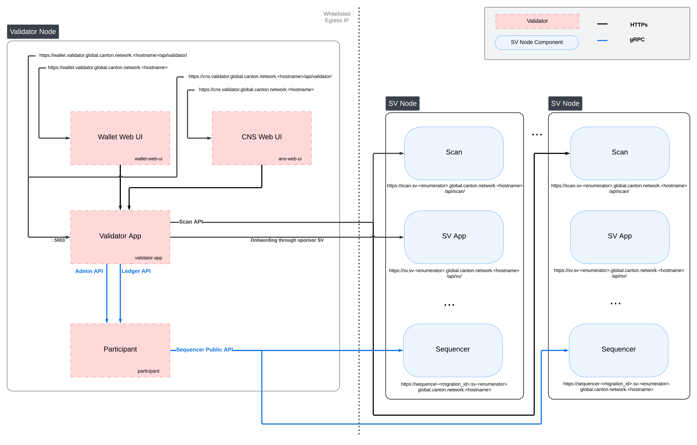

import CantonDocsGlobalSynchronizerDeploymentInstallationL22 from "/snippets/canton-docs/global-synchronizer_deployment_installation_L22.mdx";
import CantonDocsGlobalSynchronizerDeploymentInstallationL41 from "/snippets/canton-docs/global-synchronizer_deployment_installation_L41.mdx";
import CantonDocsGlobalSynchronizerDeploymentInstallationL47 from "/snippets/canton-docs/global-synchronizer_deployment_installation_L47.mdx";
import CantonDocsGlobalSynchronizerDeploymentInstallationL53 from "/snippets/canton-docs/global-synchronizer_deployment_installation_L53.mdx";
import CantonDocsGlobalSynchronizerDeploymentInstallationL66 from "/snippets/canton-docs/global-synchronizer_deployment_installation_L66.mdx";
import CantonDocsGlobalSynchronizerDeploymentInstallationL87 from "/snippets/canton-docs/global-synchronizer_deployment_installation_L87.mdx";
import CantonDocsGlobalSynchronizerDeploymentInstallationL95 from "/snippets/canton-docs/global-synchronizer_deployment_installation_L95.mdx";
import CantonDocsGlobalSynchronizerDeploymentInstallationL103 from "/snippets/canton-docs/global-synchronizer_deployment_installation_L103.mdx";
import CantonDocsGlobalSynchronizerDeploymentInstallationL128 from "/snippets/canton-docs/global-synchronizer_deployment_installation_L128.mdx";
import CantonDocsGlobalSynchronizerDeploymentInstallationL136 from "/snippets/canton-docs/global-synchronizer_deployment_installation_L136.mdx";
import CantonDocsGlobalSynchronizerDeploymentInstallationL144 from "/snippets/canton-docs/global-synchronizer_deployment_installation_L144.mdx";
import CantonDocsGlobalSynchronizerDeploymentInstallationL152 from "/snippets/canton-docs/global-synchronizer_deployment_installation_L152.mdx";
import CantonDocsGlobalSynchronizerDeploymentInstallationL162 from "/snippets/canton-docs/global-synchronizer_deployment_installation_L162.mdx";
import CantonDocsGlobalSynchronizerDeploymentInstallationL187 from "/snippets/canton-docs/global-synchronizer_deployment_installation_L187.mdx";
import CantonDocsGlobalSynchronizerDeploymentInstallationL203 from "/snippets/canton-docs/global-synchronizer_deployment_installation_L203.mdx";


This page walks through deploying a validator node on the Canton Network. Choose the tab matching your deployment method.

## Before you begin

Confirm that you have completed the [onboarding process](/docs-main/global-synchronizer/deployment/onboarding-process) and have the following ready:

- Your static egress IP is allowlisted
- You have an onboarding secret from your SV sponsor (or self-generated for DevNet)
- You know the sponsor SV URL
- You have the current migration ID (published at [sync.global/sv-network/](https://sync.global/sv-network/))
- You have chosen a party hint for your validator admin (format: `organization-function-enumerator`, for example `acmeCorp-validator-1`)

## Download the Splice node bundle

Both deployment methods start by downloading the release bundle from GitHub:

<CantonDocsGlobalSynchronizerDeploymentInstallationL22 />

The extracted bundle contains Docker Compose files, sample Helm values, and configuration templates.

<Tabs>

<Tab title="Docker Compose">

## Docker Compose installation

### 1. Navigate to the validator directory

<CantonDocsGlobalSynchronizerDeploymentInstallationL41 />

### 2. Set the image tag

<CantonDocsGlobalSynchronizerDeploymentInstallationL47 />

### 3. Start the validator

<CantonDocsGlobalSynchronizerDeploymentInstallationL53 />

The `-w` flag enables the Wallet UI. Add `-a` to enable authentication (recommended for anything beyond local testing).

On subsequent restarts, you can omit the `-o` flag since the onboarding secret is consumed on first use:

<CantonDocsGlobalSynchronizerDeploymentInstallationL66 />

### 4. Verify the deployment

After startup completes, access the web UIs:

| Service | URL |
|---|---|
| Wallet UI | http://wallet.localhost |
| CNS UI | http://ans.localhost |
| JSON Ledger API | http://json-ledger-api.localhost |
| gRPC Ledger API | http://grpc-ledger-api.localhost |

Check the logs for successful onboarding:

<CantonDocsGlobalSynchronizerDeploymentInstallationL87 />

Look for messages indicating the validator has connected to the synchronizer and completed onboarding.

### 5. Stop the validator

<CantonDocsGlobalSynchronizerDeploymentInstallationL95 />

### Systemd integration

For persistent deployments, create a systemd service. Set `RemainAfterExit=true` since `start.sh` runs Docker Compose in detached mode:

<CantonDocsGlobalSynchronizerDeploymentInstallationL103 />

</Tab>

<Tab title="Kubernetes">

## Kubernetes installation

### 1. Create the namespace

<CantonDocsGlobalSynchronizerDeploymentInstallationL128 />

### 2. Create Kubernetes secrets

**PostgreSQL password:**

<CantonDocsGlobalSynchronizerDeploymentInstallationL136 />

**Onboarding secret:**

<CantonDocsGlobalSynchronizerDeploymentInstallationL144 />

**Ledger API auth (if using authentication):**

<CantonDocsGlobalSynchronizerDeploymentInstallationL152 />

### 3. Configure Helm values

The Splice node bundle includes sample Helm values files. Copy and customize them for your environment. Key parameters to set:

<CantonDocsGlobalSynchronizerDeploymentInstallationL162 />

Refer to the sample values in the bundle for the full set of configurable parameters.

### 4. Install the Helm charts

<CantonDocsGlobalSynchronizerDeploymentInstallationL187 />

### 5. Configure ingress

Set up your ingress controller to route traffic to the validator services. The specific configuration depends on your ingress controller. At minimum, configure routes for:

- Wallet UI
- CNS UI
- Ledger API endpoints (if exposed externally)

### 6. Verify the deployment

<CantonDocsGlobalSynchronizerDeploymentInstallationL203 />

Confirm the validator has connected to the synchronizer and the Wallet UI is accessible through your ingress.

</Tab>

</Tabs>

## First startup verification checklist

After deploying with either method, verify:

- Validator logs show successful connection to the Global Synchronizer sequencer
- The onboarding process completed without errors
- The Wallet UI loads and displays your validator identity
- Your party hint appears correctly in the validator admin party
- Traffic auto-top-up is functioning (if configured)

<Warning>
If startup fails with connection errors, verify that your egress IP is allowlisted and that outbound HTTPS (port 443) is permitted to `*.sync.global` endpoints.
</Warning>

## Next steps

<CardGroup cols={2}>

<Card title="Configuration" icon="gear" href="/docs-main/global-synchronizer/deployment/configuration">
  Tune your validator's configuration.
</Card>

<Card title="Authorization Setup" icon="lock" href="/docs-main/global-synchronizer/deployment/authorization-setup">
  Configure authentication for production use.
</Card>

</CardGroup>

{/* COPIED_START source="splice:docs/src/validator_operator/validator_helm.rst" hash="f9985bc9" */}

<Warning title="Pre-reviewed Content - Do Not Modify">
This section was copied from existing reviewed documentation.
**Source:** `splice:docs/src/validator_operator/validator_helm.rst`
Reviewers: Skip this section. Remove markers after final approval.
</Warning>

# Kubernetes-Based Deployment of a Validator node

This section describes how to deploy a standalone validator node in Kubernetes using Helm charts. The Helm charts deploy a validator node along with associated wallet and CNS UIs, and connect it to a global synchronizer.

## Requirements

1)  A running Kubernetes cluster in which you have administrator access to create and manage namespaces.

2)  A development workstation with the following:

    > 1.  `kubectl` - At least v1.26.1
    > 2.  `helm` - At least v3.11.1

3)  Your cluster needs a static egress IP. After acquiring that, provide it to your SV sponsor who will propose adding it to the IP allowlist to the other SVs.

4)  Please download the release artifacts containing the sample Helm value files, from here: , and extract the bundle:

tar xzvf \_splice-node.tar.gz

TRUSTED_SCAN_URL
The scan URL of an SV that you trust and that is reachable by your validator, often your SV sponsor. This should be of the form , e.g., for the Global Synchronizer Foundation SV it is .

Additional parameters describing your own setup as opposed to the connection to the network are described below.

## Validator Network Diagram



## Preparing a Cluster for Installation

Create the application namespace within Kubernetes.

```bash
kubectl create ns validator
```

<Note>
The validator deployment assumes one validator per namespace. If you wish to run multiple validators in the same cluster, please create a separate namespace for each.
</Note>

## HTTP Proxy configuration

If you need to use an HTTP forward proxy for egress in your environment, you need to set `https.proxyHost` and `https.proxyPort` in `additionalJvmOptions` in the validator and participant helm charts to use the HTTP proxy for outgoing connections:

```yaml
additionalJvmOptions: |
  -Dhttps.proxyHost=your.proxy.host
  -Dhttps.proxyPort=your_proxy_port
```

Replace `your.proxy.host` and `your_proxy_port` with the actual host and port of your HTTP proxy. You can set `https.nonProxyHosts` as well to prevent proxying for particular addresses. Proxy authentication is currently not supported.

## Configuring PostgreSQL authentication

The PostgreSQL instance that the helm charts create, and all apps that depend on it, require the user's password to be set through Kubernetes secrets. Currently, all apps use the Postgres user `cnadmin`. The password can be setup with the following command, assuming you set the environment variable `POSTGRES_PASSWORD` to a secure value:

call out the option of using a managed postgres instance

```bash
kubectl create secret generic postgres-secrets \
    --from-literal=postgresPassword=${POSTGRES_PASSWORD} \
    -n validator
```

## Preparing for Validator Onboarding

Ensure that your validator onboarding secret `ONBOARDING_SECRET` is set in the namespace you created earlier.

```bash
kubectl create secret generic splice-app-validator-onboarding-validator \
    "--from-literal=secret=${ONBOARDING_SECRET}" \
    -n validator
```

## Configuring Authentication

For security, the various components that comprise your Validator node need to be able to authenticate themselves to each other, as well as be able to authenticate external UI and API users. We use JWT access tokens for authentication and expect these tokens to be issued by an (external) [OpenID Connect](https://openid.net/connect/) (OIDC) provider. You must:

1.  Set up an OIDC provider in such a way that both backends and web UI users are able to obtain JWTs in a supported form.
2.  Configure your backends to use that OIDC provider.

The validator supports non-authenticated deployments as well, but this is strongly discouraged for production deployments. If you wish to run without authentication, please refer to the notes in `helm-validator-no-auth`.

### OIDC Provider Requirements

This section provides pointers for setting up an OIDC provider for use with your Validator node. Feel free to skip directly to `helm-validator-auth0` if you plan to use [Auth0](https://auth0.com) for your Validator node's authentication needs.

These docs focus on Auth0, and are being continuously tested and maintained. Other OIDC providers can be used, and are in active use by various community members, who have contributed some notes and examples in Okta and Keycloak community authored examples \.

Your OIDC provider must be reachable[^1] at a well known (HTTPS) URL. In the following, we will refer to this URL as `OIDC_AUTHORITY_URL`. Both your Validator node and any users that wish to authenticate to a web UI connected to your Validator node must be able to reach the `OIDC_AUTHORITY_URL`. We require your OIDC provider to provide a [discovery document](https://openid.net/specs/openid-connect-discovery-1_0.html) at `OIDC_AUTHORITY_URL/.well-known/openid-configuration`. We furthermore require that your OIDC provider exposes a [JWK Set](https://datatracker.ietf.org/doc/html/rfc7517) document. In this documentation, we assume that this document is available at `OIDC_AUTHORITY_URL/.well-known/jwks.json`.

For machine-to-machine (Validator node component to Validator node component) authentication, your OIDC provider must support the [OAuth 2.0 Client Credentials Grant](https://tools.ietf.org/html/rfc6749#section-4.4) flow. This means that you must be able to configure (`CLIENT_ID`, `CLIENT_SECRET`) pairs for all Validator node components that need to authenticate themselves to other components. Currently, this is the validator app backend - which needs to authenticate to the Validator node's Canton participant. The `sub` field of JWTs issued through this flow must match the user ID configured as `ledger-api-user` in `helm-validator-auth-secrets-config`. In this documentation, we assume that the `sub` field of these JWTs is formed as `CLIENT_ID@clients`. If this is not true for your OIDC provider, pay extra attention when configuring `ledger-api-user` values below.

For user-facing authentication - allowing users to access the various web UIs hosted on your Validator node, your OIDC provider must support the [OAuth 2.0 Authorization Code Grant](https://datatracker.ietf.org/doc/html/rfc6749#section-4.1) flow and allow you to obtain client identifiers for the web UIs your Validator node will be hosting. Currently, these are the Wallet web UI and the CNS web UI. You might be required to whitelist a range of URLs on your OIDC provider, such as "Allowed Callback URLs", "Allowed Logout URLs", "Allowed Web Origins", and "Allowed Origins (CORS)". If you are using the ingress configuration of this runbook, the correct URLs to configure here are `https://wallet.validator.YOUR_HOSTNAME` (for the Wallet web UI) and `https://cns.validator.YOUR_HOSTNAME` (for the CNS web UI).

`YOUR_HOSTNAME` is a placeholder that you need to replace with the actual domain name or IP address of the server hosting your services.

An identifier that is unique to the user must be set via the `sub` field of the issued JWT. On some occasions, this identifier will be used as a user name for that user on your Validator node's Canton participant. In `helm-validator-install`, you will be required to configure a user identifier as the `validatorWalletUser` -make sure that whatever you configure there matches the contents of the `sub` field of JWTs issued for that user.

*All* JWTs issued for use with your Validator node:

- must be signed using the RS256 signing algorithm

In the future, your OIDC provider might additionally be required to issue JWTs with a `scope` explicitly set to `daml_ledger_api` (when requested to do so as part of the OAuth 2.0 authorization code flow).

Summing up, your OIDC provider setup must provide you with the following configuration values:

| Name                    | Value                                                                                   |
|-------------------------|-----------------------------------------------------------------------------------------|
| OIDC_AUTHORITY_URL      | The URL of your OIDC provider for obtaining the `openid-configuration` and `jwks.json`. |
| VALIDATOR_CLIENT_ID     | The client id of your OIDC provider for the validator app backend.                      |
| VALIDATOR_CLIENT_SECRET | The client secret of your OIDC provider for the validator app backend.                  |
| WALLET_UI_CLIENT_ID     | The client id of your OIDC provider for the wallet UI.                                  |
| CNS_UI_CLIENT_ID        | The client id of your OIDC provider for the CNS UI.                                     |

We are going to use these values, exported to environment variables named as per the `Name` column, in `helm-validator-auth-secrets-config` and `helm-validator-install`.

When first starting out, it is suggested to configure both JWT token audiences below to the same value: `https://canton.network.global`.

Once you can confirm that your setup is working correctly using this (simple) default, we recommend that you configure dedicated audience values that match your deployment and URLs. This is important for security to avoid tokens for your validators on one network be usable for your validators on another network. You can configure audiences of your choice for the participant ledger API and the validator backend API. We will refer to these using the following configuration values:

| Name                               | Value                                                                                |
|------------------------------------|--------------------------------------------------------------------------------------|
| OIDC_AUTHORITY_LEDGER_API_AUDIENCE | The audience for the participant ledger API. e.g. `https://ledger_api.example.com`   |
| OIDC_AUTHORITY_VALIDATOR_AUDIENCE  | The audience for the validator backend API. e.g. `https://validator.example.com/api` |

Your IAM may also require a scope to be specified when the validator backend requests a token for the ledger API. We will refer to that using the following configuration value:

| Name                            | Value                                              |
|---------------------------------|----------------------------------------------------|
| OIDC_AUTHORITY_LEDGER_API_SCOPE | The scope for the participant ledger API. Optional |

In case you are facing trouble with setting up your (non-Auth0) OIDC provider, it can be beneficial to skim the instructions in `helm-validator-auth0` as well, to check for functionality or configuration details that your OIDC provider setup might be missing.

### Configuring an Auth0 Tenant

To configure [Auth0](https://auth0.com) as your validator's OIDC provider, perform the following:

1.  Create an Auth0 tenant for your validator

2.  Create an Auth0 API that controls access to the ledger API:

    > 1.  Navigate to Applications \> APIs and click "Create API". Set name to `Daml Ledger API`, set identifier to `https://canton.network.global`. Alternatively, if you would like to configure your own audience, you can set the identifier here. e.g. `https://ledger_api.example.com`.
    > 2.  Under the Permissions tab in the new API, add a permission with scope `daml_ledger_api`, and a description of your choice.
    > 3.  On the Settings tab, scroll down to "Access Settings" and enable "Allow Offline Access", for automatic token refreshing.

3.  (Optional) If you want to configure a different audience to your APIs, you can do so by creating new Auth0 APIs with an identifier set to the audience of your choice. For example,

    > 1.  Create another API by setting name to `Validator App API`, set identifier for the Validator backend app e.g. `https://validator.example.com/api`.

4.  Create an Auth0 Application for the validator backend:

    > 1.  In Auth0, navigate to Applications -\> Applications, and click the "Create Application" button.
    > 2.  Name it `Validator app backend`, choose "Machine to Machine Applications", and click Create.
    > 3.  Choose the `Daml Ledger API` API you created in step 2 in the "Authorize Machine to Machine Application" dialog and click Authorize.

5.  Create an Auth0 Application for the wallet web UI.

    > 1.  In Auth0, navigate to Applications -\> Applications, and click the "Create Application" button.
    > 2.  Choose "Single Page Web Applications", call it `Wallet web UI`, and click Create.
    > 3.  Determine the URL for your validator's wallet UI. If you're using the ingress configuration of this runbook, that would be `https://wallet.validator.YOUR_HOSTNAME`.
    > 4.  In the Auth0 application settings, add the URL of the validator wallet to the following:
    >     - "Allowed Callback URLs"
    >     - "Allowed Logout URLs"
    >     - "Allowed Web Origins"
    >     - "Allowed Origins (CORS)"
    > 5.  Save your application settings.

6.  Create an Auth0 Application for the CNS web UI. Repeat all steps described in step 5, with following modifications:

    - In step b, use `CNS web UI` as the name of your application.
    - In steps c and d, use the URL for your validator's *CNS* UI. If you're using the ingress configuration of this runbook, that would be `https://cns.validator.YOUR_HOSTNAME`.

Please refer to Auth0's [own documentation on user management](https://auth0.com/docs/manage-users) for pointers on how to set up end-user accounts for the two web UI applications you created. Note that you will need to create at least one such user account for completing the steps in `helm-validator-install` - for being able to log in as your Validator node's administrator. You will be asked to obtain the user identifier for this user account. It can be found in the Auth0 interface under User Management -\> Users -\> your user's name -\> user_id (a field right under the user's name at the top).

We will use the environment variables listed in the table below to refer to aspects of your Auth0 configuration:

| Name                               | Value                                                                                      |
|------------------------------------|--------------------------------------------------------------------------------------------|
| OIDC_AUTHORITY_URL                 | `https://AUTH0_TENANT_NAME.us.auth0.com`                                                   |
| OIDC_AUTHORITY_LEDGER_API_AUDIENCE | The optional audience of your choice for Ledger API. e.g. `https://ledger_api.example.com` |
| VALIDATOR_CLIENT_ID                | The client id of the Auth0 app for the validator app backend                               |
| VALIDATOR_CLIENT_SECRET            | The client secret of the Auth0 app for the validator app backend                           |
| WALLET_UI_CLIENT_ID                | The client id of the Auth0 app for the wallet UI                                           |
| CNS_UI_CLIENT_ID                   | The client id of the Auth0 app for the CNS UI                                              |

The `AUTH0_TENANT_NAME` is the name of your Auth0 tenant as shown at the top left of your Auth0 project. You can obtain the client ID and secret of each Auth0 app from the settings pages of that app.

### Configuring Authentication on your Validator

We are now going to configure your Validator node software based on the OIDC provider configuration values you exported to environment variables at the end of either `helm-validator-auth-requirements` or `helm-validator-auth0`. (Note that some authentication-related configuration steps are also included in `helm-validator-install`)

The validator app backend requires the following secret (omit the scope if it is not needed in your setup)

```bash
kubectl create --namespace validator secret generic splice-app-validator-ledger-api-auth \
    "--from-literal=ledger-api-user=${VALIDATOR_CLIENT_ID}@clients" \
    "--from-literal=url=${OIDC_AUTHORITY_URL}/.well-known/openid-configuration" \
    "--from-literal=client-id=${VALIDATOR_CLIENT_ID}" \
    "--from-literal=client-secret=${VALIDATOR_CLIENT_SECRET}" \
    "--from-literal=audience=${OIDC_AUTHORITY_LEDGER_API_AUDIENCE}" \
    "--from-literal=scope=${OIDC_AUTHORITY_LEDGER_API_SCOPE}"
```

To setup the wallet and CNS UI, create the following two secrets.

```bash
kubectl create --namespace validator secret generic splice-app-wallet-ui-auth \
    "--from-literal=url=${OIDC_AUTHORITY_URL}" \
    "--from-literal=client-id=${WALLET_UI_CLIENT_ID}"

kubectl create --namespace validator secret generic splice-app-cns-ui-auth \
    "--from-literal=url=${OIDC_AUTHORITY_URL}" \
    "--from-literal=client-id=${CNS_UI_CLIENT_ID}"
```

### Running without Authentication

<Warning>
Running without authentication is highly insecure. Anyone with access to the wallet UI, or to the validator in any other way, may log in to your wallet as a user of their choice, or otherwise transact on-ledger on your behalf. For any production use, you should configure proper authentication as described in the sections above.
</Warning>

In order to run the validator without authentication, add `disableAuth: true` to both `splice-node/examples/sv-helm/validator-values.yaml` and `splice-node/examples/sv-helm/participant-values.yaml`. Note that you must disable auth in both places, otherwise the validator will not be able to connect to the participant.

When running without authentication, the username of the validator administrator is `administrator`.

## Installing the Software

### Configuring the Helm Charts

To install the Helm charts needed to start a Validator node connected to the cluster, you will need to meet a few preconditions. The first is that there needs to be an environment variable defined to refer to the version of the Helm charts necessary to connect to this environment:

Please modify the file `splice-node/examples/sv-helm/participant-values.yaml` as follows:

- Replace `OIDC_AUTHORITY_LEDGER_API_AUDIENCE` in the `auth.targetAudience` entry with audience for the ledger API. e.g. `https://ledger_api.example.com`. If you are not ready to use a custom audience, you can use the suggested default `https://canton.network.global`.
- Update the `auth.jwksUrl` entry to point to your auth provider's JWK set document by replacing `OIDC_AUTHORITY_URL` with your auth provider's OIDC URL, as explained above.
- If you are running on a version of Kubernetes earlier than 1.24, set `enableHealthProbes` to `false` to disable the gRPC liveness and readiness probes.

If you are using the provided postgres helm chart, modify `splice-node/examples/sv-helm/postgres-values-validator-participant.yaml` as follows:

- Add `db.volumeSize` and `db.volumeStorageClass` to the values file adjust persistant storage size and storage class if necessary. (These values default to 20GiB and `standard-rwo`)

Additionally, please modify the file `splice-node/examples/sv-helm/standalone-participant-values.yaml` as follows:

- Replace `MIGRATION_ID` with the migration ID of the global synchronizer on the network you are connecting to (devnet/testnet/mainnet).

To configure the validator app, please modify the file `splice-node/examples/sv-helm/validator-values.yaml` as follows:

- Replace `TRUSTED_SCAN_URL` with a URL of a Scan you host or trust that is reachable by your Validator. For example, the GSF scan URL, (This Scan instance will be used for obtaining additional Scan URLs for BFT Scan reads.)
- If you want to configure the audience for the Validator app backend API, replace `OIDC_AUTHORITY_VALIDATOR_AUDIENCE` in the `auth.audience` entry with audience for the Validator app backend API. e.g. `https://validator.example.com/api`.
- If you want to configure the audience for the Ledger API, set the `audience` field in the `splice-app-validator-ledger-api-auth` k8s secret with the audience for the Ledger API. e.g. `https://ledger_api.example.com`.
- Replace `OPERATOR_WALLET_USER_ID` with the user ID in your IAM that you want to use to log into the wallet as the validator operator party. Note that this should be the full user id, e.g., `auth0|43b68e1e4978b000cefba352`, *not* only the suffix `43b68e1e4978b000cefba352`
- Replace `YOUR_CONTACT_POINT` by a slack user name or email address that can be used by node operators to contact you in case there are issues with your node. Note that this contact information will be publicly visible. If you do not want to share contact information, you can put an empty string.
- Update the `auth.jwksUrl` entry to point to your auth provider's JWK set document by replacing `OIDC_AUTHORITY_URL` with your auth provider's OIDC URL, as explained above.

If you want to only connect to a single trusted scan at `TRUSTED_SCAN_URL` but not obtain additional Scan URLs for BFT Scan reads, you can uncomment the following and set `nonSvValidatorTrustSingleScan` to `true`. This does mean that you depend on that single SV and if it is broken or malicious you will be unable to use the network so usually you want to default to not enabling this.

```yaml
-- Code from: ../../../apps/app/src/pack/examples/sv-helm/validator-values.yaml
-- [Include actual code example here]
```

If you want to connect to the decentralized synchronizer via only a single trusted sequencer, you can uncomment the following and set `useSequencerConnectionsFromScan` to `false`. Also replace `TRUSTED_SYNCHRONIZER_SEQUENCER_URL` with the publicly accessible URL of the trusted sequencer, e.g., for the sequencer operated by the GSF. This does mean that you depend on that single SV and if it is broken or malicious you will be unable to use the network so usually you want to default to not enabling this.

```yaml
-- Code from: ../../../apps/app/src/pack/examples/sv-helm/validator-values.yaml
-- [Include actual code example here]
```

Additionally, please modify the file `splice-node/examples/sv-helm/standalone-validator-values.yaml` as follows:

- Replace `MIGRATION_ID` with the migration ID of the global synchronizer on the network you are connecting to.
- Replace `SPONSOR_SV_URL` with the URL of the SV that provided you your secret.
- Replace `YOUR_VALIDATOR_PARTY_HINT` with the desired name for your validator operator party. It must be of the format `<organization>-<function>-<enumerator>`.
- Replace `YOUR_VALIDATOR_NODE_NAME` with the name you want your validator node to be represented as on the network. Usually you can use the same value as for your `validatorPartyHint`.

If you are redeploying the validator app as part of a synchronizer migration, you will also need to set `migrating` to `true` in your `standalone-validator-values.yaml`:

```yaml
-- Code from: ../../../apps/app/src/pack/examples/sv-helm/standalone-validator-values.yaml
-- [Include actual code example here]
```

Finally, please download the UI config values file from [https://github.com/global-synchronizer-foundation/configs/blob/main/configs/ui-config-values.yaml](https://github.com/global-synchronizer-foundation/configs/blob/main/configs/ui-config-values.yaml) and add the values from it to your `standalone-validator-values.yaml`.

### Installing the Helm Charts

With these files in place, you can execute the following helm commands in sequence. It's generally a good idea to wait until each deployment reaches a stable state prior to moving on to the next step.

helm install postgres /splice-postgres -n validator --version \${CHART_VERSION} -f splice-node/examples/sv-helm/postgres-values-validator-participant.yaml --wait helm install participant /splice-participant -n validator --version \${CHART_VERSION} -f splice-node/examples/sv-helm/participant-values.yaml -f splice-node/examples/sv-helm/standalone-participant-values.yaml --wait helm install validator /splice-validator -n validator --version \${CHART_VERSION} -f splice-node/examples/sv-helm/validator-values.yaml -f splice-node/examples/sv-helm/standalone-validator-values.yaml --wait

Once this is running, you should be able to inspect the state of the cluster and observe pods running in the new namespace. A typical query might look as follows:

```bash
$ kubectl get pods -n validator
NAMESPACE         NAME                                  READY   STATUS             RESTARTS        AGE
validator         ans-web-ui-5bf489db78-bdn2j           1/1     Running            0               24m
validator         participant-8988dfb54-m9655           1/1     Running            0               26m
validator         postgres-0                            1/1     Running            0               37m
validator         validator-app-f8c74d5dd-zf9j4         1/1     Running            0               24m
validator         wallet-web-ui-69d85cdb99-fnj7q        1/1     Running            0               24m
```

Note also that `Pod` restarts may happen during bringup, particularly if all helm charts are deployed at the same time. For example, the `participant` cannot start until `postgres` is running.

## Configuring the Cluster Ingress

The following routes should be configured in your cluster ingress controller.

| Services                     | Port | Routes                                                                                                                                                                     |
|------------------------------|------|----------------------------------------------------------------------------------------------------------------------------------------------------------------------------|
| `wallet-web-ui`              |      | https://wallet.validator.                                                                                                                                 |
| `validator-app` `ans-web-ui` | 5003 | `https://wallet.validator.&lt;YOUR_HOSTNAME&gt;/api/validator` https://cns.validator.                                                                           |
| `validator-app`              | 5003 | `https://cns.validator.&lt;YOUR_HOSTNAME&gt;/api/validator`                                                                                                                      |
| `participant`                | 7575 | `https://&lt;YOUR_HOSTNAME&gt;/api/json-api` (optional, not required by the validator itself but if you want to access the ledger API yourself. You can change the route freely) |

- https://wallet.validator. should be routed to service `wallet-web-ui` in the `validator` namespace
- `https://wallet.validator.&lt;YOUR_HOSTNAME&gt;/api/validator` should be routed to `/api/validator` at port 5003 of service `validator-app` in the `validator` namespace
- https://cns.validator. should be routed to service `ans-web-ui` in the `validator` namespace
- `https://cns.validator.&lt;YOUR_HOSTNAME&gt;/api/validator` should be routed to `/api/validator` at port 5003 of service `validator-app` in the `validator` namespace

<Warning>
To keep the attack surface on your validator deployment small, please disallow ingress connections to all other services in your validator deployment. It should be assumed that opening up *any* additional port or service represents a security risk that needs to be carefully evaluated on a case-by-case basis. In addition, it is recommended to restrict access to above services to a limited number of explicitly trusted IP address ranges.
</Warning>

Internet ingress configuration is often specific to the network configuration and scenario of the cluster being configured. To illustrate the basic requirements of a Validator node ingress, we have provided a Helm chart that configures ingress according to the routes above using Istio, as detailed in the sections below.

### Requirements

In order to install the reference charts, the following must be satisfied in your cluster:

- *cert-manager* must be available in the cluster (See [cert-manager documentation](https://cert-manager.io/docs/installation/helm/))
- *istio* should be installed in the cluster (See [istio documentation](https://istio.io/latest/docs/setup/))

*Note that their deployments are often platform-dependent and good documentations on how to set them up can be found online.*

**Example of Istio installation:**

```bash
helm repo add istio https://istio-release.storage.googleapis.com/charts
helm repo update
helm install istio-base istio/base -n istio-system --set defaults.global.istioNamespace=cluster-ingress --wait
helm install istiod istio/istiod -n cluster-ingress --set global.istioNamespace="cluster-ingress" --set meshConfig.accessLogFile="/dev/stdout"  --wait
```

### Installation Instructions

Create a `cluster-ingress` namespace:

```bash
kubectl create ns cluster-ingress
```

Ensure that there is a cert-manager certificate available in a secret named `cn-net-tls`. An example of a suitable certificate definition:

```yaml
apiVersion: cert-manager.io/v1
kind: Certificate
metadata:
   name: cn-certificate
   namespace: cluster-ingress
spec:
    dnsNames:
    - '*.validator.YOUR_HOSTNAME'
    issuerRef:
        name: letsencrypt-production
    secretName: cn-net-tls
```

Create a file named `istio-gateway-values.yaml` with the following content (Tip: on GCP you can get the cluster IP from `gcloud compute addresses list`):

```yaml
service:
    loadBalancerIP: "YOUR_CLUSTER_IP"
    loadBalancerSourceRanges:
        - "35.194.81.56/32"
        - "35.198.147.95/32"
        - "35.189.40.124/32"
        - "34.132.91.75/32"
```

And install it to your cluster:

```bash
helm install istio-ingress istio/gateway -n cluster-ingress -f istio-gateway-values.yaml
```

Create an Istio Gateway resource in the `cluster-ingress` namespace. Save the following to a file named `gateway.yaml`, and replace `YOUR_HOSTNAME` with the actual hostname you want to use for your validator node (and has a DNS record pointing to the cluster IP you configured above):

```yaml
apiVersion: networking.istio.io/v1alpha3
kind: Gateway
metadata:
  name: cn-http-gateway
  namespace: cluster-ingress
spec:
  selector:
    app: istio-ingress
    istio: ingress
  servers:
  - port:
      number: 443
      name: https
      protocol: HTTPS
    tls:
      mode: SIMPLE
      credentialName: cn-net-tls # name of the secret created above
    hosts:
    - "*.YOUR_HOSTNAME"
    - "YOUR_HOSTNAME"
  - port:
      number: 80
      name: http
      protocol: HTTP
    tls:
      httpsRedirect: true
    hosts:
    - "*.YOUR_HOSTNAME"
    - "YOUR_HOSTNAME"
```

And apply it to your cluster:

```bash
kubectl apply -f gateway.yaml -n cluster-ingress
```

This gateway terminates tls using the secret that you configured above, and exposes raw http traffic in its outbound port 443. Istio VirtualServices can now be created to route traffic from there to the required pods within the cluster. A reference Helm chart is provided for that, which can be installed after

1.  replacing `YOUR_HOSTNAME` in `splice-node/examples/sv-helm/validator-cluster-ingress-values.yaml` and
2.  setting `nameServiceDomain` in the same file to `"cns"`

using:

helm install cluster-ingress-validator /splice-cluster-ingress-runbook -n validator --version \${CHART_VERSION} -f splice-node/examples/sv-helm/validator-cluster-ingress-values.yaml

## Logging into the wallet UI

After you deploy your ingress, open your browser at [https://wallet.validator.YOUR_HOSTNAME](https://wallet.validator.YOUR_HOSTNAME) and login using the credentials for the user that you configured as `validatorWalletUser` earlier. Once logged in one should see the transactions page.


explain the config sections below in a way that makes them also accessible to the Docker compose users

## Configuring automatic traffic purchases

By default your node will be configured to automatically purchase traffic on a pay-as-you-go basis (see automatically purchase traffic). To disable or tune to your needs, edit the following section in the validator-values.yaml file:

```yaml
-- Code from: ../../../apps/app/src/pack/examples/sv-helm/standalone-validator-values.yaml
-- [Include actual code example here]
```

\* show error message that people will see while the traffic purchase fails due to insufficient funds; it is currentlye here: `error-insufficient-funds` \* link to the option to disable automatic top-ups, and call out the option of using third-party traffic providers

## Configuring sweeps and auto-accepts of transfer offers

You can optionally configure the validator to automatically create transfer offers to other parties on the network whenever the balance of certain parties that it hosts exceeds a certain threshold. To do so, uncomment and fill in the following section in the `validator-values.yaml` file:

```yaml
-- Code from: ../../../apps/app/src/pack/examples/sv-helm/validator-values.yaml
-- [Include actual code example here]
```

Whenever the balance of \ exceeds `maxBalanceUSD`, the validator will automatically create a transfer offer to \, for an amount that leaves `minBalanceUSD` in the sender's wallet. Note that you will need to know the party IDs of both the sender and receiver, which can be copied from the wallet UIs of the respective users (in the top right corner). This therefore needs to be applied to the Helm chart in a second step after the initial deployment, once the party IDs are known.

Similarly, you can configure the validator to automatically accept transfer offers from certain parties on the network. To do so, uncomment and fill in the following section in the `validator-values.yaml` file:

```yaml
-- Code from: ../../../apps/app/src/pack/examples/sv-helm/validator-values.yaml
-- [Include actual code example here]
```

Whenever the validator receives a transfer offer from \ to \, it will automatically accept it. Similarly to sweeps, party IDs must be known in order to apply this configuration.

## Logging into the CNS UI

You can open your browser at [https://cns.validator.YOUR_HOSTNAME](https://cns.validator.YOUR_HOSTNAME) and login using the credentials for the user that you configured as `validatorWalletUser` earlier. You will be able to register a name on the Canton Name Service.


## Participant Pruning

By default, participants preserve all history (it is not preserved across major upgrades though). However, this leads to gradually growing databases and can slow down certain queries, in particular, queries for the active contract set on the ledger API.

To mitigate that, it is possible to enable participant pruning which will remove all history beyond a specified retention point and only preserve the active contract set.

Note that this only affects the participant stores. The CN apps (Validator, SV and Scan) are unaffected by enabling this, so e.g., the history in your wallet will never be pruned.

Below you can see an example of the pruning config that you need to add to `validator-values.yaml` to retain only the history for the last 48h.

Note that if your node is down for longer than the pruning window (48 hours in the example above), your node will most probably get corrupted, as the apps race catching up with the participant's attempts to keep pruning. It is therefore advisable to set the pruning window to a value that you are comfortable with in terms of guaranteeing uptime of your node. Setting it to 30 days is in general a reasonable choice, as the sequencers currently are also pruned after 30 days, so you will not be able to catch up with the network after a longer downtime anyway (see Disaster Recovery for disaster recovery guidelines).

Refer to the Canton documentation for more details on participant pruning:

- `https://docs.daml.com/ops/pruning.html`
- `https://docs.daml.com/canton/usermanual/pruning.html`

```yaml
-- Code from: ../../../apps/app/src/pack/examples/sv-helm/validator-values.yaml
-- [Include actual code example here]
```

## Configuring init containers

If you need to configure init containers on the participant or validator deployments, you can use the following helm values for `splice-participant` or `splice-validator`:

```yaml
# if you want to disable the default postgres init container:
persistence:
  enablePgInitContainer: false

# if you want additional init containers:
extraInitContainers:
  - name: my-extra-container
    image: busybox
    command: [ "sh", "-c", "echo 'example extra container'" ]
```

## Working around volume ownership issues

The containers in the `splice-validator` chart run as non-root users (specifically, user:group 1001:1001) for security reasons. The pod mounts volumes for use by the containers, and these volumes need to be owned by the user that the containers run as. The Helm chart uses an `fsGroup` [security context](https://kubernetes.io/docs/tasks/configure-pod-container/security-context/) to ensure that the mounted volumes are owned by the correct user. In certain environments, however, this does not work as expected and the mounted volumes are owned by root. If you encounter this issue, you can work around it by creating init containers that change the ownership of the mounted volumes to the correct user.

For example, for the `/domain-upgrade-dump` volume (required for synchronizer upgrades), you can add the following to your `validator-values.yaml` file:

```yaml
extraInitContainers:
    - name: chown-domain-upgrade-dump
      image: busybox:1.37.0
      command: ["sh", "-c", "chown -R 1001:1001 /domain-upgrade-dump"]
      volumeMounts:
        - name: domain-upgrade-dump-volume
          mountPath: /domain-upgrade-dump
```

A similar workaround will be required for mounting a usable `/participant-bootstrapping-dump` (required when recovering from identities backup).

[^1]: The URL must be reachable from the Canton participant and validator app running in your cluster, as well as from all web browsers that should be able to interact with the wallet and CNS UIs.

{/* COPIED_END */}


{/* COPIED_START source="splice:docs/src/validator_operator/validator_compose.rst" hash="3481a1d6" */}

<Warning title="Pre-reviewed Content - Do Not Modify">
This section was copied from existing reviewed documentation.
**Source:** `splice:docs/src/validator_operator/validator_compose.rst`
Reviewers: Skip this section. Remove markers after final approval.
</Warning>

# Docker Compose-Based Deployment of a Validator Node

This section describes how to deploy a standalone validator node on a VM or a local machine using [Docker Compose](https://docs.docker.com/compose/). The deployment consists of the validator node along with associated wallet and CNS UIs, and onboards the validator node to the target network.

This deployment is useful for:

- Application development, where one needs an ephemeral validator that is easy to deploy.
- Production validators, with the following caveats:
  - The default deployment is highly insecure. Authentication should be enabled as described in the authentication section.
  - There is no support for ingress from outside your machine, nor is there support for TLS. The deployment should be kept local to your machine only and not exposed externally.
  - Reliability & scalability: docker-compose will restart containers that crash, and the deployment supports backup&restore as detailed below, but a docker-compose deployment is inherently more limited than a cloud-based Kubernetes one.
  - Monitoring: The deployment, as opposed to a Kubernetes-based one, does not include monitoring.
  - For production settings, you should aim to keep your validator up and running constantly, in order to avoid losing out on rewards, and avoid issues with catching up on ledger state after significant downtime.

## Requirements

1)  A linux/MacOS machine with the following:

    1.  [docker compose](https://docs.docker.com/compose/install/) - at least version 2.26.0 or newer
    2.  [curl](https://curl.se/)
    3.  [jq](https://jqlang.org/)

    Note that both AMD64 and ARM64 architectures are supported.

To validate that the dependencies are set up correctly, run the following commands. All commands should succeed and print out the version. Note that the exact versions you see may be different from the example here. As long as you have docker-compose 2.26.0 or newer you should be fine.

```bash
> docker compose version
Docker Compose version 2.32.1
> curl --version
curl 8.11.0 (x86_64-pc-linux-gnu) libcurl/8.11.0 OpenSSL/3.3.2 zlib/1.3.1 brotli/1.1.0 zstd/1.5.6 libidn2/2.3.7 libpsl/0.21.5 libssh2/1.11.1 nghttp2/1.64.0
Release-Date: 2024-11-06
Protocols: dict file ftp ftps gopher gophers http https imap imaps ipfs ipns mqtt pop3 pop3s rtsp scp sftp smb smbs smtp smtps telnet tftp
Features: alt-svc AsynchDNS brotli GSS-API HSTS HTTP2 HTTPS-proxy IDN IPv6 Kerberos Largefile libz NTLM PSL SPNEGO SSL threadsafe TLS-SRP UnixSockets zstd
> jq --version
jq-1.7.1
```

2)  Your machine should either be connected to a VPN that is whitelisted on the network (contact your sponsor SV to obtain access), or have a static egress IP address. In the latter case, please provide that IP address to your sponsor SV to add it to the firewall rules.
3)  Please download the release artifacts containing the docker-compose files, from here: , and extract the bundle:

tar xzvf \_splice-node.tar.gz

Additional parameters describing your own setup as opposed to the connection to the network are described below.

### HTTP Proxy configuration

If you need to use an HTTP forward proxy for egress in your environment, you need to set `https.proxyHost` and `https.proxyPort` in `JAVA_TOOL_OPTIONS` in `splice-node/docker-compose/validator/compose.yaml` to use the HTTP proxy for outgoing connections. You need to do this for both the validator and the participant services:

```yaml
services:
  validator:
    environment:
      JAVA_TOOL_OPTIONS: >-
        -Dhttps.proxyHost=your.proxy.host
        -Dhttps.proxyPort=your_proxy_port
```

```yaml
services:
  participant:
    environment:
      JAVA_TOOL_OPTIONS: >-
        -Dhttps.proxyHost=your.proxy.host
        -Dhttps.proxyPort=your_proxy_port
```

Replace `your.proxy.host` and `your_proxy_port` with the actual host and port of your HTTP proxy. You can set `https.nonProxyHosts` as well to prevent proxying for particular addresses. Proxy authentication is currently not supported.

## Deployment

1)  Change to the `docker-compose` directory inside the extracted bundle:

```bash
cd splice-node/docker-compose/validator
```

2)  Export the current version to an environment variable:
3)  Run the following command to start the validator node, and wait for it to become ready (could take a few minutes):

> ```bash
> ./start.sh -s "&lt;SPONSOR_SV_URL&gt;" -o "&lt;ONBOARDING_SECRET&gt;" -p "&lt;party_hint&gt;" -m "&lt;MIGRATION_ID&gt;" -w
> ```text
>
> Where:
>
> `&lt;party_hint&gt;` will be used as the prefix of the Party ID of your validator's administrator.
> This must be of format `\<organization\>-\<function\>-\<enumerator\>`, e.g. `myCompany-myWallet-1`. It cannot be changed over time as it is part of the validator operator party ID.

Note that the validator may be stopped with the command `./stop.sh` and restarted again with the same `start.sh` command as above. Its data will be retained between invocations. In subseqent invocations, the secret itself may be left empty, but the `-o` is still mandatory, so a `-o ""` argument should be provided.

## Logging into the wallet UI

<Note>
Docker Compose-based validator deployments use `.localhost` subdomains for addressing, such as `wallet.localhost`. `.localhost` URLs reportedly do not work on some browsers. If you encounter issues please try using a different browser such as Firefox or Chrome. If you're encountering issues with reaching APIs from a custom program or script, you may need to set the `HOST` header on HTTP requests explicitly to the target `.localhost` address.
</Note>

The wallet UI is accessible at [http://wallet.localhost](http://wallet.localhost) in your browser. The validator administrator's username is `administrator`. Insert that name into the username field and click `Log in`, and you should see the wallet of the administrator of your wallet.

You can also logout of the administrator account and login as any other username. The first time a user logs in, they will be prompted with a message asking them to confirm whether they wish to be onboarded to the validator node.

link to section that explains what this onbarding means

## Logging into the CNS UI

You can open your browser at [http://ans.localhost](http://ans.localhost) (note that this is currently by default `ans` and not `cns`), and login using the same administrator user, or any other user that has been onboarded via the wallet, in order to purchase a CNS entry for that user.

### Accessing the Canton Participant APIs

The [JSON Ledger API](https://docs.digitalasset.com/build/3.4/tutorials/json-api/canton_and_the_json_ledger_api.html) is exposed under `json-ledger-api.localhost:80`. Note that for some clients you may explicitly need to set the `Host: json-ledger-api.localhost` header for this to get resolved correctly.

The [gRPC Ledger API](https://docs.digitalasset.com/build/3.4/explanations/ledger-api-services.html) is exposed under `grpc-ledger-api.localhost:80`. Note that for some clients you may explicitly need to set the `:authority: json-ledger-api.localhost` pseudo-header for this to get resolved correctly.

The Canton Admin API is not exposed by default as it does not yet support auth. There is a commented out section in `nginx.conf` that you can enable to expose it if you ensure that it is not exposed publicly, e.g., through network restrictions.

## Configuring Authentication

<Warning>
The default deployment uses highly insecure self-signed tokens. Anyone with access to the wallet UI (or the machine and/or its network interface) may log in to your wallet as a user of their choice. For any production use, you should configure proper authentication as described in this section.
</Warning>

Please refer to the authentication section for instructions on how to set up an OAuth provider for your validator. The URLs to configure for callbacks are `http://wallet.localhost` and `http://ans.localhost`.

Once you have set up your OAuth provider, you need to configure it by setting the following environment variables in the `.env` file:

| Name                         | Value                                                                                                                                                                                                        |
|------------------------------|--------------------------------------------------------------------------------------------------------------------------------------------------------------------------------------------------------------|
| AUTH_URL                     | The URL of your OIDC provider for obtaining the `openid-configuration` and `jwks.json`.                                                                                                                      |
| AUTH_JWKS_URL                | The URL of your OIDC provider for obtaining the `jwks.json`, will typically be `${AUTH_URL}/.well-known/jwks.json`.                                                                                          |
| AUTH_WELLKNOWN_URL           | The URL of your OIDC provider for obtaining the `openid-configuration`, will typically be `${AUTH_URL}/.well-known/openid-configuration`.                                                                    |
| LEDGER_API_AUTH_AUDIENCE     | The audience for the participant ledger API. e.g. `https://ledger_api.example.com`. This will set the `ledger-api.auth-services.target-audience` configuration for the participant.                          |
| LEDGER_API_AUTH_SCOPE        | The scope for the participant ledger API. This will set the participant's `ledger-api.auth-services.target-scope` configuration. Optional                                                                    |
| VALIDATOR_AUTH_AUDIENCE      | The audience for the validator backend API. e.g. `https://validator.example.com`.                                                                                                                            |
| VALIDATOR_AUTH_CLIENT_ID     | The client id of the OAuth app for the validator app backend.                                                                                                                                                |
| VALIDATOR_AUTH_CLIENT_SECRET | The client secret of the OAuth app for the validator app backend.                                                                                                                                            |
| LEDGER_API_ADMIN_USER        | Should match the `sub` field of JWTs issued for the validator app. For some auth providers, this would be formed as `CLIENT_ID@clients`.                                        |
| WALLET_ADMIN_USER            | The user ID of the user which should login as the wallet administrator. Note that this should be the full user id, e.g., `auth0|43b68e1e4978b000cefba352`, *not* only the suffix `43b68e1e4978b000cefba352`. |
| WALLET_UI_CLIENT_ID          | The client id of the OAuth app for the wallet UI.                                                                                                                                                            |
| ANS_UI_CLIENT_ID             | The client id of the OAuth app for the CNS UI.                                                                                                                                                               |
| CONTACT_POINT                | The contact point for your validator node that can be used by other node operators to reach out to you if needed (slack username or an email address). Optional                                              |

In order to enable auth in the deployment, add the `-a` flag to the `start.sh` command, as follows:

```bash
./start.sh -s "&lt;SPONSOR_SV_URL&gt;" -o "&lt;ONBOARDING_SECRET&gt;" -p "&lt;party_hint&gt;" -m "&lt;MIGRATION_ID&gt;" -w -a
```

If you have already deployed a non-authenticated validator on your machine, you can migrate it to an authenticated one by stopping the validator with `./stop.sh` and restarting it with the `-a` flag as above. The validator operator user will be automatically migrated, and the user indicated by the `WALLET_ADMIN_USER` variable will be associated with the validator operator party. If you have also onboarded other users onto your validator, those will not be automatically migrated, and you need to manually associate the OAuth users with their corresponding parties. In order to do that, first take note of the party IDs of all relevant users (do this before stopping the unauthenticated validator), e.g. by copying them from the top-right corner of their wallet UIs. Now for every user that you wish to migrate, follow the instructions for associating a user with a party in the Users, Parties and Wallets in the Splice Wallet section, but replace the admin party ID with the party ID which you wish to associate with each user.

## Configuring Automatic Traffic Purchases

Your node is configured to automatically purchase traffic on a pay-as-you-go basis (see automatically purchase traffic). To tune to your needs, you can set environment variables, for example:

```bash
export TARGET_TRAFFIC_THROUGHPUT=20000 # target throughput in bytes/second
export MIN_TRAFFIC_TOPUP_INTERVAL="1m" # minimum interval between top-ups
```

## Integration with systemd and other init systems

If you want to manage the validator through systemd or a similar init system, create a service that calls the `start.sh` script with the right arguments. However, note that `start.sh` invokes `docker compose up` with the `-d/--detach` option so the script exits after the containers are up instead of continuing running.

You need to make sure that your service does not stop docker compose at that point. To accomplish this with systemd set `RemainAfterExit=true`. Refer to the [systemd documentation](https://www.freedesktop.org/software/systemd/man/latest/systemd.service.html) for more details. If you are using another init system, look for similar options to ensure that docker compose continues running after the script exits.

Alternatively, you can edit the script to remove the `-d` option so the script continues running.

{/* COPIED_END */}


{/* COPIED_START source="splice:docs/src/validator_operator/validator_onboarding.rst" hash="a1a3ab0c" */}

<Warning title="Pre-reviewed Content - Do Not Modify">
This section was copied from existing reviewed documentation.
**Source:** `splice:docs/src/validator_operator/validator_onboarding.rst`
Reviewers: Skip this section. Remove markers after final approval.
</Warning>

# Validator Onboarding Process

## Networks

There are three different networks: DevNet, TestNet and MainNet. If you are only interested in setting up a validator node, you can set up a node on DevNet for practice, then jump to MainNet. If you’d like to build, test, or deploy an app, we recommend that you run a node on DevNet, TestNet, and MainNet.

DevNet
DevNet is open to any node but still requires the validator’s egress IP to be added to the allowlist maintained by the SV node operators. It gets reset every 3 months. DevNet always gets upgraded to new versions before TestNet and MainNet, so it is a good way to test upgrades of your node and their impact on your apps before they reach MainNet.

TestNet
Joining TestNet requires that you have been approved to join MainNet by the Tokenomics Committee of the Global Synchronizer Foundation. You can initiate a request to do so through [https://sync.global/validator-request/](https://sync.global/validator-request/). Just like for DevNet, is also still requires your validator’s egress IP to be added to the allowlist and it requires an onboarding secret from your SV sponsor. Just like DevNet, TestNet gets reset every 3-6 months, but the reset schedule is shifted so TestNet never gets reset at the same time as DevNet. TestNet upgrades to new versions after DevNet, but before MainNet so it provides an additional layer of testing. Application providers are encouraged to maintain long-running instances of their app on TestNet, which allows using TestNet to test composed applications.

MainNet
MainNet requires everything TestNet requires, so approval by the Tokenomics committee, an IP on the allowlist, and an onboarding secret from your SV sponsor. MainNet never gets reset and is therefore the only network where data is always preserved. MainNet gets upgraded to new versions after DevNet and TestNet.

## Onboarding Process Overview

Onboarding a Validator involves the following steps (for each network you want to join).

1.  Provide your sponsoring SV with the egress IP for your Validator node. Only one IP may be provided per network, and this IP must be distinct from the IP you use for any other of the three networks.

<Note>
At this point this can also be accomplished by connecting your validator through a VPN run by an SV This can be useful when trying to run a validator from a local laptop. This option may be removed in the future.
</Note>

2.  Wait for super validators to adopt the new IP allowlist. This usually takes between 2-7 days.

3.  If you want to access the Canton Coin Scan Web UI from your laptop, you also need to ensure that you can connect to a VPN operated by one of the SVs. This is required as laptops usually do not have static IP addresses and the Scan web UI is not (yet) fully public. If you can use your validator egress IP also for browsing the web UI this is not necessary.

4.  Request an onboarding secret from your SV sponsor. On DevNet, you can do this yourself through an API call (refer to Deployment instructions for details). On TestNet and MainNet your SV sponsor needs to provide you with this manually. Note that onboarding secrets are only valid for 48 hours and are one-time use, and self-generated DevNet secrets are only valid for 1 hour. If it expired, you need to request a new one.

5.  Deploy your node either using docker compose or Kubernetes. Refer to the Deployment Options for information on how to choose between them and references to each of the two approaches. You will need to make sure that all IP traffic going from your validator to the SVs uses the egress IP you provided to your SV sponsor and you need to provide the onboarding secret.

## Validating that your IP has been approved

To validate that the SVs have added you to their respective IP allowlists, you can query their Scan URLs. Note that this must be run from the same egress IP from which you want to deploy your validator, e.g., from the VM that you want to run your docker compose setup on, or from within your Kubernetes cluster.

First, please confirm that your egress IP in the terminal in which you are running the command is indeed the one you provided for whitelisting by running:

curl -sSL [http://checkip.amazonaws.com](http://checkip.amazonaws.com)

and confirming that the IP matches what you have provided for whitelisting. If it does, run the following command to check to which instance of Scan you can connect.

Note that the following snippet requires installing [jq](https://jqlang.org/).

(set -o pipefail CURL='curl -fsS -m 5 --connect-timeout 5' for url in \$(\$CURL /api/scan/v0/scans \| jq -r '.scans\[\].scans\[\].publicUrl'); do echo -n "\$url: " \$CURL "\$url"/api/scan/version \| jq -r '.version' done)

You should see output in the form shown below, where each line indicates one SV and the version it is on. If you see timeouts that SV has not yet added you to their allowlist, if you do not get any errors, then all SVs have added you. Note that the URLs and versions will vary over time so don't try to compare exactly.

```bash
https://scan.sv-2.test.global.canton.network.digitalasset.com: 0.3.6
https://scan.sv.test.global.canton.network.tradeweb.com: 0.3.6
https://scan.sv-1.test.global.canton.network.cumberland.io: 0.3.6
https://scan.sv-1.test.global.canton.network.orb1lp.mpch.io: 0.3.6
https://scan.sv-1.test.global.canton.network.sync.global: 0.3.6
https://scan.sv.test.global.canton.network.sv-nodeops.com: 0.3.6
https://scan.sv-1.test.global.canton.network.mpch.io: 0.3.6
https://scan.sv-2.test.global.canton.network.cumberland.io: 0.3.6
https://scan.sv-1.test.global.canton.network.c7.digital: 0.3.6
https://scan.sv-1.test.global.canton.network.digitalasset.com: 0.3.6
```

Apart from connectivity to Scan, your validator must also be able to connect to the sequencer endpoints of the SVs. If you are encountering issues related to connecting to the synchronizer, you can use the following snippet to confirm that you are able to reach those endpoints (i.e., that SVs have whitelisted your IP for those endpoints as well). Note that the following snippet requires installing [jq](https://jqlang.org/) and [grpcurl](https://github.com/fullstorydev/grpcurl).

```bash
(set -o pipefail for url in $(curl -fsS -m 5 --connect-timeout 5 /api/scan/v0/dso-sequencers | jq -r '.domainSequencers[].sequencers[].url | sub("https://"; "")'); do echo -n "$url: " grpcurl --max-time 10 "$url":443 grpc.health.v1.Health/Check done)
```

Sequencers that are functional and have whitelisted your IP correctly will return `"status": "SERVING"` in the `grpcurl` output.

```bash
sequencer-1.sv-2.test.global.canton.network.digitalasset.com: {
  "status": "SERVING"
}
sequencer-1.sv.test.global.canton.network.tradeweb.com: {
  "status": "SERVING"
}
sequencer-1.sv-1.test.global.canton.network.cumberland.io: {
  "status": "SERVING"
}
sequencer-1.sv-1.test.global.canton.network.orb1lp.mpch.io: {
  "status": "SERVING"
}
sequencer-1.sv-1.test.global.canton.network.sync.global: {
  "status": "SERVING"
}
sequencer-1.sv.test.global.canton.network.sv-nodeops.com: {
  "status": "SERVING"
}
sequencer-1.sv-1.test.global.canton.network.mpch.io: {
  "status": "SERVING"
}
sequencer-1.sv-2.test.global.canton.network.cumberland.io: {
  "status": "SERVING"
}
sequencer-1.sv-1.test.global.canton.network.c7.digital: {
  "status": "SERVING"
}
sequencer-1.sv-1.test.global.canton.network.digitalasset.com: {
  "status": "SERVING"
}
```

The default configuration for both of these requires access to at least 2/3 of the SVs for each of scans and sequencers. You may, at your option and own risk, configure connection to a single trusted scan and sequencer as described under validator helm chart configuration, at the cost of losing BFT integrity guarantees.

## Stay Connected

To stay connected with other validator operators, there is a shared slack channel and a few mailing lists:

### Slack

Join the `#validator-operations` channel hosted by the `Global Synchronizer Foundation` using Slack Connect: [https://daholdings.slack.com/archives/C08AP9QR7K4](https://daholdings.slack.com/archives/C08AP9QR7K4). Your Slack workspace may allow you to browse to this channel, or you can ask your SV sponsor to send you an invitation.

### Mailing Lists

You can sign up for various mailing lists provided by the `Global Synchronizer Foundation`. To do so, first create an account at [https://groups.io/](https://groups.io/) and then log in at [https://lists.sync.global/](https://lists.sync.global/). We recommend the following lists:

- [main](https://lists.sync.global/g/main/messages): for overall information about the Canton Network.
- [cip announce](https://lists.sync.global/g/cip-announce/messages): for new Canton Improvement Proposals (CIPs).
- [tokenomics-announce](https://lists.sync.global/g/tokenomics-announce/messages): for announcements from the Tokenomics commitee. This also includes approval of new validators.
- [validator-announce](https://lists.sync.global/g/validator-announce/messages): for other announcements intended for validator operators.

{/* COPIED_END */}

