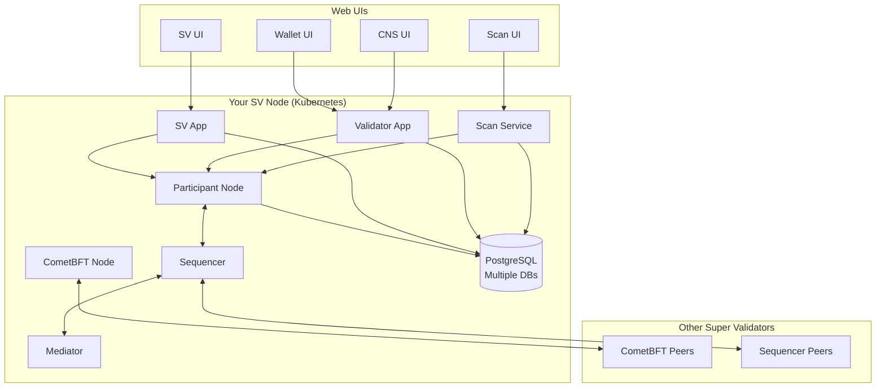

import CantonDocsGlobalSynchronizerDeploymentSuperValidatorSetupL58 from "/snippets/canton-docs/global-synchronizer_deployment_super-validator-setup_L58.mdx";
import CantonDocsGlobalSynchronizerDeploymentSuperValidatorSetupL102 from "/snippets/canton-docs/global-synchronizer_deployment_super-validator-setup_L102.mdx";
import CantonDocsGlobalSynchronizerDeploymentSuperValidatorSetupL148 from "/snippets/canton-docs/global-synchronizer_deployment_super-validator-setup_L148.mdx";
import CantonDocsGlobalSynchronizerDeploymentSuperValidatorSetupL156 from "/snippets/canton-docs/global-synchronizer_deployment_super-validator-setup_L156.mdx";
import CantonDocsGlobalSynchronizerDeploymentSuperValidatorSetupL189 from "/snippets/canton-docs/global-synchronizer_deployment_super-validator-setup_L189.mdx";
import CantonDocsGlobalSynchronizerDeploymentSuperValidatorSetupL208 from "/snippets/canton-docs/global-synchronizer_deployment_super-validator-setup_L208.mdx";

Super Validators (SVs) operate the core infrastructure of the Global Synchronizer: sequencer nodes, mediator nodes, and BFT consensus through CometBFT. This guide covers the Kubernetes-based deployment of an SV node.

SV deployment is significantly more involved than a standard validator. If you are setting up a regular validator, see the [Installation](/global-synchronizer/deployment/deployment-options) page instead.

## Requirements

### Infrastructure

- **Kubernetes cluster:** Version 1.27 or newer (EKS, GKE, AKS, or self-managed)
- **Helm:** Version 3.11.1 or newer
- **Compute:** Minimum 3 worker nodes, 8 CPU cores and 32 GB RAM each
- **Storage:** SSD-backed storage class with low latency
- **PostgreSQL:** Managed service recommended (RDS, Cloud SQL, or Azure Database). Multiple databases are required — one each for the participant, validator app, SV app, and Scan service.
- **Static egress IP:** Required for network allowlisting, same as regular validators
- **DNS:** Hostnames for web UIs and API endpoints (sv.*, wallet.*, cns.*, scan.*)

### Network

SV nodes need the same outbound connectivity as validators, plus:

- **CometBFT peering:** Outbound TCP connections to other SV CometBFT nodes (ports vary by deployment; typically 26656 for P2P)
- **BFT sequencer connections:** Outbound to other SVs' sequencer endpoints
- **Ingress:** TLS-terminated endpoints for the SV, Wallet, CNS, and Scan web UIs

### Governance

You must be approved as a Super Validator by the Global Synchronizer Foundation before beginning deployment. SV onboarding involves governance votes among existing SVs.

## Deployment overview

The SV deployment follows this sequence:

1. Generate SV identity
2. Prepare the Kubernetes cluster
3. Generate and configure CometBFT node keys
4. Create PostgreSQL instances and secrets
5. Configure BFT sequencer connections
6. Configure authentication
7. Configure and install Helm charts
8. Configure cluster ingress and egress
9. Verify deployment through web UIs

## Step 1: Generate SV identity

Before cluster setup, generate the cryptographic identity for your SV node. This produces the keys and identifiers that other SVs need to reference in their configurations.

The identity generation procedure is coordinated with existing Super Validators, who must add your identity to the network configuration. Follow the instructions provided during your SV onboarding process.

## Step 2: Prepare the cluster

Create the Kubernetes namespace and base resources:

<CantonDocsGlobalSynchronizerDeploymentSuperValidatorSetupL58 />

Ensure your cluster has:

- A storage class backed by SSDs
- An ingress controller installed and configured (NGINX, Traefik, or cloud-native)
- DNS records pointing to your ingress for the required hostnames

## Step 3: CometBFT node setup

SV nodes participate in BFT consensus through CometBFT. You need to generate node keys and configure peering with other SVs.

### Generate CometBFT node keys

Generate the key pair that identifies your CometBFT node in the consensus network. Store these keys securely — they represent your SV's identity in the BFT protocol.

The generated keys include:

- **Node key** — Used for P2P authentication between CometBFT nodes
- **Validator key** — Used for signing consensus votes

### Configure CometBFT peering

Provide your CometBFT node's public key and endpoint to other SVs, and configure your node with their peer information. This is coordinated through the SV operator channels.

### Configure state sync

For joining an existing network (rather than bootstrapping a new one), enable CometBFT state sync. This allows your node to catch up with the current network state without replaying the full block history.

## Step 4: PostgreSQL setup

SV nodes require multiple PostgreSQL databases. Create them in your managed database service or deploy in-cluster for non-production environments.

**Required databases:**

- Participant database
- Validator app database
- SV app database
- Scan service database

### Create Kubernetes secrets for database credentials

<CantonDocsGlobalSynchronizerDeploymentSuperValidatorSetupL102 />

For cloud-hosted PostgreSQL, configure network connectivity between your Kubernetes cluster and the managed database service (VPC peering, private endpoints, or authorized networks).

## Step 5: Configure BFT sequencer connections

The BFT sequencer distributes transaction ordering across all SVs. Each SV runs a sequencer component that connects to the other SVs' sequencer endpoints.

Configure the BFT sequencer connection parameters in your Helm values with the endpoints of all other SVs. These endpoints are shared during the SV onboarding coordination process.

## Step 6: Configure authentication

SV nodes expose web UIs that require authentication. The setup is similar to standard validator authentication (see [Authorization Setup](/global-synchronizer/deployment/authorization-setup)), with additional clients for the SV-specific UIs.

**Required OIDC clients for an SV node:**

- `validator-app-backend` — Service account for validator backend
- `sv-app-backend` — Service account for SV backend
- `wallet-web-ui` — Public client for Wallet UI
- `cns-ui` — Public client for CNS UI
- `sv-ui` — Public client for SV management UI

Configure your OIDC provider (Auth0, Keycloak, or other) with these clients before installing the Helm charts.

## Step 7: Install Helm charts

The Splice node bundle contains Helm charts and sample values for SV deployment. Download the bundle as described in the [Installation](/global-synchronizer/deployment/deployment-options) guide.

Configure the Helm values for your environment. Key sections include:

- Migration ID and network parameters
- PostgreSQL connection details (referencing the secrets created in Step 4)
- CometBFT configuration (keys, peers, state sync)
- BFT sequencer endpoints
- Authentication provider endpoints and client credentials
- Ingress hostnames

Install the charts:

<CantonDocsGlobalSynchronizerDeploymentSuperValidatorSetupL148 />

Monitor the rollout:

<CantonDocsGlobalSynchronizerDeploymentSuperValidatorSetupL156 />

## Step 8: Configure cluster networking

### Ingress

Configure your ingress controller to route external traffic to the SV web UIs and APIs. You need TLS-terminated routes for:

| Hostname pattern | Service | Purpose |
|---|---|---|
| `sv.&lt;your-domain&gt;` | SV UI | SV management interface |
| `wallet.&lt;your-domain&gt;` | Wallet UI | Canton Coin wallet |
| `cns.&lt;your-domain&gt;` | CNS UI | Canton Name Service |
| `scan.&lt;your-domain&gt;` | Scan UI | Network transaction viewer |

All endpoints must use HTTPS with valid TLS certificates.

### Egress

Ensure all outbound traffic routes through your registered static IP. Configure your cloud NAT or gateway to cover:

- Global Synchronizer endpoints (`*.sync.global`)
- CometBFT peer-to-peer connections to other SVs
- BFT sequencer endpoints of other SVs

## Step 9: Verify the deployment

Once all pods are running, verify your SV is operational:

### Check pod status

<CantonDocsGlobalSynchronizerDeploymentSuperValidatorSetupL189 />

All pods should be in `Running` state.

### Access the web UIs

Log into each web UI through your configured ingress:

- **Wallet UI** (`wallet.&lt;your-domain&gt;`) — Verify your SV identity and Canton Coin balance
- **CNS UI** (`cns.&lt;your-domain&gt;`) — Verify Canton Name Service access
- **SV UI** (`sv.&lt;your-domain&gt;`) — Verify SV status, governance participation, and network parameters
- **Scan UI** (`scan.&lt;your-domain&gt;`) — Verify that the Scan service is indexing network transactions

### Verify CometBFT consensus

Check that your CometBFT node is connected to peers and participating in consensus:

<CantonDocsGlobalSynchronizerDeploymentSuperValidatorSetupL208 />

Look for messages indicating peer connections and block production.

### Verify sequencer connectivity

Confirm the BFT sequencer is connected to other SVs' sequencer endpoints and processing transactions.

## Network architecture diagram

## Ongoing operations

SV operators have additional responsibilities beyond standard validator operations:

- **Governance participation:** Vote on network proposals through the SV UI
- **BFT consensus monitoring:** Ensure your CometBFT node maintains peer connections and participates in block production
- **Sequencer health:** Monitor sequencer throughput and connectivity
- **Coordinated upgrades:** Participate in Type 3 upgrade coordination with other SVs
- **IP allowlisting:** Process allowlist requests from new validators you sponsor

## Next steps

<CardGroup cols={2}>

<Card title="Upgrades" icon="arrow-up" href="/global-synchronizer/deployment/upgrades">
  Plan for SV-specific upgrade procedures.
</Card>

<Card title="Authorization Setup" icon="lock" href="/global-synchronizer/deployment/authorization-setup">
  Configure authentication for SV web UIs.
</Card>

</CardGroup>

## Kubernetes-Based Deployment

For the Helm-chart-based Kubernetes deployment of a Super Validator node — including authentication, CometBFT, Postgres, ingress, and helm chart installation — see [Kubernetes Deployment](/global-synchronizer/deployment/kubernetes-deployment).

