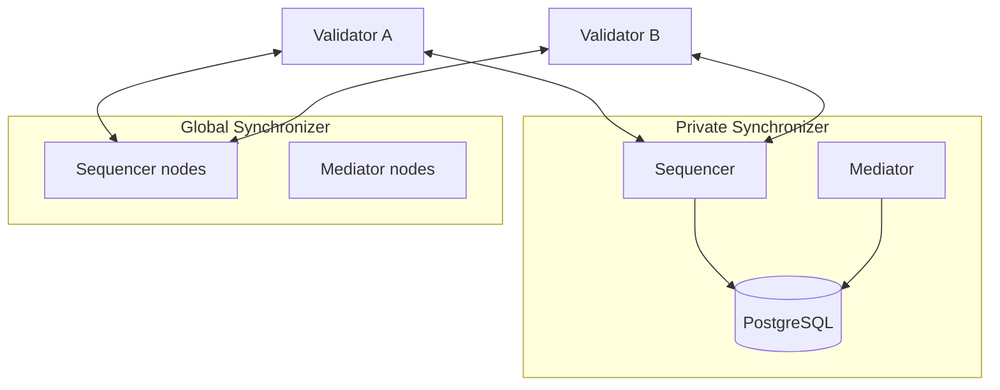
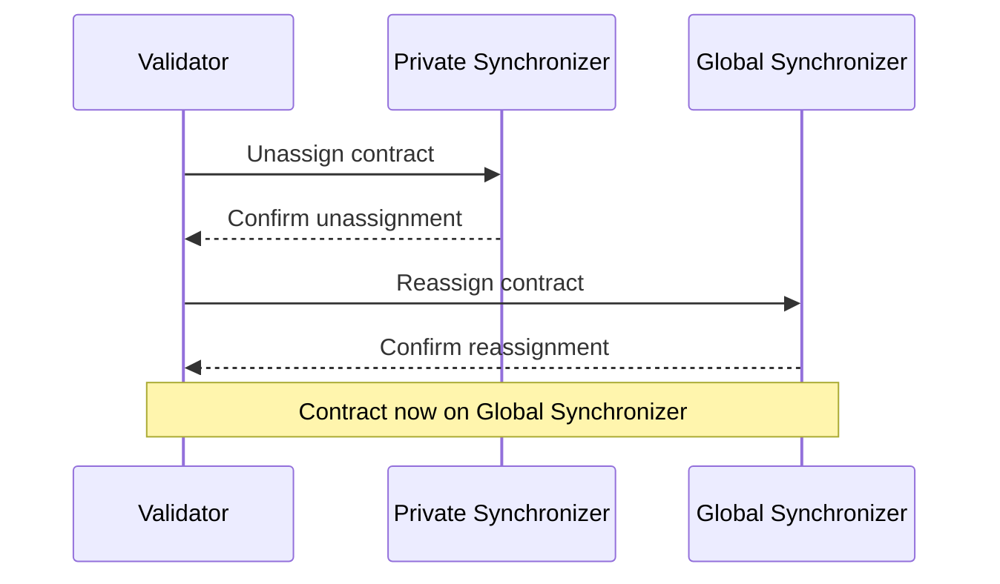

import CANTON_DOCS_CN_GS_EXTENSION_SYNCHRONIZERS_HYBRID_SYNCHRONIZER_PATTERN_0 from "/snippets/external/canton/main/docs-open/target/snippet_json_data/docs-cn/global-synchronizer-extension-synchronizers-hybrid-synchronizer-pattern-0.mdx";


A common deployment pattern on Canton Network combines private synchronizers with the Global Synchronizer. Your validators connect to both, running high-volume or confidential workflows on the private synchronizer while settling or sharing results through the Global Synchronizer.

## Why use a hybrid setup

The Global Synchronizer provides network-wide interoperability and access to Canton Coin, but not every workflow benefits from running on shared infrastructure. A hybrid pattern makes sense when you have:

- **High-volume bilateral flows** — Frequent transactions between a small set of parties (e.g., trade confirmations between two counterparties) that would consume unnecessary traffic on the Global Synchronizer
- **Confidential processing stages** — Intermediate computation steps that should stay on infrastructure you control, with only the final result published to the Global Synchronizer
- **Latency-sensitive operations** — Workflows where you need lower latency than the Global Synchronizer provides, because your private synchronizer runs fewer nodes
- **Cost optimization** — Reducing Canton Coin traffic costs by keeping high-frequency interactions on a private synchronizer and only moving contracts to the Global Synchronizer for settlement

## Architecture overview

In a hybrid deployment, each validator maintains connections to both the Global Synchronizer and one or more private synchronizers. Contracts are assigned to the synchronizer appropriate for their current lifecycle stage.



Both validators can transact on either synchronizer. Contracts created on the private synchronizer can later be reassigned to the Global Synchronizer (and vice versa) using Canton's unassignment/reassignment protocol.

## Contract assignment strategies

You control which synchronizer a contract lives on at the point of creation, and you can move contracts between synchronizers as needed.

**Create on private, settle on public:**
1. Two parties create and update a trade contract on the private synchronizer, where transaction volume is high and latency is low
2. When the trade is ready for settlement, the submitting party reassigns the contract to the Global Synchronizer
3. Settlement executes on the Global Synchronizer, where it can interact with Canton Coin and contracts held by other network participants

**Create on public, process on private:**
1. A contract is created on the Global Synchronizer so all parties can discover and interact with it
2. Once two parties agree to work together, they reassign the contract to a private synchronizer for intensive processing
3. The final result is reassigned back to the Global Synchronizer

## Cross-synchronizer reassignment

Moving a contract between synchronizers requires that the submitting validator is connected to both the source and target synchronizer. The operation uses Canton's two-phase reassignment protocol:



During the brief interval between unassignment and reassignment, the contract cannot be exercised. Plan your workflows to minimize the impact of this window.

## Configuration

To connect a validator to both synchronizers, register each synchronizer connection. The Global Synchronizer connection is typically configured during onboarding. For the private synchronizer, add a connection through the Canton Console or Admin API.

Via Canton Console:


<CANTON_DOCS_CN_GS_EXTENSION_SYNCHRONIZERS_HYBRID_SYNCHRONIZER_PATTERN_0 />


If you deploy with Helm, you can include additional synchronizer connections in your validator values:

```yaml
participant:
  additionalSynchronizerConnections:
    - alias: "private-sync"
      sequencerConnection: "https://sequencer.private-sync.example.com"
```

## Considerations

- **Traffic costs** — Transactions on the private synchronizer do not consume Canton Coin. Only transactions on the Global Synchronizer incur traffic fees.
- **Validator overlap** — All parties involved in a contract must have their validators connected to the synchronizer where that contract is assigned. Plan your synchronizer topology accordingly.
- **Ordering guarantees** — Each synchronizer provides its own total ordering. Cross-synchronizer transactions are synchronized by the Canton protocol but have higher latency than same-synchronizer transactions.
- **Operational overhead** — Running a private synchronizer means operating sequencer and mediator infrastructure in addition to your validator. See the [deployment guide](/global-synchronizer/extension-synchronizers/deployment) for what this involves.
