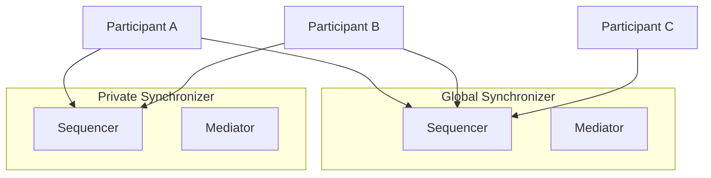

Canton Network applications are not limited to the Global Synchronizer. You can operate private synchronizers (also called extension synchronizers) alongside the Global Synchronizer for workloads that require different privacy, performance, or governance characteristics.

## Why Private Synchronizers

The Global Synchronizer is the public backbone of Canton Network — it provides the coordination layer for Canton Coin, identity management, and cross-organizational workflows. But some workloads have requirements that are better served by a dedicated synchronizer:

- **Privacy** — Transaction data on a private synchronizer is only visible to the stakeholder parties, not to the entire Global Synchronizer network. Even the synchronizer operator only sees encrypted message envelopes.
- **Performance** — A dedicated synchronizer can be tuned for specific throughput and latency requirements without being affected by other network traffic
- **Governance** — You control the synchronizer's configuration, access policies, and upgrade schedule
- **Cost** — Private synchronizer traffic does not consume Canton Coin traffic credits

## How They Work

A private synchronizer runs its own sequencer and mediator nodes. Participants connect to both the Global Synchronizer (for Canton Coin and cross-network interoperability) and one or more private synchronizers (for application-specific transactions).

Canton's multi-synchronizer protocol allows a single participant to be connected to multiple synchronizers simultaneously. Contracts can live on any connected synchronizer, and the Canton protocol handles cross-synchronizer transactions automatically when contracts on different synchronizers need to interact.



In this example, Participants A and B are connected to both synchronizers and can transact on either. Participant C only connects to the Global Synchronizer and cannot see contracts on the private synchronizer.

## When to Use a Private Synchronizer

Private synchronizers make sense when:

- Your application processes high-volume transactions between a known set of participants
- Regulatory requirements mandate that transaction data stays within a specific jurisdiction or infrastructure
- You need guaranteed performance characteristics independent of Global Synchronizer load
- Your workflow involves bilateral or multilateral agreements that don't need to be visible to the broader network

Private synchronizers are not needed when:

- Your application primarily involves Canton Coin transfers (these require the Global Synchronizer)
- You need maximum interoperability with other Canton Network applications
- You prefer the operational simplicity of a single synchronizer connection

## Deployment Models

### Self-Operated

You run your own sequencer and mediator nodes. This gives you full control over infrastructure, configuration, and access policies. You are responsible for availability, backups, and upgrades.

### Operated by a Third Party

A trusted third party runs the synchronizer infrastructure on your behalf. You connect your participant to their sequencer endpoints. The operator controls the infrastructure, but Canton's privacy model ensures they cannot see the contents of your transactions — they only see encrypted message envelopes.

### Multi-Operator (BFT)

Multiple organizations collectively operate the synchronizer using a BFT consensus protocol (similar to the Global Synchronizer model but with a smaller, private operator set). This provides resilience against any single operator going offline or behaving maliciously.

## Connecting to a Private Synchronizer

Participants connect to a private synchronizer through the Canton Admin API or Canton Console. The connection requires the sequencer's endpoint URL and appropriate authentication credentials.

```scala
// Connect to a private synchronizer via Canton Console
participant.domains.connect(
  alias = "my-private-sync",
  connection = "https://sequencer.private-sync.example.com"
)

// Verify the connection
participant.domains.list_connected
```

Once connected, the participant can create contracts on the private synchronizer by specifying it as the target synchronizer in transaction submissions.

## Relationship with the Global Synchronizer

Private synchronizers and the Global Synchronizer are complementary:

- **Canton Coin** operations always use the Global Synchronizer
- **Application contracts** can live on either synchronizer, depending on your requirements
- **Cross-synchronizer transactions** are possible when contracts on different synchronizers need to interact (Canton handles the coordination automatically)
- **Party identities** are shared across synchronizers — a party registered on the Global Synchronizer can be used on any connected private synchronizer

## Next Steps

- [Hybrid Synchronizer Pattern](/docs-main/global-synchronizer/extension-synchronizers/hybrid-synchronizer-pattern) — Combining public and private synchronizers
- [Deployment](/docs-main/global-synchronizer/extension-synchronizers/deployment) — Deploying extension synchronizer infrastructure
- [Linking Validators](/docs-main/global-synchronizer/extension-synchronizers/linking-validator-multi-sync) — Multi-synchronizer validator configuration
