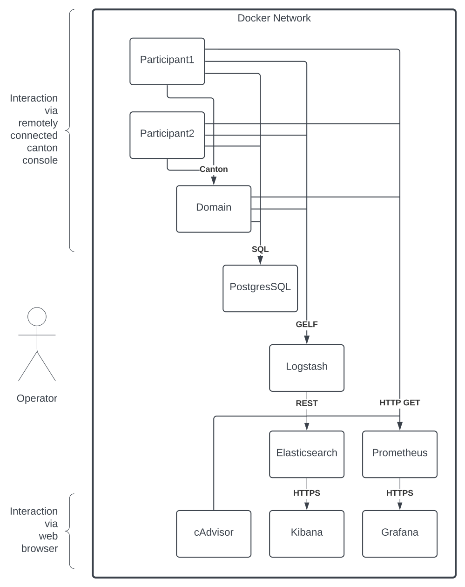
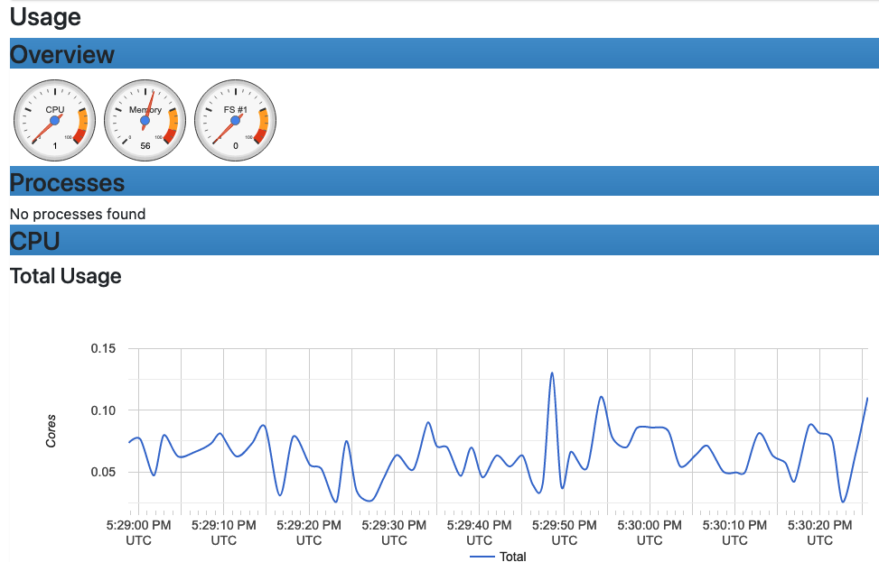
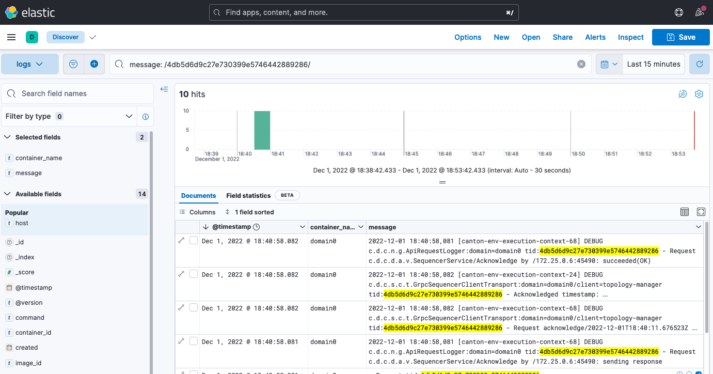
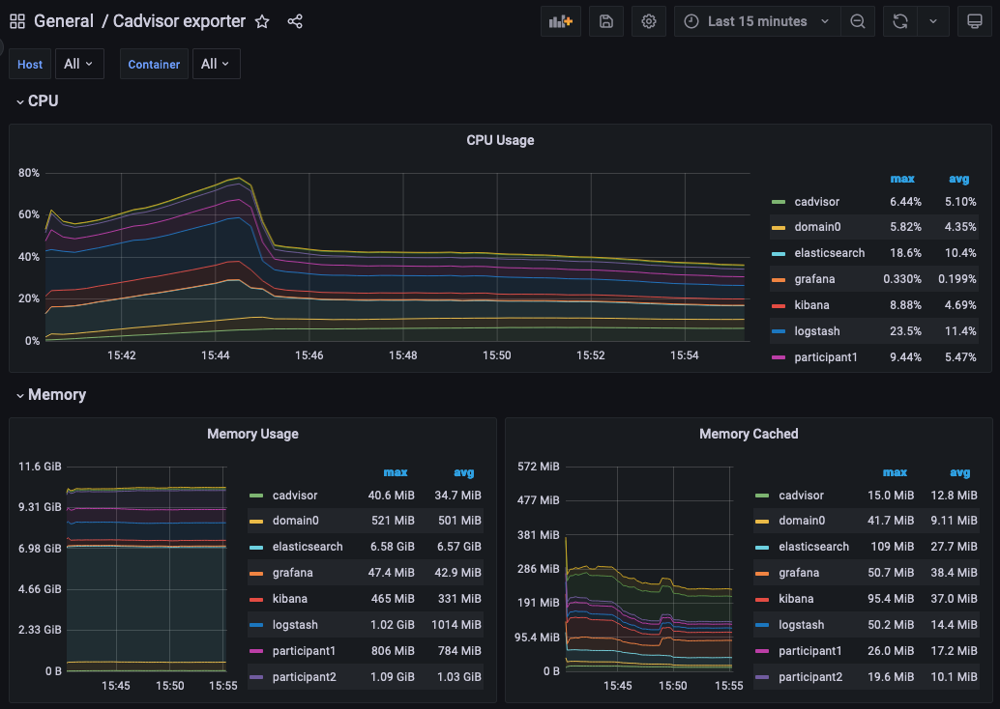

Every Canton Network node exposes Prometheus-format metrics on port 10013 at the `/metrics` path. This page covers how to configure metrics scraping, enable optional metric triggers, and set up Grafana dashboards.

## Components That Expose Metrics

{/* COPIED_START source="splice:deployment/observability/metrics.rst" hash="metrics-components" */}

<Warning title="Pre-reviewed Content - Do Not Modify">
This section was adapted from existing reviewed documentation.
**Source:** `deployment/observability/metrics.rst`
Reviewers: Skip this section. Remove markers after final approval.
</Warning>

For a validator, the following components expose metrics:

- The validator app
- The participant

For a Super Validator, these additional components also expose metrics:

- The SV app
- The scan app

{/* COPIED_END */}

## Scraping Metrics

{/* COPIED_START source="splice:deployment/observability/metrics.rst" hash="metrics-scraping" */}

<Warning title="Pre-reviewed Content - Do Not Modify">
This section was adapted from existing reviewed documentation.
**Source:** `deployment/observability/metrics.rst`
Reviewers: Skip this section. Remove markers after final approval.
</Warning>

Metrics are built with OpenTelemetry and exposed in Prometheus format. Any Prometheus-compatible server can scrape them.

### Histograms

Histograms are exposed as [exponential histograms](https://opentelemetry.io/docs/specs/otel/metrics/data-model/#exponentialhistogram), which convert to [Prometheus native histograms](https://prometheus.io/docs/specs/native_histograms/).

<Note>
Prometheus native histogram support must be enabled with the flag `-enable-feature=native-histograms`. Native histograms are only available via the protobuf format, so Prometheus will switch to protobuf collection automatically.
</Note>

To switch back to regular histograms, add the following environment variable to a node:

```bash
ADDITIONAL_CONFIG_DISABLE_NATIVE_HISTOGRAMS="canton.monitoring.metrics.histograms=[]"
```

{/* COPIED_END */}

## Enabling Metrics in Kubernetes

{/* COPIED_START source="splice:deployment/observability/metrics.rst" hash="metrics-helm" */}

<Warning title="Pre-reviewed Content - Do Not Modify">
This section was adapted from existing reviewed documentation.
**Source:** `deployment/observability/metrics.rst`
Reviewers: Skip this section. Remove markers after final approval.
</Warning>

Set `metrics.enable` to `true` in your Helm values (default: `false`). This creates a `ServiceMonitor` Kubernetes custom resource, which requires the [Prometheus Operator](https://github.com/prometheus-operator/prometheus-operator) to be installed in your cluster.

Alternatively, add Prometheus scrape annotations to your charts configured to scrape port 10013.

{/* COPIED_END */}

## Enabling Metrics in Docker Compose

{/* COPIED_START source="splice:deployment/observability/metrics.rst" hash="metrics-compose" */}

<Warning title="Pre-reviewed Content - Do Not Modify">
This section was adapted from existing reviewed documentation.
**Source:** `deployment/observability/metrics.rst`
Reviewers: Skip this section. Remove markers after final approval.
</Warning>

<Note>
Docker Compose metrics are for validator nodes only.
</Note>

Metrics are enabled by default in Docker Compose deployments. Access them at:

- `http://validator.localhost/metrics` — validator app metrics
- `http://participant.localhost/metrics` — participant metrics

{/* COPIED_END */}

## Enabling Extra Metric Triggers

{/* COPIED_START source="splice:deployment/observability/metrics.rst" hash="metrics-extra-triggers" */}

<Warning title="Pre-reviewed Content - Do Not Modify">
This section was adapted from existing reviewed documentation.
**Source:** `deployment/observability/metrics.rst`
Reviewers: Skip this section. Remove markers after final approval.
</Warning>

The validator app can run a trigger that polls topology state and exports metrics summarizing it. These metrics use the `splice.synchronizer-topology` prefix. The trigger is disabled by default.

To enable it with a 5-minute polling interval, add this environment variable:

```bash
ADDITIONAL_CONFIG_TOPOLOGY_METRICS_EXPORT=canton.validator-apps.validator_backend.automation.topology-metrics-polling-interval = 5m
```

{/* COPIED_END */}

## Grafana Dashboards

{/* COPIED_START source="splice:deployment/observability/metrics.rst" hash="metrics-grafana" */}

<Warning title="Pre-reviewed Content - Do Not Modify">
This section was adapted from existing reviewed documentation.
**Source:** `deployment/observability/metrics.rst`
Reviewers: Skip this section. Remove markers after final approval.
</Warning>

The release bundle contains pre-built Grafana dashboards in the `grafana-dashboards` folder. Import these into your Grafana instance.

The dashboards assume a Kubernetes deployment and may need modification for other deployment types. Dashboard queries use Prometheus native histogram syntax.

{/* COPIED_END */}

## Next Steps

- [Key Metrics](/global-synchronizer/production-operations/key-metrics) — Which metrics to monitor and what they mean
- [Metrics Reference](/global-synchronizer/reference/metrics-reference) — Complete metrics catalog

{/* COPIED_START source="docs-website:docs/replicated/canton/3.4/participant/tutorials/monitoring/example_monitoring_setup.rst" hash="c78cf431" */}

<Warning title="Pre-reviewed Content - Do Not Modify">
This section was copied from existing reviewed documentation.
**Source:** `docs-website:docs/replicated/canton/3.4/participant/tutorials/monitoring/example_monitoring_setup.rst`
Reviewers: Skip this section. Remove markers after final approval.
</Warning>

This guide and the scripts/configs are not tested, do they still work? Try to split this up into specific howtos and ensure the configs/scripts move to examples that are tested.

how should this relate to the other observability docs that we have? we have the observability gh stuff plus the observability stuff in the quickstart

# Example Monitoring Setup

This section provides an example of how Canton can be run inside a connected network of Docker containers. The example also shows how you can monitor network activity. See the [glossary](/overview/understand/glossary) for monitoring term definitions and the [Monitoring Choices](#monitoring-choices) section for the reasoning behind the example monitoring setup.

## Container Setup

To configure [Docker Compose](https://docs.docker.com/compose/) to spin up the Docker container network shown in the diagram, use the information below. See the `compose` documentation for detailed information concerning the structure of the configuration files.

`compose` allows you to provide the overall configuration across multiple files. Each configuration file is described below, followed by information on how to bring them together in a running network.



### Intended Use

This example is intended to demonstrate how to expose, aggregate, and observe monitoring information from Canton. It is not suitable for production without alterations. Note the following warnings:

<Warning>
Ports are exposed from the Docker network that are not necessary to support the UI. For example, the network can allow low-level interaction with the underlying service via a REST or similar interface. In a production system, the only ports that should be exposed are those required for the operation of the system.
</Warning>

<Warning>
Some of the services used in the example (for example, Postgres and Elasticsearch) persist data to disk. For this example, the volumes used for this persisted data are internal to the Docker container. This means that when the Docker network is torn down, all data is cleaned up along with the containers. In a production system, these volumes would be mounted onto permanent storage.
</Warning>

<Warning>
Passwords are stored in plaintext in configuration files. In a production system, passwords should be extracted from a secure keystore at runtime.
</Warning>

<Warning>
Network connections are not secured. In a production system, connections between services should be TLS-enabled, with a certificate authority (CA) provided.
</Warning>

<Warning>
The memory use of the containers is only suitable for light demonstration loads. In a production setup, containers need to be given sufficient memory based on memory profiling.
</Warning>

<Warning>
The versions of the Docker images used in the example may become outdated. In a production system, only the latest patched versions should be used.
</Warning>


### Network Configuration

In this compose file, define the network that will be used to connect all the running containers:

```yaml
# Create with `docker network create monitoring`
# Note that `external: false` will fail the docker-compose execution if the network `monitoring` already exists

version: "3.8"

networks:
  default:
    name: monitoring
    external: false
```

### Postgres Setup

Using only a single Postgres container, create databases for the synchronizer, along with Canton and index databases for each participant. To do this, mount `postgres-init.sql` into the Postgres-initialized directory. Note that in a production environment, passwords must not be inlined inside config.

```yaml
services:
  postgres:
    image: postgres:17.5-bullseye
    hostname: postgres
    container_name: postgres
    environment:
      - POSTGRES_USER=pguser
      - POSTGRES_PASSWORD=pgpass
    volumes:
      - ../etc/postgres-init.sql:/docker-entrypoint-initdb.d/init.sql
    expose:
      - "5432"
    ports:
      - "5432:5432"
    healthcheck:
      test: "pg_isready -U postgres"
      interval: 5s
      timeout: 5s
      retries: 5
```

```sql
create database canton1db;
create database index1db;

create database synchronizer0db;

create database canton2db;
create database index2db;
```

### Synchronizer Setup

Run the synchronizer with the `--log-profile container` that writes plain text to standard out at debug level.

#\. Add examples here \<[https://github.com/DACH-NY/canton/issues/23872](https://github.com/DACH-NY/canton/issues/23872)\>

### Participant Setup

The participant container has two files mapped into it on container creation. The `.conf` file provides details of the synchronizer and database locations. An HTTP metrics endpoint is exposed that returns metrics in the [Prometheus Text Based Format](https://github.com/prometheus/docs/blob/main/content/docs/instrumenting/exposition_formats.md#text-based-format). By default, participants do not connect to remote synchronizers, so a bootstrap script is provided to accomplish that.

```yaml
services:
  participant1:
    image: digitalasset/canton-open-source:2.5.1
    container_name: participant1
    hostname: participant1
    volumes:
      - ./participant1.conf:/canton/etc/participant1.conf
      - ./participant1.bootstrap:/canton/etc/participant1.bootstrap
    command: daemon --log-profile container --config etc/participant1.conf --bootstrap etc/participant1.bootstrap
    expose:
      - "10011"
      - "10012"
      - "10013"
    ports:
      - "10011:10011"
      - "10012:10012"
      - "10013:10013"
```

```scala
participant1.synchronizers.connect_local(sequencer1, alias = "synchronizer0")
```

``` none
canton {
  participants {
    participant1 {
      storage {
        type = postgres
        config {
        dataSourceClass = "org.postgresql.ds.PGSimpleDataSource"
          properties = {
            databaseName = "canton1db"
            serverName = "postgres"
            portNumber = "5432"
            user = pguser
            password = pgpass
          }
        }
        ledger-api-jdbc-url = "jdbc:postgresql://postgres:5432/index1db?user=pguser&password=pgpass"
      }
      ledger-api {
        port = 10011
        address = "0.0.0.0"
      }
      admin-api {
        port = 10012
        address = "0.0.0.0"
      }
    }
  }
  monitoring.metrics.reporters = [{
    type = prometheus
    address = "0.0.0.0"
    port = 10013
  }]
}
```

The setup for participant2 is identical, except that the name and ports are changed.

```yaml
services:
  participant2:
    image: digitalasset/canton-open-source:2.5.1
    container_name: participant2
    hostname: participant2
    volumes:
      - ./participant2.conf:/canton/etc/participant2.conf
      - ./participant2.bootstrap:/canton/etc/participant2.bootstrap
    command: daemon --log-profile container --config etc/participant2.conf --bootstrap etc/participant2.bootstrap
    expose:
      - "10021"
      - "10022"
      - "10023"
    ports:
      - "10021:10021"
      - "10022:10022"
      - "10023:10023"
```

```scala
participant1.synchronizers.connect_local(sequencer1, alias = "synchronizer0")
```

``` none
canton {
  participants {
    participant1 {
      storage {
        type = postgres
        config {
        dataSourceClass = "org.postgresql.ds.PGSimpleDataSource"
          properties = {
            databaseName = "canton1db"
            serverName = "postgres"
            portNumber = "5432"
            user = pguser
            password = pgpass
          }
        }
        ledger-api-jdbc-url = "jdbc:postgresql://postgres:5432/index1db?user=pguser&password=pgpass"
      }
      ledger-api {
        port = 10011
        address = "0.0.0.0"
      }
      admin-api {
        port = 10012
        address = "0.0.0.0"
      }
    }
  }
  monitoring.metrics.reporters = [{
    type = prometheus
    address = "0.0.0.0"
    port = 10013
  }]
}
```

### Logstash

Docker containers can specify a log driver to automatically export log information from the container to an aggregating service. The example exports log information in GELF, using Logstash as the aggregation point for all GELF streams. You can use Logstash to feed many downstream logging data stores, including Elasticsearch, Loki, and Graylog.

``` none
services:
  logstash:
    image: docker.elastic.co/logstash/logstash:8.5.1
    hostname: logstash
    container_name: logstash
    expose:
      - 12201/udp
    volumes:
      - ./pipeline.yml:/usr/share/logstash/config/pipeline.yml
      - ./logstash.yml:/usr/share/logstash/config/logstash.yml
      - ./logstash.conf:/usr/share/logstash/pipeline/logstash.conf
    ports:
      - "12201:12201/udp"
```

Logstash reads the `pipeline.yml` to discover the locations of all pipelines.

``` none
- pipeline.id: main
  path.config: "/usr/share/logstash/pipeline/logstash.conf"
```

The configured pipeline reads GELF-formatted input, then outputs it to an Elasticsearch index prefixed with `logs-` and postfixed with the date.

``` none
# Main logstash pipeline

input { 
  gelf {
    use_udp => true
    use_tcp => false
    port => 12201   
  }
} 

filter {}

output { 

  elasticsearch { 
    hosts => ["http://elasticsearch:9200"] 
    index => "logs-%{+YYYY.MM.dd}"
  }

}
```

The default Logstash settings are used, with the HTTP port bound to all host IP addresses.

``` none
# For full set of descriptions see
# https://www.elastic.co/guide/en/logstash/current/logstash-settings-file.html

http.host: "0.0.0.0"
```

### Elasticsearch

Elasticsearch supports running in a clustered configuration with built-in resiliency. The example runs only a single Elasticsearch node.

``` none
services:
  elasticsearch:
    image: docker.elastic.co/elasticsearch/elasticsearch:8.5.2
    container_name: elasticsearch
    environment:
      ELASTIC_PASSWORD: elastic
      node.name: elasticsearch
      cluster.name: elasticsearch
      cluster.initial_master_nodes: elasticsearch
      xpack.security.enabled: false
      bootstrap.memory_lock: true
    ulimits:
      memlock:
        soft: -1
        hard: -1
    expose:
      - 9200
    ports:
      - 9200:9200
    healthcheck:
      test: "curl -s -I http://localhost:9200 | grep 'HTTP/1.1 200 OK'"
      interval: 10s
      timeout: 10s
      retries: 10
```

### Kibana

Kibana provides a UI that allows the Elasticsearch log index to be searched.

``` none
services:
  kibana:
    image: docker.elastic.co/kibana/kibana:8.5.2
    container_name: kibana
    expose:
      - 5601
    ports:
      - 5601:5601
    environment:
      - SERVERNAME=kibana
      - ELASTICSEARCH_HOSTS=http://elasticsearch:9200
    healthcheck:
      test: "curl -s -I http://localhost:5601 | grep 'HTTP/1.1 302 Found'"
      interval: 10s
      timeout: 10s
      retries: 10
```

You must manually configure a data view to view logs. See [Kibana Log Monitoring](#kibana-log-monitoring) for instructions.

### cAdvisor

cAdvisor exposes container system metrics (CPU, memory, disk, and network) to Prometheus. It also provides a UI to view these metrics.

``` none
services:
  cadvisor:
    image: gcr.io/cadvisor/cadvisor:v0.45.0
    container_name: cadvisor
    hostname: cadvisor
    privileged: true
    devices:
      - /dev/kmsg:/dev/kmsg
    volumes:
      - /var/run:/var/run:ro
      - /var/run/docker.sock:/var/run/docker.sock:ro
      # Although the following two directories are not present on OSX removing them stops cAdvisor working
      # Maybe some internal logic checks for the existence of the directory.
      - /sys:/sys:ro
      - /var/lib/docker/:/var/lib/docker:ro
    expose:
      - 8080
    ports:
      - "8080:8080"
```

To view container metrics:

> 1.  Navigate to [http://localhost:8080/docker/](http://localhost:8080/docker/).
> 2.  Select a Docker container of interest.

You should now see a UI similar to the one shown.



Prometheus-formatted metrics are available by default at [http://localhost:8080/metrics](http://localhost:8080/metrics).

### Prometheus

Configure Prometheus with `prometheus.yml` to provide the endpoints from which metric data should be scraped. By default, port `9090` can query the stored metric data.

``` none
services:
  prometheus:
    image: prom/prometheus:v2.40.6
    container_name: prometheus
    hostname: prometheus
    volumes:
      - ./prometheus.yml:/etc/prometheus/prometheus.yml
    ports:
      - 9090:9090
```

``` none
global:
  scrape_interval: 15s
  scrape_timeout: 10s
  evaluation_interval: 1m

scrape_configs:

  - job_name: canton
    static_configs:
      - targets:
          - participant1:10013
          - participant2:10023

  - job_name: cadvisor
    static_configs:
      - targets:
          - cadvisor:8080

    # Exclude container labels by default
    # curl cadvisor:8080/metrics to see all available labels
    metric_relabel_configs:
      - regex: "container_label_.*"
        action: labeldrop
```

### Grafana

Grafana is provided with:

- The connection details for the Prometheus metric store
- The username and password required to use the web UI
- The location of any externally provided dashboards
- The actual dashboards

Note that the `Metric Count` dashboard referenced in the docker-compose.yml file (`grafana-message-count-dashboard.json`) is not inlined below. The reason is that this is not hand-configured but built via the web UI and then exported. See [Grafana Metric Monitoring](#grafana-metric-monitoring) for instructions to log into Grafana and display the dashboard.

``` none
services:
  grafana:
    image: grafana/grafana:9.3.1-ubuntu
    container_name: grafana
    hostname: grafana
    volumes:
      - ./grafana.ini:/etc/grafana/grafana.ini
      - ./grafana-datasources.yml:/etc/grafana/provisioning/datasources/default.yml
      - ./grafana-dashboards.yml:/etc/grafana/provisioning/dashboards/default.yml
      - ./grafana-message-count-dashboard.json:/var/lib/grafana/dashboards/grafana-message-count-dashboard.json
    ports:
      - 3000:3000
```

``` none
instance_name = "docker-compose"

[security]
admin_user = "grafana"
admin_password = "grafana"

[unified_alerting]
enabled = false

[alerting]
enabled = false

[plugins]
plugin_admin_enabled = true
```

``` none
---
apiVersion: 1

datasources:
- name: prometheus
  type: prometheus
  access: proxy
  orgId: 1
  uid: prometheus
  url: http://prometheus:9090
  isDefault: true
  version: 1
  editable: false
```

``` none
---
apiVersion: 1

providers:
  - name: local
    orgId: 1
    folder: ''
    folderUid: default
    type: file
    disableDeletion: true
    updateIntervalSeconds: 30
    allowUiUpdates: true
    options:
      path: /var/lib/grafana/dashboards
      foldersFromFilesStructure: true
```

### Dependencies

There are startup dependencies between the Docker containers. For example, the synchronizer needs to be running before the participant, and the database needs to run before the synchronizer.

The `yaml` anchor `x-logging` enabled GELF container logging and is duplicated across the containers where you want to capture logging output. Note that the host address is the host machine, not a network address (on OSX).

```yaml
x-logging: &logging
  driver: gelf
  options:
    # Should be able to use "udp://logstash:12201"
    gelf-address: "udp://host.docker.internal:12201"

services:

  logstash:
    depends_on:
      elasticsearch:
        condition: service_healthy

  postgres:
    logging:
      <<: *logging
    depends_on:
      logstash:
        condition: service_started

  participant1:
    logging:
      <<: *logging
    depends_on:
      synchronizer0:
        condition: service_started
      logstash:
        condition: service_started

  participant2:
    logging:
      <<: *logging
    depends_on:
      synchronizer0:
        condition: service_started
      logstash:
        condition: service_started

  kibana:
    depends_on:
      elasticsearch:
        condition: service_healthy

  grafana:
    depends_on:
      prometheus:
        condition: service_started
```

### Docker Images

The Docker images need to be pulled down before starting the network:

- digitalasset/canton-open-source:2.5.1
- docker.elastic.co/elasticsearch/elasticsearch:8.5.2
- docker.elastic.co/kibana/kibana:8.5.2
- docker.elastic.co/logstash/logstash:8.5.1
- gcr.io/cadvisor/cadvisor:v0.45.0
- grafana/grafana:9.3.1-ubuntu
- postgres:17.5-bullseye
- prom/prometheus:v2.40.6

### Running Docker Compose

Since running `docker compose` with all the compose files shown above creates a long command line, a helper script `dc.sh` is used.

A minimum of **12GB** of memory is recommended for Docker. To verify that Docker is not running short of memory, run `docker stats` and ensure the total `MEM%` is not too high.

```bash
#!/bin/bash

if [ $# -eq 0 ];then
    echo "Usage: $0 <docker compose command>"
    echo "Use '$0 up --force-recreate --renew-anon-volumes' to re-create network"
    exit 1
fi

set -x

docker compose \
    -p monitoring \
    -f etc/network-docker-compose.yml \
    -f etc/cadvisor-docker-compose.yml \
    -f etc/elasticsearch-docker-compose.yml \
    -f etc/logstash-docker-compose.yml \
    -f etc/postgres-docker-compose.yml \
    -f etc/synchronizer0-docker-compose.yml0-docker-compose.yml \
    -f etc/participant1-docker-compose.yml \
    -f etc/participant2-docker-compose.yml \
    -f etc/kibana-docker-compose.yml \
    -f etc/prometheus-docker-compose.yml \
    -f etc/grafana-docker-compose.yml \
    -f etc/dependency-docker-compose.yml \
    $*
```

**Useful commands**

```bash
./dc.sh up -d       # Spins up the network and runs it in the background

./dc.sh ps          # Shows the running containers

./dc.sh stop        # Stops the containers

./dc.sh start       # Starts the containers

./dc.sh down        # Stops and tears down the network, removing any created containers
```

## Connecting to Nodes

To interact with the running network, a Canton console can be used with a remote configuration. For example:

```bash
bin/canton -c etc/remote-participant1.conf
```

### Remote Configurations

``` none
canton {

  features.enable-testing-commands = yes  // Needed for ledger-api

  remote-participants.participant1 {
    ledger-api {
      address="0.0.0.0"
      port="10011"
    }
    admin-api {
      address="0.0.0.0"
      port="10012"
    }
  }
} 
```

``` none
canton {

  features.enable-testing-commands = yes  // Needed for ledger-api

  remote-participants.participant2 {
    ledger-api {
      address="0.0.0.0"
      port="10021"
    }
    admin-api {
      address="0.0.0.0"
      port="10022"
    }
  }

}  
```

### Getting Started

Using the previous scripts, you can follow the examples provided in the Getting Started guide.

## Kibana log monitoring

When Kibana is started for the first time, you must set up a data view to allow view the log data:

> 1.  Navigate to [http://localhost:5601/](http://localhost:5601/).
> 2.  Click **Explore on my own**.
> 3.  From the menu select **Analytics** \> **Discover**.
> 4.  Click **Create data view**.
> 5.  Save a data view with the following properties:
>     - Name: `Logs`
>     - Index pattern: `logs-\*`
>     - Timestamp field: `@timestamp`

You should now see a UI similar to the one shown here:



In the Kibana interface, you can:

> - Create a view based on selected fields
> - View log messages by logging timestamp
> - Filter by field value
> - Search for text
> - Query using either `KSQL` or `Lucene` query languages

For more details, see the Kibana documentation. Note that querying based on plain text for a wide time window likely results in poor UI performance. See [Logging Improvements](#logging-improvements) for ideas to improve it.

## Grafana Metric Monitoring

You can log into the Grafana UI and set up a dashboard. The example imports a [GrafanaLabs community dashboard](https://grafana.com/grafana/dashboards/) that has graphs for cAdvisor metrics. The [cAdvisor Export dashboard](https://grafana.com/grafana/dashboards/14282-cadvisor-exporter/) imported below has an ID of **14282**.

> 1.  Navigate to [http://localhost:3000/login](http://localhost:3000/login).
> 2.  Enter the username/password: `grafana/grafana`.
> 3.  In the side border, select **Dashboards** and then **Import**.
> 4.  Enter the dashboard ID `14282` and click **Load**.
> 5.  On the screen, select **Prometheus** as the data source and click **Import**.

You should see a container system metrics dashboard similar to the one shown here:



See the [Grafana documentation](https://grafana.com/grafana/) for how to configure dashboards. For information about which metrics are available, see the Metrics documentation in the Monitoring section of this user manual.

## Monitoring Choices

This section documents the reasoning behind the technology used in the example monitoring setup.

### Use Docker Log Drivers

**Reasons:**

- Most Docker containers can be configured to log all debug output to stdout.
- Containers can be run as supplied.
- No additional dockerfile layers need to be added to install and start log scrapers.
- There is no need to worry about local file naming, log rotation, and so on.

### Use GELF Docker Log Driver

**Reasons:**

- It is shipped with Docker.
- It has a decodable JSON payload.
- It does not have the size limitations of syslog.
- A UDP listener can be used to debug problems.

### Use Logstash

**Reasons:**

- It is a lightweight way to bridge the GELF output provided by the containers into Elasticsearch.
- It has a simple conceptual model (pipelines consisting of input/filter/output plugins).
- It has a large ecosystem of input/filter and output plugins.
- It externalizes the logic for mapping container logging output to a structures/ECS format.
- It can be run with `stdin`/`stdout` input/output plugins for use with testing.
- It can be used to feed Elasticsearch, Loki, or Graylog.
- It has support for the Elastic Common Schema (ECS) if needed.

### Use Elasticsearch/Kibana

**Reasons:**

- Using Logstash with Elasticsearch and Kibana, the ELK stack, is a mature way to set up a logging infrastructure.
- Good defaults for these products allow a basic setup to be started with almost zero configuration.
- The ELK setup acts as a good baseline as compared to other options such as Loki or Graylog.

### Use Prometheus/Grafana

**Reasons:**

- Prometheus defines and uses the OpenTelemetry reference file format.
- Exposing metrics via an HTTP endpoint allows easy direct inspection of metric values.
- The Prometheus approach of pulling metrics from the underlying system means that the running containers do not need infrastructure to store and push metric data.
- Grafana works very well with Prometheus.

## Logging Improvements

This version of the example only has the logging structure provided via GELF. It is possible to improve this by:

> - Extracting data from the underlying containers as a JSON stream.
> - Mapping fields in this JSON data onto the ECS so that the same name is used for commonly used field values (for example, log level).
> - Configuring Elasticsearch with a schema that allows certain fields to be quickly filtered (for example, log level).

{/* COPIED_END */}


{/* COPIED_START source="docs-website:docs/replicated/canton/3.4/participant/howtos/observe/health.rst" hash="64490235" */}

<Warning title="Pre-reviewed Content - Do Not Modify">
This section was copied from existing reviewed documentation.
**Source:** `docs-website:docs/replicated/canton/3.4/participant/howtos/observe/health.rst`
Reviewers: Skip this section. Remove markers after final approval.
</Warning>

# Participant Node Health

The participant exposes health status information in several ways, which may be inspected manually when troubleshooting or integrated into larger monitoring and orchestration systems.

## Using gRPC Health Service for Load Balancing and Orchestration

The Participant Node provides a `grpc.health.v1.Health` service, implementing the [gRPC Health Checking Protocol](https://github.com/grpc/grpc/blob/master/doc/health-checking.md) protocol.

Kubernetes containers can be [configured](https://kubernetes.io/docs/tasks/configure-pod-container/configure-liveness-readiness-startup-probes/#define-a-grpc-liveness-probe) to use this for readiness or liveness [probes](https://kubernetes.io/docs/concepts/configuration/liveness-readiness-startup-probes/#readiness-probe), e.g.

```text
readinessProbe:
  grpc:
    port: <port>
```
By default the port is the one used for the `Ledger API`.

Likewise, [gRPC clients](https://grpc.io/docs/guides/health-checking/#enabling-client-health-checking) and [NGinx](https://docs.nginx.com/nginx/admin-guide/load-balancer/grpc-health-check/) can be configured to watch the health service for traffic management and load balancing.

You can manually check the health of a Participant with a command line tool such as [grpcurl](https://github.com/fullstorydev/grpcurl) e.g. (using the Participant's actual address):

```bash
$ grpcurl -plaintext <host>:<port> grpc.health.v1.Health/Check
{
  "status": "SERVING"
}
```

Calling [Check](https://github.com/grpc/grpc-proto/blob/6565a1ba38af695ace7c3ce6e6ff837ee87d4c10/grpc/health/v1/health.proto#L55) will respond with `SERVING` if it is currently ready and available to serve requests.

Calling [Watch](https://github.com/grpc/grpc-proto/blob/6565a1ba38af695ace7c3ce6e6ff837ee87d4c10/grpc/health/v1/health.proto#L72) will perform a streaming health check. The server will immediately send the current health of the Participant, and then send a new message whenever the health changes.

When multiple Participant replicas are configured, passive nodes return `NOT_SERVING`.

In practice, the health of the Participant is composed of the health of the components it depends on. You can query these individually by name, by making a request with the [service](https://github.com/grpc/grpc-proto/blob/6565a1ba38af695ace7c3ce6e6ff837ee87d4c10/grpc/health/v1/health.proto#L29) field set to the name of the component. An empty or unset `service` field returns the aggregate health of all components. An unknown name will result in a gRPC `NOT_FOUND` error.

## Checking health via HTTP

Health checking can also be done via HTTP, which is useful for frameworks that don't support gRPC Health Checking Protocol. Setting monitoring.http-health-server.port= in the configuration for your node will expose health information at the URL `http://<host>:<port>/health`.

Here the important information is reported via the HTTP Reponse status code.

- A status of `200` is equivalent to `SERVING` from the gRPC Health Service.
- A status of `503` is equivalent to `NOT_SERVING`.
- A status of `500` means the check failed for any other reason.

Kubernetes can use also use these for readiness probes:

```text
readinessProbe:
  httpGet:
    port: <port>
    path: /health
```
## Inspection of General Health Status

General information about the Participant Node, including about unhealthy synchronizers and dependencies, and whether the node is currently Active, can be displayed in the canton console by invoking the `health.status` command on the node.

``` none
@ participant1.health.status
    res1: NodeStatus[ParticipantStatus] = Participant id: PAR::participant1::12201ff69b1d24edbf0ee2028a304ea702ee8536790dab1a31e7136e6d90ff6d473c
    Uptime: 2.069737s
    Ports: 
        ledger: 30183
        admin: 30184
        json: 30185
    Connected synchronizers: None
    Unhealthy synchronizers: None
    Active: true
    Components: 
        memory_storage : Ok()
        connected-synchronizer : Not Initialized
        sync-ephemeral-state : Not Initialized
        sequencer-client : Not Initialized
        acs-commitment-processor : Not Initialized
    Version: 3.4.11-SNAPSHOT
    Supported protocol version(s): 34
```

The Admin API of the Participant Node provides programmatic access to this data in a structured form, via [ParticipantStatusService](https://github.com/DACH-NY/canton/blob/release-line-3.3/community/admin-api/src/main/protobuf/com/digitalasset/canton/admin/participant/v30/participant_status_service.proto#L10)'s `ParticipantStatus` call.

The canton console can also provide information about *all* connected nodes, including those remotely connected, by invoking the command at the top level.

``` none
@ health.status
    res2: CantonStatus = Status for Sequencer 'sequencer1':
    Sequencer id: da::1220a82692abc55c0367abefc4bdbc23df25688230430ddfeef5759845f26d5cc29c
    Synchronizer id: da::1220a82692abc55c0367abefc4bdbc23df25688230430ddfeef5759845f26d5cc29c::34-0
    Uptime: 5.968597s
    Ports: 
        public: 30187
        admin: 30188
    Connected participants: 
        PAR::participant2::1220a4d7463b...
        PAR::participant1::12201ff69b1d...
    Connected mediators: 
        MED::mediator1::122009299340...
    Sequencer: SequencerHealthStatus(active = true)
    details-extra: None
    Components: 
        memory_storage : Ok()
        sequencer : Ok()
    Accepts admin changes: true
    Version: 3.4.11-SNAPSHOT
    Protocol version: 34

    Status for Mediator 'mediator1':
    Node uid: mediator1::12200929934059da3e012af672ee8a5d26a7e4b3e5084920be298f791f7619843c78
    Synchronizer id: da::1220a82692abc55c0367abefc4bdbc23df25688230430ddfeef5759845f26d5cc29c::34-0
    Uptime: 5.920214s
    Ports: 
        admin: 30186
    Active: true
    Components: 
        memory_storage : Ok()
        sequencer-client : Ok()
        sequencer-connection-pool : Ok()
        sequencer-subscription-pool : Ok()
        internal-sequencer-connection-sequencer1-0 : Ok()
        subscription-sequencer-connection-sequencer1-0 : Ok()
    Version: 3.4.11-SNAPSHOT
    Protocol version: 34

    Status for Participant 'participant1':
    Participant id: PAR::participant1::12201ff69b1d24edbf0ee2028a304ea702ee8536790dab1a31e7136e6d90ff6d473c
    Uptime: 7.954779s
    Ports: 
        ledger: 30183
        admin: 30184
        json: 30185
    Connected synchronizers: 
        da::1220a82692ab...::34-0
    Unhealthy synchronizers: None
    Active: true
    Components: 
        memory_storage : Ok()
        connected-synchronizer : Ok()
        sync-ephemeral-state : Ok()
        sequencer-client : Ok()
        acs-commitment-processor : Ok()
        sequencer-connection-pool : Ok()
        sequencer-subscription-pool : Ok()
        internal-sequencer-connection-sequencer1-0 : Ok()
        subscription-sequencer-connection-sequencer1-0 : Ok()
    Version: 3.4.11-SNAPSHOT
    Supported protocol version(s): 34

    Status for Participant 'participant2':
    Participant id: PAR::participant2::1220a4d7463bd34b2ba3704401b48ab41d8f88cdcbe512fc1ef071aad97fef106161
    Uptime: 8.670214s
    Ports: 
        ledger: 30180
        admin: 30181
        json: 30182
    Connected synchronizers: 
        da::1220a82692ab...::34-0
    Unhealthy synchronizers: None
    Active: true
    Components: 
        memory_storage : Ok()
        connected-synchronizer : Ok()
        sync-ephemeral-state : Ok()
        sequencer-client : Ok()
        acs-commitment-processor : Ok()
        sequencer-connection-pool : Ok()
        sequencer-subscription-pool : Ok()
        internal-sequencer-connection-sequencer1-0 : Ok()
        subscription-sequencer-connection-sequencer1-0 : Ok()
    Version: 3.4.11-SNAPSHOT
    Supported protocol version(s): 34
```

## Generating a Node Health Dump for Troubleshooting

When interacting with support or attempting to troubleshoot an issue, it is often necessary to capture a snapshot of relevant execution state. Canton implements a facility that gathers key system information and bundles it into a ZIP file.

This will contain:

- The configuration you are using, with all sensitive data stripped from it (no passwords).
- An extract of the log file. Sensitive data is not logged into log files.
- A current snapshot on Canton metrics.
- A stacktrace for each running thread.

These health dumps can be triggered from the canton console with `health.dump()`, which returns the path to the resulting ZIP file.

``` none
@ health.dump()
    ..
```

If the console is configured to access remote nodes, their state will be included too. You can obtain the data of just a specific node by targeting it when running the command, e.g. `remoteParticipant1.health.dump()`

When packaging large amounts of data, increase the default timeout of the dump command:

``` none
@ health.dump(timeout = 2.minutes)
    ..
```

Health dumps can also be gathered via gRPC on the `Admin API` of the Participant Node via the [StatusService](https://github.com/DACH-NY/canton/blob/release-line-3.3/community/admin-api/src/main/protobuf/com/digitalasset/canton/admin/health/v30/status_service.proto#L10)'s `HealthDump`. This call streams back the bytes of the produced ZIP file.

## Monitoring for Slow or Stuck Tasks

Some operations can report when they are slow, if you enable

``` none
canton.monitoring.logging.log-slow-futures = yes
```

If a task is taking longer than expected, a log line will be emitted periodically until it completes, such as `<task name> has not completed after <duration>`. This feature is disabled by default to reduce the overhead.

Canton also provides a facility to periodically test whether we are able to schedule new tasks in a timely manner, enabled via the configuration

``` none
canton.monitoring.deadlock-detection.enabled = yes
```

If a problem is detected, a log line containing `Task runner <name> is stuck or overloaded for <duration>` will be emitted. This may indicate that resources such as CPU are overloaded, that the Execution Context is too small, or that too many tasks are otherwise stuck. If the issue resolves itself, a subsequent log message: `Task runner <name> is just overloaded, but operating correctly. Task got executed in the meantime` will be emitted.

## Disabling Restart on Fatal Failures

Processes should be run under a process supervisor, such as `systemd` or Kubernetes, which can monitor them and restart them as needed. By default, the Participant Node process will exit in the event of a fatal failure.

If you wish to disable this behaviour

``` none
canton.parameters.exit-on-fatal-failures = no
```

which will cause the Node to stay alive and report unhealthy in such cases.

{/* COPIED_END */}


{/* COPIED_START source="docs-website:docs/replicated/canton/3.4/participant/howtos/observe/commitments.rst" hash="448aca51" */}

<Warning title="Pre-reviewed Content - Do Not Modify">
This section was copied from existing reviewed documentation.
**Source:** `docs-website:docs/replicated/canton/3.4/participant/howtos/observe/commitments.rst`
Reviewers: Skip this section. Remove markers after final approval.
</Warning>

# Monitor ACS Commitments

A participant that fails to send commitments in a timely manner is problematic for its counter-participants: Counter-participants cannot prune their state, because they have no proof that their state is the same as the state of the participant. More information on commitments is available in the Pruning overview section.

This page describes the monitoring options for ACS commitments. Commitment monitoring supports participant node operators in several ways. First, monitoring provides insight into commitment generation performance, allowing the participant node operator to troubleshoot and fix potential performance problems. For example, monitoring metrics indicate potential performance bottlenecks, which the operator can use as input for configuring commitment generation.

Second, monitoring provides insights into the status of commitments from counter-participants. This is relevant for the participant node operator because a counter-participant that runs behind in commitment generation, either because it is faulty or because the network is slow, prevents pruning on the participant: The participant does not know whether its state and the counter-participant's state diverged, and cannot prune because it might need to investigate a potential fork. The operator can use the monitoring metrics to identify slow counter-participants and potentially blacklist them.

## Monitoring own commitments

We provide the following metrics for commitment generation, which are described in detail in the Metrics reference section:

- `daml.participant.sync.commitments.compute`: Measures the time that the participant node spends computing commitments.
- `daml.participant.sync.commitments.sequencing-time`: Measures the time between the end of a commitment period, and the time when the sequencer observes the corresponding commitment.
- `daml.participant.sync.commitments.catchup-mode-enabled`: Measures how many times the catch-up mode has been triggered.

## Monitoring counter-participant commitments

The operator can monitor the status of commitments from the counter-participants through latency metrics. These metrics can reveal slow counter-participants, which are behind in sending commitments, and enable operators to configure thresholds defining when a counter-participant is considered slow.

The operator can group counter-participants into three categories, which affect metric reporting:

- *Default*
- *Distinguished*
- *Individually monitored*

An *Individually monitored* counter-participant always shows that participant's commitment latency. *Distinguished* and *Default* groupings of counter-participants only show the largest latency in the group. Inspection tools and direct monitoring can then be used to identify slow counter-participant(s).

All metrics below are described in detail in the Metrics reference section.

- *Default*: All counter-participants that are not distinguished or individually monitored belong to this group by default. We publish one aggregated metric for all participants in this group: `daml.participant.sync.commitments.synchronizer.largest-counter-participant-latency` which represents the highest latency in milliseconds for commitments from counter-participants outstanding for more than a threshold number of reconciliation intervals.

- *Distinguished*: The operator has the option to upgrade some default counter-participants to the distinguished group, for example, counter-participants with whom it has important business relations. We produce one aggregate metric for all distinguished participants, published under `daml.participant.sync.commitments.synchronizer.largest-distinguished-counter-participant-latency` Just as for the Default group, the metric represents the highest latency in milliseconds for commitments outstanding for more than a `thresholdDistinguished` number of reconciliation intervals.

  The following examples show how the operator of `participant1` adds counter-participant `participant4` to the distinguished group on synchronizer `synchronizer2Id`, and removes counter-participant `participant2` from the distinguished group on synchronizer `synchronizer1Id`:

  ``` none
  participant1.commitments.add_config_distinguished_slow_counter_participants(
    Seq(participant4Id),
    Seq(synchronizer2Id),
  )
  ```

  ``` none
  participant1.commitments.remove_config_distinguished_slow_counter_participants(
    Seq(participant2.id),
    Seq(synchronizer1Id),
  )
  ```

- *Individually monitored*: The operator can optionally select counter-participants whose commitment status it wants to monitor individually, for example because they recently presented intermittent failures and have just recovered, or because the operator observes a slowdown in one of the other groups and wants to locate the cause. Each participant gets its own unique label under daml.participant.sync.commitments.synchronizer.counter-participant-latency. Individual alerting can be set based on the business relations. (Note: any participant, whether *Default* or *Distinguished*, can be added to *Individually monitored*. A distinguished participant remains in the *Distinguished* group even if it is *Individually monitored*. In contrast, a *Default* participant that is added to *Individually monitored* is removed from the Default group.)

  The following examples show how the operator of `participant1` adds/removes counter-participant `participant3` to be *Individually monitored* on the synchronizer `synchronizerId`:

  ``` none
  participant1.commitments.add_participant_to_individual_metrics(
    Seq(participant3.id),
    Seq(synchronizerId),
  )
  ```

  ``` none
  participant1.commitments.remove_participant_from_individual_metrics(
    Seq(participant3.id),
    Seq(synchronizerId),
  )
  ```

The operator of a participant can set the monitoring configuration at once on multiple synchronizers, including thresholds for the *Default* and *Distinguished* groups, as well as for the *Individually monitored*. The example below shows how the operator of `participant1` can apply a monitoring configuration to synchronizers `synchronizer1Id` and `synchronizer2Id`.

``` none
val update1Config = new SlowCounterParticipantSynchronizerConfig(
  synchronizerIds = Seq(synchronizer1Id, synchronizer2Id),
  distinguishedParticipants = Seq(participant3.id),
  thresholdDistinguished = 15,
  thresholdDefault = 15,
  individuallyMonitored = Seq.empty,
)
participant1.commitments.set_config_for_slow_counter_participants(Seq(update1Config))
```

{/* COPIED_END */}


{/* COPIED_START source="splice:docs/src/deployment/observability/validator_health.rst" hash="08633c30" */}

<Warning title="Pre-reviewed Content - Do Not Modify">
This section was copied from existing reviewed documentation.
**Source:** `splice:docs/src/deployment/observability/validator_health.rst`
Reviewers: Skip this section. Remove markers after final approval.
</Warning>

# Validator Health

You can check your validator's health using the readiness endpoints. All CN applications provide the `/readyz` and `/livez` endpoints, which are used for readiness and liveness probes.

- **Checking readiness**

  - In Kubernetes: readiness and liveness probes are already configured.

```bash
You can also manually check validator readiness with the following command:

```yaml
kubectl exec &lt;pod-name&gt; -n <namespace> -- curl -v https://localhost:5003/api/validator/readyz
```
```
  - In Docker: run for example this command to check validator liveness inside a container:

    ```yaml
    docker exec &lt;container-name&gt; -- curl -v https://localhost:5003/api/validator/livez
    ```

  You should expect in both case HTTP status code 200 if the validator is ready and live.

- **Using metrics**

  The `splice_store_last_ingested_record_time_ms` metric represents the last ingested record time in each validator store. It can be used to track general activity of the node:

  - If this value continue to increase over time, your node is active and stays in sync with the network. Note that it only advances if your node actually ingests new transactions. For a validator collecting validator liveness rewards this happens every round so you should expect your lag to never go above 20min.
  - If it remains static, further investigation may be required.

  For more details and to visualize this metric on its dedicated dashboard `Splice Store Last Ingested Record Time`, refer to the documentation about Metrics.

{/* COPIED_END */}