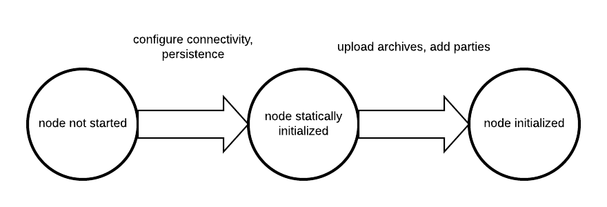

import ExternalCantonMainCommunityAppSrcTestResourcesDocumentationSnippetsNoFailFast from "/snippets/external/canton/main/community/app/src/test/resources/documentation-snippets/no-fail-fast.mdx";
import ExternalCantonMainCommunityAppSrcTestResourcesDocumentationSnippetsPortsFile from "/snippets/external/canton/main/community/app/src/test/resources/documentation-snippets/ports-file.mdx";
import ExternalCantonMainCommunityAppSrcTestResourcesDocumentationSnippetsPreviewCommands from "/snippets/external/canton/main/community/app/src/test/resources/documentation-snippets/preview-commands.mdx";
import ExternalCantonMainCommunityAppSrcPackExampleSimpleTopology from "//snippets/external/canton/main/community/app/src/pack/examples/01-simple-topology/simple-topology.mdx";

{/* COPIED_START source="docs-website:docs/replicated/canton/3.4/participant/howtos/configure/general/conf_file.rst" hash="01a8d862" */}

<Warning title="Pre-reviewed Content - Do Not Modify">
This section was copied from existing reviewed documentation.
**Source:** `docs/replicated/canton/3.4/participant/howtos/configure/general/conf_file.rst`
Reviewers: Skip this section. Remove markers after final approval.
</Warning>

Explain the difference between static and dynamic configuration. Move out specific configuration parts from here to their howto sections, such as multi-synchronizer below.

# Set Configuration Options

Canton differentiates between static and dynamic configuration. Static configuration is immutable and therefore has to be known from the beginning of the process. For a static configuration, examples would be the connectivity parameters to the local persistence store or the port the admin-apis should bind to. On the other hand, connecting to a synchronizer or adding parties are not matters of static configuration and therefore are not set via the config file but through console commands (or the administration APIs).

<figure>

</figure>

The configuration files themselves are written in [HOCON](https://github.com/lightbend/config/blob/master/HOCON.md) format with some extensions:

- Durations are specified scala durations using a `<length><unit>` format. Valid units are defined by [scala](https://github.com/scala/scala/blob/v2.13.3/src/library/scala/concurrent/duration/Duration.scala#L82) directly, but behave as expected using `ms`, `s`, `m`, `h`, `d` to refer to milliseconds, seconds, minutes, hours and days. Durations have to be non-negative in our context.

Canton does not run one node, but any number of nodes, be it synchronizers or participant nodes in the same process. Therefore, the root configuration allows to define several instances of synchronizers and participant nodes together with a set of general process parameters.

A sample configuration file for two participant nodes and a single synchronizer can be seen below.

<ExternalCantonMainCommunityAppSrcPackExampleSimpleTopology />

## Configuration reference

The Canton configuration file for static properties is based on [PureConfig](https://pureconfig.github.io/). PureConfig maps Scala case classes and their class structure into analogue configuration options (see e.g. the [PureConfig quick start](https://pureconfig.github.io/docs/#quick-start) for an example). Therefore, the ultimate source of truth for all available configuration options and the configuration file syntax is given by the [CantonConfig Scala reference](/reference/scala/com-digitalasset-canton-config/cantonconfig) and the related types in `com.digitalasset.canton.config`.

When understanding the mapping from scaladocs to configuration, please keep in mind that:

- CamelCase Scala names are mapped to lowercase-with-dashes names in configuration files, e.g. `synchronizerParameters` in the scaladocs becomes `synchronizer-parameters` in a configuration file (dash, not underscore).
- `Option[&lt;scala-class&gt;]` means that the configuration can be specified but doesn't need to be, e.g. you can specify a JWT token via `token=token` in [RemoteParticipantConfig](/reference/scala/com-digitalasset-canton-participant-config/remoteparticipantconfig), but not specifying `token` is also valid.

## Configuration Compatibility

The enterprise edition configuration files extend the community configuration. As such, any community configuration can run with an enterprise binary, whereas not every enterprise configuration file will also work with community versions.

## Advanced Configurations

Configuration files can be nested and combined together. First, using the `include required` directive (with relative paths), a configuration file can include other configuration files.

{/* TODO: Rework this example https://github.com/DACH-NY/canton/issues/23924 */}

```
canton {
    synchronizers {
        include required(file("synchronizer1.conf"))
    }
}
```

The `required` keyword will trigger an error, if the included file does not exist; without the `required` keyword, any missing files will be silently ignored. The `file` keyword instructs the configuration parser to interpret its argument as a file name; without this keyword, the parser may interpret the given name as a URL or classpath resource. By using the `file` keyword, you will also get the most intuitive semantics and most stable semantics of `include`. The precise rules for resolving relative paths can be found [here](https://github.com/lightbend/config/blob/master/HOCON.md#include-semantics-locating-resources).

Second, by providing several configuration files, we can override configuration settings using explicit configuration option paths:

```
canton.participants.myparticipant.admin-api.port = 11234
```

If the same key is included in multiple configurations, then the last definition has highest precedence.

Furthermore, HOCON supports substituting environment variables for config values using the syntax `key = ${ENV_VAR_NAME}` or optional substitution `key = ${?ENV_VAR_NAME}`, where the key will only be set if the environment variable exists.

## Configuration Mixin

Even more than multiple configuration files, we can leverage [PureConfig](https://github.com/pureconfig/pureconfig) to create shared configuration items that refer to environment variables. A handy example is the following, which allows for sharing database configuration settings in a setup involving several synchronizers or participant nodes:

``` none
# Postgres persistence configuration mixin
#
# This file defines a shared configuration resources. You can mix it into your configuration by
# refer to the shared storage resource and add the database name.
#
# Example:
#   participant1 {
#     storage = ${_shared.storage}
#     storage.config.properties.databaseName = "participant1"
#   }
#
# The user and password is not set. You want to either change this configuration file or pass
# the settings in via environment variables POSTGRES_USER and POSTGRES_PASSWORD.
#
_shared {
    storage {
        type = postgres
        config {
            dataSourceClass = "org.postgresql.ds.PGSimpleDataSource"
            properties = {
                serverName = "localhost"
                # the next line will override above "serverName" in case the environment variable POSTGRES_HOST exists
                # which makes it optional
                serverName = ${?POSTGRES_HOST}
                portNumber = "5432"
                portNumber = ${?POSTGRES_PORT}
                # user and password are required
                user = ${POSTGRES_USER}
                password = ${POSTGRES_PASSWORD}
            }
        }
        parameters {
            # If defined, will configure the number of database connections per node.
            # Please note that the number of connections can be fine tuned for participant nodes (see participant.conf)
            max-connections = ${?POSTGRES_NUM_CONNECTIONS}
            # If true, then database migrations will be applied on startup automatically
            # Otherwise, you will have to run the migration manually using participant.db.migrate()
            migrate-and-start = false
            # If true (default), then the node will fail to start if it can not connect to the database.
            # The setting is useful during initial deployment to get immediate feedback when the
            # database is not available.
            # In a production setup, you might want to set this to false to allow uncoordinated startups between
            # the database and the node.
            fail-fast-on-startup = true
        }
    }
}
```

Such a definition can subsequently be referenced in the actual node definition:

#\. Add examples here \<[https://github.com/DACH-NY/canton/issues/23873](https://github.com/DACH-NY/canton/issues/23873)\>

```hocon
canton {
    synchronizers {
        mysynchronizer {
            storage = ${_shared.storage}
            storage.config.properties.databaseName = ${CANTON_DB_NAME_SYNCHRONIZER}
        }
    }
}
```
## Multiple Synchronizers

A Canton configuration allows you to define multiple synchronizers. Also, a Canton participant can connect to multiple synchronizers. This is however only supported as a preview feature and not yet suitable for production use.

In particular, contract key uniqueness cannot be enforced over multiple synchronizers. In this situation, you must turn off contract key uniqueness in the Canton configuration. Please note that the setting is final and cannot be changed subsequently. We will provide a migration path once multi-synchronizer functionality is fully implemented.

## Fail Fast Mode

By default, Canton will fail to start if it cannot access some external dependency such as the database. This is preferable during initial deployment and development, as it provides instantaneous feedback, but can cause problems in production. As an example, if Canton is started with a database in parallel, the Canton process would fail if the database is not ready before the Canton process attempts to access it. To avoid this problem, you can configure a node to wait indefinitely for an external dependency such as a database to start. The config option below will disable the "fail fast" behavior for `participant1`.

<ExternalCantonMainCommunityAppSrcTestResourcesDocumentationSnippetsNoFailFast />

This option should be used with care as, by design, it can cause infinite, noisy waits.

## Init Configuration

Some configuration values are only used during the first initialization of a node and cannot be changed afterwards. These values are located under the `init` section of the relevant configuration of the node. Below is an example with some init values for a participant config

``` none
participant1 {
  init {
    // example settings
    ledger-api.max-deduplication-duration = 1 minute
    identity.node-identifier.type = random
  }
}
```

The option `ledger-api.max-deduplication-duration` sets the maximum deduplication duration that the participant uses for command deduplication.

{/* COPIED_END */}

{/* COPIED_START source="docs-website:docs/replicated/canton/3.4/participant/howtos/configure/general/command_line.rst" hash="5d37a7f5" */}

<Warning title="Pre-reviewed Content - Do Not Modify">
This section was copied from existing reviewed documentation.
**Source:** `docs/replicated/canton/3.4/participant/howtos/configure/general/command_line.rst`
Reviewers: Skip this section. Remove markers after final approval.
</Warning>

# Use the Canton Command Line

Canton supports a variety of command line arguments. Please run `bin/canton --help` to see all of them. Here, we explain the most relevant ones.

## Selecting a Configuration

Canton requires a configuration file to run. There is no default topology configuration built in and therefore, the user needs to at least define what kind of node (synchronizer or participant) and how many they want to run in the given process. Sample configuration files can be found in our release package, under the `examples` directory.

When starting Canton, configuration files can be provided using

```bash
bin/canton --config conf_filename -c conf_filename2
```

which will start Canton by merging the content of `conf_filename2` into `conf_filename`. Both options `-c` and `--config` are equivalent. If several configuration files assign values to the same key, the *last* value is taken. The section on static configuration explains how to write a configuration file.

You can also specify config parameters on the command line, alone or along with configuration files, to specify missing parameters or to overwrite others. This can be useful for providing simple short config info. Config parameters can be provided using `-C`:

```bash
bin/canton --config conf_filename -C canton.participants.participant1.storage.type=memory
```

## Run Modes

You can run Canton in various modes, depending on the desired environment and task.

### Interactive Console

The default method to run Canton is in the interactive mode. The process will start a command line interface (REPL) which allows to conveniently operate, modify and inspect the Canton application.

In this mode, all errors will be reported as `CommandExecutionException` to the console, but Canton will remain running.

The interactive console can be started together with a script, using the `--bootstrap=...` option. The script uses the same syntax as the console.

The interactive mode is useful for development, education and expert use.

### Daemon

If the console is undesired such as in server operation, Canton can be started in daemon mode

```bash
bin/canton daemon --config ...
```

All configured entities will be automatically started and will resume operation.

A failure to connect to the database storage will lead the process to exit with a non-zero exit code. This can be turned off using:

<ExternalCantonMainCommunityAppSrcTestResourcesDocumentationSnippetsNoFailFast />

Any failures encountered while running the bootstrap script will immediately shutdown the Canton process with a non-zero exit code.

Nodes started in daemon mode can be administrated by setting up a remote console that provides the interactive user experience, while the nodes run in a separate process.

### Sandbox

During development, it can be useful to run a lightweight ledger with a given DAR. For this purpose, you can run Canton in sandbox mode, which runs the Daml Sandbox.

```bash
bin/canton sandbox --dar Main.dar ...
```

### Headless Script Mode

For testing and scripting purposes, Canton can also start in headless script mode:

```bash
bin/canton run &lt;script-path&gt; --config ...
```

In this case, commands are specified in a script rather than executed interactively. Any errors with the script or during command execution should cause the Canton process to exit with a non-zero exit code. When the script completes all components are stopped.

### Interactive Server Process using Screen

In some situations, we find it convenient to run even a server process interactively. For server use on Linux / OSX, this can be accomplished by using the [screen](https://linux.die.net/man/1/screen) command:

```bash
screen -S canton -d -m ./bin/canton -c ...
```

will start the Canton process in a screen session named `canton` which does not terminate on user-logout and therefore allows to inspect the Canton process whenever necessary.

A previously started process can be joined using

```bash
screen -r canton
```

and an active screen session can be detached using CTRL-A + D (in sequence). Be careful and avoid typing CTRL-D, as it will terminate the session. The screen session will continue to run even if you log out of the machine.

## Java Virtual Machine Arguments

The `bin/canton` application is a convenient wrapper to start a Java virtual machine running the Canton process. The wrapper supports providing additional JVM options using the `JAVA_OPTS` environment variable or using the `-D` command line option.

For example, you can configure the heap size as follows:

```bash
JAVA_OPTS="-Xmx2G" ./bin/canton --config ...
```

There are several log related options that can be specified. Refer to Logging for more details.

{/* COPIED_END */}

{/* COPIED_START source="docs-website:docs/replicated/canton/3.4/participant/howtos/configure/general/declarative_conf.rst" hash="29ee858d" */}

<Warning title="Pre-reviewed Content - Do Not Modify">
This section was copied from existing reviewed documentation.
**Source:** `docs/replicated/canton/3.4/participant/howtos/configure/general/declarative_conf.rst`
Reviewers: Skip this section. Remove markers after final approval.
</Warning>

# Declarative Configuration

<Note>
Declarative configuration is an alpha feature and initially only available for participant nodes.
</Note>

By default, Canton at runtime is administered using API requests for scalability purposes. For smaller-sized deployments, Canton also supports configuration settings for dynamic changes. This configuration can add or remove DARs, parties, synchronizers, users, and identity providers, and can be used as follows:

``` none
// enable dynamic configuration explicitly (alpha feature, turned off by default)
canton.parameters.enable-alpha-state-via-config = yes
canton.parameters.state-refresh-interval = 5s

// this is an example configuration file
// note that the configuration format will possibly change in the future based
// on the feedback we get from the community
canton.participants.myparticipant.alpha-dynamic {
  fetched-dar-directory = "fetched-dars"
  // upload dars
  dars = [
    { location = "dars/CantonExamples.dar", expected-main-package = "abcd" }
    { location = "https://path.to/repo/token.dar", request-headers = { AuthenticationToken : "mytoken" }}
  ],
  // define parties
  parties = [
    { party = "Alice", synchronizers = ["mysync"] }
    { party = "Bob" }
  ],
  // if true, then parties found which are not in the configuration file will be deleted
  remove-parties = false
  // define identity providers
  idps = [
    { identity-provider-id = "idp1", issuer = "issuer", jwks-url = "https://path.to/jwks", audience = "optional", is-deactivated = false }
  ]
  // if true, then idps found which are not in the configuration file will be deleted
  remove-idps = false
  // define users
  users = [
    { user = "User1", primary-party = "Alice", is-deactivated = false, annotations = {"key" : "value"},
      identity-provider-id = "idp1", rights = {
        act-as = ["Alice"],
        read-as = ["Bob"],
        read-as-any-party = true
        participant-admin = true
        identity-provider-admin = true
      }
    }
  ]
  // if true, then users found which are not in the configuration file will be deleted
  remove-users = false
  // define synchronizers
  connections = [{
    synchronizer-alias = "mysync"
    manual-connect = false
    priority = 0
    trust-threshold = 1
    connections = {
      "first" : {
        endpoints = [{ host = "localhost", port = 1234 }]
        transport-security = true
        custom-trust-certificate = "cert.pem"
      }
    }
  }]
}
```

Please note that all configuration files will be checked regularly for file modifications, triggering a reload and applying the changes to the node.

The metrics `daml.declarative_api.items` and `daml.declarative_api.errors` provide insights into the amount of items managed through the state configuration file. Negative error codes mean that something fundamental with the sync did not succeed (-1 if the config file cannot be parsed, -2 if something failed during the preparation of the sync, and -3 if the sync itself failed fundamentally), while positive error codes point to a number of items that failed. Anything other than 0 errors means something is wrong.

Some settings can only be applied if certain preconditions are met. Assigning a party to a user is only possible if a synchronizer is already registered. Therefore, some of the changes will only appear once these preconditions are met. However, it is safe to define a target state with parties before the participant is connected to a synchronizer.

It is also possible to mix declarative and imperative configurations. Excess items defined through the API will not be deleted unless explicitly configured to do so.

{/* COPIED_END */}

{/* COPIED_START source="docs-website:docs/replicated/canton/3.4/participant/howtos/configure/storage/storage.rst" hash="02111269" */}

<Warning title="Pre-reviewed Content - Do Not Modify">
This section was copied from existing reviewed documentation.
**Source:** `docs/replicated/canton/3.4/participant/howtos/configure/storage/storage.rst`
Reviewers: Skip this section. Remove markers after final approval.
</Warning>

# Configure storage

Canton needs to persist data to operate. Participant Nodes, Mediator Nodes, and Synchronizer Nodes all require storage configuration.

<Note>
Canton creates, manages and upgrades the database schema directly on startup.
</Note>

## Configure production storage

For production deployments, the only supported storage is [PostgreSQL](https://www.postgresql.org/). Please see Configure Canton with Postgres for details on how to configure it.

## Other storage configurations

<Warning>
The following storage configurations are not supported for production deployments. They are provided for testing, development, and experimental purposes only.
</Warning>

### Configure in-memory storage

By default, in-memory storage is used if no other storage configuration is provided. With in-memory storage, in place of a relational database, in-memory data structures store the data. A consequence of this is that all data is lost when the node is stopped.

This example shows explicit in-memory configuration for a Sequencer, Mediator, and Participant Node:

``` none
# Configures sequencer1, mediator1, and participant1 to use in-memory storage.
canton {
  sequencers.sequencer1.storage.type = memory
  mediators.mediator1.storage.type = memory
  participants.participant1.storage.type = memory
}
```

### Configure H2 storage

This example shows [H2](https://www.h2database.com/) storage configuration for a Sequencer, Mediator, and Participant Node:

``` none
# Configures sequencer1, mediator1, and participant1 to use file based H2 storage.
canton {
  sequencers.sequencer1.storage {
    type = h2
    config.url = "jdbc:h2:file:./data/sequencer1;MODE=PostgreSQL;LOCK_TIMEOUT=10000;DB_CLOSE_DELAY=-1"
  }
  mediators.mediator1.storage {
    type = h2
    config.url = "jdbc:h2:file:./data/mediator1;MODE=PostgreSQL;LOCK_TIMEOUT=10000;DB_CLOSE_DELAY=-1"
  }
  participants.participant1.storage {
    type = h2
    config.url = "jdbc:h2:file:./data/participant1;MODE=PostgreSQL;LOCK_TIMEOUT=10000;DB_CLOSE_DELAY=-1"
  }
}
```

The `jdbc:` prefixed `url` can be [configured in many ways](https://www.h2database.com/html/features.html#database_url). The example above configures:

Embedded file based storage
On canton startup embedded H2 databases will be created in the `./data` directory relative to the Canton node's working directory and will have the file suffix `.mv.db`. When using H2 [embedded connection mode](https://www.h2database.com/html/features.html#connection_modes) only a single process can access the database at a time, so to inspect the database, it will be necessary to stop Canton first. Once no other process is accessing the database, it can be inspected using the H2 tools, such as the [H2 Console](https://www.h2database.com/html/quickstart.html#h2-console).

MODE=PostgreSQL
This is essential as the SQL dialect used by Canton is PostgreSQL. This setting enables [PostgreSQL compatibility mode](https://www.h2database.com/html/features.html#postgresql_mode).

LOCK_TIMEOUT=10000
This gives a thread 10 seconds to acquire a database lock before timing out.

DB_CLOSE_DELAY=-1
This setting keeps the database open until the Canton process terminates.

{/* COPIED_END */}

{/* COPIED_START source="docs-website:docs/replicated/canton/3.4/participant/howtos/configure/storage/postgres.rst" hash="e08b03d4" */}

<Warning title="Pre-reviewed Content - Do Not Modify">
This section was copied from existing reviewed documentation.
**Source:** `docs/replicated/canton/3.4/participant/howtos/configure/storage/postgres.rst`
Reviewers: Skip this section. Remove markers after final approval.
</Warning>

# Configure Canton with PostgreSQL<span id="postgres-config"></span>

## Example configuration

This example shows a [PostgreSQL](https://https://www.postgresql.org/) storage configuration for a Sequencer, Mediator, and Participant Node all running on a local PostgreSQL database instance on port `5432`.

``` none
# Configures sequencer1, mediator1, and participant1 with locally running PostgreSQL storage.
canton {
  sequencers.sequencer1.storage {
    type = postgres
    config {
      dataSourceClassName = "org.postgresql.ds.PGSimpleDataSource"
      properties = {
        serverName = "localhost"
        databaseName = "sequencer1_db"
        portNumber = "5432"
        user = "sequencer1"
        password = "pgpass"
      }
    }
  }
  mediators.mediator1.storage {
    type = postgres
    config {
      dataSourceClassName = "org.postgresql.ds.PGSimpleDataSource"
      properties = {
        serverName = "localhost"
        databaseName = "mediator1_db"
        portNumber = "5432"
        user = "mediator1"
        password = "pgpass"
      }
    }
  }
  participants.participant1.storage {
    type = postgres
    config {
      dataSourceClassName = "org.postgresql.ds.PGSimpleDataSource"
      properties = {
        serverName = "localhost"
        databaseName = "participant1_db"
        portNumber = "5432"
        user = "participant1"
        password = "pgpass"
      }
    }
  }
}
```

## Configure the connection pool

Canton uses [HikariCP](https://github.com/brettwooldridge/HikariCP) for connection pooling. This is configured in `storage.config`. We recommend this article on how to [choose the size of the pool.](https://github.com/brettwooldridge/HikariCP/wiki/About-Pool-Sizing)

<Note>
The setup of `dataSourceClassName` and `properties` for PostgreSQL are discussed in the next section.
</Note>

The set of pool properties that may be set is given below, the descriptions of the properties can be found in the associated `get`/`set` method descriptions for [HikariConfig](https://www.javadoc.io/doc/com.zaxxer/HikariCP/3.2.0/com/zaxxer/hikari/HikariConfig.html).

|                        |                           |                        |
|------------------------|---------------------------|------------------------|
| allowPoolSuspension    | catalog                   | connectionInitSql      |
| connectionTestQuery    | connectionTimeout         | dataSourceClassName    |
| idleTimeout            | initializationFailTimeout | isolateInternalQueries |
| leakDetectionThreshold | maxLifetime               | maximumPoolSize        |
| minimumIdle            | poolName                  | properties             |
| readOnly               | registerMbeans            | schema                 |
| validationTimeout      |                           |                        |

## Configure the PostgreSQL data source

To create a connection `HikariCP` uses the *data-source* `dataSourceClassName` configured using the properties in `properties`. We recommend using the `org.postgresql.ds.PGSimpleDataSource` *data-source* configured with the following properties:

> - serverName
> - databaseName
> - portNumber
> - user
> - password

You can find the details of additional supported properties by reviewing the associated `get`/`set` method descriptions for [PGSimpleDataSource](https://jdbc.postgresql.org/documentation/publicapi/org/postgresql/ds/PGSimpleDataSource.html).

### Use environment variables in configuration

You can use environment variables to configure the PostgreSQL data-source properties. This is useful for sensitive information like passwords or when you want to avoid hardcoding values in your configuration files.

In this example all the database properties are set using environment variables. The environment variables are prefixed with `SEQUENCER1_` to avoid conflicts with other configurations.

``` 
config {
  dataSourceClassName = "org.postgresql.ds.PGSimpleDataSource"
  properties = {
    serverName = ${SEQUENCER1_SERVER}
    databaseName = ${SEQUENCER1_DB}
    portNumber = ${SEQUENCER1_PORT}
    user = ${SEQUENCER1_USER}
    password = ${SEQUENCER1_PASSWORD}
  }
```

### Share database configuration across nodes

This example shows how [PureConfig](https://github.com/pureconfig/pureconfig) can be used to share common database configuration across multiple nodes in a Canton setup.

``` none
# Postgres persistence configuration mixin
#
# This file defines a shared configuration resources. You can mix it into your configuration by
# refer to the shared storage resource and add the database name.
#
# Example:
#   participant1 {
#     storage = ${_shared.storage}
#     storage.config.properties.databaseName = "participant1"
#   }
#
# The user and password is not set. You want to either change this configuration file or pass
# the settings in via environment variables POSTGRES_USER and POSTGRES_PASSWORD.
#
_shared {
    storage {
        type = postgres
        config {
            dataSourceClass = "org.postgresql.ds.PGSimpleDataSource"
            properties = {
                serverName = "localhost"
                # the next line will override above "serverName" in case the environment variable POSTGRES_HOST exists
                # which makes it optional
                serverName = ${?POSTGRES_HOST}
                portNumber = "5432"
                portNumber = ${?POSTGRES_PORT}
                # user and password are required
                user = ${POSTGRES_USER}
                password = ${POSTGRES_PASSWORD}
            }
        }
        parameters {
            # If defined, will configure the number of database connections per node.
            # Please note that the number of connections can be fine tuned for participant nodes (see participant.conf)
            max-connections = ${?POSTGRES_NUM_CONNECTIONS}
            # If true, then database migrations will be applied on startup automatically
            # Otherwise, you will have to run the migration manually using participant.db.migrate()
            migrate-and-start = false
            # If true (default), then the node will fail to start if it can not connect to the database.
            # The setting is useful during initial deployment to get immediate feedback when the
            # database is not available.
            # In a production setup, you might want to set this to false to allow uncoordinated startups between
            # the database and the node.
            fail-fast-on-startup = true
        }
    }
}
```

## Use SSL

Configure SSL using the following `PGSimpleDataSource` properties.

ssl = true
Verify both the SSL certificate and verify the hostname

sslmode= "verify-ca"
Check the certificate chain up to the root certificate stored on the client.

sslrootcert = "path/to/root.cert"
Optionally set this to set with path to root certificate.

For more details on how to configure SSL in PostgreSQL, see the [PostgreSQL SSL](https://jdbc.postgresql.org/documentation/ssl/) documentation.

### Use mTLS

To configure mutual TLS ([mTLS](https://en.wikipedia.org/wiki/Mutual_authentication#mTLS)) you can use the following additional properties:

> - sslcert = "path/to/client-cert.pem"
> - sslkey = "path/to/client-key.p12"

## Set up the PostgreSQL database

A separate database is required for each Canton node. Create the database before starting Canton.

<Note>
The canton distribution provides a script, `config/utils/postgres/db.sh`, to help create the database and users.
</Note>

### Create the database

Databases must be created with UTF8 encoding to ensure proper handling of Unicode characters. The following SQL command creates a database named `participant1_db` with UTF8 encoding:

```sql
create database participant1_db encoding = 'UTF8';
```

### Create a database user

The database user configured in the *data-source* properties must have the necessary permissions to create and modify the database schema, in addition to reading and writing data.

The following SQL commands create a user named `participant1_user` with a password and grant all privileges on the database:

```sql
create user participant1_user with password 'change-me';
grant all privileges on database participant1_db to participant1_user;
```

## Operations

### Optimize storage

See Storage Optimization.

### Backup

See Backup and Restore.

### Setup HA

See High Availability Usage.

## Use a cloud hosted database

You can use a cloud-hosted PostgreSQL database, such as [Amazon RDS](https://aws.amazon.com/rds/postgresql/), [Google Cloud SQL](https://cloud.google.com/sql/docs/postgres), or [Azure Database for PostgreSQL](https://azure.microsoft.com/en-us/services/postgresql/).

Please refer to the documentation of the respective cloud provider for details on how to set up and configure and secure a PostgreSQL database.

{/* COPIED_END */}

{/* COPIED_START source="docs-website:docs/replicated/canton/3.4/participant/howtos/configure/parameters/parameters.rst" hash="978f5ecd" */}

<Warning title="Pre-reviewed Content - Do Not Modify">
This section was copied from existing reviewed documentation.
**Source:** `docs/replicated/canton/3.4/participant/howtos/configure/parameters/parameters.rst`
Reviewers: Skip this section. Remove markers after final approval.
</Warning>

# Configure Canton parameters

## Participant Node protocol version

On Participant Node connection to a Sequencer Node there is a handshake between the nodes to ensure that the Synchronizer protocol version is compatible. By default a Participant Node can connect to a Synchronizer running any stable protocol version.

### Ensure a minimum protocol version

Setting a minimum protocol version ensures that the Participant Node can only connect to a Synchronizer running a protocol version at least as high as the configured minimum. Use this to ensure a Participant Node cannot connect to a Synchronizer running an protocol version known to have an security exploit or that doesn't support a required feature.

For example to ensure that the Synchronizer protocol version is at least version **33** set the `minimum-protocol-version` Participant Node parameter:

``` 
canton.participants.participant1.parameters.minimum-protocol-version=33
```

### Enable early access protocol features

<Warning>
The use of early access is intended for non-production environments and is not covered by support
</Warning>

#### Enable alpha protocol versions

To allow a Participant Node to connect to a Synchronizer running an alpha protocol version, set the `alpha-version-support` parameter to `true`. As this is an experimental feature, it's necessary to also set the `non-standard-config` parameter to `true`:

``` none
canton.parameters {
  # turn on non-standard configuration support
  non-standard-config = yes

  # turn on support of alpha version support for synchronizer nodes
  alpha-version-support = yes
}

canton.participants.participant1.parameters = {
  # enable alpha version support on the participant (this will allow the participant to connect to a synchronizer running protocol version dev or any other alpha protocol)
  # and it will turn on support for unsafe daml lf dev versions
  # not to be used in production and requires you to define non-standard-config = yes
  alpha-version-support = yes
}
```

#### Enable beta protocol versions

To allow a Participant Node to connect to a Synchronizer running an beta protocol version, set the `beta-version-support` parameter to `true`. As this is an experimental feature, it's necessary to also set the `non-standard-config` parameter to `true`:

``` 
```

``` none
canton.parameters {
  # turn on support of beta version support for synchronizer nodes
  beta-version-support = yes
}

canton.participants.participant1.parameters = {
  # enable beta version on the participant (this will allow the participant to connect to a synchronizer with beta protocol version)
  beta-version-support = yes
}
```

## Detect when Canton has started

When running Canton inside a test environment, it can be useful to detect when Canton has started.

To instruct Canton to write a file containing details of the running ports when initialized, configure a ports-file:

<ExternalCantonMainCommunityAppSrcTestResourcesDocumentationSnippetsPortsFile />

On startup, Canton writes to the ports-file the values of the ports its services are running on:

```json
{
  "participant1" : {
    "ledgerApi" : 5021,
    "adminApi" : 5022,
    "jsonApi" : null
  }
}
```

## Enable preview commands

Canton console *preview commands* are commands that are not considered stable and are not listed in command group help requests.

To enable preview commands, set the `enable-preview-commands` parameter to `yes` in the configuration file. Preview commands are now listed in command group help requests and may be used.

<Warning>
Preview commands are not guaranteed to be stable and may change in future releases.
</Warning>

<ExternalCantonMainCommunityAppSrcTestResourcesDocumentationSnippetsPreviewCommands />

{/* COPIED_END */}