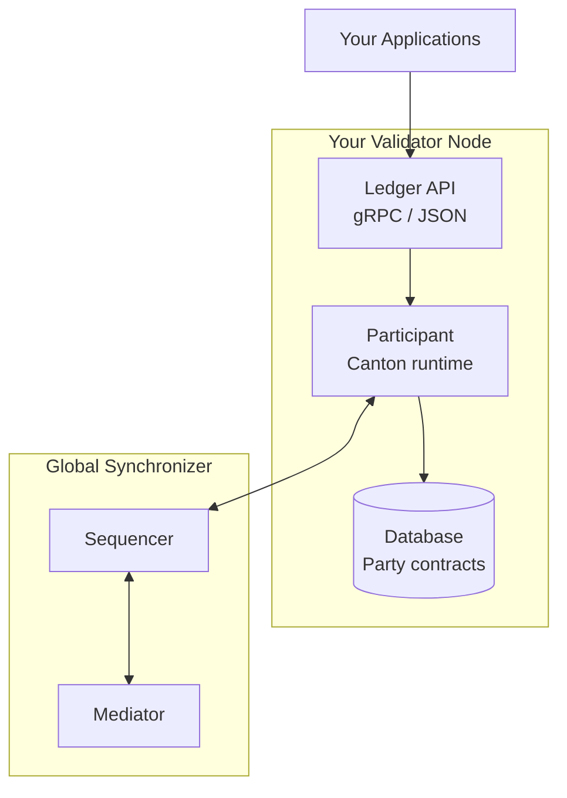
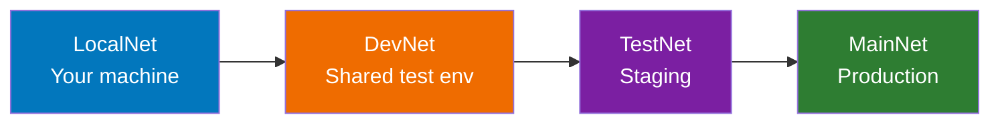

The Global Synchronizer is the public coordination layer of Canton Network, operated by a decentralized set of validators. This section introduces what it means to operate a node on this network.

## What is a Validator?

A **validator** (also called participant node) is infrastructure that:

- **Hosts parties**: Stores contract data for the parties it hosts
- **Participates in consensus**: Confirms transactions affecting its parties
- **Exposes APIs**: Provides Ledger API access for applications
- **Connects to the Global Synchronizer**: Provides connectivity to other validators on the Canton Network

## Validator vs. Super Validator

**Validators:**
- Host parties and store contracts
- Expose Ledger APIs for applications
- Operated by application operators and enterprises

**Super Validators:**
- Operate synchronizer infrastructure (sequencer, mediator nodes)
- Participate in network governance
- Operated by major institutions and approved operators

As a validator, you:
- Run your own participant node
- Host parties for your users/applications
- Pay traffic fees in Canton Coin
- Are expected to keep your node updated with versions mandated by the network
- Do **not** operate synchronizer components (sequencer/mediator)
- Do **not** participate directly in network governance
- Do **not** run BFT consensus nodes

## Network Environments

Canton Network operates across four environments:

- **LocalNet**: Local development environment, accessible to anyone, uses local test CC
- **DevNet**: Integration testing environment, requires VPN and sponsorship, uses faucet for test CC
- **TestNet**: Staging environment, requires application process, uses faucet for test CC
- **MainNet**: Production environment, requires full onboarding, CC has real value

### Progression Path

**Moving between environments requires:**
- **LocalNet → DevNet**: VPN credentials, Super Validator sponsorship
- **DevNet → TestNet**: Application approval, IP whitelisting
- **TestNet → MainNet**: Full onboarding process, operational readiness

## Operating Models

You have two primary options for running validator infrastructure:

### Option 1: Self-Hosted

Run your own validator infrastructure on your own (or cloud) servers.

| Aspect | Details |
|--------|---------|
| **Control** | Full control over infrastructure |
| **Responsibility** | You manage operations, upgrades, security |
| **Requirements** | Technical expertise, operational capacity |
| **Cost** | Infrastructure costs + operational overhead |

**Best for:** Organizations with DevOps/SRE capacity, specific compliance requirements, or need for full control.

### Option 2: Node-as-a-Service

Use a provider to host and manage your validator infrastructure.

| Aspect | Details |
|--------|---------|
| **Control** | Configuration control; provider manages operations |
| **Responsibility** | Provider handles upgrades, availability |
| **Requirements** | Contract with provider |
| **Cost** | Service fees |

**Best for:** Teams focused on application development, organizations without infrastructure expertise.

## What Running a Validator Involves

### Day-to-Day Operations

| Task | Frequency | Description |
|------|-----------|-------------|
| **Monitoring** | Continuous | Health checks, performance metrics |
| **Log management** | Continuous | Capture and analyze logs |
| **Upgrades** | Weekly-monthly | Keep pace with network versions |
| **Traffic management** | As needed | Ensure Canton Coin balance for fees |
| **Backup** | Regular | Database and identity backups |

### Upgrade Expectations

The Global Synchronizer upgrades frequently:

| Type | Frequency | Impact |
|------|-----------|--------|
| **Minor updates** | Weekly-monthly | Usually backward compatible |
| **Feature releases** | Quarterly | May require configuration changes |
| **Security patches** | As needed | Critical; rapid deployment required |

<Warning>
Validators must keep pace with network upgrades. Falling behind versions can result in disconnection from the network.
</Warning>

## Getting Started

### Prerequisites

Before deploying a validator, ensure you have:

1. **Sponsorship**: A Super Validator must sponsor your onboarding
2. **Infrastructure**: Meet the [infrastructure requirements](/docs-main/global-synchronizer/understand/infrastructure-requirements)
3. **Technical capacity**: Team capable of operating containerized services
4. **Canton Coin**: Budget for traffic fees (TestNet/MainNet)

### Onboarding Process

1. **Contact a Super Validator** sponsor ([list at canton.foundation](https://canton.foundation))
2. **Provide your egress IP** for network allowlisting
3. **Wait for allowlisting** (typically 2-7 days)
4. **Obtain onboarding secret** from your sponsor
5. **Deploy your validator** with the onboarding configuration
6. **Verify connectivity** and begin operations

<Note>
DevNet is the recommended starting point for testing. DevNet secrets can be obtained via API and are valid for 1 hour. TestNet and MainNet secrets require manual provision from your sponsor.
</Note>

## Key Responsibilities

As a validator operator, you are responsible for:

| Responsibility | Description |
|----------------|-------------|
| **Availability** | Keep your node running and connected |
| **Security** | Protect your infrastructure and keys |
| **Upgrades** | Stay current with network versions |
| **Traffic** | Maintain Canton Coin balance for fees |
| **Compliance** | Meet any regulatory requirements for your jurisdiction |

## What You Don't Need to Worry About

The Global Synchronizer handles:
- **Consensus**: Super Validators run BFT consensus
- **Governance**: The Global Synchronizer Foundation (GSF) manages network parameters. GSF is the non-profit foundation that governs the Global Synchronizer.
- **Sequencing**: Synchronizer orders transactions
- **Mediation**: Synchronizer manages confirmations

## Next Steps

<CardGroup cols={2}>

<Card title="Infrastructure Requirements" icon="server" href="/docs-main/global-synchronizer/understand/infrastructure-requirements">
  Hardware, software, and network requirements.
</Card>

<Card title="Validator Roles" icon="user-gear" href="/docs-main/global-synchronizer/understand/validator-roles">
  Understand your responsibilities as a validator.
</Card>

</CardGroup>
