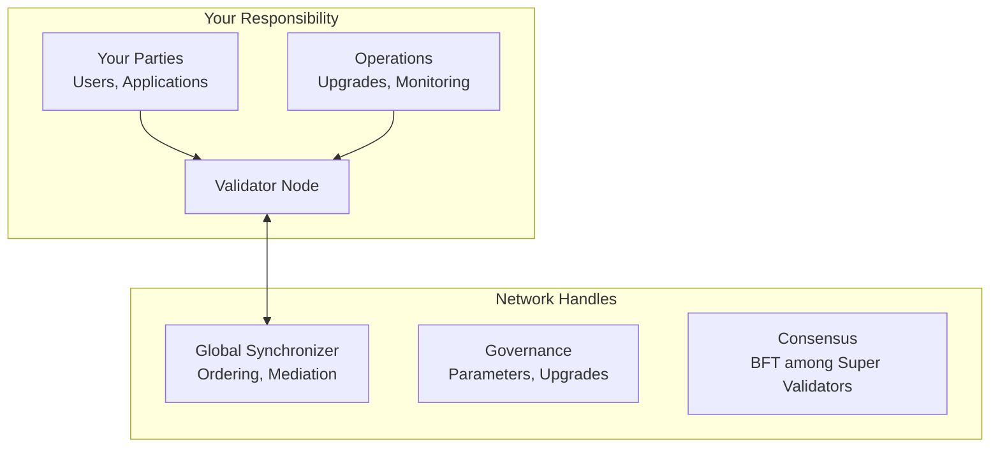

Operating a validator on Canton Network comes with specific roles, responsibilities, and expectations. This page clarifies what's expected of validators versus what the network handles.

## The Validator's Role

As a validator, you operate a **participant node** that:

1. **Hosts parties** for users and applications
2. **Stores contract data** for those parties
3. **Validates transactions** affecting your parties
4. **Connects to the synchronizer** for coordination
5. **Exposes APIs** for applications to interact with the ledger

## What You Are Responsible For

### Infrastructure Operations

- **Node availability**: Keep your validator running and connected
- **Performance**: Ensure adequate resources for your workload
- **Upgrades**: Stay current with network versions
- **Monitoring**: Track health, performance, and errors
- **Backup**: Regular backups of database and identity
- **Security**: Protect infrastructure, keys, and access

### Party Management

- **Onboarding**: Create and manage parties on your validator
- **Key management**: Secure storage of party keys
- **Access control**: Control who can act as which parties
- **Data custody**: Your validator stores your parties' data

### Traffic (Transaction Fees)

- **Canton Coin balance**: Maintain sufficient CC for operations
- **Top-ups**: Replenish traffic when needed
- **Cost management**: Monitor and optimize traffic usage

## What You Are NOT Responsible For

### Handled by the Global Synchronizer

| Function | Who Handles |
|----------|-------------|
| **Transaction ordering** | Synchronizer sequencer |
| **Confirmation aggregation** | Synchronizer mediator |
| **BFT consensus** | Super Validators |
| **Network parameters** | CF governance |
| **Upgrade coordination** | CF and SVs |

### Trust Model

As a validator, you trust that:

- The synchronizer orders transactions fairly
- Super Validators maintain availability
- Network parameters are set appropriately
- Upgrades are coordinated properly

You do NOT need to:

- Run consensus nodes
- Verify all network transactions
- Participate in governance votes
- Operate synchronizer infrastructure

## Operational Expectations

### Availability

| Expectation | Details |
|-------------|---------|
| **Uptime target** | Plan for 99%+ availability |
| **Planned maintenance** | Coordinate during low-traffic periods |
| **Incident response** | Monitor and respond to issues |

<Note>
Your parties cannot transact while your validator is offline. Plan maintenance windows carefully and communicate with your users.
</Note>

### Version Currency

The network upgrades frequently. Validators must keep pace:

| Timeframe | Action |
|-----------|--------|
| **As announced** | Apply security patches |
| **Before deadline** | Major version upgrades (announced in advance) |

<Warning>
Validators running outdated versions may be disconnected from the network. Monitor announcements and plan upgrade windows.
</Warning>

### Communication

Stay connected with the network:

| Channel | Purpose |
|---------|---------|
| **#validator-operations** | Slack channel for operational discussions |
| **Mailing lists** | lists.sync.global for announcements |
| **Release notes** | Track changes and requirements |

## Security Responsibilities

### Your Security Scope

| Asset | Your Responsibility |
|-------|---------------------|
| **Validator infrastructure** | Hardening, patching, access control |
| **Party keys** | Secure generation, storage, rotation |
| **Database** | Encryption, access control, backups |
| **API access** | Authentication, authorization, TLS |
| **Network perimeter** | Firewall, DDoS protection |

### Not Your Responsibility

| Asset | Handled By |
|-------|------------|
| **Synchronizer security** | Super Validators |
| **Protocol security** | Canton/Splice development |
| **Network-wide DoS protection** | Synchronizer operators |

## Compliance Considerations

Depending on your jurisdiction and use case:

| Consideration | Action |
|---------------|--------|
| **Data residency** | Ensure validator location meets requirements |
| **Audit requirements** | Maintain logs and records |
| **KYC/AML** | Implement for your parties if required |
| **Regulatory reporting** | Build necessary capabilities |

<Note>
Canton's privacy model helps with compliance by ensuring data stays with entitled parties. However, you remain responsible for your regulatory obligations.
</Note>

## Costs

Operating a validator involves several cost categories:

### Infrastructure Costs

Infrastructure costs depend on your deployment method, cloud provider, and transaction volume. See [Prerequisites](/global-synchronizer/deployment/prerequisites) for hardware sizing guidance. Use DevNet or TestNet to measure your actual resource consumption before estimating MainNet costs.

| Component | Notes |
|-----------|-------|
| **Compute** | Scales with hosted parties and transaction volume |
| **Database** | Scales with data volume; managed services (RDS, Cloud SQL) recommended |
| **Network** | Egress costs depend on traffic volume |
| **Storage** | Scales with ledger history retained |

### Network Costs

| Cost | Description |
|------|-------------|
| **Traffic fees** | Canton Coin for transactions |
| **Variable** | Based on transaction volume and size |

### Operational Costs

| Cost | Description |
|------|-------------|
| **Personnel** | Time for monitoring, upgrades, incidents |
| **Tooling** | Monitoring, logging, alerting |

## Support Resources

### Community Support

| Resource | Description |
|----------|-------------|
| **Slack** | #validator-operations for peer support |
| **Forum** | forum.canton.network for technical questions |
| **Documentation** | This site |

## Becoming a Validator

### Prerequisites

1. **Technical capacity**: Team capable of operating containerized services
2. **Infrastructure**: Meet [infrastructure requirements](/global-synchronizer/understand/infrastructure-requirements)
3. **Sponsorship**: Super Validator willing to sponsor
4. **Canton Coin**: Budget for traffic fees

### Process

1. **Contact a Super Validator** ([list at canton.foundation](https://canton.foundation))
2. **Discuss your use case** and onboarding requirements
3. **Prepare infrastructure** according to requirements
4. **Complete onboarding** with sponsorship
5. **Begin operations** and maintain your node

## Next Steps

<CardGroup cols={2}>

<Card title="Validator Setup" icon="server" href="/global-synchronizer/understand/introduction">
  Begin deploying your validator node.
</Card>

<Card title="Infrastructure Requirements" icon="list-check" href="/global-synchronizer/understand/infrastructure-requirements">
  Review detailed infrastructure requirements.
</Card>

</CardGroup>
