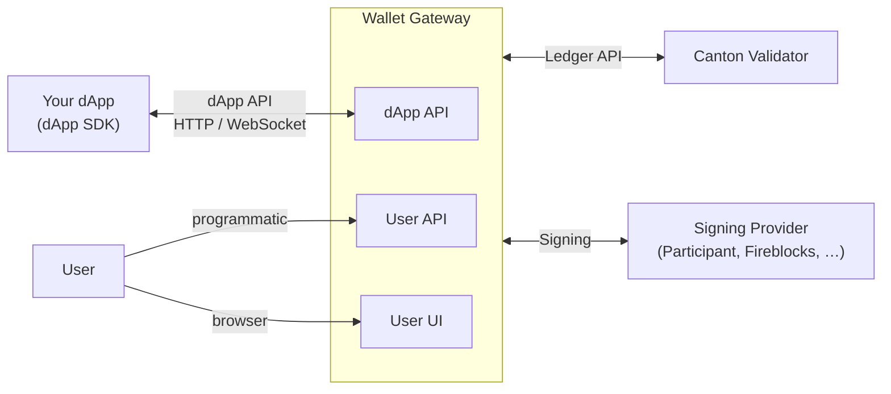

{/* COPIED_START source="wallet-gateway:docs/dapp-building/overview/index.md@82ec39c9" hash="339b53f6" */}

This guide helps you build **dApps** (decentralized applications) that interact with the **Canton Network** through the **Wallet Gateway** or other dApp API-compatible wallets.
You use the **dApp SDK** in your frontend to connect users to their wallets, and the Wallet Gateway mediates between your dApp, Canton validator nodes, and signing providers.

## What You're Building

A typical setup involves:

- **dApp** — A web or mobile application that lets users view ledger data, create contracts, and submit transactions. Your dApp uses the dApp SDK to connect to a wallet and call the dApp API.
- **Wallet Gateway** — A server that exposes the dApp API and User API, manages sessions, and talks to Canton validators and signing providers.
- **Canton Network** — The distributed ledger. Validator nodes expose a Ledger API; the Wallet Gateway connects to them on behalf of authenticated users.
- **Signing** — Transaction signing is handled by a **signing provider** (e.g. Canton participant, Fireblocks or Blockdaemon). Users create wallets (parties) tied to a network and a signing provider. For testing purposes the Gateway allows using it for signing.

## High-Level Architecture

- **dApp → Wallet Gateway**: Your dApp uses the dApp SDK to call the **dApp API** (connect, list accounts, prepare and execute transactions). The SDK can use HTTP (remote Wallet Gateway) or `postMessage` (browser extension).
- **User → Wallet Gateway**: Users manage wallets and approve transactions via the **User UI** or programmatically via the **User API** (sessions, networks, IDPs, wallets, sign, execute).
- **Wallet Gateway → Canton / Signing**: The Gateway authenticates to validator Ledger APIs and forwards signing requests to the configured signing provider.

## dApp API and dApp SDK

The **dApp API** is a JSON-RPC 2.0 interface specified by **CIP-103**.
You can call it directly (e.g. over HTTP or WebSocket) from your frontend or backend.
In practice, most developers use the **dApp SDK**, which implements the same protocol and adds a simpler API, multi-transport support (HTTP for remote Gateways, `postMessage` for browser-extension wallets), and an EIP-1193–style provider (`window.canton`).
The dApp API lets your frontend connect to a wallet, list accounts, prepare and execute transactions, and receive real-time updates; all of this requires a valid session (JWT).
See [APIs](/integrations/wallet-gateway/apis) and the [dApp SDK](/integrations/dapp-sdk/usage) documentation.

## User API and User UI

The **User API** is for users and automation: sessions, networks, identity providers, wallets, and transaction signing.
The **User UI** (served by the Wallet Gateway) is a web interface that uses the User API so users can log in, create and manage wallets, approve dApp transactions, and change settings.
For custom integrations or scripts, you can call the User API directly instead of using the User UI.
See [Usage](/integrations/wallet-gateway/usage) and [APIs](/integrations/wallet-gateway/apis).

## Discovery and Connection Flow

1. **Discovery**: Your dApp discovers available Wallet Gateway instances (e.g. via well-known URLs or a registry). Each Gateway exposes a base URL and kernel info.
2. **Connect**: The user chooses a Gateway. Your dApp calls `connect()` (dApp SDK). Depending on configuration, the user may be redirected to the Gateway's User UI to log in (OAuth or self-signed).
3. **Session**: After login, the Gateway creates a session and returns a JWT. The dApp SDK uses this to call the dApp API (`listAccounts`, `prepareExecute`, etc.).
4. **Transactions**: When your dApp calls `prepareExecute`, the user may need to approve the transaction in the User UI. Once signed and executed, your dApp receives the result and can react to `TxChanged` events.

## Where to Go Next

- **Building a dApp?** → Install the [dApp SDK](https://github.com/canton-network/wallet-gateway/blob/82ec39c9/docs/dapp-building/dapp-sdk/installation.md), follow [dApp SDK usage](/integrations/dapp-sdk/usage), and use the [APIs](/integrations/wallet-gateway/apis) (dApp API) as needed.
- **Running or configuring the Wallet Gateway?** → Start with [Getting Started](https://github.com/canton-network/wallet-gateway/blob/82ec39c9/docs/dapp-building/wallet-gateway/getting-started/index.md), then [Configuration](https://github.com/canton-network/wallet-gateway/blob/82ec39c9/docs/dapp-building/wallet-gateway/configuration/index.md), [Signing Providers](/integrations/wallet-gateway/signing-providers), and [APIs](/integrations/wallet-gateway/apis) (User API).
- **Using the User UI or User API?** → See [Usage](/integrations/wallet-gateway/usage) for typical workflows and when to use which interface.

{/* COPIED_END */}

{/* LOCAL_MODIFICATION: the "High-Level Architecture" diagram was converted from ASCII box-drawing to mermaid for consistency with other diagrams in the project. The diagram is the only divergence from the upstream source; the surrounding prose is verbatim. */}
