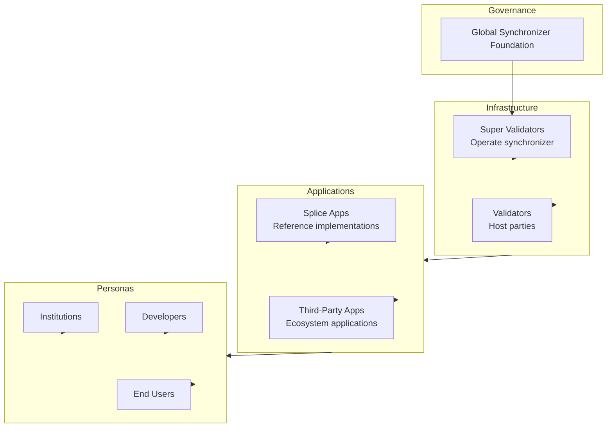

The Canton Network ecosystem encompasses the organizations, applications, and infrastructure that make up the network. This page provides an overview of the ecosystem landscape.

## Ecosystem Overview

## Governance

### Global Synchronizer Foundation (GSF)

The GSF is an independent, non-profit body under the Linux Foundation that governs the Global Synchronizer.

| Responsibility | Description |
|----------------|-------------|
| **Network policies** | Set parameters and rules |
| **Upgrade coordination** | Manage network upgrades |
| **SV oversight** | Oversee Super Validator participation |
| **Ecosystem development** | Foster network growth |

**Learn more:** [canton.foundation](https://canton.foundation)

## Infrastructure Participants

### Super Validators

Super Validators operate the Global Synchronizer infrastructure and participate in governance.

| Role | Function |
|------|----------|
| **Sequencer operation** | Order transactions |
| **Mediator operation** | Aggregate confirmations |
| **Governance** | Vote on network parameters |
| **Sponsorship** | Onboard new validators |

The current Super Validator set includes major financial institutions and technology providers.

### Validators

Validators host parties and run participant nodes connected to the Global Synchronizer.

| Type | Description |
|------|-------------|
| **Enterprise validators** | Run by organizations for their own parties |
| **Service providers** | Offer validator services to others |
| **Application operators** | Run validators for specific applications |

## Applications

### Splice Applications

[Splice](https://github.com/hyperledger-labs/splice) is the open-source project providing reference applications for Canton Network.

| Application | Purpose |
|-------------|---------|
| **Canton Coin** | Native token implementation |
| **Wallet** | User wallet for CC management |
| **Scan** | Network explorer |
| **Validator App** | Validator node management |

### Application Categories

| Category | Examples |
|----------|----------|
| **Financial services** | Trading, settlement, custody |
| **Asset tokenization** | Securities, real estate, commodities |
| **Supply chain** | Trade finance, logistics |
| **Identity** | Digital identity, KYC |

## Developer Ecosystem

### Tools and SDKs

| Tool | Purpose |
|------|---------|
| **Daml SDK** | Core development toolkit |
| **Daml** | Smart contract language |
| **Wallet SDK** | Wallet integration |
| **PQS** | Query optimization |

### Development Resources

| Resource | Description |
|----------|-------------|
| **QuickStart** | Example application and LocalNet |
| **Documentation** | This site and related docs |
| **Community** | Slack, forums, events |

## Network Statistics

Canton Network continues to grow across all metrics.

### Network Activity

For current network statistics, visit:
- [Canton Network Explorer](https://scan.sync.global)
- [Network Status](https://canton.foundation/sv-network-status/)

## Getting Involved

### As a Validator

1. Review [infrastructure requirements](/global-synchronizer/understand/infrastructure-requirements)
2. Contact a [Super Validator](https://canton.foundation) for sponsorship
3. Complete the onboarding process
4. Begin operations

### As a Developer

1. Start with the [QuickStart](/appdev/quickstart)
2. Learn [Daml](/appdev/get-started/choose-your-path)
3. Build and deploy your application
4. Join the developer community {/* TODO: Add Slack link once available */}

### As an Institution

1. Evaluate Canton for your use case
2. Contact the [Canton Foundation](https://canton.foundation)
3. Explore partnership opportunities

## Ecosystem Resources

### Official Channels

| Channel | Purpose |
|---------|---------|
| [canton.network](https://canton.network) | Main website |
| [canton.foundation](https://canton.foundation) | Canton Foundation and validator info |
| Slack | Community discussion | {/* TODO: Add Slack link once available */}
| [GitHub](https://github.com/hyperledger-labs/splice) | Splice source code |

### Events

The Canton Network community holds regular events:
- Developer workshops
- Validator operations calls
- Governance discussions

Check [canton.network](https://canton.network) for upcoming events.

## Next Steps

<CardGroup cols={2}>

<Card title="Integration Patterns" icon="puzzle-piece" href="/integrations/integration-patterns">
  Learn common integration approaches.
</Card>

<Card title="Start Building" icon="code" href="/appdev/get-started/choose-your-path">
  Begin developing on Canton Network.
</Card>

</CardGroup>
