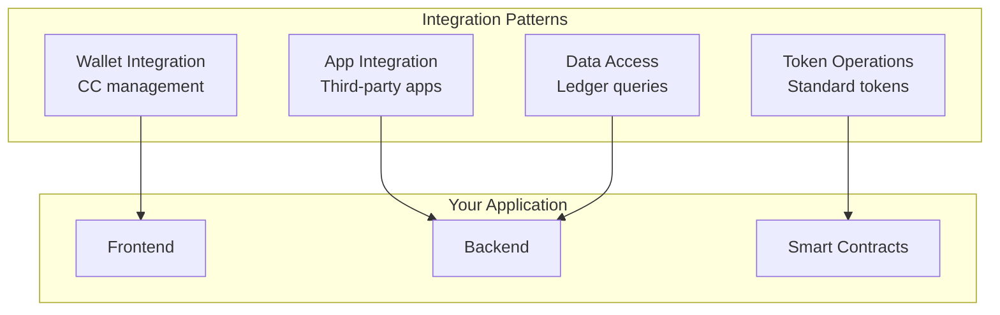
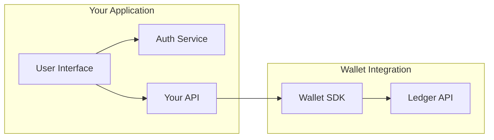
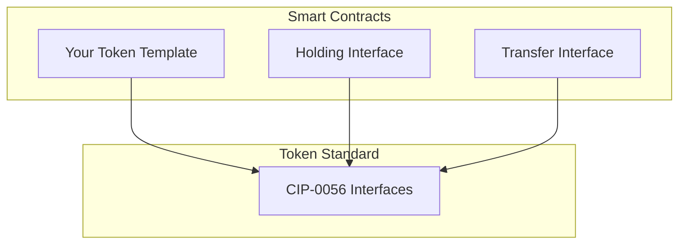
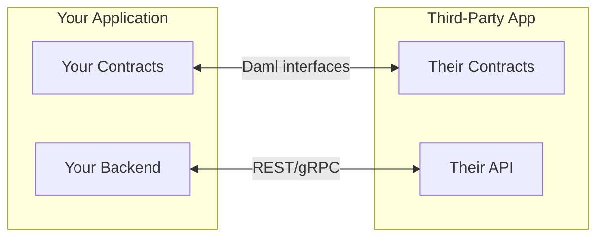
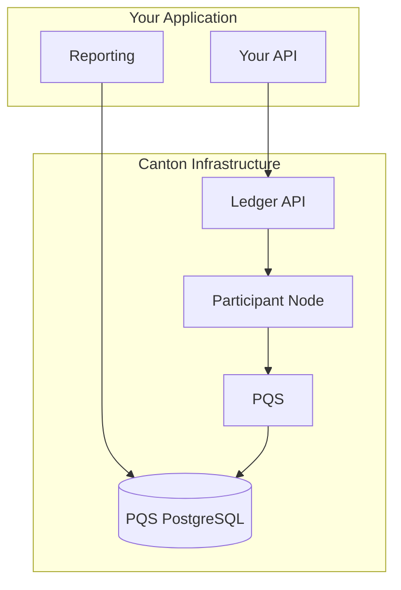

import DamlIntegrationsIntegrationPatternsL103 from "/snippets/daml-docs/integrations_integration-patterns_L103.mdx";


This page describes common patterns for integrating Canton Network building blocks into applications. These patterns help you design effective integrations while respecting Canton's privacy model.

## Pattern Overview



## Wallet Integration Pattern

### Use Case

Add Canton Coin management to your application, allowing users to:
- View their CC balance
- Transfer CC to other parties
- Top up traffic for transactions

### Architecture



### Key Considerations

| Consideration | Approach |
|---------------|----------|
| **Authentication** | Integrate with your auth system; map users to parties |
| **Balance display** | Query via Wallet SDK; cache appropriately |
| **Transfers** | Submit via Ledger API; handle async confirmation |
| **Error handling** | Handle insufficient balance, network errors |

### Privacy Implications

- Users see only their own balance
- Transfer details visible only to sender and receiver
- Your application backend sees what it's authorized to see

## Token Operations Pattern

### Use Case

Create, manage, and transfer tokens following the Canton Token Standard ([CIP-0056](https://github.com/global-synchronizer-foundation/cips/blob/main/cip-0056/cip-0056.md)).

### Architecture



### Implementation Approach

<DamlIntegrationsIntegrationPatternsL103 />

### Key Considerations

| Consideration | Approach |
|---------------|----------|
| **Interoperability** | Follow [CIP-0056](https://github.com/global-synchronizer-foundation/cips/blob/main/cip-0056/cip-0056.md) for wallet compatibility |
| **Authorization** | Define clear signatory/controller roles |
| **Privacy** | Token balances visible only to holders |

## Application Integration Pattern

### Use Case

Integrate with other Canton Network applications, such as:
- DeFi protocols
- Identity services
- Data feeds

### Architecture



### Integration Approaches

| Approach | When to Use |
|----------|-------------|
| **On-ledger** | Multi-party workflows requiring atomic execution |
| **Off-ledger API** | Read-only queries, non-transactional operations |
| **Hybrid** | Combine both for complete integration |

### Key Considerations

| Consideration | Approach |
|---------------|----------|
| **Interface compatibility** | Use published Daml interfaces |
| **Authorization** | Understand party requirements |
| **Privacy** | Know what data is shared through composition |
| **Versioning** | Handle contract upgrades |

## Data Access Pattern

### Use Case

Query ledger data for reporting, analytics, or application state.

### Options

| Method | Use Case | Performance |
|--------|----------|-------------|
| **Ledger API** | Real-time queries, streaming | Good |
| **PQS** | Complex queries, analytics | Best for reads |
| **Transaction trees** | Historical data, audit | Depends on volume |

### Architecture with PQS



<Note>
PQS connects to the participant node via the Ledger API to receive transaction updates, then stores the data in its own PostgreSQL database for querying.
</Note>

### Key Considerations

| Consideration | Approach |
|---------------|----------|
| **Query complexity** | Simple: Ledger API; Complex: PQS |
| **Latency requirements** | Real-time: Ledger API; Batch: PQS |
| **Data volume** | High volume: PQS with indexing |
| **Privacy scope** | Only query data for authorized parties |

## Privacy-Aware Design

All integration patterns must account for Canton's privacy model:

### Design Principles

| Principle | Application |
|-----------|-------------|
| **Minimal visibility** | Request only necessary observer rights |
| **Party design** | Don't create parties unnecessarily |
| **Divulgence awareness** | Understand what composing contracts reveals |
| **Audit consideration** | Plan for audit visibility from the start |

### Common Mistakes

| Mistake | Impact | Solution |
|---------|--------|----------|
| Over-observing | Unnecessary data exposure | Minimize observers |
| Public queries | Expecting global state | Query party-scoped data |
| Ignoring divulgence | Unintended data sharing | Map transaction composition |

## Error Handling Patterns

Integrations should handle common error scenarios:

| Error | Cause | Handling |
|-------|-------|----------|
| **Insufficient traffic** | Not enough CC for fees | Prompt for top-up |
| **Authorization failure** | Party not authorized | Check party setup |
| **Timeout** | Network or validator issues | Retry with backoff |
| **Contract not found** | Archived or never existed | Refresh state |

### Retry Strategy

```typescript
async function submitWithRetry<T>(command: Command, maxRetries = 3): Promise<T> {
  for (let attempt = 0; attempt < maxRetries; attempt++) {
    try {
      return await ledgerApi.submit(command);
    } catch (error) {
      if (isRetryable(error) && attempt < maxRetries - 1) {
        await sleep(Math.pow(2, attempt) * 1000);
        continue;
      }
      throw error;
    }
  }
  throw new Error("Max retries exceeded");
}
```

## Next Steps

<CardGroup cols={2}>

<Card title="Wallet for Developers" icon="code" href="/docs-main/integrations/overview">
  Detailed wallet integration guide.
</Card>

<Card title="Token Standard" icon="coins" href="/docs-main/overview/understand/cips-introduction">
  Implement the Canton Token Standard.
</Card>

</CardGroup>
