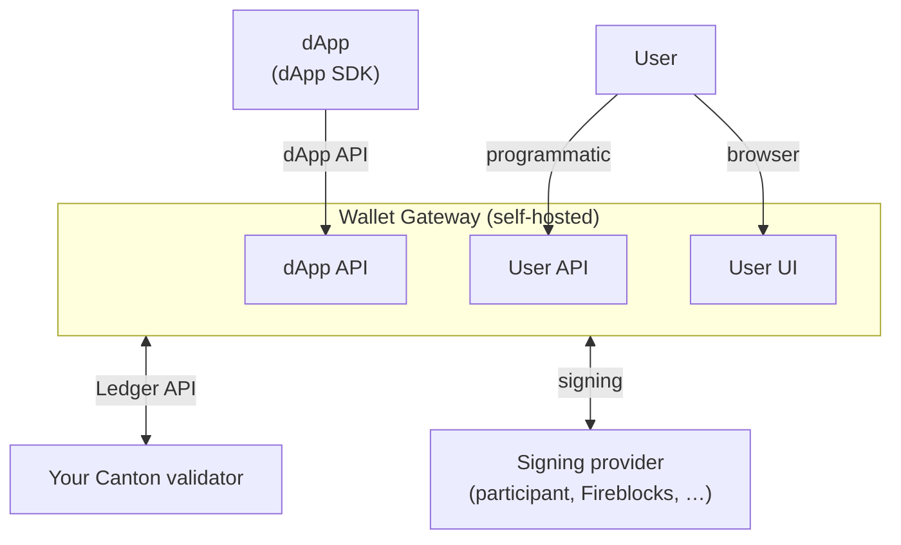
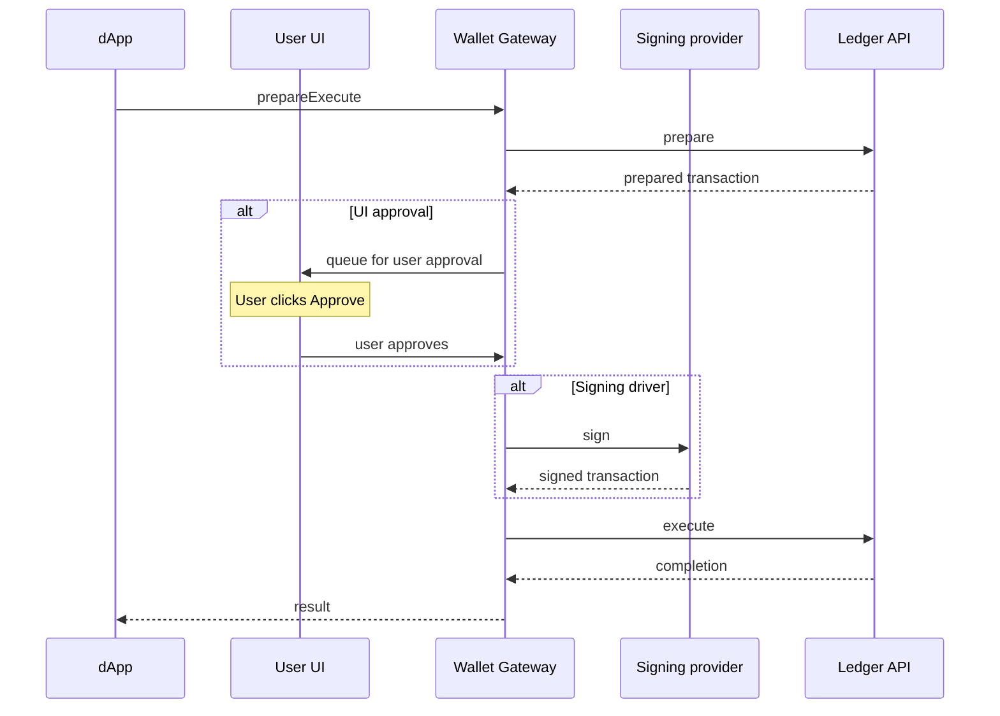

The Wallet Gateway is a self-hosted component that connects your Canton validator to dApps on
Canton Network. You run it in your own environment, next to a validator you already operate,
so you can connect to any [CIP-0103](https://github.com/canton-foundation/cips/blob/main/cip-0103/cip-0103.md)
dApp using **your** validator and **your** signing or custody provider, without moving signing
away from infrastructure you already trust.

Run the Wallet Gateway to:

- **Connect to dApps**: expose the CIP-0103 dApp API so any compatible dApp can connect,
  list accounts, and request transactions.
- **Use your own validator**: talk to your Canton validator's Ledger API on behalf of
  authenticated users.
- **Keep signing where you want it**: sign with a participant node, an external custody
  provider (Fireblocks, Blockdaemon, DFNS), or an internal store for development.
- **Manage wallets**: create and manage parties across one or more networks, through a web
  UI or programmatically.
- **Authenticate users**: log users in through OAuth / OpenID Connect or self-signed tokens,
  and issue sessions for API access.

<Note>
The Wallet Gateway is for teams that operate their own infrastructure: validator operators,
builders, and organizations that want to connect a validator and signing provider they control
to dApps. If you are building a dApp frontend instead, use the [dApp SDK](/sdks-tools/sdks/dapp-sdk/overview).
</Note>

## How it fits together

## Core concepts

**Networks.** A network points the Wallet Gateway at one Canton validator's Ledger API, identified
in [CAIP-2](https://github.com/ChainAgnostic/CAIPs/blob/main/CAIPs/caip-2.md) form (for
example `canton:localnet`). You can configure several networks in one Wallet Gateway, and each
wallet belongs to exactly one network.

**Identity providers.** Every network references an identity provider (IDP) that issues the
JWT used to authenticate against the validator. The Wallet Gateway supports **OAuth / OpenID Connect**
providers (recommended for production) and **self-signed** tokens (development only).

**Sessions.** Users authenticate through an IDP, and the Wallet Gateway issues a session (a JWT)
that the User and dApp APIs use to authorize later calls. Sessions are created on login and
ended on logout.

**Wallets and parties.** A wallet is a Canton party the Wallet Gateway manages for a user. Each
wallet is tied to a network and a signing provider, and a user can mark one wallet as
primary. dApps see these wallets as the accounts a user can transact with.

**Signing providers.** Signing is delegated to a signing provider chosen per wallet, so
different wallets in the same Wallet Gateway can sign through different providers. Keys stay with the
provider you choose: a participant node, an external custody service, or an internal store for
testing. See [Signing providers](/integrations/wallet-gateway/operate/signing-providers).

## Transaction lifecycle

Once a dApp is connected, transactions flow through the Wallet Gateway so that approval and
signing stay under your control. A dApp asks the Wallet Gateway to run a transaction, the
Wallet Gateway prepares it against your validator, the user reviews and approves it in the
User UI, your signing provider signs it, and the Wallet Gateway submits it to the ledger and
returns the result. Preparation and submission happen on your validator's Ledger API, approval
happens in your User UI, and signing happens in the provider you chose, so private keys never
pass through the dApp.

## Quickstart

Ready to run it? The [Quickstart](/integrations/wallet-gateway/quickstart) walks through
installing the Wallet Gateway, generating a configuration file, starting it against a network, and
verifying the three endpoints.

## Where to go next

<CardGroup cols={2}>
  <Card title="Quickstart" href="/integrations/wallet-gateway/quickstart">
    Install, configure, run, and verify a Wallet Gateway.
  </Card>
  <Card title="Configure the Wallet Gateway" href="/integrations/wallet-gateway/operate/configure">
    Understand the configuration file, store, and server settings.
  </Card>
  <Card title="Signing providers" href="/integrations/wallet-gateway/operate/signing-providers">
    Choose where transaction signing and key custody happen.
  </Card>
  <Card title="API Reference" href="/integrations/wallet-gateway/reference/user-api">
    Drive the Wallet Gateway from scripts with the User API.
  </Card>
</CardGroup>
