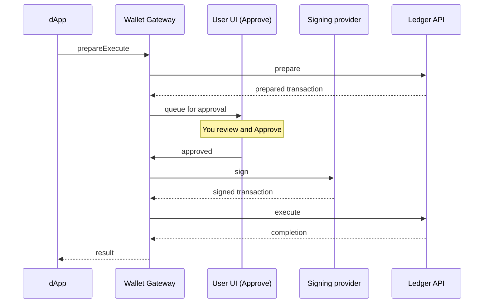

When a dApp wants to act on your behalf, it does not sign anything itself. It asks the Wallet
Gateway to run a transaction, and the Wallet Gateway routes it to you for approval and to your
signing provider for signing. This keeps approval and key custody under your control: private
keys never reach the dApp. This guide covers what you see on the **Approve** page, how to
approve or reject, and how to track a transaction afterwards.

## How a transaction reaches you

A dApp submits a transaction through the [dApp SDK](/sdks-tools/sdks/dapp-sdk/overview), which
calls the Wallet Gateway's dApp API. The Wallet Gateway prepares it against your validator,
queues it for your approval, has your signing provider sign it, and submits it to the ledger.

The dApp learns the outcome through the `txChanged` event, so once you approve and the
transaction executes, the dApp updates on its own.

## Review a transaction

When a dApp requests a transaction, the Wallet Gateway takes you to the **Approve** page (it may
open in a popup window if the dApp triggered it). There you can see:

- The **wallet** (party) the transaction will act as.
- The **network** it will be submitted to.
- The **transaction details** the dApp prepared, so you can confirm it matches what you expect.

<Warning>
Only approve transactions you understand and expect. Approving signs with your wallet's key
through its signing provider and submits to the ledger — it cannot be undone. If anything looks
wrong, reject it.
</Warning>

## Approve or reject

- **Approve** — the Wallet Gateway hands the prepared transaction to the wallet's
  [signing provider](/integrations/wallet-gateway/operate/signing-providers), which signs it,
  and then submits it to the ledger. The dApp is notified of the result.
- **Reject** — the Wallet Gateway discards the request and notifies the dApp that you declined.
  Nothing is signed or submitted.

If the **Approve** page opened as a popup, it closes and returns you to the dApp after you
decide.

## Where signing happens

Signing is delegated per wallet to the signing provider you chose when you created it — a
participant node, an external custody provider (Fireblocks, Blockdaemon, DFNS), or the internal
store for development. Your keys stay with that provider; approving in the UI authorizes the
provider to sign, but the key never passes through the dApp or the browser. See
[Signing providers](/integrations/wallet-gateway/operate/signing-providers).

## Track a transaction

Open the **Transactions** page to follow a transaction through its lifecycle and inspect its
details. Each transaction moves through these states:

| Status | Meaning |
| --- | --- |
| **Pending** | Prepared and waiting for your approval. |
| **Signed** | Approved and signed by the signing provider, being submitted. |
| **Executed** | Submitted to the ledger and completed successfully. |
| **Failed** | Rejected, or failed during signing or submission. |

Use this page to confirm a transaction executed, or to see why one failed. If executions fail
to start or never complete, see
[Troubleshooting](/integrations/wallet-gateway/operate/troubleshooting).

## Next steps

<CardGroup cols={2}>
  <Card title="Manage wallets" href="/integrations/wallet-gateway/use/manage-wallets">
    Log in and create, organize, and remove wallets in the User UI.
  </Card>
  <Card title="Automate with the User API" href="/integrations/wallet-gateway/use/automate-with-user-api">
    Sign and execute transactions programmatically.
  </Card>
  <Card title="Signing providers" href="/integrations/wallet-gateway/operate/signing-providers">
    Choose where signing and key custody happen.
  </Card>
  <Card title="dApp API" href="/integrations/wallet-gateway/reference/dapp-api">
    See how dApps request transactions through the dApp API.
  </Card>
</CardGroup>
