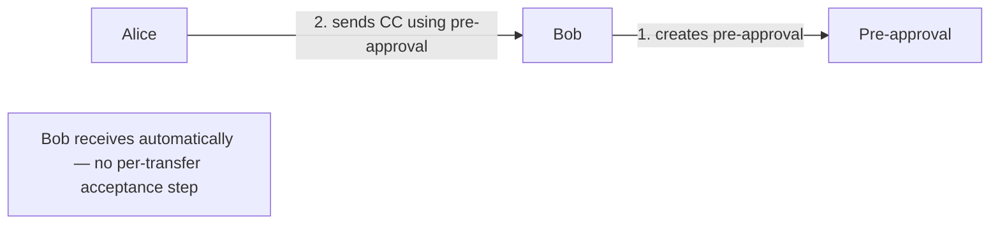
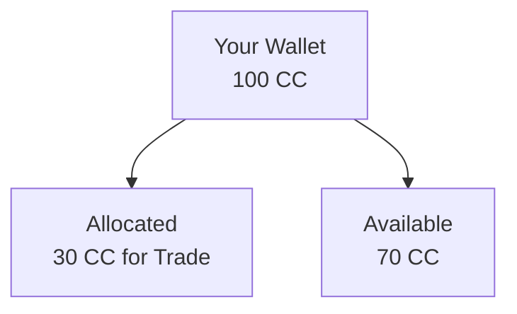
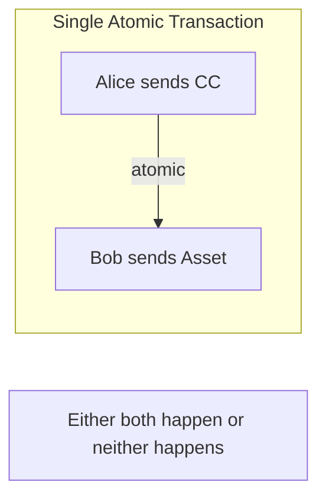
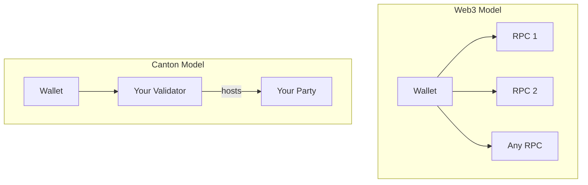

Canton wallets work differently from Web3 wallets like MetaMask. This page explains the key differences and what they mean for users and developers.

## Fundamental Differences

| Aspect | Web3 Wallets | Canton Wallets |
|--------|--------------|----------------|
| **Data visibility** | Balances public | CC balances public via scan; private contract data visible only to participants |
| **Transaction privacy** | All transactions public | CC transactions public via scan; private contract activity visible only to participants |
| **Network model** | Connect to any RPC | Connect to the validator with your party |
| **Identity** | Pseudonymous address | Party identifier |
| **Transfer model** | Single-step send | Single-step or multi-step (pre-approvals, allocations) |

## Privacy Model

### Web3: Public by Default

On Ethereum, your wallet:
- Has a public address anyone can see
- Shows balance to anyone who queries
- All transactions visible on block explorers
- Transaction patterns analyzable

```
Anyone can query: 0x123...abc has 45.67 ETH
Anyone can see: 0x123...abc sent 5 ETH to 0x456...def
```

### Canton: Contract Privacy by Default

Canton's privacy model depends on the contract type:

- CC balances and transaction history are publicly visible via the network's scan service
- Private application contract data is visible only to entitled parties
- There is no global view of all contracts — only CC data is aggregated publicly by the scan service

```
Anyone can query via scan: Your party's CC balance and transfer history
Only entitled parties see: Your private application contract data
```

## Transfer Capabilities

Canton wallets support transfer patterns not possible in traditional wallets.

### Multi-Step Transfers

Traditional transfer: Send X now.

Canton supports complex workflows:

| Pattern | Description |
|---------|-------------|
| **Pre-approvals** | Recipient pre-approves accepting transfers from a specific sender |
| **Allocations** | Reserve tokens for specific purposes |
| **DvP** | Atomic delivery-vs-payment exchanges |
| **Conditional** | Transfers triggered by conditions |

### Pre-Approvals

Allow a recipient to receive tokens from a specific sender without accepting each incoming transfer:



**Use cases:**
- Subscription payments
- Recurring transfers
- Automated application flows

### Allocations

Reserve tokens for a specific purpose:



**Use cases:**
- Trade settlement
- Escrow arrangements
- Multi-step workflows

### Delivery vs. Payment (DvP)

Atomic exchange of different assets:



**Why this matters:**
- No settlement risk
- No trust required between parties
- Complex exchanges in single transaction

## Connection Model

### Web3: Any RPC

Web3 wallets connect to any compatible RPC endpoint:
- Infura, Alchemy, or self-hosted
- Can switch providers freely
- Any node can answer queries

### Canton: Your Validator

Canton wallets connect to one or more validators:
- The validator(s) hosting your party
- Can't freely switch (party is hosted somewhere specific)
- Only your validator(s) have your data



## Identity Model

### Web3: Address-Based

- Address derived from public key
- Anyone can generate addresses
- Pseudonymous (address is identity)

### Canton: Party-Based

- Party identifier tied to validator hosting
- Party creation involves validator
- Not pseudonymous in the same way

<Note>
For local parties (where the validator holds the keys), the validator signs on behalf of the party. For external parties, keys are held externally and require explicit signing.
</Note>

| Web3 Address | Canton Party |
|--------------|--------------|
| `0x742d35Cc6634C0532925a3b844Bc454e4438f44e` | `alice::1220f2fe29866fd6a0009ecc8a64ccdc09f1958bd0f801166baaee469d1251b2eb72` |

## Explorer Differences

### Web3: Global Explorer

Block explorers show all network activity:
- Any transaction
- Any address balance
- Any contract state

### Canton: Scan Service for CC, Personal View for Private Contracts

For CC, the network's scan service works like a block explorer — anyone can query CC balances and transaction history by party. For private application contracts, you see only your own activity:
- Your private contract transactions
- Your private contract balances
- Your contracts

## Implications for Users

| If you're used to... | On Canton... |
|----------------------|--------------|
| Checking any address balance | CC balances queryable via scan; private contract balances require entitlement |
| Viewing all transactions | CC history public via scan; private contract activity visible only to you |
| Connecting to any RPC | You connect to your validator(s) |
| Simple send transactions | You have more transfer options |

## Implications for Developers

| If you're building... | Consider... |
|----------------------|-------------|
| Wallet integration | Use Wallet SDK for Canton patterns |
| Transaction display | Show only user's transactions |
| Balance queries | Query via scan for CC; query user's party for private contracts |
| Multi-step workflows | Leverage pre-approvals and allocations |

## Next Steps

<CardGroup cols={2}>

<Card title="Wallet for Developers" icon="code" href="/integrations/overview">
  Integrate wallet functionality into your app.
</Card>

<Card title="Token Standard" icon="coins" href="/overview/understand/cips-introduction">
  Understand the Canton Token Standard.
</Card>

</CardGroup>
