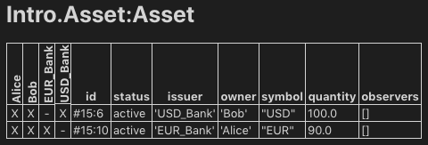

import DamlAppdevModulesM3DesignPatternsL115 from "/snippets/daml-docs/appdev_modules_m3-design-patterns_L115.mdx";
import DamlAppdevModulesM3DesignPatternsL155 from "/snippets/daml-docs/appdev_modules_m3-design-patterns_L155.mdx";
import DamlAppdevModulesM3DesignPatternsL256 from "/snippets/daml-docs/appdev_modules_m3-design-patterns_L256.mdx";
import DamlAppdevModulesM3DesignPatternsL282 from "/snippets/daml-docs/appdev_modules_m3-design-patterns_L282.mdx";
import DamlAppdevModulesM3DesignPatternsL330 from "/snippets/daml-docs/appdev_modules_m3-design-patterns_L330.mdx";
import DamlAppdevModulesM3DesignPatternsL347 from "/snippets/daml-docs/appdev_modules_m3-design-patterns_L347.mdx";
import DamlAppdevModulesM3DesignPatternsL410 from "/snippets/daml-docs/appdev_modules_m3-design-patterns_L410.mdx";
import DamlAppdevModulesM3DesignPatternsL426 from "/snippets/daml-docs/appdev_modules_m3-design-patterns_L426.mdx";
import DamlAppdevModulesM3DesignPatternsL442 from "/snippets/daml-docs/appdev_modules_m3-design-patterns_L442.mdx";
import DamlAppdevModulesM3DesignPatternsL464 from "/snippets/daml-docs/appdev_modules_m3-design-patterns_L464.mdx";
import DamlAppdevModulesM3DesignPatternsL491 from "/snippets/daml-docs/appdev_modules_m3-design-patterns_L491.mdx";
import DamlAppdevModulesM3DesignPatternsL504 from "/snippets/daml-docs/appdev_modules_m3-design-patterns_L504.mdx";
import DamlAppdevModulesM3DesignPatternsL521 from "/snippets/daml-docs/appdev_modules_m3-design-patterns_L521.mdx";
import DamlAppdevModulesM3DesignPatternsL541 from "/snippets/daml-docs/appdev_modules_m3-design-patterns_L541.mdx";
import DamlAppdevModulesM3DesignPatternsL587 from "/snippets/daml-docs/appdev_modules_m3-design-patterns_L587.mdx";
import DamlAppdevModulesM3DesignPatternsL598 from "/snippets/daml-docs/appdev_modules_m3-design-patterns_L598.mdx";
import DamlAppdevModulesM3DesignPatternsL629 from "/snippets/daml-docs/appdev_modules_m3-design-patterns_L629.mdx";
import DamlAppdevModulesM3DesignPatternsL74 from "/snippets/daml-docs/appdev_modules_m3-design-patterns_L74.mdx";
import DamlAppdevModulesM3DesignPatternsL80 from "/snippets/daml-docs/appdev_modules_m3-design-patterns_L80.mdx";
import DamlAppdevModulesM3DesignPatternsL86 from "/snippets/daml-docs/appdev_modules_m3-design-patterns_L86.mdx";
import DamlAppdevModulesM3DesignPatternsL92 from "/snippets/daml-docs/appdev_modules_m3-design-patterns_L92.mdx";


{/* COPIED_START source="docs-website:docs/replicated/daml/3.4/sdk/tutorials/smart-contracts/compose.rst" hash="f782af8e" */}

# Compose choices

It's time to put everything you've learned so far together into a complete and secure Daml model for asset issuance, management, transfer, and trading. This application will have capabilities similar to the one in `/app-dev/bindings-java/quickstart`. In the process you will learn about a few more concepts:

- Daml projects, packages, and modules
- Composition of transactions
- Observers and stakeholders
- Daml's execution model
- Privacy

The model in this section is not a single Daml file, but a Daml project consisting of several files that depend on each other.

<Tip>
Remember that you can load all the code for this section into a folder called `intro-compose` by running `dpm new intro-compose  --template daml-intro-compose`
</Tip>

## Daml projects

Daml is organized in projects, packages, and modules. A Daml project is specified using a single `daml.yaml` file, and compiles into a package in Daml's intermediate language, or bytecode equivalent, Daml-LF. Each Daml file within a project becomes a Daml module, which is a bit like a namespace. Each Daml project has a source root specified in the `source` parameter in the project's `daml.yaml` file. The package will include all modules specified in `*.daml` files beneath that source directory.

You can start a new project with a skeleton structure using `dpm new project-name` in the terminal. A minimal project would contain just a `daml.yaml` file and an empty directory of source files.

> Take a look at the `daml.yaml` for the this chapter's project:

```yaml
sdk-version: __VERSION__
name: __PROJECT_NAME__
source: daml
version: 1.0.0
dependencies:
  - daml-prim
  - daml-stdlib
  - daml-script
```

You can generally set `name` and `version` freely to describe your project. `dependencies` does what the name suggests: it includes dependencies. You should always include `daml-prim` and `daml-stdlib`. The former contains internals of the compiler and the Daml Runtime, the latter gives access to the Daml standard library. `daml-script` contains the types and functions for Daml Script.

You compile a Daml project by running `dpm build` from the project root directory. This creates a DAR file in `.daml/dist/dist/${project_name}-${project_version}.dar`. A DAR file is Daml's equivalent of a JAR file in Java: it's the artifact that gets deployed to a ledger to load the package and its dependencies. `dar` files are fully self-contained in that they contain all dependencies of the main package. More on all of this in [Building and Packaging](/mainnet/appdev/modules/m3-building-packaging).

## Project structure

This project contains an asset holding model for transferable, fungible assets and a separate trade workflow. The templates are structured in three modules: `Intro.Asset`, `Intro.Asset.Role`, and `Intro.Asset.Trade`.

In addition, there are tests in modules `Test.Intro.Asset`, `Test.Intro.Asset.Role`, and `Test.Intro.Asset.Trade`.

All but the last `.`-separated segment in module names correspond to paths relative to the project source directory, and the last one to a file name. The folder structure therefore looks like this:

``` none
.
├── daml
│   ├── Intro
│   │   ├── Asset
│   │   │   ├── Role.daml
│   │   │   └── Trade.daml
│   │   └── Asset.daml
│   └── Test
│       └── Intro
│           ├── Asset
│           │   ├── Role.daml
│           │   └── Trade.daml
│           └── Asset.daml
└── daml.yaml
```

Each file contains a module header. For example, `daml/Intro/Asset/Role.daml`:

<DamlAppdevModulesM3DesignPatternsL74 />

You can import one module into another using the `import` keyword. The `LibraryModules` module imports all six modules:

<DamlAppdevModulesM3DesignPatternsL80 />

Imports always have to appear just below the module declaration. You can optionally add a list of names after the import to import only the selected names:

<DamlAppdevModulesM3DesignPatternsL86 />

If your module contains any Daml Scripts, you need to import the corresponding functionality:

<DamlAppdevModulesM3DesignPatternsL92 />

## Project overview

The project both changes and adds to the `Iou` model presented in [Authorization](/mainnet/appdev/modules/m3-authorization):

- Assets are fungible in the sense that they have `Merge` and `Split` choices that allow the `owner` to manage their holdings.

- Transfer proposals now need the authorities of both `issuer` and `newOwner` to accept. This makes `Asset` safer than `Iou` from the issuer's point of view.

  With the `Iou` model, an `issuer` could end up owing cash to anyone as transfers were authorized by just `owner` and `newOwner`. In this project, only parties having an `AssetHolder` contract can end up owning assets. This allows the `issuer` to determine which parties may own their assets.

- The `Trade` template adds a swap of two assets to the model.

## Composed choices and scripts

This project showcases how you can put the `Update` and `Script` actions you learned about in [Authorization](/mainnet/appdev/modules/m3-authorization) to good use. For example, the `Merge` and `Split` choices each perform several actions in their consequences.

- Two create actions in case of `Split`
- One create and one archive action in case of `Merge`

<DamlAppdevModulesM3DesignPatternsL115 />

The `return` function used in `Split` is available in any `Action` context. The result of `return x` is a no-op containing the value `x`. It has an alias `pure`, indicating that it's a pure value, as opposed to a value with side-effects. The `return` name makes sense when it's used as the last statement in a `do` block as its argument is indeed the "return"-value of the `do` block in that case.

Taking transaction composition a step further, the `Trade_Settle` choice on `Trade` composes two `exercise` actions:

<DamlAppdevModulesM3DesignPatternsL155 />

The resulting transaction, with its two nested levels of consequences, can be seen in the `test_trade` script in `Test.Intro.Asset.Trade`:

``` none
TX 14 1970-01-01T00:00:00Z (Test.Intro.Asset.Trade:79:23)
#14:0
│   disclosed to (since): 'Alice' (14), 'Bob' (14)
└─> 'Bob' exercises Trade_Settle on #12:0 (Intro.Asset.Trade:Trade)
          with
            quoteAssetCid = #9:1; baseApprovalCid = #13:1
    children:
    #14:1
    │   disclosed to (since): 'Alice' (14), 'Bob' (14), 'USD_Bank' (14)
    └─> 'Alice' and 'USD_Bank' fetch #10:1 (Intro.Asset:Asset)

    #14:2
    │   disclosed to (since): 'Alice' (14), 'Bob' (14), 'EUR_Bank' (14)
    └─> 'Bob' and 'EUR_Bank' fetch #9:1 (Intro.Asset:Asset)

    #14:3
    │   disclosed to (since): 'Alice' (14), 'Bob' (14), 'USD_Bank' (14)
    └─> 'Alice' and 'Bob' exercise TransferApproval_Transfer on #13:1 (Intro.Asset:TransferApproval)
                          with
                            assetCid = #10:1
        children:
        #14:4
        │   disclosed to (since): 'Alice' (14), 'Bob' (14), 'USD_Bank' (14)
        └─> 'Alice' and 'USD_Bank' fetch #10:1 (Intro.Asset:Asset)

        #14:5
        │   disclosed to (since): 'Alice' (14), 'Bob' (14), 'USD_Bank' (14)
        └─> 'Alice' and 'USD_Bank' exercise Archive on #10:1 (Intro.Asset:Asset)

        #14:6
        │   disclosed to (since): 'Alice' (14), 'Bob' (14), 'USD_Bank' (14)
        └─> 'Bob' and 'USD_Bank' create Intro.Asset:Asset
                                 with
                                   issuer = 'USD_Bank';
                                   owner = 'Bob';
                                   symbol = "USD";
                                   quantity = 100.0000000000;
                                   observers = []

    #14:7
    │   disclosed to (since): 'Alice' (14), 'Bob' (14), 'EUR_Bank' (14)
    └─> 'Alice',
        'Bob' exercises TransferApproval_Transfer on #11:1 (Intro.Asset:TransferApproval)
              with
                assetCid = #9:1
        children:
        #14:8
        │   disclosed to (since): 'Alice' (14), 'Bob' (14), 'EUR_Bank' (14)
        └─> 'Bob' and 'EUR_Bank' fetch #9:1 (Intro.Asset:Asset)

        #14:9
        │   disclosed to (since): 'Alice' (14), 'Bob' (14), 'EUR_Bank' (14)
        └─> 'Bob' and 'EUR_Bank' exercise Archive on #9:1 (Intro.Asset:Asset)

        #14:10
        │   disclosed to (since): 'Alice' (14), 'Bob' (14), 'EUR_Bank' (14)
        └─> 'Alice' and 'EUR_Bank' create Intro.Asset:Asset
                                   with
                                     issuer = 'EUR_Bank';
                                     owner = 'Alice';
                                     symbol = "EUR";
                                     quantity = 90.0000000000;
                                     observers = []
```

Similar to choices, you can see how the scripts in this project are built up from each other:

<DamlAppdevModulesM3DesignPatternsL256 />

In the above, the `test_issuance` script in `Test.Intro.Asset.Role` uses the output of the `setupRoles` script in the same module.

The same line shows a new kind of pattern matching. Rather than writing `setupResult <- setupRoles` and then accessing the components of `setupResult` using `_1`, `_2`, etc., you can give them names. It's equivalent to writing:

<DamlAppdevModulesM3DesignPatternsL282 />

Just writing `(alice, bob, bank, aha, ahb) <- setupRoles` would also be legal, but `setupResult` is used in the return value of `test_issuance` so it makes sense to give it a name, too. The notation with `@` allows you to give both the whole value as well as its constituents names in one go.

## Daml's execution model

Daml's execution model is fairly easy to understand, but has some important consequences. You can imagine the life of a transaction as follows:

Command submission
A user submits a list of commands via the Ledger API of a participant node, acting as a `Party` hosted on that node. That party is called the requester.

Interpretation
Each command corresponds to one or more actions. During this step, the `Update` corresponding to each action is evaluated in the context of the ledger to calculate all consequences, including transitive ones (consequences of consequences, etc.). The result of this is a complete transaction. Together with its requestor, this is also known as a commit.

Blinding
On ledgers with strong privacy, projections (see [Privacy Model](/mainnet/overview/learn/privacy-model)) for all involved parties are created. This is also called *projecting*.

Transaction submission
The transaction/commit is submitted to the network.

Validation
The transaction/commit is validated by the network. Who exactly validates can differ from implementation to implementation. Validation also involves scheduling and collision detection, ensuring that the transaction has a well-defined place in the (partial) ordering of commits, and no double spends occur.

Commitment
The commit is actually committed according to the commit or consensus protocol of the ledger.

Confirmation
The network sends confirmations of the commitment back to all involved participant nodes.

Completion
The user gets back a confirmation through the Ledger API of the submitting participant node.

The first important consequence of the above is that all transactions are committed atomically. Either a transaction is committed as a whole and for all participants, or it fails.

That's important in the context of the `Trade_Settle` choice shown above. The choice transfers a `baseAsset` one way and a `quoteAsset` the other way. Thanks to transaction atomicity, there is no chance that either party is left out of pocket.

The second consequence is that the requester of a transaction knows all consequences of their submitted transaction -- there are no surprises in Daml. However, it also means that the requester must have all the information to interpret the transaction. We also refer to this as Principle 2 a bit later on this page.

That's also important in the context of `Trade`. In order to allow Bob to interpret a transaction that transfers Alice's cash to Bob, Bob needs to know both about Alice's `Asset` contract, as well as about some way for `Alice` to accept a transfer -- remember, accepting a transfer needs the authority of `issuer` in this example.

## Observers

*Observers* are Daml's mechanism to disclose contracts to other parties. They are declared just like signatories, but using the `observer` keyword, as shown in the `Asset` template:

<DamlAppdevModulesM3DesignPatternsL330 />

The `Asset` template also gives the `owner` a choice to set the observers, and you can see how Alice uses it to show her `Asset` to Bob just before proposing the trade. You can try out what happens if she didn't do that by removing that transaction:

<DamlAppdevModulesM3DesignPatternsL347 />

Observers have guarantees in Daml. In particular, they are guaranteed to see actions that create and archive the contract on which they are an observer.

Since observers are calculated from the arguments of the contract, they always know about each other. That's why, rather than adding Bob as an observer on Alice's `AssetHolder` contract, and using that to authorize the transfer in `Trade_Settle`, Alice creates a one-time authorization in the form of a `TransferAuthorization`. If Alice had lots of counterparties, she would otherwise end up leaking them to each other.

Choice controllers are not automatically made observers, as they can only be calculated at the point in time when the choice arguments are known.

## Privacy

Daml's privacy model is based on two principles:

Principle 1. Parties see those actions that they have a stake in. Principle 2. Every party that sees an action sees its (transitive) consequences.

Principle 2 is necessary to ensure that every party can independently verify the validity of every transaction they see.

A party has a stake in an action if

- they are a required authorizer of it
- they are a signatory of the contract on which the action is performed
- they are an observer on the contract, and the action creates or archives it

What does that mean for the `exercise tradeCid Trade_Settle` action from `test_trade`?

Alice is the signatory of `tradeCid` and Bob a required authorizer of the `Trade_Settled` action, so both of them see it. According to principle 2 above, that means they get to see everything in the transaction.

The consequences contain, next to some `fetch` actions, two `exercise` actions of the choice `TransferApproval_Transfer`.

Each of the two involved `TransferApproval` contracts is signed by a different `issuer`, which see the action on "their" contract. So the EUR_Bank sees the `TransferApproval_Transfer` action for the EUR `Asset` and the USD_Bank sees the `TransferApproval_Transfer` action for the USD `Asset`.

Some Daml ledgers, like the script runner and the Sandbox, work on the principle of "data minimization", meaning nothing more than the above information is distributed. That is, the "projection" of the overall transaction that gets distributed to EUR_Bank in step 4 of `execution_model` would consist only of the `TransferApproval_Transfer` and its consequences.

Other implementations, in particular those on public blockchains, may have weaker privacy constraints.

### Divulgence

Note that principle 2 of the privacy model means that sometimes parties see contracts that they are not signatories or observers on. If you look at the final ledger state of the `test_trade` script, for example, you may notice that both Alice and Bob now see both assets, as indicated by the Xs in their respective columns:

| Alice | Bob | EUR_Bank | USD_Bank | id | status | issuer | owner | symbol | quantity |
|-------|-----|----------|----------|----|--------|--------|-------|--------|----------|
| X | X | - | X | #15:6 | active | USD_Bank | Bob | USD | 100.0 |
| X | X | X | - | #15:10 | active | EUR_Bank | Alice | EUR | 90.0 |

This is because the `create` action of these contracts are in the transitive consequences of the `Trade_Settle` action both of them have a stake in. This kind of disclosure is often called "divulgence" and needs to be considered when designing Daml models for privacy sensitive applications.

{/* COPIED_END */}

## Common Daml design patterns

Beyond the composition patterns above, this section covers common multi-party workflow patterns used in Daml. All examples below use a `Coin` asset model to illustrate each pattern.

{/* COPIED_START source="docs-website:docs/replicated/daml/3.4/sdk/sdlc-howtos/smart-contracts/develop/patterns/" hash="patterns-all" */}

### Propose-Accept

The most common way to get multiple parties to agree on a shared contract. One party creates a proposal contract that the other party can accept, reject, or let expire. The `IouProposal` [in the authorization module](/mainnet/appdev/modules/m3-authorization#use-propose-accept-workflow-for-one-off-authorization) is another example of this pattern.

The issuer creates a `CoinMaster` contract, then uses it to invite an owner. The invitation is a proposal contract with the issuer as signatory and the owner as observer:

<DamlAppdevModulesM3DesignPatternsL410 />

The proposal gives the owner a choice to accept. In a complete model, it would also include `Reject` and `Counter` choices:

<DamlAppdevModulesM3DesignPatternsL426 />

When the owner accepts, the result contract has both parties as signatories — neither can be forced into the agreement without consent:

<DamlAppdevModulesM3DesignPatternsL442 />

This pattern can be verbose when more than two signatures are needed — see Multiple Party Agreement below for that case.

### Delegation

Gives one party the right to exercise a choice on behalf of another. The principal creates a delegation contract that authorizes an agent to act for them, without the principal committing each action. This models real-world custodian relationships where a bank holds securities and settles transactions on a client's behalf.

The delegation contract (`CoinPoA` — Power of Attorney) has the principal as signatory. The attorney controls a `TransferCoin` choice that exercises `Transfer` on the principal's coin:

<DamlAppdevModulesM3DesignPatternsL464 />

The coin must be disclosed to the attorney before they can exercise the delegated choice. This is done by adding them as an observer via a `Disclose` choice on `Coin`:

<DamlAppdevModulesM3DesignPatternsL491 />

### Authorization

Verifies that a controlling party has the right permissions before they take certain actions. An authorization contract serves as proof — the choice body checks for its existence and validity before proceeding.

For example, an issuer wants to ensure that only accredited parties can receive coin transfers. The issuer creates an authorization token for approved owners:

<DamlAppdevModulesM3DesignPatternsL504 />

The `AcceptTransfer` choice on `TransferProposal` requires the new owner to supply their authorization token. The asserts verify the token matches the issuer and the new owner:

<DamlAppdevModulesM3DesignPatternsL521 />

If the issuer withdraws the authorization before the transfer is accepted, the transfer fails.

### Locking

Prevents choices from being exercised on a contract while it is in a locked state. Useful for scenarios like securities settlement where assets must be frozen during clearing.

One approach is **locking by state change** — the contract carries a `locker` field. When `owner == locker`, the coin is unlocked and can be transferred. When they differ, a third-party locker controls the unlock:

<DamlAppdevModulesM3DesignPatternsL541 />

Two other approaches exist: **locking by archiving** (archive the original contract and create a `LockedCoin` wrapper with `Unlock` and `Clawback` choices) and **locking by safekeeping** (transfer custody to a trusted third party who controls the unlock).

### Multiple party agreement

Collects signatures from more than two parties. A `Pending` contract wraps the final `Agreement` and tracks who has signed. Each party signs by exercising a `Sign` choice, and once all parties have signed, any of them can `Finalize` to create the agreement.

The final agreement contract has multiple signatories:

<DamlAppdevModulesM3DesignPatternsL587 />

The `Pending` contract collects signatures one by one. It is observable by all required signatories, so each can see when it is their turn to sign:

<DamlAppdevModulesM3DesignPatternsL598 />

One party kicks off the workflow by creating a `Pending` contract listing only themselves as signed. The others sign in any order, and once complete, any signatory can finalize:

<DamlAppdevModulesM3DesignPatternsL629 />

{/* COPIED_END */}
{/* COPIED_START source="docs-website:docs/replicated/daml/3.4/sdk/tutorials/smart-contracts/compose.rst" hash="f782af8e" */}

<Warning title="Pre-reviewed Content - Do Not Modify">
This section was copied from existing reviewed documentation.
**Source:** `docs-website:docs/replicated/daml/3.4/sdk/tutorials/smart-contracts/compose.rst`
Reviewers: Skip this section. Remove markers after final approval.
</Warning>

# Compose choices

It's time to put everything you've learned so far together into a complete and secure Daml model for asset issuance, management, transfer, and trading. This application will have capabilities similar to the one in `/app-dev/bindings-java/quickstart`. In the process you will learn about a few more concepts:

- Daml projects, packages, and modules
- Composition of transactions
- Observers and stakeholders
- Daml's execution model
- Privacy

The model in this section is not a single Daml file, but a Daml project consisting of several files that depend on each other.

<Tip>
Remember that you can load all the code for this section into a folder called `intro-compose` by running `dpm new intro-compose  --template daml-intro-compose`
</Tip>

## Daml projects

Daml is organized in projects, packages, and modules. A Daml project is specified using a single `daml.yaml` file, and compiles into a package in Daml's intermediate language, or bytecode equivalent, Daml-LF. Each Daml file within a project becomes a Daml module, which is a bit like a namespace. Each Daml project has a source root specified in the `source` parameter in the project's `daml.yaml` file. The package will include all modules specified in `*.daml` files beneath that source directory.

You can start a new project with a skeleton structure using `dpm new project-name` in the terminal. A minimal project would contain just a `daml.yaml` file and an empty directory of source files.

> Take a look at the `daml.yaml` for the this chapter's project:

```yaml
-- Code from: daml/daml-intro-compose/daml.yaml.template
-- [Include actual code example here]
```

You can generally set `name` and `version` freely to describe your project. `dependencies` does what the name suggests: it includes dependencies. You should always include `daml-prim` and `daml-stdlib`. The former contains internals of the compiler and the Daml Runtime, the latter gives access to the Daml standard library. `daml-script` contains the types and functions for Daml Script.

You compile a Daml project by running `dpm build` from the project root directory. This creates a DAR file in `.daml/dist/dist/${project_name}-${project_version}.dar`. A DAR file is Daml's equivalent of a JAR file in Java: it's the artifact that gets deployed to a ledger to load the package and its dependencies. `dar` files are fully self-contained in that they contain all dependencies of the main package. More on all of this in `dependencies`.

## Project structure

This project contains an asset holding model for transferable, fungible assets and a separate trade workflow. The templates are structured in three modules: `Intro.Asset`, `Intro.Asset.Role`, and `Intro.Asset.Trade`.

In addition, there are tests in modules `Test.Intro.Asset`, `Test.Intro.Asset.Role`, and `Test.Intro.Asset.Trade`.

All but the last `.`-separated segment in module names correspond to paths relative to the project source directory, and the last one to a file name. The folder structure therefore looks like this:

``` none
.
├── daml
│   ├── Intro
│   │   ├── Asset
│   │   │   ├── Role.daml
│   │   │   └── Trade.daml
│   │   └── Asset.daml
│   └── Test
│       └── Intro
│           ├── Asset
│           │   ├── Role.daml
│           │   └── Trade.daml
│           └── Asset.daml
└── daml.yaml
```

Each file contains a module header. For example, `daml/Intro/Asset/Role.daml`:

```daml
-- Code from: daml/daml-intro-compose/daml/Intro/Asset/Role.daml
-- [Include actual code example here]
```

You can import one module into another using the `import` keyword. The `LibraryModules` module imports all six modules:

```daml
-- Code from: daml/daml-intro-compose/daml/Intro/Asset/Role.daml
-- [Include actual code example here]
```

Imports always have to appear just below the module declaration. You can optionally add a list of names after the import to import only the selected names:

```daml
import DA.List (sortOn, groupOn)
```

If your module contains any Daml Scripts, you need to import the corresponding functionality:

```daml
import Daml.Script
```

## Project overview

The project both changes and adds to the `Iou` model presented in `parties`:

- Assets are fungible in the sense that they have `Merge` and `Split` choices that allow the `owner` to manage their holdings.

- Transfer proposals now need the authorities of both `issuer` and `newOwner` to accept. This makes `Asset` safer than `Iou` from the issuer's point of view.

  With the `Iou` model, an `issuer` could end up owing cash to anyone as transfers were authorized by just `owner` and `newOwner`. In this project, only parties having an `AssetHolder` contract can end up owning assets. This allows the `issuer` to determine which parties may own their assets.

- The `Trade` template adds a swap of two assets to the model.

## Composed choices and scripts

This project showcases how you can put the `Update` and `Script` actions you learned about in `parties` to good use. For example, the `Merge` and `Split` choices each perform several actions in their consequences.

- Two create actions in case of `Split`
- One create and one archive action in case of `Merge`

```daml
-- Code from: daml/daml-intro-compose/daml/Intro/Asset.daml
-- [Include actual code example here]
```

The `return` function used in `Split` is available in any `Action` context. The result of `return x` is a no-op containing the value `x`. It has an alias `pure`, indicating that it's a pure value, as opposed to a value with side-effects. The `return` name makes sense when it's used as the last statement in a `do` block as its argument is indeed the "return"-value of the `do` block in that case.

Taking transaction composition a step further, the `Trade_Settle` choice on `Trade` composes two `exercise` actions:

```daml
-- Code from: daml/daml-intro-compose/daml/Intro/Asset/Trade.daml
-- [Include actual code example here]
```

The resulting transaction, with its two nested levels of consequences, can be seen in the `test_trade` script in `Test.Intro.Asset.Trade`:

``` none
TX 14 1970-01-01T00:00:00Z (Test.Intro.Asset.Trade:79:23)
#14:0
│   disclosed to (since): 'Alice' (14), 'Bob' (14)
└─> 'Bob' exercises Trade_Settle on #12:0 (Intro.Asset.Trade:Trade)
          with
            quoteAssetCid = #9:1; baseApprovalCid = #13:1
    children:
    #14:1
    │   disclosed to (since): 'Alice' (14), 'Bob' (14), 'USD_Bank' (14)
    └─> 'Alice' and 'USD_Bank' fetch #10:1 (Intro.Asset:Asset)

    #14:2
    │   disclosed to (since): 'Alice' (14), 'Bob' (14), 'EUR_Bank' (14)
    └─> 'Bob' and 'EUR_Bank' fetch #9:1 (Intro.Asset:Asset)

    #14:3
    │   disclosed to (since): 'Alice' (14), 'Bob' (14), 'USD_Bank' (14)
    └─> 'Alice' and 'Bob' exercise TransferApproval_Transfer on #13:1 (Intro.Asset:TransferApproval)
                          with
                            assetCid = #10:1
        children:
        #14:4
        │   disclosed to (since): 'Alice' (14), 'Bob' (14), 'USD_Bank' (14)
        └─> 'Alice' and 'USD_Bank' fetch #10:1 (Intro.Asset:Asset)

        #14:5
        │   disclosed to (since): 'Alice' (14), 'Bob' (14), 'USD_Bank' (14)
        └─> 'Alice' and 'USD_Bank' exercise Archive on #10:1 (Intro.Asset:Asset)

        #14:6
        │   disclosed to (since): 'Alice' (14), 'Bob' (14), 'USD_Bank' (14)
        └─> 'Bob' and 'USD_Bank' create Intro.Asset:Asset
                                 with
                                   issuer = 'USD_Bank';
                                   owner = 'Bob';
                                   symbol = "USD";
                                   quantity = 100.0000000000;
                                   observers = []

    #14:7
    │   disclosed to (since): 'Alice' (14), 'Bob' (14), 'EUR_Bank' (14)
    └─> 'Alice',
        'Bob' exercises TransferApproval_Transfer on #11:1 (Intro.Asset:TransferApproval)
              with
                assetCid = #9:1
        children:
        #14:8
        │   disclosed to (since): 'Alice' (14), 'Bob' (14), 'EUR_Bank' (14)
        └─> 'Bob' and 'EUR_Bank' fetch #9:1 (Intro.Asset:Asset)

        #14:9
        │   disclosed to (since): 'Alice' (14), 'Bob' (14), 'EUR_Bank' (14)
        └─> 'Bob' and 'EUR_Bank' exercise Archive on #9:1 (Intro.Asset:Asset)

        #14:10
        │   disclosed to (since): 'Alice' (14), 'Bob' (14), 'EUR_Bank' (14)
        └─> 'Alice' and 'EUR_Bank' create Intro.Asset:Asset
                                   with
                                     issuer = 'EUR_Bank';
                                     owner = 'Alice';
                                     symbol = "EUR";
                                     quantity = 90.0000000000;
                                     observers = []
```

Similar to choices, you can see how the scripts in this project are built up from each other:

```daml
-- Code from: daml/daml-intro-compose/daml/Test/Intro/Asset/Role.daml
-- [Include actual code example here]
```

In the above, the `test_issuance` script in `Test.Intro.Asset.Role` uses the output of the `setupRoles` script in the same module.

The same line shows a new kind of pattern matching. Rather than writing `setupResult <- setupRoles` and then accessing the components of `setupResult` using `_1`, `_2`, etc., you can give them names. It's equivalent to writing:

```daml
setupResult <- setupRoles
case setupResult of
  (alice, bob, bank, aha, ahb) -> ...
```

Just writing `(alice, bob, bank, aha, ahb) <- setupRoles` would also be legal, but `setupResult` is used in the return value of `test_issuance` so it makes sense to give it a name, too. The notation with `@` allows you to give both the whole value as well as its constituents names in one go.

## Daml's execution model

Daml's execution model is fairly easy to understand, but has some important consequences. You can imagine the life of a transaction as follows:

Command submission
A user submits a list of commands via the Ledger API of a participant node, acting as a `Party` hosted on that node. That party is called the requester.

Interpretation
Each command corresponds to one or more actions. During this step, the `Update` corresponding to each action is evaluated in the context of the ledger to calculate all consequences, including transitive ones (consequences of consequences, etc.). The result of this is a complete transaction. Together with its requestor, this is also known as a commit.

Blinding
On ledgers with strong privacy, projections (see `privacy`) for all involved parties are created. This is also called *projecting*.

Transaction submission
The transaction/commit is submitted to the network.

Validation
The transaction/commit is validated by the network. Who exactly validates can differ from implementation to implementation. Validation also involves scheduling and collision detection, ensuring that the transaction has a well-defined place in the (partial) ordering of commits, and no double spends occur.

Commitment
The commit is actually committed according to the commit or consensus protocol of the ledger.

Confirmation
The network sends confirmations of the commitment back to all involved participant nodes.

Completion
The user gets back a confirmation through the Ledger API of the submitting participant node.

The first important consequence of the above is that all transactions are committed atomically. Either a transaction is committed as a whole and for all participants, or it fails.

That's important in the context of the `Trade_Settle` choice shown above. The choice transfers a `baseAsset` one way and a `quoteAsset` the other way. Thanks to transaction atomicity, there is no chance that either party is left out of pocket.

The second consequence is that the requester of a transaction knows all consequences of their submitted transaction -- there are no surprises in Daml. However, it also means that the requester must have all the information to interpret the transaction. We also refer to this as Principle 2 a bit later on this page.

That's also important in the context of `Trade`. In order to allow Bob to interpret a transaction that transfers Alice's cash to Bob, Bob needs to know both about Alice's `Asset` contract, as well as about some way for `Alice` to accept a transfer -- remember, accepting a transfer needs the authority of `issuer` in this example.

## Observers

*Observers* are Daml's mechanism to disclose contracts to other parties. They are declared just like signatories, but using the `observer` keyword, as shown in the `Asset` template:

```daml
-- Code from: daml/daml-intro-compose/daml/Intro/Asset.daml
-- [Include actual code example here]
```

The `Asset` template also gives the `owner` a choice to set the observers, and you can see how Alice uses it to show her `Asset` to Bob just before proposing the trade. You can try out what happens if she didn't do that by removing that transaction:

```daml
-- Code from: daml/daml-intro-compose/daml/Test/Intro/Asset/Trade.daml
-- [Include actual code example here]
```

Observers have guarantees in Daml. In particular, they are guaranteed to see actions that create and archive the contract on which they are an observer.

Since observers are calculated from the arguments of the contract, they always know about each other. That's why, rather than adding Bob as an observer on Alice's `AssetHolder` contract, and using that to authorize the transfer in `Trade_Settle`, Alice creates a one-time authorization in the form of a `TransferAuthorization`. If Alice had lots of counterparties, she would otherwise end up leaking them to each other.

Choice controllers are not automatically made observers, as they can only be calculated at the point in time when the choice arguments are known.

## Privacy

Daml's privacy model is based on two principles:

Principle 1. Parties see those actions that they have a stake in. Principle 2. Every party that sees an action sees its (transitive) consequences.

Principle 2 is necessary to ensure that every party can independently verify the validity of every transaction they see.

A party has a stake in an action if

- they are a required authorizer of it
- they are a signatory of the contract on which the action is performed
- they are an observer on the contract, and the action creates or archives it

What does that mean for the `exercise tradeCid Trade_Settle` action from `test_trade`?

Alice is the signatory of `tradeCid` and Bob a required authorizer of the `Trade_Settled` action, so both of them see it. According to principle 2 above, that means they get to see everything in the transaction.

The consequences contain, next to some `fetch` actions, two `exercise` actions of the choice `TransferApproval_Transfer`.

Each of the two involved `TransferApproval` contracts is signed by a different `issuer`, which see the action on "their" contract. So the EUR_Bank sees the `TransferApproval_Transfer` action for the EUR `Asset` and the USD_Bank sees the `TransferApproval_Transfer` action for the USD `Asset`.

Some Daml ledgers, like the script runner and the Sandbox, work on the principle of "data minimization", meaning nothing more than the above information is distributed. That is, the "projection" of the overall transaction that gets distributed to EUR_Bank in step 4 of `execution_model` would consist only of the `TransferApproval_Transfer` and its consequences.

Other implementations, in particular those on public blockchains, may have weaker privacy constraints.

### Divulgence

Note that principle 2 of the privacy model means that sometimes parties see contracts that they are not signatories or observers on. If you look at the final ledger state of the `test_trade` script, for example, you may notice that both Alice and Bob now see both assets, as indicated by the Xs in their respective columns:

<figure>

</figure>

This is because the `create` action of these contracts are in the transitive consequences of the `Trade_Settle` action both of them have a stake in. This kind of disclosure is often called "divulgence" and needs to be considered when designing Daml models for privacy sensitive applications.

## Next up

In `exceptions`, we will learn about how errors in your model can be handled in Daml.

{/* COPIED_END */}
