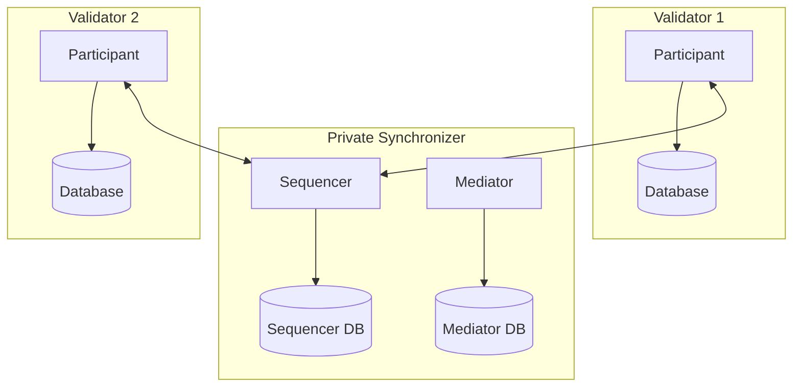

Not every Canton deployment needs to connect to the Global Synchronizer. You can run a fully standalone private synchronizer for workflows that are entirely internal to your organization or consortium. These deployments operate independently — no Canton Coin, no interaction with the broader Canton Network, and no dependency on the Global Synchronizer Foundation infrastructure.

## When a standalone synchronizer makes sense

A private synchronizer disconnected from the Global Synchronizer is appropriate when:

- **All parties are internal** — Your workflows run entirely within one organization or a closed group of known participants, with no need to interact with external Canton Network parties
- **Regulatory isolation is required** — Compliance rules require that transaction data and metadata stay within specific infrastructure boundaries, with no external network connections
- **You want Canton's privacy and synchronization model without network participation** — Canton's sub-transaction privacy, multi-party workflows, and Daml smart contracts are valuable on their own, independent of the Canton Network ecosystem
- **You are evaluating Canton** — Running a standalone synchronizer is the simplest way to test Canton's capabilities before committing to Global Synchronizer onboarding

## What you give up

Without a Global Synchronizer connection, your deployment cannot:

- **Use Canton Coin** — Canton Coin is native to the Global Synchronizer. Standalone synchronizers have no access to it.
- **Interoperate with other Canton Network participants** — Contracts on your private synchronizer cannot be reassigned to the Global Synchronizer or interact with contracts there
- **Participate in Canton Network governance** — Your validators are not part of the Canton Network topology

If you later decide you need Global Synchronizer connectivity, you can add it by connecting your validators to the Global Synchronizer and reassigning contracts as needed. See [linking a validator to multiple synchronizers](/mainnet/global-synchronizer/extension-synchronizers/linking-validator-multi-sync) for how this works.

## Architecture

A standalone private synchronizer consists of:

- **One or more sequencer nodes** — Provide message ordering for the synchronizer
- **One or more mediator nodes** — Collect transaction confirmations and determine results
- **PostgreSQL databases** — Backend storage for both sequencer and mediator state
- **Validators** — Connected to the private synchronizer only

## Deployment overview

Deploying a standalone synchronizer follows the same process as deploying a private synchronizer in a hybrid setup, minus the Global Synchronizer onboarding steps. You need to:

1. Deploy sequencer and mediator nodes with their PostgreSQL databases
2. Initialize the synchronizer identity and topology
3. Deploy validators and connect them to your synchronizer
4. Allocate parties on the validators and begin transacting

For step-by-step instructions, see the [private synchronizer deployment guide](/mainnet/global-synchronizer/extension-synchronizers/deployment).

## Differences from Global Synchronizer operation

Running a standalone synchronizer changes your operational model in several ways:

- **You are responsible for all infrastructure** — There are no super-validators. You operate the sequencer, mediator, and all validators yourself (or within your consortium).
- **No traffic fees** — Without the Global Synchronizer, there is no Canton Coin traffic metering. Your costs are purely infrastructure costs.
- **Upgrade schedule is yours to set** — You are not bound by Global Synchronizer upgrade timelines. You can upgrade Canton versions on your own schedule, though staying current with security patches is recommended.
- **Simpler topology** — No onboarding secrets, no IP allowlisting, no sponsor relationships. You control the full network topology.

## Scaling considerations

For a small deployment (a few validators, moderate transaction volume), a single sequencer and mediator with PostgreSQL backends is sufficient. As transaction volume grows, you can:

- Scale the PostgreSQL database vertically (more CPU, memory, faster storage)
- Add read replicas for the validator databases
- Deploy multiple sequencer and mediator instances if you need fault tolerance within your private network

<Note>
The centralized sequencer (single PostgreSQL backend) is currently in Alpha. For production workloads, validate performance and stability against your expected transaction volume before committing to this ordering backend.
</Note>
