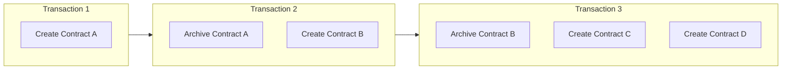
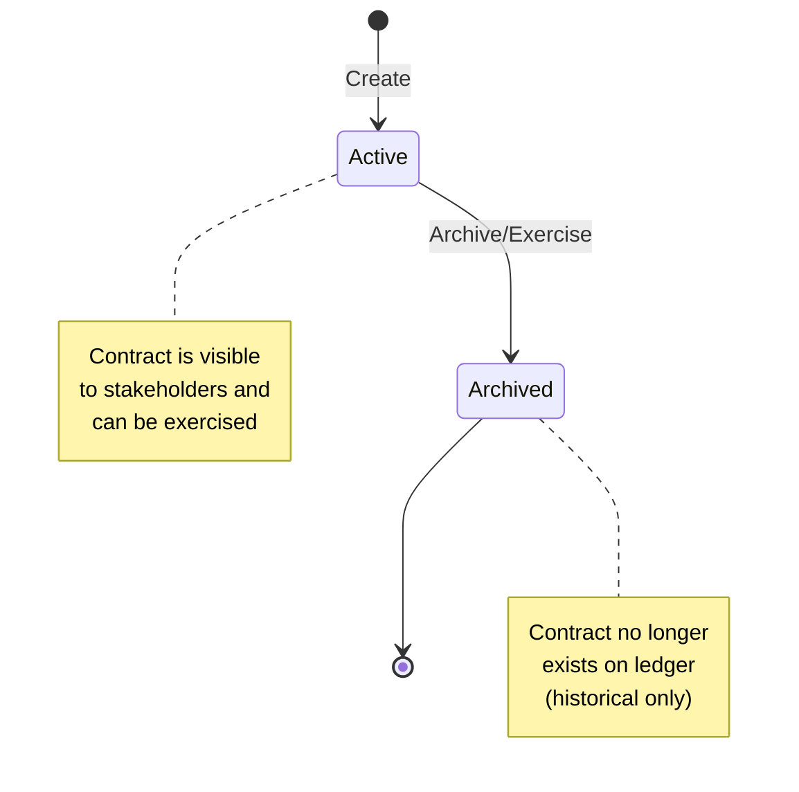
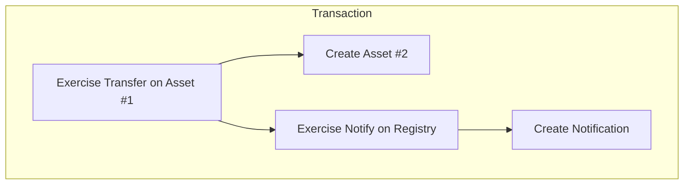
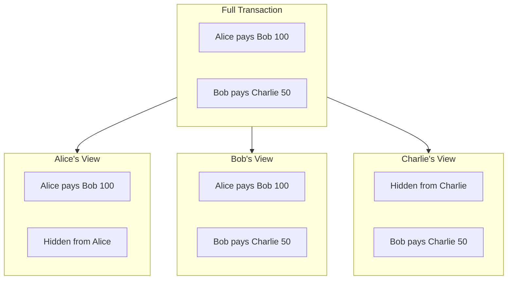

import DamlOverviewLearnLedgerModelL101 from "/snippets/daml-docs/overview_learn_ledger-model_L101.mdx";
import DamlOverviewLearnLedgerModelL122 from "/snippets/daml-docs/overview_learn_ledger-model_L122.mdx";
import DamlOverviewLearnLedgerModelL180 from "/snippets/daml-docs/overview_learn_ledger-model_L180.mdx";
import DamlOverviewLearnLedgerModelL241 from "/snippets/daml-docs/overview_learn_ledger-model_L241.mdx";
import DamlOverviewLearnLedgerModelL269 from "/snippets/daml-docs/overview_learn_ledger-model_L269.mdx";
import DamlOverviewLearnLedgerModelL283 from "/snippets/daml-docs/overview_learn_ledger-model_L283.mdx";
import DamlOverviewLearnLedgerModelL81 from "/snippets/daml-docs/overview_learn_ledger-model_L81.mdx";

Canton uses an **extended UTXO (eUTXO)** ledger model where contracts are discrete objects that are created and archived, rather than mutable account balances. This model is fundamental to how Canton achieves privacy and composability.

## Contracts as UTXOs

In Canton, the ledger is a collection of **active contracts**. Each contract:

- Is created by a transaction
- Exists until archived by another transaction
- Is immutable
- Has a unique contract ID

### Why UTXO?

| Property | UTXO Model | Account Model |
|----------|-----------|---------------|
| **Parallelism** | High—independent contracts process in parallel | Low—account locks needed |
| **Privacy** | Natural—each contract has specific stakeholders | Hard—accounts aggregate data |
| **Composability** | Built-in—contracts reference each other | Requires careful design |
| **Double-spend prevention** | Structural—contract archived once | Requires sequence numbers |

### Contract Lifecycle

## Stakeholder Roles

Every contract has **stakeholders**—parties with specific relationships to that contract. Stakeholder roles determine visibility and authorization.

### Signatories

Signatories are the primary authorities on a contract.

**Properties:**
- Must authorize contract creation
- May authorize contract archival (if controller on a consuming choice)
- Always see the contract and all actions on it
- Defined in the template with `signatory` keyword

<DamlOverviewLearnLedgerModelL81 />

**When to use:** When a party's agreement is essential to the contract's existence.

### Observers

Observers can see the contract but cannot act on it unilaterally.

**Properties:**
- See the contract and actions on it
- Cannot archive or exercise choices (unless also a controller)
- Defined with `observer` keyword

<DamlOverviewLearnLedgerModelL101 />

**When to use:** When a party needs visibility for compliance, audit, or information.

### Controllers

Controllers can exercise specific choices on a contract.

**Properties:**
- Can exercise choices they control
- See the choice and its consequences
- Defined per-choice with `controller` keyword

<DamlOverviewLearnLedgerModelL122 />

**When to use:** When a party should be able to trigger specific actions.

### Actors

Actors are the parties submitting or authorizing a transaction.

### Role Comparison

| Role | Can Create? | Can See? | Can Exercise? | Can Archive? |
|------|-------------|----------|---------------|--------------|
| **Signatory** | Yes | Always | If controller | Must authorize |
| **Observer** | No | Always | If controller | No |
| **Controller** | No | Choice + consequences | Yes (their choices) | Via consuming choice |
| **Actor** | If signatory | If stakeholder | If controller | If signatory |

## Transaction Structure

Transactions in Canton are trees of **actions**. Each action creates, exercises, or fetches contracts. (*Note that fetches are not typically returned in the transaction stream.*)

### Action Types

- **Create** adds a new contract to the ledger and returns a contract ID.
- **Exercise** executes a choice on a contract (which may archive it) and returns the choice result along with any consequences.
- **Fetch** reads a contract without changing state, returning the contract data.

### Transaction Tree

A transaction tree records all creates, exercises, fetches, and archives that occur within a single transaction:

### Consuming vs Non-Consuming Choices

A **consuming** choice (the default) archives the contract when exercised. Use these for state transitions and transfers. A **non-consuming** choice leaves the contract active, which is useful for queries, notifications, and reads.

<DamlOverviewLearnLedgerModelL180 />

## Views

Each stakeholder sees a **view** of the transaction: only the parts they're entitled to.

### View Composition

### Visibility Rules

1. **Signatories see the contract**, consuming, and non-consuming choices exercised on it
2. **Observers see the contract** and consuming choices exercised on it
3. **Controllers see choices** they can exercise and their consequences

## Contract Keys

<Note>
Contract keys are under development and planned for Canton 3.5.
</Note>

Contracts can have **keys**—identifiers that allow lookup without knowing the contract ID.

<DamlOverviewLearnLedgerModelL241 />

They support **lookup** so you can find a contract by its key without knowing the contract ID. Every key has a **maintainer**, the party responsible for the key.

<Warning>
Keys are global within a synchronizer. Design keys carefully to avoid leaking information about contract existence.
</Warning>

## Ledger Time

Canton uses **ledger time** for contract operations. Time is:

- Assigned by the synchronizer
- Monotonically increasing per synchronizer
- Used for time-based contract logic

<DamlOverviewLearnLedgerModelL269 />

See [Working with Time](/mainnet/appdev/modules/m3-working-with-time) for the full set of time primitives available in Canton 3.x.

## Composability

The UTXO model enables **atomic composition**—multiple contracts can be affected in a single transaction, all-or-nothing.

<DamlOverviewLearnLedgerModelL283 />

The ledger enforces this atomicity — either the entire swap commits or none of it does.

## Related Topics

- [Contract Templates](/mainnet/appdev/modules/m3-contract-templates) — write your first Daml contracts
- [Choices](/mainnet/appdev/modules/m3-choices) — add behavior to contracts
- [Privacy Model](/mainnet/overview/learn/privacy-model) — how views enable privacy
