A Super Validator (SV) runs everything a regular validator runs, plus the Global Synchronizer infrastructure and governance tooling. SVs are operated by major institutions approved through the DSO governance process, and they form the backbone of the Global Synchronizer's decentralized operation.

## Component Architecture

An SV node is composed of three layers: the base validator stack, the synchronizer infrastructure, and SV-specific applications.

```mermaid
flowchart TB
    subgraph SV["Super Validator Node"]
        direction TB

        subgraph SVApps["SV-Specific Applications"]
            SVAPP[SV App<br>Governance]
            SVUI[SV Web UI<br>Dashboard]
            SCANAPP[Scan App<br>Transaction Index]
            SCANUI[Scan Web UI<br>Network Explorer]
        end

        subgraph SyncInfra["Synchronizer Infrastructure"]
            SEQ[Sequencer Node]
            MED[Mediator Node]
            BFT[CometBFT / BFT Orderer Node]
        end

        subgraph ValStack["Validator Stack"]
            VALAPP[Validator App]
            WALLET[Wallet UI]
            CNSUI[Canton Name Service UI]
            PART[Canton Participant<br>with Splice DARs<br>Ledger API &#8226; Admin API]
            JAPI[JSON API]
            SCANPROXY[Scan Proxy]
            DB[(PostgreSQL Databases)]
        end

        SVAPP --> PART
        SCANAPP --> PART
        VALAPP --> PART
        PART --> DB
        SEQ --> DB
        MED --> DB
        BFT --> SEQ
        JAPI --> PART
    end

    ExtVal[External Validators] <-->|Sequencer API| SEQ
    OtherSV[Other SV Nodes] <-->|BFT P2P + Gossip| BFT
    OtherSV <-->|Scan Backfill| SCANAPP
    Apps[Applications] --> PART
    Apps --> JAPI
    Public[Public Clients] --> SCANAPP
```

## Validator Stack

Every SV includes the full validator stack. For a detailed breakdown, see the [Validator Node Components](/mainnet/overview/reference/validator-node-components) reference.

The validator layer provides:

- **Validator App** -- manages validator lifecycle, party onboarding, traffic top-ups, and wallet automation
- **Canton Participant** -- the Daml execution engine that hosts parties, stores contracts, and participates in the Canton protocol. Splice DARs (Canton Coin, governance, wallet) are installed on the participant.
- **Wallet UI and Canton Name Service UI** -- web interfaces for managing Canton Coin holdings and registering human-readable party names
- **Ledger API (gRPC) and JSON API** -- application-facing APIs for submitting commands and streaming transactions
- **Admin API** -- node administration, party management, and identity operations
- **Scan Proxy** -- provides BFT reads against Scan APIs hosted by multiple SVs, so the validator does not need to trust a single SV's Scan instance
- **PostgreSQL databases** -- persistent storage for the participant's ledger shard and application state

## Synchronizer Infrastructure

SVs operate the distributed synchronizer that all validators (including the SV's own participant) connect to. Each SV runs one instance of each synchronizer component, and together the SVs form the distributed Global Synchronizer.

### Sequencer Node

The sequencer provides authenticated, timestamped multicast for the Global Synchronizer. It receives encrypted transaction messages from participants and delivers them to the designated recipients in a consistent, total order.

The sequencer does not decrypt message content. It handles routing and ordering based on encrypted envelopes and metadata.

In the Global Synchronizer, each SV runs a sequencer node. Validators connect to multiple SV sequencers using BFT sequencer connections -- reading from and writing to a threshold of sequencers to tolerate faulty or unavailable nodes.

### Mediator Node

The mediator facilitates the two-phase commit protocol for transactions on the Global Synchronizer. It collects confirmation verdicts from the stakeholder participants involved in a transaction, aggregates those verdicts, and declares the transaction outcome (committed or rejected).

Like the sequencer, the mediator does not see decrypted transaction content. It operates over encrypted confirmation messages.

Each SV runs a mediator node. The mediators use BFT state machine replication so that the confirmation protocol continues to function as long as a sufficient threshold of mediators is honest and available.

### CometBFT / BFT Orderer Node

The BFT orderer node participates in the consensus protocol that establishes the total ordering of messages processed by the sequencer. The current implementation uses [CometBFT](https://cometbft.com/) (formerly Tendermint), where each SV runs a CometBFT validator that participates in block production and voting.

CometBFT nodes maintain peer-to-peer connections with all other SV CometBFT nodes and communicate over a dedicated TCP gossip/consensus channel (separate from the HTTPS APIs used by validators). The BFT consensus requires agreement from more than two-thirds of the SV nodes to produce a block, meaning the system tolerates up to `f` Byzantine (faulty or malicious) nodes where `f = floor((n-1)/3)` and `n` is the total number of SVs.

For more on how ordering consensus works, see [Ordering Consensus](/mainnet/overview/reference/ordering-consensus).

## SV-Specific Applications

These Splice applications are unique to SV nodes and provide governance participation and public network transparency.

### SV App

The SV App manages the SV's participation in DSO governance. Through it, the SV:

- Votes on Canton Improvement Proposals (CIPs)
- Votes on network parameter changes (traffic pricing, reward distributions, upgrade schedules)
- Approves or rejects new SV onboarding requests
- Generates onboarding secrets for validators that the SV sponsors
- Manages the SV's amulet (Canton Coin) conversion rate vote
- Distributes SV reward coupons to configured beneficiaries

The SV App connects to the local participant using the Ledger API and authenticates via OIDC.

### SV Web UI

The SV Web UI is the operator dashboard for governance and node monitoring. It provides:

- DSO governance overview (active votes, network parameters, SV membership)
- Vote creation and management interface for CIPs and parameter changes
- Validator onboarding secret generation
- CometBFT debug information (peer connectivity, block height, consensus state)
- Global Synchronizer node status (sequencer and mediator health)

### Scan App

The Scan App indexes the transaction history visible to the DSO party on the Global Synchronizer. It subscribes to the SV's participant node and reconstructs a queryable view of Canton Coin transfers, governance operations, mining rounds, and reward distributions.

Each SV runs its own Scan App instance. Scan Apps backfill data from other SV Scan instances in a BFT manner, so that their records are consistent across the network. This allows the public to compare data across multiple SV-hosted Scan instances without needing to trust any single SV.

### Scan API

The Scan API is the public HTTP API exposed by the Scan App. It provides:

- Canton Coin balances and transfer history
- Mining round data (open, closing, closed rounds and issuance information)
- SV information (identities, reward weights, governance participation)
- Global Synchronizer connectivity information (sequencer URLs, package references)
- Aggregated statistics on network activity
- A bulk data API for full history export and ACS snapshots

The Scan API is documented with an OpenAPI specification. Endpoints marked as `external` are intended for third-party consumption and maintain backward compatibility across releases.

## Network Connectivity

An SV node has several distinct network connectivity requirements beyond what a regular validator needs.

**BFT peer-to-peer connections**: Each SV's CometBFT node maintains TCP connections to every other SV's CometBFT node on dedicated P2P ports (e.g., port `26<MIGRATION_ID>56`). These connections carry the consensus gossip protocol.

**Sequencer API**: The SV exposes its sequencer over HTTPS so that external validators (and other SVs' participants) can connect to it. Validators use BFT sequencer connections that read from and write to multiple SV sequencers simultaneously.

**Scan backfill**: Each SV's Scan App connects to the Scan APIs of all other SVs to backfill and cross-check transaction history in a BFT fashion.

**Sponsor connectivity**: When onboarding new SVs, the sponsoring SV's sequencer, Scan, and SV App endpoints must be reachable by the joining node.

## SV Roles and Responsibilities

Running an SV node means fulfilling several roles simultaneously:

- **Synchronizer operator** -- run and maintain the sequencer and mediator nodes that validators depend on for transaction processing
- **BFT consensus participant** -- run the CometBFT orderer node that contributes to block production and message ordering
- **Governance participant** -- vote on CIPs, approve new validators and SVs, and set network parameters through the DSO governance process
- **Scan infrastructure provider** -- host a public Scan instance that indexes Global Synchronizer activity for transparency and third-party integrations
- **Validator operator** -- host parties, manage Canton Coin holdings, and run applications like any other validator on the network

## Key Properties

Each SV runs the full stack: the validator layer, the synchronizer infrastructure, and the governance applications. There is no partial SV deployment -- an SV that does not run all components cannot fulfill its role in the DSO.

SVs are operated by institutions approved through the DSO governance process. Adding or removing an SV requires a governance vote with a threshold of existing SV approval.

The BFT ordering service requires more than two-thirds of SVs to be honest for safety (no conflicting ordering) and liveness (continued block production). With `n` SVs, the system tolerates up to `floor((n-1)/3)` Byzantine faults.

SVs earn rewards from network activity through the Canton Coin minting mechanism. Infrastructure operation, governance participation, and validator activity all contribute to SV minting rights.

## Database Requirements

An SV node requires four PostgreSQL instances (which can be consolidated but are recommended to be separate for operational flexibility):

- **Sequencer database** -- stores sequencer state and message queues
- **Mediator database** -- stores mediator state and confirmation data
- **Participant database** -- stores the participant's ledger shard (contracts for hosted parties)
- **Apps database** -- stores state for the SV App, Scan App, Validator App, and wallet

## Deployed Pods

A running SV node in Kubernetes consists of the following pods (as shown by `kubectl get pods`):

- `global-domain-<M>-cometbft` -- CometBFT consensus node
- `global-domain-<M>-sequencer` -- Sequencer node
- `global-domain-<M>-mediator` -- Mediator node
- `participant-<M>` -- Canton participant
- `sv-app` -- SV governance application
- `sv-web-ui` -- SV operator dashboard
- `scan-app` -- Scan indexer and API
- `scan-web-ui` -- Scan network explorer UI
- `validator-app` -- Validator application
- `wallet-web-ui` -- Wallet interface
- `ans-web-ui` -- Canton Name Service interface
- `info` -- Node information service
- `sequencer-pg`, `mediator-pg`, `participant-pg`, `apps-pg` -- PostgreSQL instances

Where `<M>` is the current migration ID of the Global Synchronizer.
