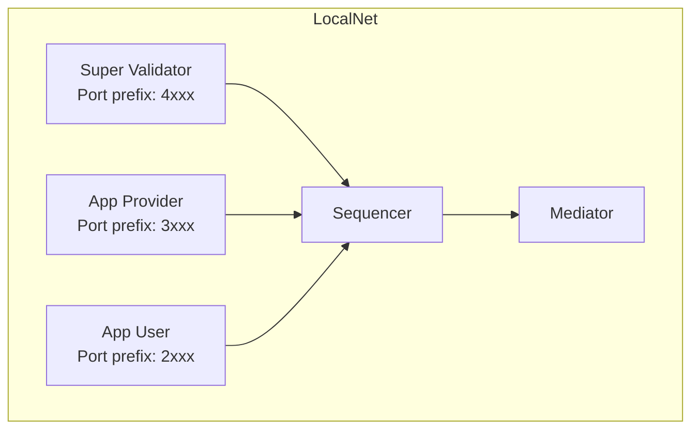

import DamlDocsSdksToolsDevelopmentToolsLocalnetL40 from "/snippets/daml-docs/sdks-tools_development-tools_localnet_L40.mdx";
import DamlDocsSdksToolsDevelopmentToolsLocalnetL55 from "/snippets/daml-docs/sdks-tools_development-tools_localnet_L55.mdx";
import DamlDocsSdksToolsDevelopmentToolsLocalnetL61 from "/snippets/daml-docs/sdks-tools_development-tools_localnet_L61.mdx";
import DamlDocsSdksToolsDevelopmentToolsLocalnetL197 from "/snippets/daml-docs/sdks-tools_development-tools_localnet_L197.mdx";


{/* COPIED_START source="splice:docs/src/app_dev/testing/localnet.rst" hash="7adf9498" */}

<Warning title="Pre-reviewed Content - Do Not Modify">
This section was copied from existing reviewed documentation.
**Source:** `docs/src/app_dev/testing/localnet.rst`
Reviewers: Skip this section. Remove markers after final approval.
</Warning>

LocalNet provides a straightforward topology comprising three participants, three validators, a PostgreSQL database, and several web applications (wallet, sv, scan) behind an NGINX gateway. Each validator plays a distinct role within the Splice ecosystem:

- **app-provider**: for the user operating their application
- **app-user**: for a user wanting to use the app from the App Provider
- **sv**: for providing the Global Synchronizer and handling AMT

Designed primarily for development and testing, LocalNet is not intended for production use.

{/* COPIED_END */}

LocalNet is provided as part of the [cn-quickstart](https://github.com/digital-asset/cn-quickstart) repository.

## What LocalNet Provides

- Three validators: Super Validator (SV), App Provider, and App User
- A local synchronizer with sequencer and mediator
- Canton Coin wallet services for each validator
- PQS (Participant Query Store) instances
- JSON API endpoints
- Keycloak for authentication (optional)
- Observability stack: Grafana, Prometheus, Loki (optional)

## Setup

From the cn-quickstart repository:

<DamlDocsSdksToolsDevelopmentToolsLocalnetL40 />

`make setup` prompts you to select a deployment profile and generates the appropriate `.env.local` configuration. `make build` compiles the Daml contracts, Java backend, and React frontend. `make start` launches the Docker Compose stack.

Check the status of running containers:

<DamlDocsSdksToolsDevelopmentToolsLocalnetL55 />

Stop the environment:

<DamlDocsSdksToolsDevelopmentToolsLocalnetL61 />

## Network Topology



Each validator runs a participant, wallet services, and supporting infrastructure. The Super Validator also runs the synchronizer components (sequencer and mediator) and the Splice SV app.

## Port Conventions

{/* COPIED_START source="splice:docs/src/app_dev/testing/localnet.rst" hash="7adf9498" */}

<Warning title="Pre-reviewed Content - Do Not Modify">
This section was copied from existing reviewed documentation.
**Source:** `docs/src/app_dev/testing/localnet.rst`
Reviewers: Skip this section. Remove markers after final approval.
</Warning>

## Exposed Ports

The following section details the ports used by various services. The default database port is **DB_PORT=5432**.

Other ports are generated using specific patterns based on the validator:

- For the Super Validator (sv), the port is specified as `4${PORT_SUFFIX}`.
- For the App Provider, the port is specified as `3${PORT_SUFFIX}`.
- For the App User, the port is specified as `2${PORT_SUFFIX}`.

These patterns apply to the following ports suffixes:

- **PARTICIPANT_LEDGER_API_PORT_SUFFIX**: 901
- **PARTICIPANT_ADMIN_API_PORT_SUFFIX**: 902
- **PARTICIPANT_JSON_API_PORT_SUFFIX**: 975
- **VALIDATOR_ADMIN_API_PORT_SUFFIX**: 903
- **CANTON_HTTP_HEALTHCHECK_PORT_SUFFIX**: 900
- **CANTON_GRPC_HEALTHCHECK_PORT_SUFFIX**: 961

UI Ports are defined as follows:

- **APP_USER_UI_PORT**: 2000
- **APP_PROVIDER_UI_PORT**: 3000
- **SV_UI_PORT**: 4000


## Application UIs

- **App User Wallet UI**

  > - **URL**: `http://wallet.localhost:2000`
  > - **Description**: Interface for managing user wallets.

- **App Provider Wallet UI**

  > - **URL**: `http://wallet.localhost:3000`
  > - **Description**: Interface for managing user wallets.

- **Super Validator Web UI**

  > - **URL**: `http://sv.localhost:4000`
  > - **Description**: Interface for super validator functionalities.

- **Scan Web UI**

  > - **URL**: `http://scan.localhost:4000`
  > - **Description**: Interface to monitor transactions.

<Note>
<span class="title-ref">LocalNet</span> rounds may take up to 6 rounds (equivalent to one hour) to display in the scan UI.
</Note>

In most scenarios, the `*.localhost` domains (e.g., `http://scan.localhost`) will resolve to your local host IP `127.0.0.1`. There are some situations where the resolution does not occur and the solution is to add entries to your `/etc/hosts` file. For example, to resolve `http://scan.localhost` and `http://wallet.localhost` add these entry to the file:

``` 
127.0.0.1   scan.localhost
127.0.0.1   wallet.localhost
```

## Default Wallet Users

- **App User**: app-user
- **App Provider**: app-provider
- **SV**: sv

{/* COPIED_END */}

For example, the App User's Ledger API is at `localhost:2901`, and the App Provider's JSON API is at `localhost:3975`.

<Warning>
The Admin API and PostgreSQL ports are exposed for development convenience. Do not expose these ports in non-local deployments.
</Warning>

## Configuration Options

### Deployment Profiles

`make setup` offers deployment profiles that control which optional services are included:

- **Minimal** -- Core validators and synchronizer only
- **Standard** -- Adds PQS, JSON API, and authentication
- **Full** -- Adds observability (Grafana, Prometheus, Loki)

### Environment Variables

The `.env` file in the `quickstart/` directory contains version numbers, feature flags, and service configuration. Create a `.env.local` file (not tracked by git) to override settings locally.

### Docker Compose Modules

LocalNet is built from modular Docker Compose layers in `docker/modules/`:

- `localnet/` -- Base infrastructure (validators, synchronizer)
- `auth/` -- Keycloak authentication
- `observability/` -- Grafana, Prometheus, Loki
- `pqs/` -- Participant Query Store instances
- `app/` -- Application services (backend, frontend)

## Health Checks

Verify that validators are healthy:

<DamlDocsSdksToolsDevelopmentToolsLocalnetL197 />

An empty response indicates a healthy service.

## When to Use LocalNet vs Sandbox

**Use LocalNet** when you need to test:

- Multi-party workflows across separate validators
- Canton Coin transfers and traffic purchases
- Wallet integration
- Splice API interactions (Scan, Validator APIs)
- End-to-end flows with backend, frontend, and ledger

**Use the [Sandbox](/mainnet/sdks-tools/development-tools/sandbox)** when you need:

- Fast iteration on contract logic
- Single-participant testing without Docker
- A lightweight environment for `dpm test` and Ledger API integration

## Related Pages

- [cn-quickstart](/mainnet/sdks-tools/reference-projects/cn-quickstart) -- Repository overview and project structure
- [Sandbox](/mainnet/sdks-tools/development-tools/sandbox) -- Lightweight single-node alternative
- [QuickStart walkthrough](/mainnet/appdev/quickstart/running-the-demo) -- Step-by-step guide to running the demo application
