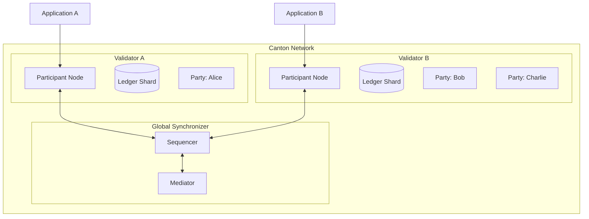
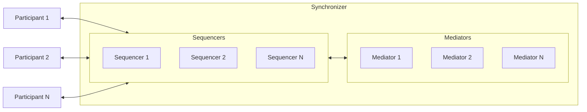
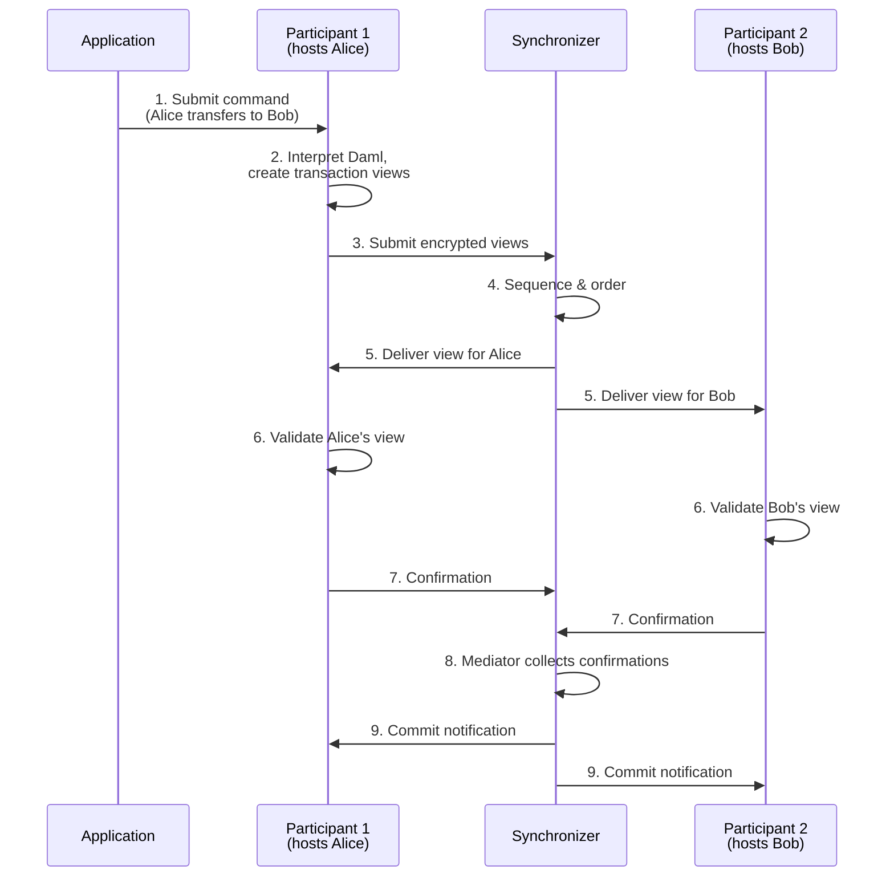
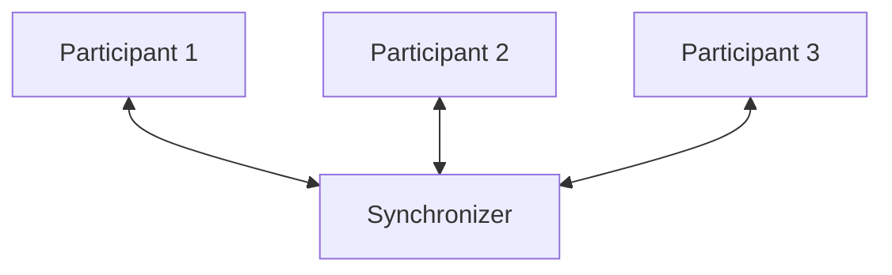
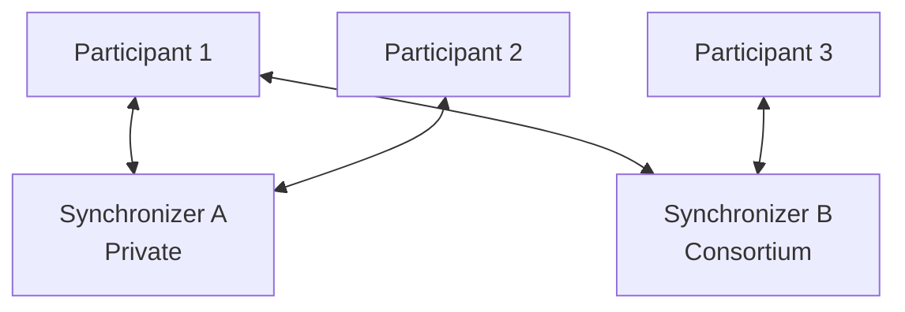
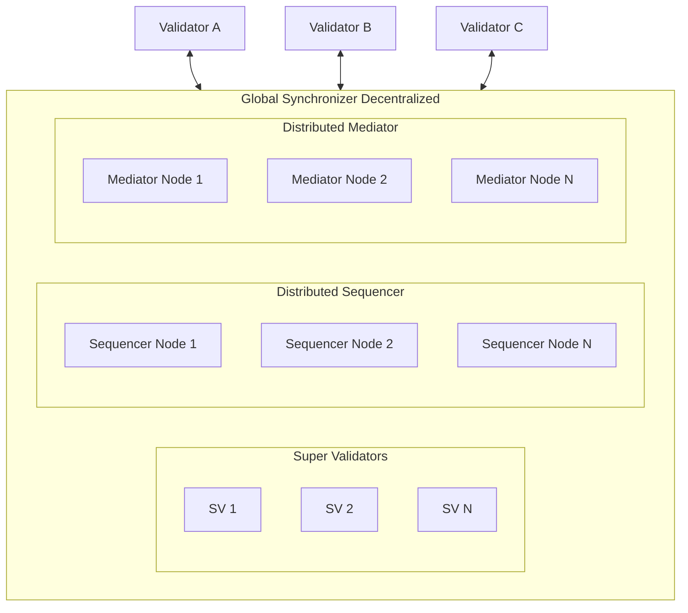
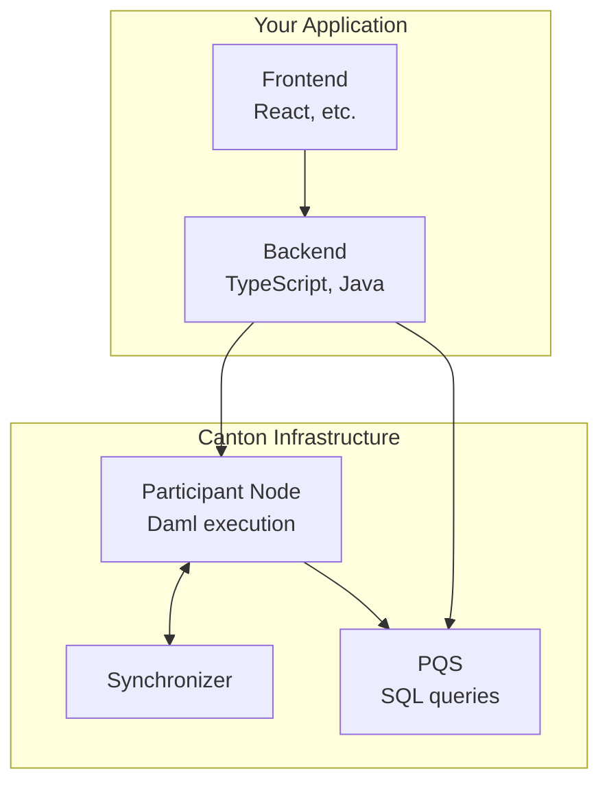

Canton's architecture differs fundamentally from traditional blockchains. Understanding these components is essential for designing and debugging Canton applications.

## The Big Picture

Canton separates **coordination** from **storage**. Synchronizers coordinate transaction ordering; participant nodes (validators) store data for their hosted parties.



Unlike Ethereum where every node stores all state, Canton nodes store only their parties' data. The synchronizer coordinates but never stores transaction content.

## Core Components

### Validators

Validators are the workhorses of Canton. They:

| Function | Description |
|----------|-------------|
| **Host parties** | Store contract data for their hosted parties |
| **Execute Daml logic** | Run smart contract code when transactions affect their parties |
| **Validate transactions** | Verify authorization and correctness for their shard |
| **Expose the Ledger API** | Provide gRPC/JSON APIs for applications |

A participant is the private, self-sovereign computational and storage unit for an entity within Canton Network.

**Key characteristics:**
- Each participant maintains a **localized, private view** of the ledger
- Participants only store contracts where their hosted parties are stakeholders
- Multiple parties can be hosted on a single participant
- Participants can connect to multiple synchronizers

### Synchronizers

Synchronizers coordinate transaction ordering and consensus **without seeing transaction content**. They consist of two components:



**Sequencer**
- Orders and distributes encrypted messages between participants
- Provides total ordering for transactions for that synchronizer
- **Does not see** decrypted transaction content
- Ensures all participants receive messages from that synchronizer in the same order

**Mediator**
- Facilitates the consensus protocol
- Collects confirmation verdicts from participants
- Declares transaction verdicts (committed or rejected)
- **Does not see** decrypted transaction content

<Note>
The synchronizer is a coordination layer, not a state storage layer. It never stores or has access to transaction data, only encrypted messages and confirmation results.
</Note>

### Parties

Parties are Canton's on-ledger identities, analogous to addresses or externally owned accounts (EOAs) on other blockchains.

```
alice::1220f2fe29866fd6a0009ecc8a64ccdc09f1958bd0f801166baaee469d1251b2eb72
└┬┘  └─────────────────────────────────────────┘
 name                              fingerprint (hash of public key)
```

**Party Capabilities:**

| Capability | Description |
|------------|-------------|
| **Validate** | Confirm transactions affecting their contracts |
| **Control** | Initiate specific actions (choices) |
| **Observe** | See specific state and transactions |

**Local vs External Parties:**

| Type | Key Storage | Control | Use Case |
|------|-------------|---------|----------|
| **Local Party** | Held by validator | Validator signs on behalf | Simpler; validator has full control |
| **External Party** | Held externally | Requires explicit signatures | More control; wallet-like experience |

<Warning>
Unlike Ethereum addresses, parties have costs associated with creation and create state on validators. They're not ephemeral, design your party structure deliberately.
</Warning>

## How Transactions Work

### Transaction Flow



### Step-by-Step Explanation

| Step | Component | Action |
|------|-----------|--------|
| **1. Submit** | Application | Sends command to participant via Ledger API |
| **2. Interpret** | Submitting Participant | Executes Daml code, creates transaction with views |
| **3. Submit** | Submitting Participant | Sends encrypted views to synchronizer |
| **4. Sequence** | Sequencer | Orders transaction, assigns timestamp |
| **5. Distribute** | Sequencer | Sends each view only to entitled participants |
| **6. Validate** | All Participants | Each validates their view independently |
| **7. Confirm** | All Participants | Send confirmation/rejection verdict to mediator |
| **8. Collect** | Mediator | Aggregates verdicts, determines outcome |
| **9. Commit** | All Participants | Apply transaction to local ledger shard |

**Key points:**
- Transaction is decomposed into **views**, each party sees only their view
- Synchronizer sequences but **never decrypts** content
- Confirmation requires **threshold agreement** from relevant participants
- Each participant stores only their committed view

## Network Topology Options

Canton supports multiple topology configurations:

### Single Synchronizer (Simple)



Use case: Simple deployments, testing, single-organization applications.

### Multiple Synchronizers (Enterprise)



Use case: Different synchronizers for different workflows; regulatory separation; consortium governance.

### Global Synchronizer (Canton Network)



Use case: Public Canton Network; decentralized applications; cross-organization workflows.

## Where Your Code Runs

| Component | Location | Technology | Responsibility |
|-----------|----------|------------|----------------|
| **Smart Contracts (Templates)** | Participant nodes | Daml | Business logic, authorization, privacy rules |
| **Backend Services** | Your infrastructure | Any language (TypeScript, Java, Python) | Off-ledger automation, integrations |
| **Frontend** | Browser/mobile | Any framework | User interface |
| **Queries** | Participant (Ledger API) or PQS | gRPC, JSON, SQL | Reading ledger state |



### Application Architecture Decisions

| Decision | On-Ledger (Daml) | Off-Ledger (Backend) |
|----------|------------------|----------------------|
| **Multi-party agreements** | ✓ Required | |
| **Authorization enforcement** | ✓ Recommended | Possible but weaker |
| **Complex business logic** | Possible | ✓ Often easier |
| **External API calls** | Not possible | ✓ Required |
| **High-frequency operations** | Consider batching | ✓ Better suited |
| **Audit trail requirements** | ✓ Built-in | Must implement |

## Component Communication

### APIs Overview

| API | Protocol | Use Case |
|-----|----------|----------|
| **Ledger API (gRPC)** | gRPC/Protobuf | High-performance backend integration |
| **Ledger API (JSON)** | HTTP/JSON | Simpler integration, browser-friendly |
| **Admin API** | gRPC/Protobuf | Node administration, party management |
| **PQS SQL API** | PostgreSQL | Complex queries, reporting |

### Ledger API Operations

| Operation | Description |
|-----------|-------------|
| **Command Submission** | Submit Daml commands (create contracts, exercise choices) |
| **Transaction Stream** | Subscribe to transaction events for your parties |
| **Active Contract Set** | Query currently active contracts |
| **Completions** | Track command completion status |

## Next Steps

- **[Privacy Model Explained](/docs-main/understand/privacy-model)** - Deep dive into sub-transaction privacy
- **[The Global Synchronizer](/docs-main/understand/global-synchronizer)** - Understand the public network infrastructure
- **[Operator Track](/docs-main/operator/m1-overview)** - For those deploying and operating validators
