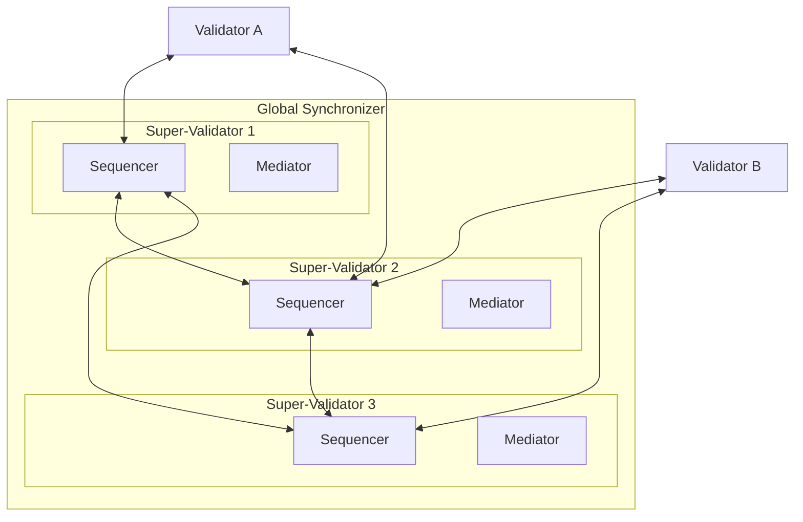

The Global Synchronizer is the shared infrastructure that enables transactions between parties on different validators. It is operated by a set of super-validators (SVs) under the governance of the Global Synchronizer Foundation. The synchronizer coordinates transaction ordering and consensus but never sees the contents of the transactions it processes.

## Components

The Global Synchronizer consists of multiple sequencers and mediators running across the super-validator nodes. This distributed architecture provides Byzantine Fault Tolerance (BFT) — the system continues operating correctly even if some nodes are compromised or fail.
Only sequencers communicate across SVs; each mediator communicates with its local SV sequencer in Canton Network deployments.

### Sequencers

Sequencers provide a total ordering for all messages in the synchronizer. They receive encrypted transaction messages from validators and deliver them in a consistent order to all participants involved in a transaction. Multiple sequencers run across different SVs, and they use a BFT consensus protocol to agree on message ordering.

Sequencers see encrypted message envelopes but cannot read their contents. They know which participants need to receive a message (based on addressing metadata) but not what the transaction does.

### Mediators

Mediators collect confirmation responses from validators and determine whether a transaction has been approved by all required parties. Like sequencers, mediators operate on encrypted views — they can verify that the right parties have confirmed a transaction without learning what the transaction contains.

Each SV runs both a sequencer and a mediator. The mediator for a given transaction is determined by the sequencer that first processes the transaction's confirmation request.

## Transaction flow through the synchronizer

When a validator submits a transaction:

1. The validator sends encrypted transaction views to the sequencer, addressed to each involved participant
2. The sequencer orders the message and distributes it to the addressed participants
3. Each receiving participant decrypts its view, validates the transaction, and sends a confirmation or rejection to the mediator
4. The mediator collects responses and determines the transaction result
5. The result is broadcast back through the sequencer to all involved participants
6. Each participant applies the result to its local ledger

The entire flow typically completes in under a second. The synchronizer never has access to the unencrypted transaction data — it coordinates the protocol without learning what is being transacted.

## BFT guarantees

The distributed design means that no single SV can unilaterally censor transactions, forge confirmations, or disrupt the ordering. As long as fewer than one-third of the SVs are faulty or malicious, the synchronizer operates correctly. The exact BFT threshold depends on the consensus configuration set by the Global Synchronizer Foundation governance.

## Validators and the synchronizer

Regular validators (as opposed to SVs) connect to the synchronizer as clients. They do not run sequencer or mediator components. A validator only needs outbound connectivity to the SV endpoints — there are no inbound connection requirements for standard validators.
