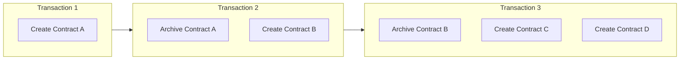
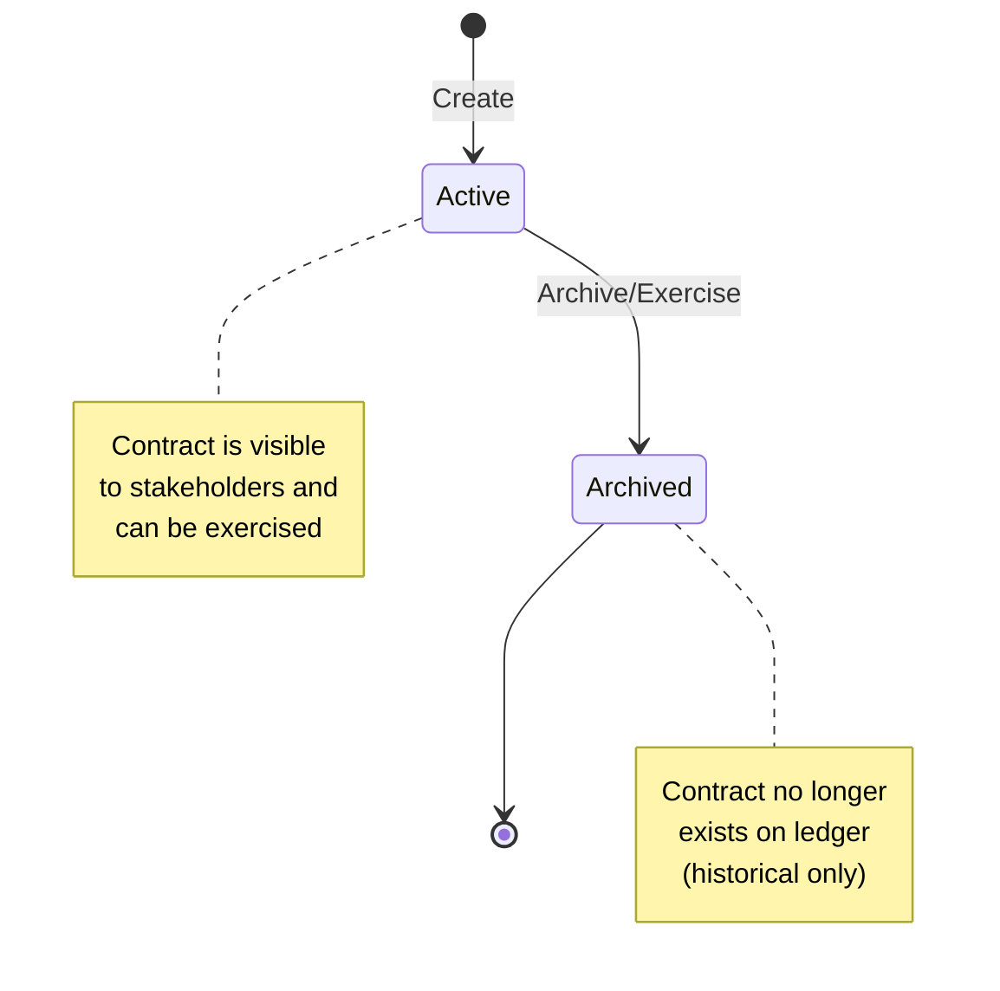
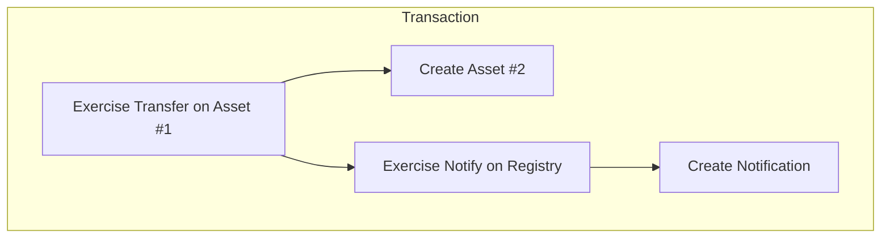
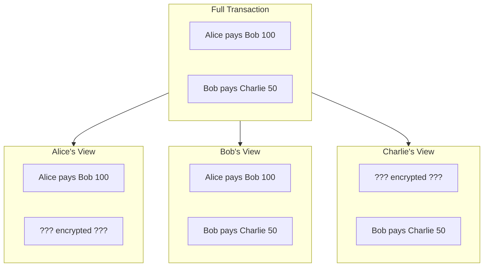

Canton uses an **extended UTXO (eUTXO)** ledger model where contracts are discrete objects that are created and archived, rather than mutable account balances. This model is fundamental to how Canton achieves privacy and composability.

## Contracts as UTXOs

In Canton, the ledger is a collection of **active contracts**. Each contract:

- Is created by a transaction
- Exists until archived by another transaction
- Is immutable
- Has a unique contract ID



### Why UTXO?

| Property | UTXO Model | Account Model |
|----------|-----------|---------------|
| **Parallelism** | High—independent contracts process in parallel | Low—account locks needed |
| **Privacy** | Natural—each contract has specific stakeholders | Hard—accounts aggregate data |
| **Composability** | Built-in—contracts reference each other | Requires careful design |
| **Double-spend prevention** | Structural—contract archived once | Requires sequence numbers |

### Contract Lifecycle



## Stakeholder Roles

Every contract has **stakeholders**—parties with specific relationships to that contract. Stakeholder roles determine visibility and authorization.

### Signatories

Signatories are the primary authorities on a contract.

**Properties:**
- Must authorize contract creation
- Must authorize contract archival
- Always see the contract and all actions on it
- Defined in the template with `signatory` keyword

```daml
template Asset
  with
    issuer : Party
    owner : Party
  where
    signatory issuer, owner  -- Both must agree to create/archive
```

**When to use:** Parties whose agreement is essential to the contract's existence.

### Observers

Observers can see the contract but cannot act on it unilaterally.

**Properties:**
- See the contract and actions on it
- Cannot archive or exercise choices (unless also a controller)
- Defined with `observer` keyword

```daml
template RegulatedAsset
  with
    owner : Party
    regulator : Party
  where
    signatory owner
    observer regulator  -- Regulator can see but not act
```

**When to use:** Parties who need visibility for compliance, audit, or information.

### Controllers

Controllers can exercise specific choices on a contract.

**Properties:**
- Can exercise choices they control
- See the choice and its consequences
- Defined per-choice with `controller` keyword

```daml
template Proposal
  with
    proposer : Party
    accepter : Party
  where
    signatory proposer
    observer accepter

    choice Accept : ContractId Agreement
      controller accepter  -- Only accepter can exercise
      do
        create Agreement with party1 = proposer, party2 = accepter
```

**When to use:** Parties who should be able to trigger specific actions.

### Actors

Actors are the parties actually submitting a transaction. They must have authorization (be a controller) for the choices they exercise.

### Role Comparison

| Role | Can Create? | Can See? | Can Exercise? | Can Archive? |
|------|-------------|----------|---------------|--------------|
| **Signatory** | Must authorize | Always | If controller | Must authorize |
| **Observer** | No | Always | If controller | No |
| **Controller** | No | Choice + consequences | Yes (their choices) | Via consuming choice |
| **Actor** | If signatory | If stakeholder | If controller | If signatory |

## Transaction Structure

Transactions in Canton are trees of **actions**. Each action creates, exercises, or fetches contracts.

### Action Types

| Action | Effect | Produces |
|--------|--------|----------|
| **Create** | Adds new contract to ledger | Contract ID |
| **Exercise** | Executes a choice (may archive) | Choice result + consequences |
| **Fetch** | Reads a contract (no state change) | Contract data |

### Transaction Tree

When a choice exercises other choices, it creates a tree:



### Consuming vs Non-Consuming Choices

| Type | Contract After | Use Case |
|------|----------------|----------|
| **Consuming** (default) | Archived | State transitions, transfers |
| **Non-consuming** | Still active | Queries, notifications, reads |

```daml
-- Consuming: archives the contract
choice Transfer : ContractId Asset
  controller owner
  do
    create this with owner = newOwner

-- Non-consuming: contract remains
nonconsuming choice GetBalance : Decimal
  controller owner
  do
    return balance
```

## Views and Projections

Each stakeholder sees a **view** of the transaction—only the parts they're entitled to.

### View Composition



### Visibility Rules

1. **Signatories see everything** about their contracts
2. **Observers see the contract** and actions on it
3. **Controllers see choices** they can exercise and their consequences
4. **If you see an action, you see its direct consequences**

## Contract Keys

Contracts can have **keys**—unique identifiers that allow lookup without knowing the contract ID.

```daml
template Account
  with
    bank : Party
    owner : Party
    accountNumber : Text
  where
    signatory bank
    observer owner

    key (bank, accountNumber) : (Party, Text)
    maintainer key._1  -- bank maintains uniqueness
```

### Key Properties

| Property | Description |
|----------|-------------|
| **Uniqueness** | Only one active contract per key |
| **Lookup** | Find contract by key without ID |
| **Maintainer** | Party responsible for uniqueness |

<Warning>
Keys are global within a synchronizer. Design keys carefully to avoid leaking information about contract existence.
</Warning>

## Ledger Time

Canton uses **ledger time** for contract operations. Time is:

- Assigned by the synchronizer
- Monotonically increasing per synchronizer
- Used for time-based contract logic

```daml
choice ClaimAfterDeadline : ()
  controller beneficiary
  do
    now <- getTime
    assertMsg "Too early" (now > deadline)
    -- ... claim logic
```

## Composability

The UTXO model enables **atomic composition**—multiple contracts can be affected in a single transaction, all-or-nothing.

```daml
-- Atomic swap: both transfers happen or neither does
choice ExecuteSwap : ()
  controller buyer
  do
    exercise assetId Transfer with newOwner = buyer
    exercise paymentId Transfer with newOwner = seller
```

This atomicity is enforced by the ledger—partial execution is impossible.

## Next Steps

- **[Contract Templates](/appdev/modules/m3-contract-templates)** - Write your first Daml contracts
- **[Choices](/appdev/modules/m3-choices)** - Add behavior to contracts
- **[Privacy Model](/overview/learn/privacy-model)** - How views enable privacy
