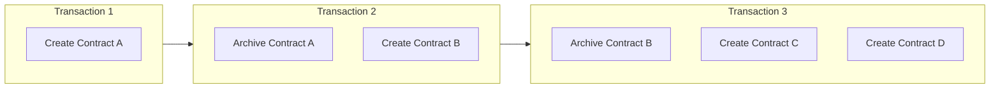
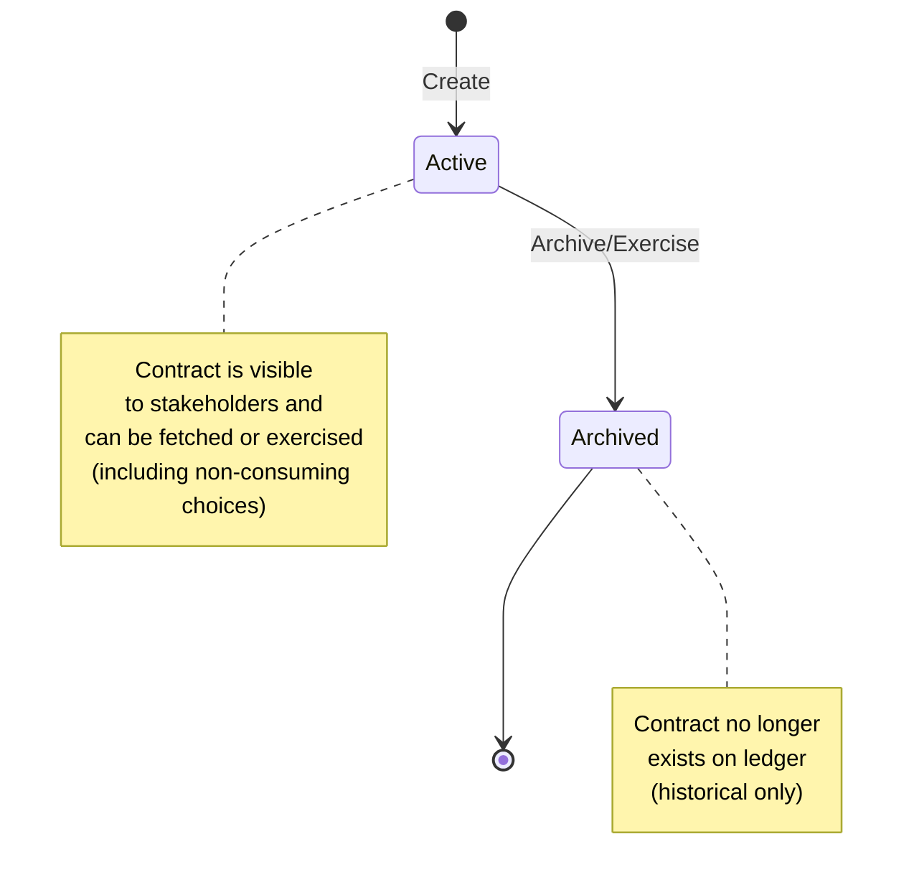
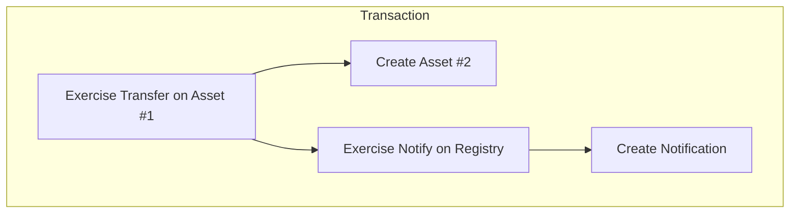
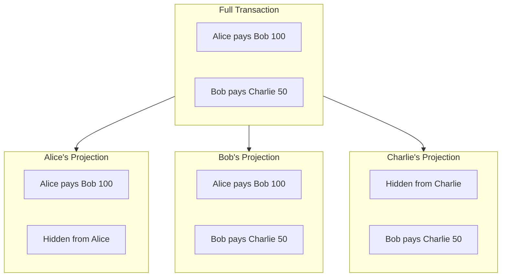

Canton uses an **extended UTXO (eUTXO)** ledger model where contracts are discrete objects that are created and archived, rather than mutable account balances. This model is fundamental to how Canton achieves privacy and composability.

## Contracts as UTXOs

In Canton, the ledger is a collection of **active contracts**. Each contract:

- Is created by a transaction
- Exists until archived by another transaction
- Is immutable
- Has a unique contract ID



### Why UTXO?

| Property | UTXO Model | Account Model |
|----------|-----------|---------------|
| **Parallelism** | High—independent contracts process in parallel | Low—account locks needed |
| **Privacy** | Natural—each contract has specific stakeholders | Hard—accounts aggregate data |
| **Composability** | Built-in—contracts reference each other | Requires careful design |
| **Double-spend prevention** | Structural—contract archived once | Requires sequence numbers |

### Contract Lifecycle



## Stakeholder Roles

Every contract has **stakeholders**—parties with specific relationships to that contract. Stakeholder roles determine visibility and authorization.

### Signatories

Signatories are the primary authorities on a contract.

**Properties:**
- Must authorize contract creation
- May authorize contract archival (if controller on a consuming choice)
- Always see the contract and all actions on it
- Defined in the template with `signatory` keyword

```daml
template Asset
  with
    issuer : Party
    owner : Party
  where
    signatory issuer, owner  -- Both must agree to create/archive
```

**When to use:** When a party's agreement is essential to the contract's existence.

### Observers

Observers can see the contract but cannot act on it unilaterally.

**Properties:**
- See the contract and consuming choices exercised on it
- Cannot archive or exercise choices (unless also a controller)
- Defined with `observer` keyword

```daml
template RegulatedAsset
  with
    owner : Party
    regulator : Party
  where
    signatory owner
    observer regulator  -- Regulator can see but not act
```

**When to use:** When a party needs visibility for compliance, audit, or information.

### Controllers

Controllers can exercise specific choices on a contract.

**Properties:**
- Can exercise choices they control
- See the choice and its consequences
- Defined per-choice with `controller` keyword

```daml
template Agreement
  with
    party1 : Party
    party2 : Party
  where
    signatory party1, party2

template Proposal
  with
    proposer : Party
    accepter : Party
  where
    signatory proposer
    observer accepter

    choice Accept : ContractId Agreement
      controller accepter  -- Only accepter can exercise
      do
        create Agreement with party1 = proposer, party2 = accepter
```

**When to use:** When a party should be able to trigger specific actions.

### Requesters

Requesters are the parties that submit a transaction.

### Role Comparison

| Role | Can Create? | Can See? | Can Exercise? | Can Archive? |
|------|-------------|----------|---------------|--------------|
| **Signatory** | Yes | Always | If controller | Must authorize |
| **Observer** | No | Always | If controller | No |
| **Choice Observer** | No | Choice + consequences | No | No |
| **Controller** | No | Choice + consequences | Yes (their choices) | Via consuming choice |
| **Requester** | If signatory | If stakeholder | If controller | If signatory |

## Transaction Structure

Transactions in Canton are forests of **nodes** (create, exercise, fetch). An action is a subtree rooted at one node. (*Note that fetches are not typically returned in the transaction stream.*)

### Action Types

- **Create** adds a new contract to the ledger and returns a contract ID.
- **Exercise** executes a choice on a contract (which may archive it) and returns the choice result along with any consequences.
- **Fetch** reads a contract without changing state, returning the contract data.

In this context, **consequences** are the follow-on create/exercise/fetch nodes triggered by an exercise.

### Transaction Tree

A transaction tree records all creates, exercises, and fetches that occur within a single transaction:



### Consuming vs Non-Consuming Choices

A **consuming** choice (the default) archives the contract when exercised. Use these for state transitions and transfers. A **non-consuming** choice leaves the contract active, which is useful for queries, notifications, and reads.

```daml
-- Consuming: archives the contract
choice Transfer : ContractId Asset
  controller owner
  do
    create this with owner = newOwner

-- Non-consuming: contract remains
nonconsuming choice GetBalance : Decimal
  controller owner
  do
    return balance
```

## Projections

Each stakeholder sees a **projection** of the transaction: only the parts they're entitled to.

### Projection Composition



### Visibility Rules

1. **Signatories see contract creation**, consuming choices (including archival), and non-consuming choices exercised on it
2. **Observers see contract creation** and consuming choices (including archival) exercised on it
3. **Choice controllers see choices** they exercise and their consequences

## Contract Keys

<Note>
Contract keys are under development and planned for Canton 3.5.
</Note>

Contracts can have **keys**—identifiers that allow lookup without knowing the contract ID.

```daml
template Account
  with
    bank : Party
    owner : Party
    accountNumber : Text
  where
    signatory bank
    observer owner

    key (bank, accountNumber) : (Party, Text)
    maintainer key._1  -- bank maintains the key
```

They support **lookup** so you can find a contract by its key without knowing the contract ID. Every key has a **maintainer**, the party responsible for the key.

<Warning>
Keys are global within a synchronizer. Design keys carefully to avoid leaking information about contract existence.
</Warning>

## Ledger Time

Canton uses **ledger time** for contract operations. Time is:

- Assigned by the synchronizer
- Monotonically increasing per synchronizer
- Used for time-based contract logic

```daml
choice ClaimAfterDeadline : ()
  controller beneficiary
  do
    assertDeadlineExceeded "claim-after-deadline" deadline
    -- ... claim logic
```

See [Working with Time](/docs-main/appdev/modules/m3-working-with-time) for the full set of time primitives available in Canton 3.x.

## Composability

The UTXO model enables **atomic composition**—multiple contracts can be affected in a single transaction, all-or-nothing.

```daml
-- Atomic swap: both transfers happen or neither does
choice ExecuteSwap : ()
  controller buyer
  do
    exercise assetId Transfer with newOwner = buyer
    exercise paymentId Transfer with newOwner = seller
```

The ledger enforces this atomicity — either the entire swap commits or none of it does.

## Related Topics

- [Contract Templates](/docs-main/appdev/modules/m3-contract-templates) — write your first Daml contracts
- [Choices](/docs-main/appdev/modules/m3-choices) — add behavior to contracts
- [Privacy Model](/docs-main/overview/learn/privacy-model) — how views enable privacy
