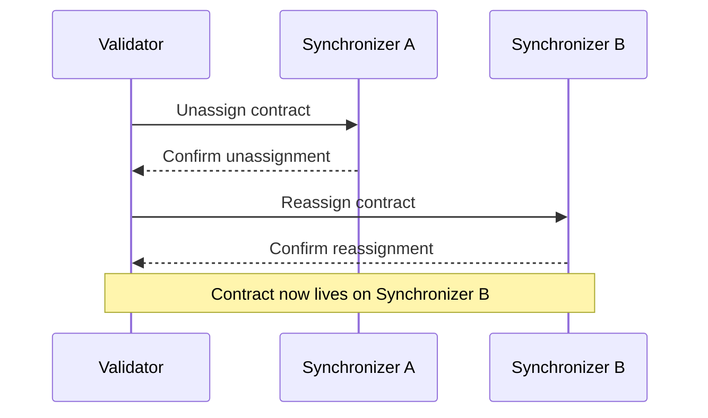

Canton Network is evolving toward production support for multiple synchronizers operating simultaneously. Each contract on the ledger is assigned to a specific synchronizer, and contracts can be reassigned between synchronizers as needed. This design allows the network to scale horizontally and supports specialized synchronizers for different use cases.

## Contracts and synchronizer assignment

Every active contract on Canton is assigned to exactly one synchronizer at any given time. The synchronizer handles ordering and consensus for transactions involving that contract. When a transaction touches contracts on different synchronizers, Canton coordinates the transaction across both.

Validators store their parties' contract data locally. The synchronizer a contract is assigned to determines which sequencer and mediator handle its transactions, but the contract data itself remains on the validators that host the contract's stakeholders.

## Unassignment and reassignment

Contracts can be reassigned from one synchronizer to another through an unassignment/reassignment protocol:

1. **Unassignment** — The contract is removed from its current synchronizer. During this brief period, the contract cannot be used in transactions.
2. **Reassignment** — The contract is assigned to the target synchronizer and becomes usable again.

This operation is atomic from the perspective of the contract's stakeholders. The contract is never on two synchronizers at once, and it is never in a state where it could be lost.

## The Global Synchronizer

The Global Synchronizer is the primary synchronizer for Canton Network. It is operated by the super-validators under the governance of the Global Synchronizer Foundation. Most contracts on Canton Network are assigned to the Global Synchronizer, and it serves as the default synchronizer for new contracts.

Additional synchronizers can be created for specific use cases — for example, a private synchronizer for a consortium that wants to keep certain transactions isolated. Contracts on private synchronizers can still interact with contracts on the Global Synchronizer through cross-synchronizer transactions.

## When to use multiple synchronizers

Most applications only need the Global Synchronizer. Multiple synchronizers become relevant when you need:

- **Isolation** — Keep certain transaction flows entirely separate from the public network
- **Performance** — Reduce contention by spreading high-throughput workflows across synchronizers
- **Regulatory compliance** — Ensure certain transactions are processed only by specific validators in specific jurisdictions
