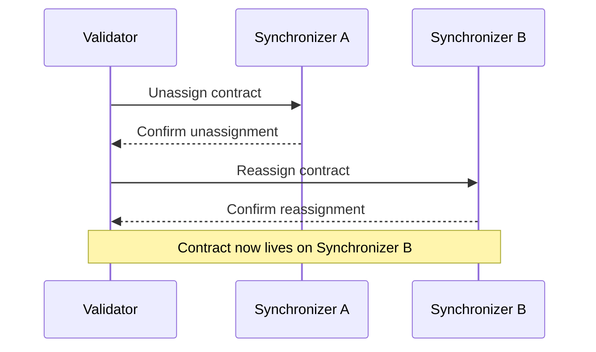

Canton Network supports multiple synchronizers operating simultaneously. Each contract on the ledger is assigned to a specific synchronizer, and contracts can be moved between synchronizers as needed. This design allows the network to scale horizontally and supports specialized synchronizers for different use cases.

## Contracts and synchronizer assignment

Every active contract on Canton is assigned to exactly one synchronizer at any given time. The synchronizer handles ordering and consensus for transactions involving that contract. When a transaction touches contracts on different synchronizers, Canton coordinates the transaction across both.

Validators store their parties' contract data locally. The synchronizer a contract is assigned to determines which sequencer and mediator handle its transactions, but the contract data itself remains on the validators that host the contract's stakeholders.

## Unassignment and reassignment

Contracts can be moved from one synchronizer to another through an unassignment/reassignment protocol:

1. **Unassignment** — The contract is removed from its current synchronizer. During this brief period, the contract cannot be used in transactions.
2. **Reassignment** — The contract is assigned to the target synchronizer and becomes usable again.

This operation is atomic from the perspective of the contract's stakeholders. The contract is never on two synchronizers at once, and it is never in a state where it could be lost.



## The Global Synchronizer

The Global Synchronizer is the primary synchronizer for Canton Network. It is operated by the super-validators under the governance of the Global Synchronizer Foundation. Most contracts on Canton Network are assigned to the Global Synchronizer, and it serves as the default synchronizer for new contracts.

Additional synchronizers can be created for specific use cases — for example, a private synchronizer for a consortium that wants to keep certain transactions isolated. Contracts on private synchronizers can still interact with contracts on the Global Synchronizer through cross-synchronizer transactions.

## When to use multiple synchronizers

Most applications only need the Global Synchronizer. Multiple synchronizers become relevant when you need:

- **Isolation** — Keep certain transaction flows entirely separate from the public network
- **Performance** — Reduce contention by spreading high-throughput workflows across synchronizers
- **Regulatory compliance** — Ensure certain transactions are processed only by specific validators in specific jurisdictions


{/* COPIED_START source="docs-website:docs/replicated/canton/3.4/overview/explanations/canton/multi-synchronizer.rst" hash="71dbc111" */}

<Warning title="Pre-reviewed Content - Do Not Modify">
This section was copied from existing reviewed documentation.
**Source:** `docs/replicated/canton/3.4/overview/explanations/canton/multi-synchronizer.rst`
Reviewers: Skip this section. Remove markers after final approval.
</Warning>

# Multiple Synchronizers

## Motivation

Participant Nodes execute Daml transactions using a Synchronizer Synchronizer, which can be either the Global Synchronizer or a privately operated Synchronizer. There are multiple reasons why you might require more than one Synchronizer:

- **Regulations**

  Some regulated environments require you to have control of the core infrastructure. Alternatively, data domicile laws may forbid you from connecting to Synchronizers that are not deployed in your zone of operations.

- **Performance**

  Different Synchronizers have different performance characteristics: some might favor high throughput, while others might target low latency. You must pick the Synchronizer which fits your non-functional requirements.

- **Governance**

  The governance of a Synchronizer might be centralized or decentralized.

- **Cost**

  For a high throughput use case, the fees of the Global Synchronizer might be too high and you might favor another Synchronizer.

- **Application restrictions**

  As an application provider, you might decide to restrict the use of your application to a specific Synchronizer.

To allow for the different use cases, a Participant Node can be connected to several Synchronizers.

<div id="def-multi-sync-assignation">

Definition **assignation** of a contract:
For any Daml contract, the participants hosting at least one stakeholder of the contract agree on which Synchronizer to use to coordinate changes on that contract. This agreed-upon Synchronizer is called the *assignation* of the contract.

</div>

More generally, the guiding principle is that for any piece of shared state, the participants maintaining this state agree which Synchronizer to use to coordinate changes of this state.

The stakeholders of a contract can agree to change the assigned Synchronizer of a contract. This procedure, which is called a *reassignment*, is described below. Reassignments are needed because a Daml transaction executes on a single synchronizer, i.e., all input contracts must be assigned to this synchronizer.

## Transactions with Multiple Synchronizers

Suppose a user wants to execute a Daml transaction that involves contracts that are currently assigned to different Synchronizers. The transaction can be execute by performing the following steps, which are made more precise below:

1.  Find a suitable Synchronizer for the transaction, let's call it `S`

    The conditions that `S` should fulfill are made more precise below in [reassignment-validations](#reassignment-validations). At minimum, all the stakeholders should be hosted on `S`, and every package of every input contract should be vetted on `S`.

2.  Change the assignation of all input contracts to `S` (that is, reassign all the input contracts to `S`).

3.  Execute the transaction on `S`.

4.  If desired, change the assignation of output contracts to another Synchronizer.

There are two ways to change the assignation of a contract:

- **Automatically**

  When a user submits the transaction, Canton's Synchronizer router tries to identify the best Synchronizer which can be used to submit the transaction. Then, it submits reassignment confirmation requests so that the transaction's inputs contracts are reassigned to the selected Synchronizer. Once all the reassignments have been completed, the Synchronizer router submits the Daml transaction to the selected Synchronizer.

  Note that in that case, the user does not have to worry about choosing a Synchronizer and performing reassignments. This allows applications to be designed without taking Synchronizers into account. However, an application can influence the routing using inhomogeneous topologies (per-synchronizer package vetting or party hosting) as well as explicitly disclosed contracts.

- **Explicitly**

  Users can control the Synchronizer routing precisely as follows:

  - Ledger API accepts commands to submit reassignments.
  - When submitting a Daml transaction, the user can prescribe which Synchronizer to use. If the prescribed Synchronizer is not suited for the transaction, the submission fails.

### Automatic selection of the Synchronizer

When the transaction cannot be executed on a single Synchronizer because not all input contracts are assigned to the same Synchronizer, the Synchronizer router attempts to find the best common Synchronizer for the submission.

For each input contract `c``i`, denote by `S``i` its assignation (at the submission time). A Synchronizer `S` is admissible for the transaction if:

- The reassignment of `c``i` from `S``i` to `S` is valid.
- The submitting participant is a reassigning participant for the submitting party for each `c``i`.

Among all admissible Synchronizers, the router will pick the one which satisfies (in order of importance):

- has the highest priority,
- minimize the number of reassignments,
- has the lowest Synchronizer id.

### Importance of the Global Synchronizer

As mentioned above, for a Daml transaction to be executed, all stakeholders of all input contracts must trust single a Synchronizer. Moreover, all input packages must be vetted on this common Synchronizer. The purpose of the Global Synchronizer is to be the standard Synchronizer that every party trusts so that it can be used to settle most of the transactions.

## Reassignment protocol

When a contract `c` is created using a Synchronizer `S` the stakeholders agree to use this Synchronizer to coordinate further changes to the contract (for example, exercise and archive). At this point, the assignation of the `c` is `S`. To change the assignation of `c` to a different Synchronizer `S'`, the stakeholders of `c` perform the *reassignment* of `c` from `S` to `S'`.

In this section, we describe the reassignment protocol.

### Overview

Reassigning a contract `c` from Synchronizer `S1` (called the *source* Synchronizer) to Synchronizer `S2` (called the *target* Synchronizer) allows the stakeholders to change the assignation from `S1` to `S2`. The procedure consists of two steps:

- **Unassignment**

  A stakeholder of the contract submits the command to unassign the contract from the source Synchronizer. Once the unassignment is committed, `c` is inactive on the source Synchronizer and cannot be used anymore.

  The unassignment goes though the same phases as the transaction protocol.

- **Assignment**

  A stakeholder of the contract (not necessarily the same one who submitted the unassignment) submits the command to assign the contract on the target Synchronizer. Once the assignment is committed, `c` becomes active on the target Synchronizer and can be used again.

  The assignment goes though the same phases as the transaction protocol.

The two steps can be visualized in the following diagram:

<div id="reassignment-high-level">

</div>


The reassignment of a contract is thus a **non-atomic** procedure involving two confirmation requests on two distinct Synchronizers (the source and the target). Once the unassignment is successful, the contract is marked as **pending assignment** and cannot be used until the assignment is performed.

Before presenting the reassignments from the point of view of the Ledger API, consider the following definition.

<div id="def-multi-sync-reassignment-counter">

Definition: **reassignment counter**
The **reassignment counter** tracks the number of times a contract was reassigned. It is set to zero when the contract is created and increased by one with each unassignment. The unassignment event and the corresponding assignment event have the same reassignment counter.

</div>

### Reassignment from Ledger API and application point of view

The unassign command consists of the following fields:

- contracts to be reassigned (all contracts in the batch must have same set of signatories and same set of stakeholders),
- source Synchronizer (current assignation),
- target Synchronizer.

A successful unassignment yield an unassigned event which contains the following fields:

- unassign id: Opaque identifier which uniquely identifies the reassignment and is used to submit the assignment.
- reassignment counter: Number of times the contract was reassigned.
- assignment exclusivity: Before this time (measured on the target Synchronizer), only the submitter of the unassignment can initiate the assignment.

The assign command consists of the following fields:

- unassign id,
- source Synchronizer (previous assignation),
- target Synchronizer.

A successful assignment yield an assigned event which contains the following fields:

- unassign id: Can be used to correlate unassigned and assigned events.
- reassignment counter: The value is the same as in the unassigned event.
- created event: Contract data (see `entering-leaving-visibility` to learn about the purpose).

### Running example

To illustrate the different scenarios and definitions, we consider an `Iou` whose signatory is the Bank and observer (owner) is Alice and we will discuss reassignments of the `Iou` from `S1` to `S2`.

The topology of the network is the following:

- Five participants `P1`, ..., `P3` and two Synchronizers `S1` and `S2`.
- Hosting relationships as shown in the picture below. The letter in parenthesis indicates the permission (Submission, Confirmation, Observation).

<div id="multi-synchronizer-running-example">

</div>


### Main definitions around reassignments

Before we present the validations which are done as part of the confirmation of unassignment and assignment requests, we need a few definitions.

#### Target timestamp

When processing an unassignment request, confirming participants need to check that the target Synchronizer meets some requirements (for example, the required package are vetted). These requirements depends on the topology on the target Synchronizer which can change over time. To ensure that all involved participant perform the same validations and reach the same conclusion, the unassignment request contains a timestamp of the target Synchronizer which is used for all topology related validations.

Definition: **target timestamp**
When an unassignment is submitted, a time proof is requested on the target Synchronizer. This timestamp is used to perform validations related to the target Synchronizer (package is vetted, stakeholders are hosted on the target Synchronizer, and so forth) during unassignment processing. This timestamp is called the **target timestamp**.

#### Reassigning participant

Because stakeholders can be hosted on several Participant Nodes and because topology can be inhomogeneous (for example, a Participant Node might host a party only on some Synchronizers it is connected to), a Participant Node involved in a reassignment might be an informee of only the unassignment request or only the assignment request (see discussion about contracts entering and leaving the visibility of a Participant Node below). Such Participant Nodes cannot perform all the validations (which would require it to be connected to both the source and target Synchronizers) and cannot protect against double spends (reassigned contract being active both on the source and target Synchronizers). This motivates the following definition.

Definition: **reassigning participant**
For a contract `c`, a participant `P` is a **reassigning participant** for a party `S` if the following hold:

1.  `S` is a stakeholder of `c`.
2.  `S` is hosted by `P` on the target Synchronizer at the target timestamp.
3.  `S` is hosted by `P` on the source Synchronizer.

The last condition is checked during submission using a recent topology snapshot and during phase 3 of the protocol using a topology snapshot at request time.

In the running example, `P1`, `P3` and `P5` are reassigning participants. `P2` is not a reassigning participant since it is not connected to the target Synchronizer. Similarly, `P4` is not connected to the source Synchronizer and therefore is not a reassigning participant.

#### Signatory unassigning participant

One key ingredient to describing the confirmation policies of reassignments is to derive the conditions that must be met for a Participant Node to be a confirmer of the unassignment request. As mentioned previously, one requirement is that the nodes is a reassigning participant.

Moreover, we only want the contract signatories to confirm. Since signatories could archive the contract on the source Synchronizer and (re)create it on the target Synchronizer, it does not bring additional safety to demand other parties like observers to confirm the unassignment requests.

This motivates the following definition.

Definition: **signatory unassigning participant**
For a contract `c`, a participant `P` is a **signatory unassigning participant** for a party `S` if the following hold:

1.  `S` is a **signatory** of `c`.
2.  `P` is a reassigning participant for `S`.
3.  `S` is hosted on `P` with at least confirmation rights on the source Synchronizer.

In the running example, the signatory unassigning participants are `P3` and `P5`. Participant `P1` does not host a signatory of the contract and `P2` and `P4` are not reassigning participants for any party.

#### Signatory assigning participant

Definition: **signatory assigning participant**
For a contract `c`, a participant `P` is a **signatory assigning participant** for a party `S` if the following hold:

1.  `S` is a **signatory** of c.
2.  `P` is a reassigning participant for `S`.
3.  `S` is hosted on `P` with at least confirmation rights on the target Synchronizer.

Informally, a signatory assigning participant is informed of both the unassignment and the assignment of a contract and is a confirmer of the assignment request.

In the running example, the only signatory assigning participant is \`P5\`:

- `P1` does not host a signatory of the contract.
- `P3` hosts a signatory but only with observation rights.

### Confirmation policies

In this section, we discuss which informee participants should send confirmation responses for an unassignment or an assignment request.

Since some of the validations can be performed only by reassigning participants and since only signatories of the contract should confirm the reassignment requests, it follows that confirmers of an unassignment are exactly the signatory unassigning participants and confirmers of an assignment are exactly the signatory assigning participants.

The number of confirmations expected by the mediator for one of the signatory is exactly the confirmation threshold of the signatory (on the source Synchronizer for the unassignment and on the target Synchronizer for the assignment).

### Validation of unassignment and assignment requests

The guiding principles behind validation rules for reassignments are:

- Reassigning a contract should not deprive a stakeholder from being able to use a contract.
- The risk that a contract cannot be assigned after it has been unassigned should be reduced to the bare minimum (recall that a reassignment is non-atomic).

We can now formalize the validations that need to be done as part of the processing of the unassignment request:

- The contract `c` is active on the source Synchronizer.
- Every stakeholder is hosted on a reassigning participant.
- Each signatory `S` is hosted on sufficiently many signatory assigning participants. More precisely, if the confirmation threshold on the target Synchronizer for `S` is `t`, then `S` needs to have at least `t` signatory assigning participants. This removes the risk that there are not enough signatory assigning participants, which would mean that the reassignment cannot be completed.
- The package corresponding to the contract has to be vetted on the target Synchronizer.
- If the request contains several contracts, all the contracts in the batch must have the same signatories and stakeholders.

Validations that need to be done as part of the processing of the assignment request are simpler. Confirming participants need to ensure:

- The assignment corresponds to a reassignment which is not yet completed.
- The package corresponding to the contract is vetted.

Some additional validations that are not specific to unassignments or assignments and are also done for regular Daml transactions are performed:

- views can be decrypted correctly,
- the recipient list is correct,
- root hash messages is correct,
- etc.

### Submission policies

The reassignment (unassignment or assignment) of a contract `c` can be submitted by a participant `P` if `P` hosts at least a stakeholder `S` of `c` for which it is a reassigning participant. It is *not* required that `P` hosts `S` with submission permission.

There are several reasons to not require the submission permission to submit a reassignment:

- In the running example, Alice loses the ability to exercise choices on the `Iou` when it is reassigned to `S2` as she is not hosted with submission permissions on Synchronizer `S2`. Because she is allowed to initiate a reassignment back to `S1`, she has a way to regain the possibility to exercise choices on the `Iou`.
- Decentralized parties cannot submit Daml transactions but should be able to submit reassignments for composability of applications.

<div className="todo">

Mention external parties use case once implemented \<<https://github.com/DACH-NY/canton/issues/25878>\>

</div>

### Contracts entering and leaving the visibility of the participant

Consider the running example of this page.

Participant `P2` is an informee participant of the unassignment confirmation request but not of the assignment request because it does not host alice on `S2`. Hence, from `P2` point of view, the contract does not become active when the assignment is completed: the contract becomes unusable on that participant (this is allowed only because Alice is hosted on `P1` on both `S1` and `S2`). In such a scenario, we say that the contract *leaves the visibility* of `P2`.

Now consider the "opposite" scenario. Participant `P4` is an informee participant of the assignment confirmation request (as a participant hosting the Bank on `S2`) and learns about the contract as part of the assignment. Once completed, the contract can be used on `P4`. In such a scenario, we say that the contract *enters the visibility* of `P4`. Because the created event is included in the assigned event, applications can learn about the payload of a contract when it enters the visibility of a Participant Node.

From the point of view of a participant, a contract can enter and leave its visibility several times during its life cycle. This can happen if all stakeholders hosted on the participant are multi-hosted.

### Non causality of the updates stream

In this section, we focus on the **updates stream** which contains only (de)activations of contracts: `Created`, `Archived`, `Unassigned` and `Assigned`. The content can easily be extended to cover update trees streams that also contains non-consuming exercises.

For a contract `c` and a Participant Node which hosts a stakeholder of `c`, we consider the list of all events emitted on the updates stream for `c`. When only a single Synchronizer is involved, this list contains exactly at most two elements:

- The first element is the `Created` of `c` (activation).
- When the contract is not active, the last element is either an `Archived` or an `Exercised` (deactivation).
- The record time of the activation is strictly smaller then then record time of the deactivation. More generally, the events on the updates stream are ordered by their record time.

When the Participant Node is connected to several Synchronizers, the updates stream consists of the events of all Synchronizers merged together. Since time cannot be compared across Synchronizers, we decided to not offer any guarantees with respect to global ordering of events. In particular, it means:

- No assumption can be made with respect to ordering of events which happened on different Synchronizers.
- The ordering can be different from one participant to the order.

Hence, in a multi Synchronizers scenario, **there is no global causality on the updates stream**.

For example, consider the following scenario:

- Contract `c` is created on Synchronizer `S1`.
- `c` is unassigned from `S1` to `S2`.
- `c` is assigned to `S2`.
- `c` is archived.

On the updates stream of a participant hosting a stakeholder on both `S1` and `S2`, the events might appear in any of the following orders:

- `created`, `unassigned`, `assigned`, `archived`
- `created`, `assigned`, `unassigned`, `archived`
- `assigned`, `created`, `unassigned`, `archived`
- `assigned`, `archived`, `created`, `unassigned`
- `created`, `assigned`, `archived`, `unassigned`
- `assigned`, `created`, `archived`, `unassigned`

In particular, the `created` event is not necessarily the first event nor is the `archived` necessarily the last event.

Note that the projection of events for each Synchronizer is causally consistent which means that

- the `created` always appears before all `unassigned` or `archived`, and
- the `archived` always appears after all the `assigned` or `created`,
- there are no consecutive activations or deactivations (and in particular no consecutive `assigned` or `unassigned`).

Finally, recall from above that a Participant Node might learn about a contract with an assignment, so the updates stream isn't guaranteed to contain a `Created` or `Archived`.

### Reassignments and contention

An assignment is an activation and thus has a impact similar to a create. Similarly, an unassignment is a deactivation and has a similar impact than an archive. In particular, both assignments and unassignments lock the contract, which means that reassignments lead to contention with other workflows, including read-only transactions. This additional contention might be unexpected and difficult to debug if reassignments are done automatically by the Synchronizer router as part of transaction submission. It is advised to consider reassignments explicitly when designing Daml workflows such that contention can be minimized.

## Multi-Synchronizer Time

<div className="todo">

Fill that section \<<https://github.com/DACH-NY/canton/issues/25859>\>

</div>

Relate to time monotonicity of the ledger model

Contrast to command dedup time model


{/* COPIED_END */}


{/* COPIED_START source="docs-website:docs/replicated/canton/3.4/overview/explanations/canton/traffic-management.rst" hash="c8ff2996" */}

<Warning title="Pre-reviewed Content - Do Not Modify">
This section was copied from existing reviewed documentation.
**Source:** `docs/replicated/canton/3.4/overview/explanations/canton/traffic-management.rst`
Reviewers: Skip this section. Remove markers after final approval.
</Warning>

# Traffic management

The sequencer is a critical component of a Canton synchronizer and incurs significant operating costs. As such Canton provides a mechanism to protect it from abuse, and control how much data individual members of the synchronizer can get sequenced over time. To that end, the sequencers of a synchronizer perform traffic accounting and enforce traffic limits. This page explains this mechanism.

## Submission requests

The sequencer API offers a `SendAsync` RPC to get events sequenced on a synchronizer. Submission requests are the payload of the SendAsync RPC and are the principal focus of traffic management, as the sequencers spend most of their resources on processing those RPCs.

### Traffic Cost

The traffic cost aims to capture the processing cost of a submission request along two dimensions:

- Network traffic incurred by recipients reading the event
- Storage cost of the events in the sequencer

Traffic cost looks at two components of submission request:

- The sender

- The list of envelopes. Each envelope contains:

  > - A payload (arbitrary bytes)
  >
  > - A list of recipients (members of the synchronizer). Recipients can be addressed either:
  >
  >   > - Individually
  >   > - Via group addressing. Group addressing allows to address a specific set of recipients as a group. For instance, the group address `AllMembersOfSynchronizer` will send the payload to all members of the synchronizer.

The traffic cost of a submission request is calculated as follows (pseudo-code):

``` 
fn calculate_submission_request_traffic_cost:
    envelopes_cost = 0

    for envelope in envelopes:
        storage_cost = envelope.payload
        network_cost = envelope.payload * envelope.recipients.size * read_vs_write_scaling_factor
        submission_request = storage_cost + network_cost
        envelopes_cost = envelopes_cost + submission_request

    return base_event_cost + envelopes_cost
```

where `base_event_cost` is a constant cost for the submission request added to the envelopes cost, and `read_vs_write_scaling_factor` is a constant factor that scales the network cost based on the number of recipients. Both are configuration parameters of the synchronizer and part of the topology. See the configuration section for more details. Typically the `read_vs_write_scaling_factor` is in the order of 1/10000 and scales down the payload size to account for network bandwidth when recipients read the event.

Group addresses are resolved before the cost is computed. This means that a message addressed to `AllMembersOfSynchronizer` will have a network cost scaled to the number of members in the synchronizer at the time the request is submitted.

The traffic cost is charged to the sender for every submission request sequenced on the synchronizer. Submission requests include confirmation requests, confirmation responses, ACS commitments, topology requests, and time proofs.

Because time proofs are technically empty messages, their traffic cost is always equal to `base_event_cost`.

Synchronizer members typically send regular acknowledgements to the synchronizer to confirm that they have received the events sent to them. This allows sequencers to prune events safely. Acknowledgements do not cost traffic, but are rate limited to avoid abuse.

## Traffic accounting

The sequencers of the synchronizer perform traffic accounting jointly. Each authorized member of the synchronizer gets the cost of their submission requests deducted from their traffic balance once the request has been sequenced. The traffic parameters described above are configured as part of the dynamic domain parameters of the synchronizer, and are therefore subject ot change. The cost of a request may consequently change between the moment it is submitted to the sequencer API and the moment it is sequenced, if the traffic parameters changed in the meantime. To that end, each member computes the expected cost of a submission request when sending it and includes it in the request's metadata. To prevent submission failures when the traffic parameters are updated concurrently, sequencers allow a grace period during which the cost computed by the member may differ from the cost at sequencing time, as long as the submission cost was correctly computed when the submission was made. Beyond this time window, the submission is rejected and must be retried with up-to-date traffic costs. The duration of this window is equal to `(confirmationResponseTimeout + mediatorReactionTimeout) * 2`. Refer to the dynamic synchronizer parameters documentation for more details on these parameters.

When a node subscribes to receive events from several sequencers of a given synchronizer, it requests its current traffic state from all sequencers and compares them in a Byzantine Fault Tolerant (BFT) fashion. This provides an initial traffic state for the node, which then continually updates its traffic state in memory as it observes its own events being sequenced from the subscription.

### Traffic enforcement

The following diagram gives a high level of the enforcement flow and scenarios.


There are a few points to highlight on this diagram.

Enforcement takes place at two points in the submission flow:

- After step 1 when the sequencer receives the submission request from the sender. At this stage the sequencer decides whether the sender has enough traffic for the request using its local knowledge of the sender's traffic state. If it determines that the sender does not have enough traffic, it rejects the request at this stage.

- After step 3, every sequencer reads the sequenced event from the BFT ordering layer. At this stage each sequencer runs the same logic as in step 1, except they use the traffic state of the sender at the sequencing time of this event. This enables every sequencer to make the same deterministic decision on whether the sender has enough traffic.

  > - If the sender does not have enough traffic, the event is not sent to its recipient, and the sender receives a deliver error indicating the reason. This is called "wasted sequencing" and will be reported as such in metrics.
  > - If the sender has enough traffic, traffic is deducted from the sender's balance. What happens after this depends on whether the event is valid and can be delivered to its recipients. Additional validations beyond traffic control happen in the sequencer before an event can be delivered (such as validating signatures, the existence of recipients, and so on). If those validations pass, the event is delivered, and the sender receives a delivery receipt that includes a `TrafficReceipt`. The receipt allows the sender to update its traffic state accordingly. If the event is otherwise invalid, the event is not delivered, and the sender receives a delivery error indicating the reason for the failure. This last case is called "wasted traffic" and is reported as such in metrics.

## Acquiring traffic

### Base traffic

All members of the synchronizer accumulate base traffic passively over time. Note that time here refers to the synchronizer's time, not the wall clock time of the sender. How fast traffic accumulates and the maximum amount of base traffic a member can accumulate is determined by the synchronizer's traffic configuration. Base traffic is generally limited and used to bootstrap nodes and allow them to connect to a synchronizer which requires a minimal amount of traffic. Most real-world scenarios require acquiring additional traffic.

### Extra traffic

Extra traffic can be acquired for any member of the synchronizer by calling the `SetTrafficPurchased` RPC on the sequencer Admin API of at least `SequencerSynchronizerState.threshold` sequencers. `SequencerSynchronizerState` is a topology transaction that defines the active sequencers of a synchronizer. It comes with a threshold defining the minimum number of sequencers that must approve a change affecting the sequencers, which includes the traffic state. Therefore, in order to add extra traffic for a member on a synchronizer, the same traffic purchase request must be submitted to at least threshold sequencers within a configurable time window.

<Warning>
The request sets the new absolute value of total extra traffic purchased for the member. **NOT** a delta in traffic. For example, if participant P1 has currently `0` extra traffic and wants to purchase `1000` extra traffic credits, a `SetTrafficPurchased` request with an amount of `1000` must be successfully processed by at least `SequencerSynchronizerState.threshold` sequencers. If later P1 wants an additional `500` extra traffic credit, a new `SetTrafficPurchased` request with an amount of `1500` must be successfully processed.
</Warning>

<Tip>
Acquiring extra traffic is often referred to as a "top up" in the the documentation.
</Tip>

#### Serial

Each `SetTrafficPurchased` request requires a serial number to be set. The serial number is an integer used to ensure idempotency of the request and correctly handle concurrent traffic updates for the same member. When a request is sent, the sequencer verifies that the serial number is higher than the last serial number used for that member. If the serial is too low, the request fails and must be retried with the correct serial. To obtain the current serial, see observing traffic.

Acquiring extra traffic requires access to the Sequencer Admin API and synchronization amongst the sequencers. In the Canton Network, this synchronization is handled on ledger via a Daml workflow resulting in each super validator updating the extra traffic balance of the member acquiring traffic.

## Observing traffic

### Traffic state

The sequencer Admin API exposes the traffic state of all members of a synchronizer via the `SequencerAdministrationService.TrafficControlState` RPC. The Admin API of a participant node exposes the traffic state of the Participant Node via the `TrafficControlService.TrafficControlState` RPC

The state observed on the Participant Node is slightly delayed compared to the one observed from the sequencer for that Participant Node because the participant updates its state from the events it receives from its sequencer subscription, which happens by definition after the event has been sequenced by the sequencer.

### Metrics

A number of traffic-related metrics are reported by the sequencer and can be used to monitor the traffic state of a synchronizer. See Canton Metrics

## Configuration

Traffic is configured via dynamic synchronizer parameters per synchronizer.

``` protobuf
// In bytes, the maximum amount of base traffic that can be accumulated
uint64 max_base_traffic_amount = 1;

// Maximum duration over which the base rate can be accumulated
// Consequently, base_traffic_rate = max_base_traffic_amount / max_base_traffic_accumulation_duration
google.protobuf.Duration max_base_traffic_accumulation_duration = 3;

// Read scaling factor to compute the event cost. In parts per 10 000.
uint32 read_vs_write_scaling_factor = 4;

// Window size used to compute the max sequencing time of a submission request
// This impacts how quickly a submission is expected to be accepted before a retry should be attempted by the caller
// Default is 5 minutes
google.protobuf.Duration set_balance_request_submission_window_size = 5;

// If true, submission requests without enough traffic credit will not be delivered
bool enforce_rate_limiting = 6;

// In bytes, base event cost added to all sequenced events.
// Optional
optional uint64 base_event_cost = 7;
```

Instructions on how to configure traffic are available in the how-to section.


{/* COPIED_END */}

